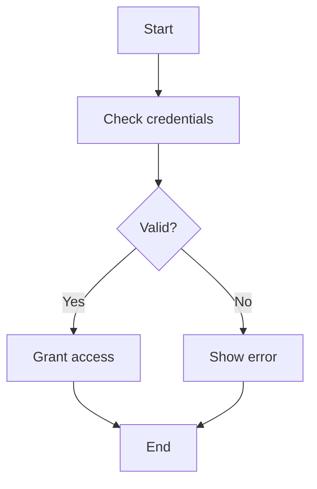
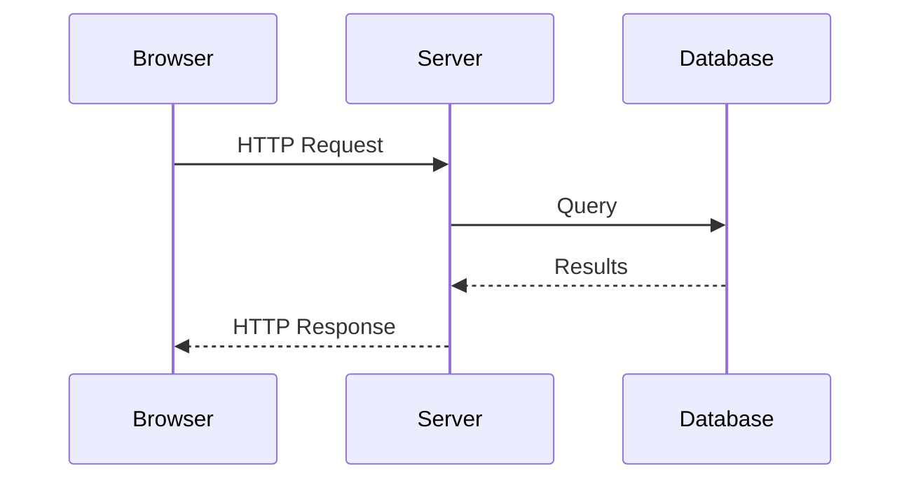

# Plan 016: General Diagramming Skill Development

**Goal**: Create a Claude Code skill for creating, editing, and converting diagrams with automatic format selection (Mermaid for simple, DrawIO for complex).

**Created**: 2026-02-01
**Priority**: 2 (MEDIUM)
**Status**: IN_PROGRESS
**Location**: `nixcfg/.claude/user-plans/016-drawio-svg-skill.md`
**Depends On**: Plan 015 (COMPLETE - drawio-svg-sync tooling)
**Branch**: `opencode`

---

## Overview

This skill enables Claude to work autonomously with diagrams using the appropriate format based on complexity. Simple diagrams use Mermaid (text-based, renderer handles layout). Complex diagrams use DrawIO (precise spatial control via mxGraphModel XML).

**Scope**: General diagramming with format auto-selection

**Input Formats** (for conversion/editing):
- `.drawio` (any variant) - convert to .drawio.svg
- `.drawio.svg` - edit mxGraphModel directly
- Mermaid (in markdown) - parse, convert to DrawIO if complex
- ASCII diagrams - parse, create Mermaid or DrawIO

**Output Formats**:
- Mermaid - for simple diagrams
- `.drawio.svg` - for complex diagrams (ALWAYS with "embed diagram" enabled)

**Priority Order**:
1. Creating new diagrams (Mermaid or DrawIO based on complexity)
2. Editing existing diagrams
3. Converting between formats (ASCII/Mermaid → DrawIO)
4. Rendering/syncing workflow automation

---

## Progress Tracking

| Phase | Task | Status | Definition of Done |
|-------|------|--------|-------------------|
| **A** | **Interactive Design** | | |
| A1 | Review existing diagrams in user projects | `TASK:COMPLETE` | Catalog diagram types, complexity levels, common patterns |
| A2 | Interactive skill design session | `TASK:COMPLETE` | User approves SKILL.md outline and capability scope |
| A3 | Define test cases and success criteria | `TASK:COMPLETE` | Documented test scenarios with expected outputs |
| **B** | **mxGraphModel Research** | | |
| B1 | Document mxGraphModel XML structure | `TASK:COMPLETE` | Complete element reference in REFERENCE.md |
| B2 | Analyze shape library and styles | `TASK:COMPLETE` | Catalog common shapes, their XML, and style attributes |
| B3 | Document connector/edge patterns | `TASK:COMPLETE` | How connections work (waypoints, terminals, styles) |
| B4 | Understand geometry and positioning | `TASK:COMPLETE` | Coordinate system, parent-relative positioning, sizing |
| **C** | **Core Skill Implementation** | | |
| C1 | Create SKILL.md with creation workflow | `TASK:COMPLETE` | Instructions for creating diagrams from scratch |
| C2 | Add editing operations to SKILL.md | `TASK:COMPLETE` | Modify text, move elements, resize, restyle |
| C3 | Add rendering workflow integration | `TASK:COMPLETE` | drawio-svg-sync invocation, verification steps |
| C4 | Create REFERENCE.md with XML details | `TASK:COMPLETE` | Deep mxGraphModel reference documentation |
| **D** | **Nix Module Integration** | | |
| D1 | Add skill to skills.nix builtinSkillDefs | `TASK:COMPLETE` | Skill registered as built-in |
| D2 | Test skill deployment via home-manager | `TASK:COMPLETE` | Skill appears in Claude Code after switch |
| D3 | Verify skill invocation works | `TASK:PENDING` | `/drawio-svg-editor` or similar triggers skill |
| **D-WSL** | **WSL2 Compatibility (BLOCKING)** | | |
| D-WSL.1 | Fix drawio-svg-sync for WSL2 | `TASK:COMPLETE` | RESOLVED: Test fixtures had invalid compression, not a drawio/WSL2 issue |
| **E** | **Validation & Documentation** | | |
| E1 | Test: Create diagram from scratch | `TASK:PENDING` | New diagram renders correctly |
| E2 | Test: Edit existing diagram | `TASK:PENDING` | Modifications preserve integrity |
| E3 | Test: Full workflow (edit→render→commit) | `TASK:PENDING` | End-to-end workflow succeeds |
| E4 | Document usage in docs/ | `TASK:PENDING` | User guide for invoking skill |

---

## Phase A: Interactive Design

### A1: Review Existing Diagrams

**Objective**: Understand the types of diagrams the user creates to inform skill design.

**Actions**:
- Search user projects for `.drawio.svg` files
- Catalog diagram categories (architecture, network, flowchart, sequence, etc.)
- Note complexity levels (simple boxes, complex connectors, embedded images)
- Identify common patterns and elements

**Output**: Diagram catalog informing skill priorities

#### A1 Results (2026-02-01)

**Files Found**: 26 `.drawio.svg` files across 5 projects

| Project | Files | Size Range | Description |
|---------|-------|------------|-------------|
| drawio-svg-sync | 7 | 4KB | Test fixtures (simple-rect, two-boxes-arrow, etc.) |
| converix-hsw | 4 | 16-876KB | Architecture docs (universal-pipeline, isar-vs-yocto) |
| converix-hsw-feature-isar-prototype | 4 | 16-164KB | Pipeline and architecture diagrams |
| cadr | 10 | 16KB-1.3MB | ADR supporting docs (comparison matrix, build phases, workflows) |
| uds | 1 | 1.6MB | Kubernetes architecture diagram |

**Two Format Patterns Discovered**:

1. **Standard Draw.io Format** (most files):
   - Comment: `<!-- Do not edit this file with editors other than draw.io -->`
   - mxGraphModel embedded in `content` attribute of `<svg>` element
   - Encoded as HTML entities (`&lt;mxfile...&gt;`)
   - Large files (876KB-1.6MB) because they include both:
     - The mxGraphModel XML (encoded in content attribute)
     - The rendered SVG elements (actual visible graphics)
   - Examples: `isar-vs-yocto.drawio.svg`, `architecture.drawio.svg`

2. **Hand-Crafted SVG** (universal-pipeline files):
   - Pure SVG with embedded design guidelines as XML comments
   - NO mxGraphModel, no Draw.io encoding
   - Smaller file size (16KB)
   - Manual control over all elements
   - Contains embedded user preferences in comments (arrow anchors, spacing, layout)
   - Example: `universal-pipeline.drawio.svg`

**Diagram Categories Identified**:

| Category | Count | Complexity | Examples |
|----------|-------|------------|----------|
| Architecture (side-by-side comparison) | 4 | High | isar-vs-yocto, pipeline-implementation-comparison |
| Architecture (Kubernetes) | 1 | Very High | uds/architecture.drawio.svg (1.6MB, K8s shapes) |
| Pipeline/Workflow | 5 | Medium-High | universal-pipeline, cicd-pipeline, isar-ci-pipeline |
| Build Process | 2 | High | isar-build-phases, isar-gbp-pq-workflow |
| Conceptual/Story | 3 | High | ci-trap-story, three-philosophies, reproducibility-spectrum |
| Simple (test fixtures) | 7 | Low | simple-rect, two-boxes-arrow |
| Comparison Matrix | 2 | Medium | comparison-matrix |
| Project Structure | 1 | Medium | super-project-structure |

**Common Elements Observed**:

- **Shapes**: Rectangles (rounded/sharp), containers, callouts, text boxes
- **Connectors**: Arrows with various styles (orthogonal, straight), waypoints
- **Styling**: Fill colors (pastel palettes), stroke colors, font styling
- **Layout**: Multi-column comparisons, hierarchical flows, stacked layers
- **Special**: Kubernetes icons (mxgraph.kubernetes.icon shapes), emoji icons

**Key Insights for Skill Design**:

1. **Two editing modes needed**:
   - mxGraphModel XML editing (for Draw.io-generated files)
   - Pure SVG editing (for hand-crafted files)

2. **Complexity range is wide**: From 4KB test fixtures to 1.6MB K8s architecture

3. **User has established preferences** (from universal-pipeline comments):
   - Arrows enter LEFT anchor, exit RIGHT anchor
   - Phase blocks align at canvas edges
   - "Build" preferred over "Compile"
   - Optional steps shown with dashed borders

4. **Kubernetes shapes are common**: The mxgraph.kubernetes.icon library is used

5. **Most diagrams are architectural/technical**: Not flowcharts or UML

### A2: Interactive Skill Design Session

**Why This Task Matters**: A1 revealed we need TWO editing modes (mxGraphModel vs pure SVG), Kubernetes icon support, and user-specific layout preferences. Before writing any skill code, we must agree on scope, capabilities, and architecture. Without this session, we risk building a skill that doesn't match your actual workflow or handles only one format.

**Objective**: Collaboratively define the skill's capabilities and interface.

#### A2 Results (2026-02-01)

**Key Decisions Made**:

| Decision | Choice | Rationale |
|----------|--------|-----------|
| Skill Name | `diagram` | General, concise, broad trigger |
| Scope | General diagramming | Consolidates diagram logic, simplifies user context |
| Heuristic | Auto-detect | Skill analyzes complexity, chooses Mermaid or DrawIO |
| Conversion (v1) | Partial | ASCII/Mermaid→DrawIO; defer DrawIO→Mermaid |
| Rendering | drawio-svg-sync | Existing flake for .drawio.svg files |
| Pure SVG files | Ignore | Edge case from past session; not a supported input |

**Complexity Heuristic (Auto-Detect)**:

```
SIMPLE → Mermaid:
├── Linear flows (A→B→C)
├── Simple trees (max 2-3 levels)
├── Basic sequence diagrams
└── No custom positioning needed

COMPLEX → DrawIO:
├── Side-by-side comparisons
├── Multiple interconnected regions
├── Custom spatial layout required
├── Layered/stacked architecture views
└── User explicitly requests DrawIO
```

**Skill File Structure**:

```
home/modules/claude-code/skills/diagram/
├── SKILL.md                  # Main instructions (~600-800 lines)
│   ├── Section 1: Overview & Invocation
│   ├── Section 2: Format Detection
│   ├── Section 3: Complexity Heuristic
│   ├── Section 4: Creating Mermaid Diagrams
│   ├── Section 5: Creating DrawIO Diagrams
│   ├── Section 6: Converting ASCII/Mermaid to DrawIO
│   ├── Section 7: Editing Existing Diagrams
│   ├── Section 8: Rendering Workflow (drawio-svg-sync)
│   └── Section 9: Troubleshooting
│
└── REFERENCE.md              # Technical reference (~400-600 lines)
    ├── Mermaid syntax quick reference
    ├── mxGraphModel XML structure (basic)
    ├── DrawIO shapes and styles (basic only)
    ├── Connection/anchor patterns
    └── Color palettes
```

**v1 Capabilities**:

| Category | In Scope | Out of Scope |
|----------|----------|--------------|
| **Create** | New Mermaid, New DrawIO | - |
| **Convert From** | .drawio (any), .drawio.svg, Mermaid, ASCII | Raw SVG |
| **Convert To** | Mermaid, .drawio.svg | - |
| **DrawIO Features** | Basic shapes, connections, anchors, colors, layers, text | Icons, complex styling |
| **Automation** | Format detection, complexity heuristic | Layout preferences |

**CRITICAL: Embed Diagram Requirement**:
When using drawio-svg-sync or the drawio flake app to export, ALWAYS ensure "embed diagram in image file" is enabled. This embeds the mxGraphModel in the SVG, making the file editable.

**Deferred Features (Priority Order)**:

1. **Multi-tab/multi-page support** (HIGH) - User uses this for "drawio animations" in presentations
2. **Styling preferences** (MEDIUM) - Arrow anchors, spacing, color palettes
3. **DrawIO → Mermaid conversion** (LOW) - Reverse direction, rarely needed
4. **Kubernetes icons** (LOW) - Shape libraries
5. **Complex DrawIO features** (LOW) - Swimlanes, containers, custom shapes

**Invocation Triggers** (skill description will match):
- "create a diagram", "make a diagram"
- "convert this to mermaid/drawio"
- "edit the diagram", "update the diagram"
- "draw an architecture", "visualize this"
- References to `.drawio`, `.drawio.svg`, mermaid, ASCII art

### A3: Define Test Cases

**Why This Task Matters**: Without concrete test cases, we have no objective way to know if the skill works. Test cases also reveal edge cases we might miss during implementation - for example, what happens when editing a 1.6MB Kubernetes diagram vs a 4KB simple rectangle? Writing tests BEFORE implementation forces us to think through the user experience.

**Objective**: Establish concrete success criteria that cover both formats and complexity levels.

#### A3 Results (2026-02-01)

**Test Case Categories**:

| Category | Count | Purpose |
|----------|-------|---------|
| Format Detection | 4 | Identify input type correctly |
| Complexity Heuristic | 5 | Choose Mermaid vs DrawIO appropriately |
| Mermaid Creation | 3 | Generate valid Mermaid diagrams |
| DrawIO Creation | 3 | Generate valid .drawio.svg files |
| Conversion | 4 | Transform between formats |
| Editing | 4 | Modify existing diagrams safely |
| Full Workflow | 2 | End-to-end edit→render→commit |

---

#### Category 1: Format Detection Tests

**FD-1: Detect Mermaid in Markdown**
- **Input**: Markdown file with ` ```mermaid ... ``` ` code block
- **Expected**: Skill identifies "Mermaid in markdown"
- **Pass Criteria**: Correct format identification, extracts diagram type (flowchart/sequence/etc)
- **Edge Case**: Multiple mermaid blocks in same file

**FD-2: Detect .drawio.svg with mxGraphModel**
- **Input**: Standard DrawIO-generated `.drawio.svg` file
- **Expected**: Skill identifies "DrawIO with embedded mxGraphModel"
- **Pass Criteria**: Finds `content` attribute, decodes mxGraphModel successfully
- **Edge Case**: Corrupted encoding in content attribute

**FD-3: Detect .drawio (XML only)**
- **Input**: Raw `.drawio` file (XML without SVG wrapper)
- **Expected**: Skill identifies "DrawIO XML source"
- **Pass Criteria**: Parses mxGraphModel structure correctly
- **Edge Case**: Multi-page .drawio files (multiple `<diagram>` elements)

**FD-4: Detect ASCII Diagram**
- **Input**: Text file or code comment with ASCII art boxes/arrows
- **Expected**: Skill identifies "ASCII diagram candidate"
- **Pass Criteria**: Recognizes box characters (`+--+`, `|`, `--->`), offers conversion
- **Edge Case**: False positive on ASCII art that's not a diagram

---

#### Category 2: Complexity Heuristic Tests

**CH-1: Simple Linear Flow → Mermaid**
- **Input**: "Create a diagram showing: User → Login → Dashboard → Logout"
- **Expected**: Skill chooses Mermaid, generates flowchart
- **Pass Criteria**:
  - [ ] Chooses Mermaid (not DrawIO)
  - [ ] Valid Mermaid flowchart syntax
  - [ ] Renders correctly in Mermaid-compatible viewer
- **Rationale**: Linear A→B→C→D flows are Mermaid's strength

**CH-2: Simple Tree (2-3 levels) → Mermaid**
- **Input**: "Create an org chart: CEO → {CTO, CFO, COO} → {teams under each}"
- **Expected**: Skill chooses Mermaid, generates tree/flowchart
- **Pass Criteria**:
  - [ ] Chooses Mermaid (not DrawIO)
  - [ ] Valid hierarchical structure
  - [ ] ≤3 levels deep
- **Rationale**: Simple hierarchies work well in Mermaid

**CH-3: Basic Sequence → Mermaid**
- **Input**: "Create a sequence diagram: Client → Server → Database → Server → Client"
- **Expected**: Skill chooses Mermaid sequence diagram
- **Pass Criteria**:
  - [ ] Chooses Mermaid sequence diagram syntax
  - [ ] Proper participant declarations
  - [ ] Correct arrow notation
- **Rationale**: Sequence diagrams are Mermaid's strong suit

**CH-4: Side-by-Side Comparison → DrawIO**
- **Input**: "Create a comparison diagram showing Option A vs Option B with pros/cons for each"
- **Expected**: Skill chooses DrawIO
- **Pass Criteria**:
  - [ ] Chooses DrawIO (not Mermaid)
  - [ ] Creates parallel columns/sections
  - [ ] Valid mxGraphModel XML
- **Rationale**: Spatial layout control requires DrawIO

**CH-5: Multi-Region Architecture → DrawIO**
- **Input**: "Create an architecture diagram with Frontend (3 services), Backend (4 services), Database (2 services), all interconnected"
- **Expected**: Skill chooses DrawIO
- **Pass Criteria**:
  - [ ] Chooses DrawIO (not Mermaid)
  - [ ] Groups/containers for each region
  - [ ] Cross-region connections with proper routing
- **Rationale**: Complex spatial relationships need DrawIO

---

#### Category 3: Mermaid Creation Tests

**MC-1: Create Flowchart**
- **Input**: "Create a flowchart for user authentication: Start → Check credentials → [valid?] → Yes: Grant access, No: Show error → End"
- **Expected**: Valid Mermaid flowchart with decision node
- **Pass Criteria**:
  - [ ] Valid Mermaid syntax (` ```mermaid flowchart TD ... ``` `)
  - [ ] Decision node with Yes/No branches
  - [ ] Renders in GitHub/GitLab preview
- **Sample Output**:


**MC-2: Create Sequence Diagram**
- **Input**: "Create a sequence diagram for API call: Browser → Server → Database → Server → Browser"
- **Expected**: Valid Mermaid sequence diagram
- **Pass Criteria**:
  - [ ] Proper participant declarations
  - [ ] Correct message arrows
  - [ ] Return messages shown
- **Sample Output**:


**MC-3: Create Class/ER Diagram**
- **Input**: "Create an entity diagram: User has many Posts, Post has many Comments, Comment belongs to User"
- **Expected**: Valid Mermaid ER or class diagram
- **Pass Criteria**:
  - [ ] Correct relationship notation
  - [ ] Entity definitions
  - [ ] Cardinality indicators

---

#### Category 4: DrawIO Creation Tests

**DC-1: Create Simple Architecture**
- **Input**: "Create a 3-tier architecture diagram: Web → API → Database"
- **Expected**: Valid .drawio.svg with mxGraphModel
- **Pass Criteria**:
  - [ ] Valid XML structure (cells 0, 1 present)
  - [ ] Three rectangle shapes with labels
  - [ ] Connectors between shapes
  - [ ] `content` attribute contains encoded mxGraphModel
  - [ ] drawio-svg-sync renders without error
  - [ ] Opens in DrawIO desktop app
- **Critical**: File must have embedded diagram (not just SVG)

**DC-2: Create Comparison Diagram**
- **Input**: "Create a side-by-side comparison: Left column 'Before' with 3 items, Right column 'After' with 3 items, arrows showing transformation"
- **Expected**: Valid .drawio.svg with parallel layout
- **Pass Criteria**:
  - [ ] Two distinct columns
  - [ ] Consistent spacing/alignment
  - [ ] Cross-column connectors
  - [ ] Labels on both columns
- **Tests**: Spatial layout precision

**DC-3: Create Layered Architecture**
- **Input**: "Create a layered diagram: Presentation layer on top, Business logic in middle, Data access at bottom, with components in each layer"
- **Expected**: Valid .drawio.svg with stacked containers
- **Pass Criteria**:
  - [ ] Container shapes for each layer
  - [ ] Child elements inside containers
  - [ ] Proper parent-child relationships in XML
  - [ ] Vertical arrangement (top to bottom)

---

#### Category 5: Conversion Tests

**CV-1: ASCII → Mermaid (Simple)**
- **Input**:
```
+-------+     +-------+     +-------+
| Start | --> | Process| --> |  End  |
+-------+     +-------+     +-------+
```
- **Expected**: Equivalent Mermaid flowchart
- **Pass Criteria**:
  - [ ] All boxes converted to nodes
  - [ ] Arrows converted to edges
  - [ ] Labels preserved
- **Rationale**: ASCII is simple, convert to Mermaid

**CV-2: ASCII → DrawIO (Complex)**
- **Input**: Complex ASCII with multiple regions, cross-connections
- **Expected**: DrawIO diagram (complexity exceeds Mermaid threshold)
- **Pass Criteria**:
  - [ ] Recognizes complexity threshold
  - [ ] Generates DrawIO instead of Mermaid
  - [ ] Preserves spatial relationships

**CV-3: Mermaid → DrawIO (Upgrade)**
- **Input**: Existing Mermaid diagram + "Convert this to DrawIO for more control"
- **Expected**: Equivalent .drawio.svg
- **Pass Criteria**:
  - [ ] All nodes converted to mxCells
  - [ ] All edges converted to connectors
  - [ ] Labels preserved
  - [ ] Reasonable auto-layout

**CV-4: .drawio → .drawio.svg (Embed)**
- **Input**: Raw `.drawio` file (XML only)
- **Expected**: `.drawio.svg` with embedded mxGraphModel AND rendered SVG
- **Pass Criteria**:
  - [ ] mxGraphModel preserved in `content` attribute
  - [ ] SVG elements generated for visual rendering
  - [ ] File opens in browser (SVG view) AND DrawIO (editable)
- **Critical**: This is the "embed diagram" requirement

---

#### Category 6: Editing Tests

**ED-1: Change Text Label**
- **Input**: Existing .drawio.svg + "Change 'Fetch' to 'Download'"
- **Expected**: Only `value` attribute updated
- **Pass Criteria**:
  - [ ] Target element found by text search
  - [ ] Only `value` attribute changed
  - [ ] All other attributes/elements unchanged
  - [ ] Diff shows minimal change
- **Files**: Use `drawio-svg-sync/tests/two-boxes-arrow.drawio.svg`

**ED-2: Change Style (Color)**
- **Input**: Existing .drawio.svg + "Make the 'API' box light blue"
- **Expected**: Only `style` attribute updated
- **Pass Criteria**:
  - [ ] Target element found
  - [ ] `fillColor` style key updated
  - [ ] Other style keys preserved
  - [ ] Valid color value (hex or named)

**ED-3: Add New Element**
- **Input**: Existing .drawio.svg + "Add a 'Cache' box between API and Database"
- **Expected**: New mxCell added, connectors updated
- **Pass Criteria**:
  - [ ] New cell with unique ID
  - [ ] Positioned between existing elements
  - [ ] Old connector split or rerouted
  - [ ] New connectors to/from new element
  - [ ] Parent references correct (parent="1")

**ED-4: Delete Element**
- **Input**: Existing .drawio.svg + "Remove the 'Logging' component"
- **Expected**: Element AND connected edges removed
- **Pass Criteria**:
  - [ ] Target cell removed
  - [ ] All edges with source/target = deleted ID removed
  - [ ] No orphan references remain
  - [ ] Diagram still valid

---

#### Category 7: Full Workflow Tests

**FW-1: Edit → Render → Verify**
- **Input**: Existing .drawio.svg, edit request
- **Workflow**:
  1. Skill edits mxGraphModel XML
  2. Skill runs `nix run 'github:timblaktu/drawio-svg-sync' -- file.drawio.svg`
  3. Skill verifies file modified (checks mtime or diff)
  4. Skill describes visual change
- **Pass Criteria**:
  - [ ] XML edit applied correctly
  - [ ] drawio-svg-sync exits 0
  - [ ] SVG body updated (not just mxGraphModel)
  - [ ] Skill confirms success with description
- **Edge Case**: drawio-svg-sync fails (Docker not available, file locked)

**FW-2: Edit → Render → Stage → Commit**
- **Input**: Existing .drawio.svg, edit request, commit instruction
- **Workflow**:
  1. All steps from FW-1
  2. `git add file.drawio.svg`
  3. `git commit -m "Update diagram: [description of change]"`
- **Pass Criteria**:
  - [ ] All FW-1 criteria pass
  - [ ] File staged successfully
  - [ ] Commit created with descriptive message
  - [ ] Commit diff shows expected changes
- **Edge Case**: File has unstaged changes (conflict resolution)

---

#### Success Criteria Summary

| Category | Must Pass | Total |
|----------|-----------|-------|
| Format Detection | 4/4 | 4 |
| Complexity Heuristic | 4/5 | 5 |
| Mermaid Creation | 2/3 | 3 |
| DrawIO Creation | 3/3 | 3 |
| Conversion | 3/4 | 4 |
| Editing | 3/4 | 4 |
| Full Workflow | 2/2 | 2 |
| **TOTAL** | **21/25** | **25** |

**Minimum for v1 Release**: 21/25 tests passing (84%)

**Critical Tests (Must All Pass)**:
- DC-1: Create Simple Architecture (core DrawIO creation)
- CV-4: .drawio → .drawio.svg embed (core constraint)
- ED-1: Change Text Label (basic editing)
- FW-1: Edit → Render → Verify (core workflow)

---

#### Edge Cases Documented

| Edge Case | Test | Mitigation Strategy |
|-----------|------|---------------------|
| Corrupted mxGraphModel encoding | FD-2 | Graceful error, suggest re-export |
| Multi-page .drawio files | FD-3 | v1: Handle first page only, warn user |
| False positive ASCII detection | FD-4 | Require user confirmation |
| 1.6MB Kubernetes diagram | (new) | Warn about size, proceed carefully |
| Docker unavailable for sync | FW-1 | Clear error message, manual fallback |
| Conflicting unstaged changes | FW-2 | Warn user, don't auto-resolve |

---

#### Test Fixtures Identified

From A1, these files will be used for testing:

| Test | Fixture File | Size | Complexity |
|------|--------------|------|------------|
| ED-1, ED-2 | `drawio-svg-sync/tests/two-boxes-arrow.drawio.svg` | 4KB | Low |
| ED-3, ED-4 | `drawio-svg-sync/tests/simple-rect.drawio.svg` | 4KB | Low |
| FW-1, FW-2 | `converix-hsw/docs/isar-vs-yocto.drawio.svg` | 876KB | High |
| Large file | `uds/architecture.drawio.svg` | 1.6MB | Very High |

**Note**: Pure SVG files (like `universal-pipeline.drawio.svg`) are OUT OF SCOPE per A2 decision.

---

## Phase B: mxGraphModel Research

**Phase Purpose**: The mxGraphModel XML format is underdocumented. Draw.io's source code is the authoritative reference, but it's complex. This phase builds the knowledge base that will be embedded in REFERENCE.md - without this research, the skill would generate invalid XML or break existing diagrams.

### B1: mxGraphModel XML Structure

**Why This Task Matters**: Every Draw.io diagram has a specific XML structure with required elements (root cells 0 and 1), parent-child relationships, and ID conventions. Getting this wrong means the diagram won't open in Draw.io. This task establishes the canonical structure that ALL diagram operations must preserve.

**Key Elements to Document**:
```xml
<mxGraphModel>
  <root>
    <mxCell id="0"/>                    <!-- Root cell - MUST exist -->
    <mxCell id="1" parent="0"/>         <!-- Default parent - MUST exist -->
    <mxCell id="2" value="Text"         <!-- Actual shapes/edges -->
            style="..."
            vertex="1"
            parent="1">
      <mxGeometry x="100" y="100" width="120" height="60" as="geometry"/>
    </mxCell>
  </root>
</mxGraphModel>
```

**Research Questions**:
- What's the encoding/escaping for the `content` attribute?
- How are IDs generated? (sequential? random? collision handling?)
- What's the minimum valid mxGraphModel?
- How does the `<diagram>` wrapper work for multi-page diagrams?

**Output**: Canonical XML structure documentation with examples

#### B1 Results (2026-02-01)

**File Format Structure**:

`.drawio.svg` files contain:
- Standard SVG structure (`<svg>`, `<defs>`, `<g>`)
- A `content` attribute on root `<svg>` with embedded mxGraphModel
- Rendered SVG elements in `<g>` (the visible graphics)

**Two Encoding Modes for `content` Attribute**:

| Mode | When Used | Format | How to Decode |
|------|-----------|--------|---------------|
| **Uncompressed** | Larger diagrams, recent Draw.io | HTML entity encoded XML | `&lt;`→`<`, `&gt;`→`>`, `&quot;`→`"`, `&#10;`→newline |
| **Compressed** | Smaller diagrams, some exports | `<mxfile><diagram>BASE64</diagram></mxfile>` | base64 decode → deflate-raw inflate |

**Example (Uncompressed)**:
```
content="&lt;mxfile host=&quot;Electron&quot;&gt;&#10;  &lt;diagram&gt;...&lt;/diagram&gt;&#10;&lt;/mxfile&gt;"
```

**Minimum Valid mxGraphModel Structure**:

```xml
<mxfile host="..." version="...">
  <diagram name="Page-1" id="unique-id">
    <mxGraphModel dx="1200" dy="800" grid="1" gridSize="10"
                  guides="1" tooltips="1" connect="1" arrows="1"
                  fold="1" page="1" pageScale="1"
                  pageWidth="1100" pageHeight="700">
      <root>
        <mxCell id="0"/>                <!-- Root cell - REQUIRED -->
        <mxCell id="1" parent="0"/>     <!-- Default parent - REQUIRED -->

        <!-- Vertex (shape) -->
        <mxCell id="shape-1"
                value="Label Text"
                style="rounded=1;whiteSpace=wrap;html=1;fillColor=#f0fdf4;"
                vertex="1"
                parent="1">
          <mxGeometry x="100" y="100" width="120" height="60" as="geometry"/>
        </mxCell>

        <!-- Edge (connector) -->
        <mxCell id="edge-1"
                value=""
                style="endArrow=classic;html=1;strokeWidth=2;"
                edge="1"
                parent="1">
          <mxGeometry relative="1" as="geometry">
            <mxPoint x="220" y="130" as="sourcePoint"/>
            <mxPoint x="300" y="130" as="targetPoint"/>
          </mxGeometry>
        </mxCell>
      </root>
    </mxGraphModel>
  </diagram>
</mxfile>
```

**Invariants (MUST be preserved)**:

| Invariant | Rule | Consequence if Violated |
|-----------|------|-------------------------|
| Cell 0 | MUST exist, no parent | Diagram won't load |
| Cell 1 | MUST exist, `parent="0"` | Shapes won't render |
| IDs | MUST be unique within diagram | Unpredictable behavior |
| Parent refs | All visible cells have `parent="1"` | Element won't appear |
| vertex/edge | Exactly one of `vertex="1"` or `edge="1"` | Rendering issues |
| mxGeometry | Required child for position/size | Element has no location |

**ID Conventions**:

- Can be sequential numbers ("2", "3", "4"...)
- Can be descriptive names ("title", "phase1-box", "arrow1")
- Draw.io desktop uses UUIDs for auto-generated IDs
- IDs 0 and 1 are RESERVED for root structure

**mxGraphModel Attributes**:

| Attribute | Purpose | Typical Value |
|-----------|---------|---------------|
| `dx`, `dy` | Canvas translation offset | 1200, 800 |
| `grid` | Show grid | 1 |
| `gridSize` | Grid cell size (pixels) | 10 |
| `pageWidth`, `pageHeight` | Page dimensions | 1100, 700 |
| `page` | Show page boundary | 1 |

**mxGeometry Attributes**:

| Attribute | Vertices | Edges | Notes |
|-----------|----------|-------|-------|
| `x`, `y` | Required | N/A | Position (top-left) |
| `width`, `height` | Required | Optional | Size |
| `relative` | N/A | "1" | Edges use relative coords |
| `as` | "geometry" | "geometry" | Always this value |

**Multi-Page Diagrams**:

Each page is a separate `<diagram>` element inside `<mxfile>`:
```xml
<mxfile pages="3">
  <diagram name="Page-1" id="id-1">...</diagram>
  <diagram name="Page-2" id="id-2">...</diagram>
  <diagram name="Page-3" id="id-3">...</diagram>
</mxfile>
```

**Key Insight for Skill Development**:

When editing `.drawio.svg`:
1. Extract `content` attribute
2. Decode HTML entities (handle both compressed and uncompressed)
3. Parse XML, modify mxGraphModel
4. Re-encode and update `content` attribute
5. Run `drawio-svg-sync` to regenerate SVG body

**Session Continuation Prompt**:
```
Continue Plan 016 Task B1: Document mxGraphModel XML structure.

Research the mxGraphModel format by:
1. Examining existing diagrams from A1 (decode content attribute)
2. Consulting Draw.io source/docs if needed
3. Documenting required elements, ID conventions, encoding rules

Goal: Define the minimum valid structure and invariants that must be preserved.

Plan: .claude/user-plans/016-drawio-svg-skill.md
```

### B2: Shape Library

**Why This Task Matters**: A1 revealed extensive use of Kubernetes icons (mxgraph.kubernetes.icon). Without documenting how shapes are defined in mxGraphModel, the skill can't create new shapes or understand existing ones. The `style` attribute is a semicolon-separated key=value string with hundreds of possible attributes - we need to catalog the common ones.

**Common Shapes to Document**:
- Rectangle (default vertex) - baseline for understanding style attributes
- Rounded rectangle - `rounded=1` style modifier
- Containers/Groups - how parent-child relationships work
- Kubernetes icons - `shape=mxgraph.kubernetes.icon;prIcon=pod` etc.
- Callouts - used in isar-vs-yocto for annotations
- Text boxes - `text;html=1` style

**Research Questions**:
- How does the style string syntax work?
- What are the required vs optional style attributes?
- How do Kubernetes icons specify which icon to display?
- How do containers/groups affect child positioning?

**Output**: Shape catalog with style attribute syntax for each

**Session Continuation Prompt**:
```
Continue Plan 016 Task B2: Analyze shape library and styles.

Extract shape definitions from existing diagrams (especially Kubernetes icons).
Document the style attribute syntax and common values.
Focus on shapes actually used in user's diagrams (from A1 catalog).

Plan: .claude/user-plans/016-drawio-svg-skill.md
```

#### B2 Results (2026-02-01)

**Style Attribute Syntax**:

The `style` attribute is a semicolon-separated string of `key=value` pairs:
```
style="key1=value1;key2=value2;key3;"
```

- Keys without values (like `text;` or `html=1;`) are flags (presence = true)
- Some keys define the shape type at the START (e.g., `text;`, `ellipse;`, `shape=...;`)
- Order matters for some attributes (shape type first)
- Values can be: numbers, hex colors (#RRGGBB), strings, or booleans (0/1)

---

**Shape Type Catalog**:

| Shape Type | Style Start | Required Attributes | Common Optional Attributes |
|------------|-------------|---------------------|---------------------------|
| **Rectangle** | (none/default) | `whiteSpace=wrap;html=1;` | `rounded=0/1`, `fillColor`, `strokeColor`, `strokeWidth` |
| **Rounded Rect** | (none) | `rounded=1;whiteSpace=wrap;html=1;` | same as Rectangle |
| **Text Box** | `text;` | `html=1;` | `align`, `verticalAlign`, `whiteSpace=wrap`, `overflow` |
| **Ellipse** | `ellipse;` | `whiteSpace=wrap;html=1;` | `shape=cloud` for cloud shape |
| **UML Lifeline** | `shape=umlLifeline;` | `perimeter=lifelinePerimeter;html=1;container=1;` | `fillColor`, `strokeColor` |
| **UML Frame** | `shape=umlFrame;` | `whiteSpace=wrap;html=1;` | `width`, `height` (for title area) |
| **Module** | `shape=module;` | `jettyWidth=8;jettyHeight=4;` | - |
| **Process** | `shape=process;` | `whiteSpace=wrap;html=1;` | `backgroundOutline=1` |
| **Single Arrow** | `shape=singleArrow;` | `whiteSpace=wrap;html=1;` | `arrowWidth`, `arrowSize` |
| **Image** | `image;` | `html=1;image=PATH` | `aspect=fixed` |
| **Group** | `group` | - | `fillColor=default` |

---

**Common Style Attributes Reference**:

| Attribute | Values | Purpose |
|-----------|--------|---------|
| `rounded` | `0`, `1` | Corner style (0=sharp, 1=rounded) |
| `whiteSpace` | `wrap` | Text wrapping in shape |
| `html` | `1` | Enable HTML formatting in labels |
| `fillColor` | `#RRGGBB`, `none`, `default` | Background color |
| `strokeColor` | `#RRGGBB`, `default` | Border color |
| `strokeWidth` | number | Border thickness (pixels) |
| `fontColor` | `#RRGGBB` | Text color |
| `fontSize` | number | Font size (points) |
| `fontStyle` | `1` | Bold text |
| `align` | `left`, `center`, `right` | Horizontal text alignment |
| `verticalAlign` | `top`, `middle`, `bottom` | Vertical text alignment |
| `dashed` | `0`, `1` | Dashed border |
| `dashPattern` | `N N` | Dash/gap pattern (e.g., `8 8`, `12 12`) |
| `overflow` | `hidden` | Text overflow handling |
| `gradientColor` | `#RRGGBB`, `default` | Gradient fill |
| `container` | `1` | Mark as container for child shapes |
| `collapsible` | `0` | Prevent collapse |

---

**Color Palettes from User Diagrams**:

Draw.io uses consistent color pairs (fill + stroke):

| Color Theme | fillColor | strokeColor | Use Case |
|-------------|-----------|-------------|----------|
| Green (success) | `#d5e8d4` | `#82b366` | Positive states, pods |
| Green (dark) | `#6d8764` | `#3A5431` | Darker green variants |
| Green (bright) | `#60a917` | `#2D7600` | Highlights |
| Red (error) | `#f8cecc` | `#b85450` | Warnings, issues |
| Yellow (warning) | `#fff2cc` | `#d6b656` | Caution, pending |
| Yellow (gold) | `#e3c800` | `#B09500` | Taints, labels |
| Orange | `#ffe6cc` | `#d79b00` | Configuration |
| Purple (light) | `#e1d5e7` | `#9673a6` | Services, managers |
| Blue (light) | `#1ba1e2` | `#006EAF` | OS layers, infrastructure |
| Blue (dark) | `#0050ef` | `#001DBC` | Network connections |

---

**Shape Examples**:

**Basic Rectangle**:
```xml
<mxCell id="box1" value="My Box"
        style="rounded=0;whiteSpace=wrap;html=1;"
        vertex="1" parent="1">
  <mxGeometry x="100" y="100" width="120" height="60" as="geometry"/>
</mxCell>
```

**Rounded Rectangle with Color**:
```xml
<mxCell id="box2" value="Success Box"
        style="rounded=1;whiteSpace=wrap;html=1;fillColor=#d5e8d4;strokeColor=#82b366;"
        vertex="1" parent="1">
  <mxGeometry x="100" y="200" width="120" height="60" as="geometry"/>
</mxCell>
```

**Text Box with Border**:
```xml
<mxCell id="text1" value="Label"
        style="text;html=1;align=center;verticalAlign=middle;whiteSpace=wrap;rounded=0;strokeColor=#d6b656;fillColor=#fff2cc;"
        vertex="1" parent="1">
  <mxGeometry x="100" y="300" width="60" height="30" as="geometry"/>
</mxCell>
```

**Dashed Container**:
```xml
<mxCell id="container1" value=""
        style="rounded=1;whiteSpace=wrap;html=1;dashed=1;dashPattern=8 8;fillColor=none;strokeColor=#00CC66;strokeWidth=3;"
        vertex="1" parent="1">
  <mxGeometry x="100" y="400" width="200" height="150" as="geometry"/>
</mxCell>
```

**Rich Text Box** (for callouts with HTML):
```xml
<mxCell id="callout1"
        value="&lt;h1&gt;Title&lt;/h1&gt;&lt;p&gt;Description text&lt;/p&gt;"
        style="text;html=1;whiteSpace=wrap;overflow=hidden;rounded=0;strokeColor=#33FF33;strokeWidth=2;"
        vertex="1" parent="1">
  <mxGeometry x="100" y="600" width="180" height="110" as="geometry"/>
</mxCell>
```

---

**Special Shapes Observed**:

1. **UML Sequence Diagram Elements**:
   - `shape=umlLifeline` - Lifeline with dashed line
   - `shape=umlFrame` - Frame/fragment boxes
   - Activation boxes use `perimeter=orthogonalPerimeter`

2. **Cloud Shapes**:
   - `ellipse;shape=cloud;whiteSpace=wrap;html=1;`

3. **Image References**:
   - Built-in: `image=img/lib/clip_art/computers/Laptop_128x128.png`
   - External SVG: `image=img/lib/allied_telesis/...`

4. **Kubernetes Icons**: Not found in analyzed files (may be in larger .drawio.svg files)

---

**Required vs Optional Attributes**:

| Category | Required | Optional |
|----------|----------|----------|
| **All Shapes** | `parent="1"` (or parent ID), `vertex="1"` | `id` (auto-generated if omitted) |
| **Rectangle** | `whiteSpace=wrap;html=1;` | everything else |
| **Text** | `text;html=1;` | alignment, colors |
| **Edge** | `edge="1"`, source/target | arrow styles, waypoints |
| **Geometry** | `x`, `y`, `width`, `height`, `as="geometry"` | `relative` for edges |

**Key Insight**: `html=1` enables HTML in labels (required for `<div>`, `<br>` formatting).

### B3: Connector Patterns

**Why This Task Matters**: Connectors (edges) are the most complex part of mxGraphModel. They have source/target references, optional waypoints for routing, and style attributes for arrow heads. A1 showed extensive use of orthogonal (right-angle) connectors. Getting connector editing wrong breaks the visual flow of diagrams.

**Edge Types to Document**:
- Straight connectors - simplest case
- Orthogonal (right-angle) connectors - `edgeStyle=orthogonalEdgeStyle`
- Curved connectors - `edgeStyle=curved`
- Arrow styles - `startArrow`, `endArrow` attributes
- Waypoints - `<mxPoint>` elements for manual routing

**Research Questions**:
- How do `source` and `target` attributes reference cells?
- How do waypoints work? (Array of mxPoint?)
- What controls arrow head styles?
- How do anchors (entry/exit points) work?

**Output**: Connector reference with examples of each type

#### B3 Results (2026-02-01)

**Edge Cell Structure**:

All edges have `edge="1"` attribute and typically include:
```xml
<mxCell id="edge-1"
        value="Label"
        style="..."
        edge="1"
        parent="1"
        source="cell-id"
        target="cell-id">
  <mxGeometry relative="1" as="geometry">
    <!-- Optional: explicit points and waypoints -->
  </mxGeometry>
</mxCell>
```

---

**Source and Target References**:

| Attribute | Purpose | Value |
|-----------|---------|-------|
| `source` | Cell ID where edge starts | ID string (e.g., "box-1") |
| `target` | Cell ID where edge ends | ID string (e.g., "box-2") |

**Edge Without source/target** (floating endpoints):
```xml
<mxGeometry relative="1" as="geometry">
  <mxPoint x="100" y="200" as="sourcePoint"/>
  <mxPoint x="300" y="200" as="targetPoint"/>
</mxGeometry>
```

**Self-referencing Edge** (same source and target):
```xml
<mxCell id="self-loop" style="edgeStyle=none;..."
        source="box-1" target="box-1" edge="1">
```

---

**Entry/Exit Anchor Points**:

Anchor points use normalized coordinates (0-1 range) on the source/target shapes:

| Attribute | Purpose | Values |
|-----------|---------|--------|
| `exitX` | X position on source (0=left, 0.5=center, 1=right) | 0.0 - 1.0 |
| `exitY` | Y position on source (0=top, 0.5=middle, 1=bottom) | 0.0 - 1.0 |
| `entryX` | X position on target | 0.0 - 1.0 |
| `entryY` | Y position on target | 0.0 - 1.0 |
| `exitDx`, `exitDy` | Pixel offset from exit point | integer |
| `entryDx`, `entryDy` | Pixel offset from entry point | integer |
| `entryPerimeter` | Constrain to shape perimeter | 0 or 1 |
| `exitPerimeter` | Constrain to shape perimeter | 0 or 1 |

**Common Anchor Positions**:
```
(0, 0.5) = Left center      (1, 0.5) = Right center
(0.5, 0) = Top center       (0.5, 1) = Bottom center
(0, 0) = Top-left           (1, 1) = Bottom-right
```

**Example with Anchors**:
```xml
<mxCell style="...;exitX=1;exitY=0.5;entryX=0;entryY=0.5;..."
        source="box-1" target="box-2" edge="1">
```
This creates an edge from right-center of box-1 to left-center of box-2.

---

**Edge Style Attributes**:

| Attribute | Values | Purpose |
|-----------|--------|---------|
| `edgeStyle` | `none`, `orthogonalEdgeStyle`, `elbowEdgeStyle`, `entityRelationEdgeStyle` | Routing algorithm |
| `curved` | `0`, `1` | Enable curved lines |
| `rounded` | `0`, `1` | Round corners in orthogonal edges |
| `orthogonalLoop` | `1` | Enable orthogonal self-loops |
| `jettySize` | `auto`, integer | Size of connection stubs |

**Edge Styles by Use Case**:

| Use Case | Style |
|----------|-------|
| Straight line | `edgeStyle=none;` |
| Right-angle routing | `edgeStyle=orthogonalEdgeStyle;` |
| Curved path | `curved=1;` |
| Entity relationship | `edgeStyle=entityRelationEdgeStyle;` |

---

**Arrow Styles**:

| Attribute | Values | Purpose |
|-----------|--------|---------|
| `startArrow` | `none`, `classic`, `block`, `oval`, `open`, `diamond`, `diamondThin` | Arrow at source |
| `endArrow` | (same values) | Arrow at target |
| `startFill` | `0`, `1` | Fill start arrow |
| `endFill` | `0`, `1` | Fill end arrow |
| `startSize` | integer | Start arrow size (pixels) |
| `endSize` | integer | End arrow size (pixels) |

**Common Arrow Combinations**:

| Pattern | Style | Use Case |
|---------|-------|----------|
| Standard arrow | `endArrow=classic;` | Flow direction |
| Filled triangle | `endArrow=block;endFill=1;` | Strong direction |
| Open arrow | `endArrow=open;` | Return/async messages |
| Bidirectional | `startArrow=oval;startFill=1;endArrow=oval;endFill=1;` | Network connections |
| No arrows | `startArrow=none;endArrow=none;` | Associations |
| Diamond (aggregation) | `startArrow=diamond;startFill=0;` | UML aggregation |
| Filled diamond | `startArrow=diamondThin;startFill=1;` | UML composition |

---

**Waypoints (Manual Routing)**:

Waypoints are intermediate points the edge passes through:

```xml
<mxGeometry relative="1" as="geometry">
  <mxPoint x="100" y="200" as="sourcePoint"/>
  <mxPoint x="400" y="200" as="targetPoint"/>
  <Array as="points">
    <mxPoint x="200" y="200"/>
    <mxPoint x="200" y="150"/>
    <mxPoint x="300" y="150"/>
    <mxPoint x="300" y="200"/>
  </Array>
</mxGeometry>
```

**Waypoint Rules**:
- Points are in absolute coordinates
- `relative="1"` means edge geometry is relative to source/target
- Array is ordered (edge follows points in sequence)
- Empty `<Array as="points"/>` means direct path

---

**Line Styling**:

| Attribute | Values | Purpose |
|-----------|--------|---------|
| `strokeColor` | `#RRGGBB`, `default` | Line color |
| `strokeWidth` | integer | Line thickness |
| `dashed` | `0`, `1` | Dashed line |
| `dashPattern` | `N N` | Dash/gap pattern (e.g., `8 8`) |

**Common Line Patterns**:

| Pattern | Style |
|---------|-------|
| Solid | (default) |
| Dashed | `dashed=1;dashPattern=8 8;` |
| Dotted | `dashed=1;dashPattern=2 4;` |
| Thick solid | `strokeWidth=4;` |
| Colored | `strokeColor=#001DBC;` |

---

**UML Sequence Diagram Messages**:

The chassis-manager.drawio file demonstrates UML sequence diagram patterns:

**Synchronous Message** (solid line, filled arrow):
```xml
<mxCell value="Register"
        style="html=1;verticalAlign=bottom;endArrow=block;curved=0;rounded=0;"
        edge="1">
```

**Return/Async Message** (dashed line, open arrow):
```xml
<mxCell value="ACK response"
        style="html=1;verticalAlign=bottom;endArrow=open;dashed=1;endSize=8;curved=0;rounded=0;"
        edge="1">
```

**Self-Call (Callback)**:
```xml
<mxCell value="Internal process"
        style="html=1;align=left;spacingLeft=2;endArrow=block;rounded=0;edgeStyle=orthogonalEdgeStyle;curved=0;"
        parent="lifeline-id" target="activation-id" edge="1">
  <mxGeometry relative="1" as="geometry">
    <mxPoint x="51" y="140" as="sourcePoint"/>
    <Array as="points">
      <mxPoint x="81" y="170"/>
    </Array>
  </mxGeometry>
</mxCell>
```

**Creation Message** (with start marker):
```xml
<mxCell value="Start process"
        style="html=1;verticalAlign=bottom;startArrow=oval;startFill=1;endArrow=block;startSize=8;curved=0;rounded=0;"
        edge="1">
```

---

**Complete Edge Examples**:

**1. Simple Orthogonal Connector**:
```xml
<mxCell id="conn-1" value=""
        style="edgeStyle=orthogonalEdgeStyle;rounded=0;orthogonalLoop=1;jettySize=auto;html=1;endArrow=classic;"
        edge="1" parent="1" source="box-1" target="box-2">
  <mxGeometry relative="1" as="geometry"/>
</mxCell>
```

**2. Network Connection (Bidirectional)**:
```xml
<mxCell id="net-link"
        style="edgeStyle=orthogonalEdgeStyle;rounded=0;orthogonalLoop=1;jettySize=auto;html=1;startArrow=oval;startFill=1;endArrow=oval;endFill=1;strokeWidth=2;strokeColor=#001DBC;"
        edge="1" parent="1" source="switch-1" target="node-1">
  <mxGeometry relative="1" as="geometry"/>
</mxCell>
```

**3. Edge with Custom Routing (Waypoints)**:
```xml
<mxCell id="routed-edge"
        style="edgeStyle=orthogonalEdgeStyle;rounded=0;html=1;endArrow=classic;"
        edge="1" parent="1" source="a" target="b">
  <mxGeometry relative="1" as="geometry">
    <Array as="points">
      <mxPoint x="200" y="100"/>
      <mxPoint x="200" y="300"/>
    </Array>
  </mxGeometry>
</mxCell>
```

**4. Floating Edge (No source/target)**:
```xml
<mxCell id="float-edge"
        style="endArrow=classic;html=1;rounded=0;"
        edge="1" parent="1">
  <mxGeometry width="50" height="50" relative="1" as="geometry">
    <mxPoint x="100" y="200" as="sourcePoint"/>
    <mxPoint x="300" y="200" as="targetPoint"/>
  </mxGeometry>
</mxCell>
```

**5. Edge with Explicit Anchors**:
```xml
<mxCell id="anchored"
        style="endArrow=classic;html=1;exitX=1;exitY=0.5;exitDx=0;exitDy=0;entryX=0;entryY=0.5;entryDx=0;entryDy=0;"
        edge="1" parent="1" source="left-box" target="right-box">
  <mxGeometry relative="1" as="geometry"/>
</mxCell>
```

---

**Key Insights for Skill Development**:

1. **Always include `edge="1"`** - distinguishes from vertices
2. **Use `source` and `target` when possible** - Draw.io maintains connections when shapes move
3. **Explicit `sourcePoint`/`targetPoint` for floating edges** - when not connected to shapes
4. **Waypoints are absolute coordinates** - even with `relative="1"`
5. **Anchor points (exitX/entryX) use 0-1 range** - normalized to shape bounds
6. **`entryPerimeter=0`** disables snapping to shape perimeter - allows custom entry points
7. **Orthogonal edges are most common** - `edgeStyle=orthogonalEdgeStyle;`

---

**Session Continuation Prompt**:
```
Continue Plan 016 Task B3: Document connector/edge patterns.

Extract connector XML from existing diagrams.
Document how source/target references work.
Understand waypoints for complex routing.
Focus on orthogonal connectors (most common in user's diagrams).

Plan: .claude/user-plans/016-drawio-svg-skill.md
```

### B4: Geometry System

**Why This Task Matters**: A1 revealed user preferences for precise layout (arrows enter LEFT, exit RIGHT; phase blocks align at canvas edges). Understanding the coordinate system is essential for honoring these preferences. The geometry system has subtleties - child coordinates can be relative to parent, and connection points use a 0-1 normalized range.

**Key Concepts to Document**:
- Absolute vs relative positioning
- Parent-child coordinate inheritance (when does child x/y become relative?)
- Anchor points (0-1 range for connection points on shapes)
- Auto-sizing behavior (`autosize=1`)
- Canvas dimensions and viewBox relationship

**Research Questions**:
- When are child coordinates absolute vs relative?
- How do `exitX`, `exitY`, `entryX`, `entryY` work for connectors?
- What units are x/y/width/height in?
- How does the SVG viewBox relate to mxGraphModel coordinates?

**Output**: Geometry reference with coordinate system explanation

#### B4 Results (2026-02-01)

**Coordinate System Fundamentals**:

| Property | Description | Units |
|----------|-------------|-------|
| Origin | Top-left corner of canvas | (0, 0) |
| X-axis | Increases rightward | Pixels |
| Y-axis | Increases downward | Pixels |
| Negative coords | Allowed (extends canvas upward/leftward) | Pixels |

**mxGeometry Attributes**:

```xml
<mxGeometry x="100" y="200" width="120" height="60" as="geometry"/>
```

| Attribute | Purpose | Notes |
|-----------|---------|-------|
| `x` | Left edge position | Absolute OR relative to parent |
| `y` | Top edge position | Absolute OR relative to parent |
| `width` | Element width | Always positive |
| `height` | Element height | Always positive |
| `as` | Always `"geometry"` | Required |

---

**mxGraphModel Canvas Attributes**:

```xml
<mxGraphModel dx="1311" dy="678" grid="1" gridSize="10"
              pageWidth="850" pageHeight="1100" page="1">
```

| Attribute | Purpose | Notes |
|-----------|---------|-------|
| `dx`, `dy` | View translation offset | Scroll position of canvas |
| `pageWidth`, `pageHeight` | Page dimensions | Visible page area |
| `gridSize` | Grid snap interval | 10 = 10px grid |
| `page` | Show page boundary | 1 = visible |

**Canvas vs Page**: The canvas is infinite; dx/dy control which portion is visible. Shapes can have negative coordinates (appear above/left of origin).

---

**Parent-Child Coordinate Inheritance**:

**Rule**: When `parent="1"` (default layer), coordinates are ABSOLUTE.
When `parent="other-id"` (custom container), coordinates are RELATIVE to parent.

**Example from chassis-manager.drawio (UML Lifeline)**:

```xml
<!-- Parent lifeline: absolute coordinates -->
<mxCell id="lifeline-1" style="shape=umlLifeline;..."
        parent="1" vertex="1">
  <mxGeometry x="140" y="-910" width="100" height="950" as="geometry"/>
</mxCell>

<!-- Child activation box: relative to lifeline -->
<mxCell id="activation-1"
        parent="lifeline-1" vertex="1">
  <mxGeometry x="45" y="90" width="10" height="40" as="geometry"/>
</mxCell>
```

**Absolute position of child**:
- x = 140 (parent x) + 45 (relative x) = **185**
- y = -910 (parent y) + 90 (relative y) = **-820**

**Container Shapes**:

Elements with `container=1` in style can hold children:
```xml
<mxCell style="shape=umlLifeline;...;container=1;..." parent="1">
```

Children inside containers:
- Use `parent="container-id"` attribute
- Coordinates are relative to container's top-left corner
- Move with the container when container is moved

---

**Special Geometry: Relative Mode for Edges**:

Edges use `relative="1"` for different coordinate behavior:

```xml
<!-- Edge with relative geometry -->
<mxGeometry relative="1" as="geometry">
  <mxPoint x="0" y="0" as="sourcePoint"/>  <!-- At source center -->
  <mxPoint x="0" y="0" as="targetPoint"/>  <!-- At target center -->
</mxGeometry>
```

When `relative="1"`:
- Source/target points are normalized (0,0 = edge center)
- Waypoints in `<Array as="points">` remain absolute coordinates

---

**Anchor Points (Connector Entry/Exit)** (from B3):

Anchor positions use normalized 0-1 range on shape bounds:

```
      (0.5, 0)
         ↓
(0, 0.5)→ ┌────────────┐ ←(1, 0.5)
          │   SHAPE    │
          └────────────┘
               ↑
           (0.5, 1)
```

| Anchor | exitX/entryX | exitY/entryY | Position |
|--------|--------------|--------------|----------|
| Left center | 0 | 0.5 | Left edge, vertical center |
| Right center | 1 | 0.5 | Right edge, vertical center |
| Top center | 0.5 | 0 | Top edge, horizontal center |
| Bottom center | 0.5 | 1 | Bottom edge, horizontal center |
| Top-left | 0 | 0 | Corner |
| Bottom-right | 1 | 1 | Corner |

---

**User Preferences (Layout Guidelines)**:

From A1 analysis of user diagrams:

| Preference | Implementation |
|------------|----------------|
| Arrows enter LEFT | `entryX=0;entryY=0.5;` |
| Arrows exit RIGHT | `exitX=1;exitY=0.5;` |
| Phase blocks at canvas edges | `x=0` or `x=pageWidth-blockWidth` |
| Horizontal flow | Sources left of targets, edges flow left→right |
| Consistent spacing | Use gridSize multiples (10, 20, 30...) |

**Standard Edge for Left-to-Right Flow**:
```xml
<mxCell style="edgeStyle=orthogonalEdgeStyle;exitX=1;exitY=0.5;exitDx=0;exitDy=0;entryX=0;entryY=0.5;entryDx=0;entryDy=0;endArrow=classic;"
        edge="1" source="left-box" target="right-box">
```

---

**SVG viewBox Relationship**:

When `.drawio.svg` is rendered:
- mxGraphModel coordinates map to SVG viewBox
- The SVG `viewBox` attribute defines the visible coordinate range
- Draw.io export calculates viewBox from diagram bounds

**Example SVG structure**:
```xml
<svg viewBox="0 0 850 1100" ...>
  <!-- content attribute contains mxGraphModel -->
  <g transform="translate(0.5,0.5)">
    <!-- Rendered shapes -->
  </g>
</svg>
```

The viewBox typically matches `pageWidth` and `pageHeight`, but may be expanded to fit all content.

---

**Auto-sizing Behavior**:

Style attribute `autosize=1` makes element resize to fit content:
```xml
<mxCell style="text;html=1;autosize=1;..." vertex="1">
```

When autosize is enabled:
- `width` and `height` in mxGeometry are suggestions
- Draw.io recalculates dimensions based on text content
- Useful for labels and callouts

---

**Coordinate System Gotchas**:

1. **Negative coordinates are valid** - shapes can extend above/left of origin
2. **Page boundary is visual only** - shapes can exist outside pageWidth/pageHeight
3. **Child coordinates are always relative** - when parent ≠ "1"
4. **Edge waypoints are always absolute** - even with `relative="1"` on geometry
5. **Grid snapping rounds to gridSize** - coordinates may snap to multiples of 10

---

**Complete Positioning Example**:

Creating a shape at specific position with proper anchor setup:

```xml
<!-- Phase 1 block at left edge of canvas -->
<mxCell id="phase1" value="Phase 1: Fetch"
        style="rounded=1;whiteSpace=wrap;html=1;fillColor=#d5e8d4;strokeColor=#82b366;"
        vertex="1" parent="1">
  <mxGeometry x="0" y="100" width="150" height="60" as="geometry"/>
</mxCell>

<!-- Phase 2 block with left-to-right flow connection -->
<mxCell id="phase2" value="Phase 2: Build"
        style="rounded=1;whiteSpace=wrap;html=1;fillColor=#dae8fc;strokeColor=#6c8ebf;"
        vertex="1" parent="1">
  <mxGeometry x="200" y="100" width="150" height="60" as="geometry"/>
</mxCell>

<!-- Connector: exits right of phase1, enters left of phase2 -->
<mxCell id="conn1"
        style="edgeStyle=orthogonalEdgeStyle;exitX=1;exitY=0.5;exitDx=0;exitDy=0;entryX=0;entryY=0.5;entryDx=0;entryDy=0;endArrow=classic;html=1;"
        edge="1" parent="1" source="phase1" target="phase2">
  <mxGeometry relative="1" as="geometry"/>
</mxCell>
```

This creates:
- Phase 1 at x=0 (left canvas edge)
- Phase 2 at x=200 (50px gap after 150px width)
- Arrow exits Phase 1 from right center, enters Phase 2 at left center

---

**Key Insights for Skill Development**:

1. **Always use `parent="1"`** for top-level shapes (default layer)
2. **Use absolute coordinates** for standard layouts
3. **Reserve parent-child** for containers (groups, UML lifelines, swimlanes)
4. **Follow user preferences**: exitX=1, entryX=0 for left-to-right flow
5. **Use grid multiples** (10, 20, 30...) for clean alignment
6. **Child x/y are offsets** from parent's top-left corner

---

## Phase C: Core Skill Implementation

**Phase Purpose**: This is where research becomes actionable. We write the actual SKILL.md and REFERENCE.md files that Claude will load when the skill is invoked. The quality of these documents directly determines whether Claude can successfully manipulate diagrams.

### C1: Creation Workflow

**Why This Task Matters**: Creating a new diagram from scratch is the most common use case. Without clear instructions, Claude might generate invalid XML, forget required elements (cells 0 and 1), or produce diagrams that won't render. This section must include complete, copy-paste-ready templates.

**SKILL.md Section**: How to create diagrams from scratch

**Capabilities**:
- Initialize new `.drawio.svg` with proper structure (including mxfile wrapper, diagram element, mxGraphModel with required cells)
- Add standard shapes with sensible defaults (based on B2 research)
- Create labeled connections between shapes (based on B3 research)
- Set diagram metadata (title, description)
- Handle BOTH formats: mxGraphModel for Draw.io-compatible files, pure SVG for hand-crafted files

**Output**: SKILL.md section with step-by-step creation instructions and templates

**Session Continuation Prompt**:
```
Continue Plan 016 Task C1: Create SKILL.md with creation workflow.

Using research from Phase B, write the "Creating Diagrams" section of SKILL.md.
Include:
- Complete boilerplate template for new diagrams
- Step-by-step instructions for adding shapes and connectors
- Examples for common diagram types (architecture, workflow)
- Format choice guidance (when to use mxGraphModel vs pure SVG)

Plan: .claude/user-plans/016-drawio-svg-skill.md
```

### C2: Editing Operations

**Why This Task Matters**: Editing existing diagrams is higher risk than creation - we can break the user's work. This section must teach Claude how to find elements safely, make surgical changes, and preserve everything else. The "find element" step is crucial - mxGraphModel uses IDs, but the user thinks in terms of text labels.

**SKILL.md Section**: How to modify existing diagrams

**Operations**:
- **Format Detection**: Check for `content` attribute with mxfile vs pure SVG
- **Find element**: By ID, by text content (`value` attribute), or by style attributes
- **Update text**: Modify `value` attribute preserving other attributes
- **Modify style**: Parse semicolon-separated style string, update specific keys
- **Move element**: Update `<mxGeometry>` x/y coordinates
- **Resize element**: Update `<mxGeometry>` width/height
- **Add/remove connections**: Handle source/target references and waypoints
- **Delete elements**: Remove cell AND any edges connected to it

**Output**: SKILL.md section with editing operation reference

**Session Continuation Prompt**:
```
Continue Plan 016 Task C2: Add editing operations to SKILL.md.

Write the "Editing Diagrams" section covering:
- Format detection (mxGraphModel vs pure SVG)
- Finding elements by text content (user-friendly) or ID (precise)
- Safe modification patterns (preserve what you don't change)
- Examples for each operation type

Critical: Include warnings about what NOT to do (don't delete cells 0/1, don't break parent references).

Plan: .claude/user-plans/016-drawio-svg-skill.md
```

### C3: Rendering Integration

**Why This Task Matters**: Editing the mxGraphModel XML doesn't update the visible SVG - that requires running drawio-svg-sync. Without this workflow section, Claude would edit the XML and the user would see no change (because browsers render the SVG body, not the encoded mxGraphModel). This is the "last mile" that makes edits visible.

**SKILL.md Section**: Workflow automation

**Steps**:
1. Edit embedded mxGraphModel XML (using techniques from C1/C2)
2. Invoke `nix run 'github:timblaktu/drawio-svg-sync' -- path/to/file.drawio.svg`
3. Verify SVG body updated (check file modification time or diff)
4. Validate result (open in browser or check SVG structure)
5. Stage the file (single file contains both XML and rendered SVG)
6. Commit with descriptive message explaining the diagram change

**Output**: SKILL.md section with complete workflow instructions

**Session Continuation Prompt**:
```
Continue Plan 016 Task C3: Add rendering workflow integration.

Write the "Render and Commit Workflow" section covering:
- When and how to invoke drawio-svg-sync
- Verification steps (how to know rendering succeeded)
- Error handling (what if sync fails?)
- Git workflow (staging, commit message conventions)

Include the exact nix command and expected output.

Plan: .claude/user-plans/016-drawio-svg-skill.md
```

### C4: REFERENCE.md

**Why This Task Matters**: SKILL.md tells Claude WHAT to do; REFERENCE.md tells Claude HOW it works. This is the deep technical reference that Phase B research produced. When Claude needs to know "what style attribute makes a rectangle rounded?" it looks here. Without this, Claude would guess or hallucinate syntax.

**Deep Technical Reference**:
- Complete mxGraphModel element reference (from B1)
- Style attribute dictionary (from B2)
- Geometry coordinate system details (from B4)
- Connector/edge patterns (from B3)
- Common patterns with code examples
- Troubleshooting malformed XML
- User preferences (arrow anchors, spacing - from A1)

**Output**: Complete REFERENCE.md file

**Session Continuation Prompt**:
```
Continue Plan 016 Task C4: Create REFERENCE.md with XML details.

Compile Phase B research into a comprehensive technical reference.
Include:
- mxGraphModel element reference (B1)
- Shape/style catalog (B2)
- Connector patterns (B3)
- Geometry/coordinates (B4)
- User-specific preferences (from A1)

This is the lookup resource Claude uses during editing.

Plan: .claude/user-plans/016-drawio-svg-skill.md
```

---

## Phase D: Nix Module Integration

**Phase Purpose**: The skill files exist, but they're not deployed. This phase integrates the skill into the nixcfg home-manager module so it appears in Claude Code sessions automatically. Without this, the skill is just markdown files sitting in a directory.

### D1: Register in skills.nix

**Why This Task Matters**: The nixcfg claude-code module has a skill registration system. Skills must be registered in `builtinSkillDefs` to be deployed. The description here is critical - it tells Claude Code WHEN to invoke the skill (e.g., when user says "edit the diagram" or "create an architecture diagram").

**Location**: `home/modules/claude-code/skills.nix`

**Addition to builtinSkillDefs**:
```nix
diagram = {
  name = "diagram";
  description = "Create, edit, and convert diagrams. Auto-selects format: Mermaid for simple flows/trees, DrawIO for complex architecture/comparisons. Supports .drawio, .drawio.svg, Mermaid, and ASCII input. Use for architecture diagrams, flowcharts, visualizations, or any diagram task.";
  files = {
    "SKILL.md" = ./skills/diagram/SKILL.md;
    "REFERENCE.md" = ./skills/diagram/REFERENCE.md;
  };
};
```

**Output**: Updated skills.nix with skill registration

**Session Continuation Prompt**:
```
Continue Plan 016 Task D1: Add skill to skills.nix builtinSkillDefs.

Register the diagram skill in home/modules/claude-code/skills.nix.
Use description that triggers on: "diagram", "drawio", "mermaid", "architecture", "flowchart", "visualize".
Include both SKILL.md and REFERENCE.md files.

Plan: .claude/user-plans/016-drawio-svg-skill.md
```

### D2: Deployment Test

**Why This Task Matters**: Registration doesn't mean deployment succeeded. We need to run home-manager switch and verify the skill files appear in the correct location. If the Nix module has syntax errors or path problems, this is where we find out.

**Verification Steps**:
```bash
# Build and switch
home-manager switch --flake '.#tim@thinky-nixos'

# Verify skill files deployed
ls -la ~/src/nixcfg/claude-runtime/.claude-max/skills/diagram/

# Check file contents are correct
head ~/src/nixcfg/claude-runtime/.claude-max/skills/diagram/SKILL.md
```

**Output**: Confirmed skill deployment with correct file paths

**Session Continuation Prompt**:
```
Continue Plan 016 Task D2: Test skill deployment via home-manager.

Run home-manager switch and verify:
1. No Nix evaluation errors
2. Skill files appear in claude-runtime/.claude-max/skills/diagram/
3. File contents match source files

If errors occur, debug the skills.nix registration.

Plan: .claude/user-plans/016-drawio-svg-skill.md
```

### D3: Invocation Test

**Why This Task Matters**: Deployment doesn't mean invocation works. Claude Code must recognize the skill name and load it when triggered. This test verifies the end-to-end path from user request to skill loading.

**Verify in Claude Code session**:
- Skill appears in available skills list (check with slash command or ask Claude)
- `/diagram` triggers skill loading
- Skill instructions load correctly (not truncated or corrupted)
- Claude can reference REFERENCE.md content when editing diagrams

**Test Commands**:
```
# In Claude Code session:
"What skills do you have for diagrams?"
"Use the diagram skill"
"/diagram"
```

**Output**: Confirmed skill invocation and content loading

**Session Continuation Prompt**:
```
Continue Plan 016 Task D3: Verify skill invocation works.

In a Claude Code session, verify:
1. Skill appears in available skills
2. Can be invoked by name or natural language
3. SKILL.md and REFERENCE.md content loads correctly

Test with: "Create a simple architecture diagram" to see if skill auto-triggers.

Plan: .claude/user-plans/016-drawio-svg-skill.md
```

---

## Phase E: Validation

**Phase Purpose**: The skill exists and deploys, but does it actually work? This phase runs real-world tests using the test cases defined in A3. If tests fail, we iterate on SKILL.md/REFERENCE.md. Only after validation passes is the skill ready for production use.

### E1: Create Diagram Test

**Why This Task Matters**: This tests the creation workflow from C1. If Claude can't create a valid diagram from scratch, the skill's most important capability is broken. This is a "green field" test - no existing file to corrupt.

**Input**: "Create a simple 3-tier architecture diagram with Web, API, and Database layers"

**Expected Output**: Valid `.drawio.svg` with:
- Three labeled boxes (rectangles with text)
- Vertical or horizontal arrangement (consistent layout)
- Connectors between layers (arrows with proper anchors)
- Renders correctly after drawio-svg-sync
- Opens successfully in Draw.io desktop app

**Pass Criteria**:
- [ ] File is valid XML
- [ ] mxGraphModel structure is correct (cells 0 and 1 present)
- [ ] All shapes have unique IDs
- [ ] Connectors reference valid source/target IDs
- [ ] drawio-svg-sync completes without error
- [ ] Visual result matches intent

**Session Continuation Prompt**:
```
Continue Plan 016 Task E1: Test creating a diagram from scratch.

Using the deployed skill, ask Claude to:
"Create a simple 3-tier architecture diagram with Web, API, and Database layers"

Verify:
1. Valid mxGraphModel XML generated
2. drawio-svg-sync renders successfully
3. Visual result is correct
4. File opens in Draw.io desktop

If failures occur, document what went wrong for skill revision.

Plan: .claude/user-plans/016-drawio-svg-skill.md
```

### E2: Edit Diagram Test

**Why This Task Matters**: This tests the editing workflow from C2. Editing is higher risk than creation - we must verify Claude makes surgical changes without breaking the rest of the diagram. Uses a real existing diagram from your projects.

**Input**: Existing diagram (e.g., `converix-hsw/docs/universal-pipeline.drawio.svg`) + "Change the 'Fetch' step text to 'Download' and make its background light green"

**Expected Output**:
- Only the targeted element modified
- All other elements unchanged (diff should be minimal)
- Renders correctly after sync
- Diagram still opens in Draw.io

**Pass Criteria**:
- [ ] Only target element's `value` and `style` changed
- [ ] No unrelated elements modified
- [ ] Parent-child relationships preserved
- [ ] Connector references still valid
- [ ] drawio-svg-sync completes without error

**Session Continuation Prompt**:
```
Continue Plan 016 Task E2: Test editing an existing diagram.

Using the deployed skill, edit a REAL diagram:
File: converix-hsw/docs/universal-pipeline.drawio.svg
Request: "Change the 'Fetch' step text to 'Download' and make its background light green"

Verify:
1. Only target element changed (minimal diff)
2. Other elements untouched
3. Diagram still renders correctly
4. File still opens in Draw.io

If failures occur, document what went wrong for skill revision.

Plan: .claude/user-plans/016-drawio-svg-skill.md
```

### E3: Full Workflow Test

**Why This Task Matters**: Individual operations working doesn't mean the end-to-end workflow works. This test runs the complete cycle: read existing diagram → edit → render → verify → stage → commit. This is how the skill will be used in practice.

**Scenario**: Complete edit-render-commit cycle on a test branch

**Steps**:
1. Create test branch from current branch
2. Claude edits `.drawio.svg` XML (using skill)
3. Claude runs drawio-svg-sync
4. Claude verifies rendering (describes what changed)
5. Claude stages changes
6. Claude commits with appropriate message
7. Review the commit diff

**Pass Criteria**:
- [ ] Edit applied correctly
- [ ] Sync completed without error
- [ ] Single commit contains complete change
- [ ] Commit message describes diagram modification
- [ ] Can be pushed and merged (valid git state)

**Session Continuation Prompt**:
```
Continue Plan 016 Task E3: Test full edit→render→commit workflow.

On a test branch, run the complete workflow:
1. Edit a diagram using the skill
2. Run drawio-svg-sync
3. Verify the visual result
4. Stage and commit

Review the commit to verify:
- Complete change captured
- No unintended modifications
- Commit message is appropriate

Plan: .claude/user-plans/016-drawio-svg-skill.md
```

### E4: Document Usage

**Why This Task Matters**: The skill works, but users need to know how to invoke it and what it can do. This task creates the user-facing documentation that goes in the project's docs/ folder. Without this, even a working skill is hard to discover and use correctly.

**Documentation Contents**:
- What the skill does (capabilities)
- How to invoke it (natural language triggers, slash command)
- What it can and cannot do (limitations)
- Examples of common tasks
- Troubleshooting common issues

**Output**: `docs/drawio-svg-skill-usage.md` with user guide

**Session Continuation Prompt**:
```
Continue Plan 016 Task E4: Document skill usage in docs/.

Write user documentation covering:
- Skill capabilities (create, edit, both formats)
- Invocation methods (natural language, slash command)
- Limitations (what it can't do)
- Examples of common tasks
- Troubleshooting

Output: docs/drawio-svg-skill-usage.md

Plan: .claude/user-plans/016-drawio-svg-skill.md
```

---

## Technical Notes

### File Structure

```
home/modules/claude-code/skills/diagram/
├── SKILL.md          # Main instructions (~600-800 lines)
└── REFERENCE.md      # Technical reference (~400-600 lines)
```

### Dependencies

- `drawio-svg-sync` flake (github:timblaktu/drawio-svg-sync)
- Already integrated in nixcfg flake.nix

### Constraints

- Skill must work without network access (XML/Mermaid knowledge embedded)
- Must handle malformed XML gracefully
- Must preserve unmodified portions of diagram exactly
- DrawIO exports MUST use "embed diagram in image file" option
- Auto-detect heuristic must be deterministic (same input → same format choice)

---

## Session Boundaries

Per user protocol, each task is a natural stopping point:
- **Session 1**: A1 (Review diagrams)
- **Session 2**: A2 (Interactive design)
- **Session 3**: A3 (Test cases)
- **Session 4-7**: B1-B4 (Research, may combine if small)
- **Session 8-11**: C1-C4 (Implementation)
- **Session 12-13**: D1-D3 (Integration)
- **Session 14-17**: E1-E4 (Validation)

---

## Related Work

- **Plan 015**: drawio-svg-sync tooling (COMPLETE)
- **n3x Plan 019 C0**: Diagram approach decision (COMPLETE)
- **Existing Skills**: `adr-writer`, `mikrotik-management` (patterns to follow)

---

## WSL2 Compatibility Issue (RESOLVED - 2026-02-02)

### Problem Discovery

The diagram skill was tested in WSL2 (NixOS distro) and DrawIO rendering failed completely:
- Error: `Rendering: diagram.drawio.svg ... failed`

### Root Cause Analysis

**Initial Hypothesis (INCORRECT)**: Xvfb socket issues, WSLg display detection, GPU/Vulkan failures.

**Actual Root Cause (CORRECT)**: Test fixtures in `drawio-svg-sync` contained **invalid compressed data**.

Draw.io compression format is: `URL encode → raw deflate → Base64`

The test fixtures were created with invalid/corrupted compression that drawio's export function could not parse.

### Resolution (commit 2764f26 in drawio-svg-sync)

1. Regenerated all test fixtures with valid draw.io compression
2. Added `scripts/regenerate-fixtures.py` for future fixture creation
3. Smart display detection (commit 8cd5e88) still provides WSLg optimization

### Key Finding

**GPU/Vulkan warnings in WSL2 are COSMETIC** - exports succeed regardless of these errors:
```
[ERROR:viz_main_impl.cc:189] Exiting GPU process due to errors during initialization
```

### Status

**UNBLOCKED** - Validation tasks E1-E4 can now proceed.
