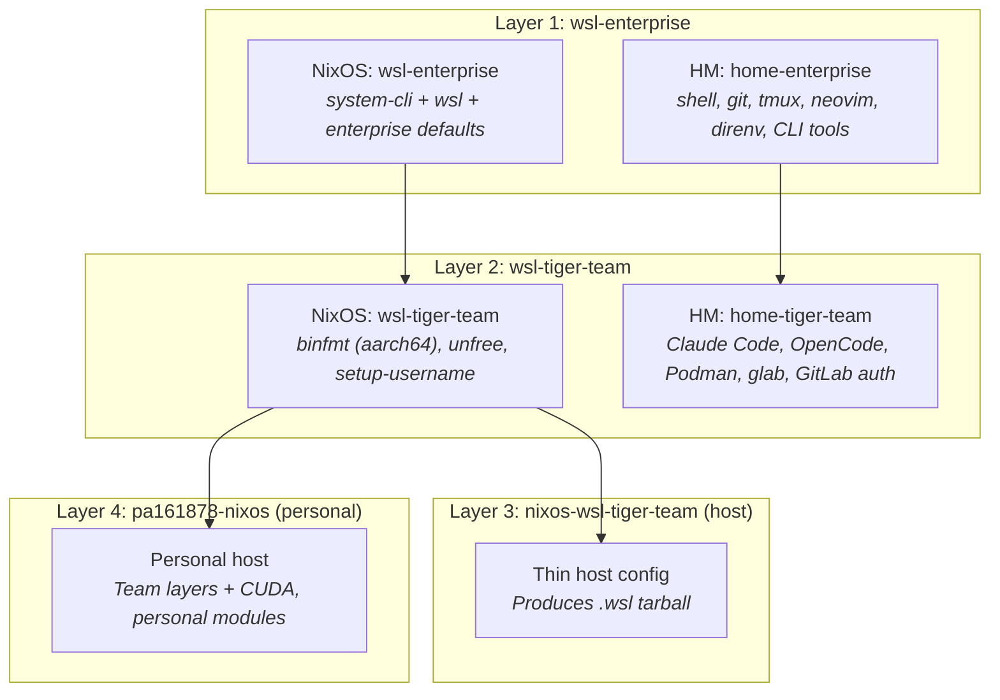

# WSL Image Builder & Admin Guide

Builder/maintainer reference for building, distributing, and customizing NixOS-WSL
team images. For end-user setup, see [WSL-TEAM-QUICKSTART.md](WSL-TEAM-QUICKSTART.md).

**Last Updated**: 2026-02-19

---

## Architecture

The distributable WSL image is composed from four module layers. Each layer is a
convenience bundle of dendritic feature modules — not a gatekeeper. Any host can
import layers wholesale or cherry-pick individual modules.



Each layer provides **both** a NixOS module and a Home Manager module (dual registration).
Priority layering: Enterprise (`mkDefault`) < Tiger-team (bare) < Host (`mkForce`).

For the full dendritic pattern and repository structure, see [ARCHITECTURE.md](ARCHITECTURE.md).

### Module file locations

| Layer | NixOS module | HM module | File |
|-------|-------------|-----------|------|
| Enterprise | `wsl-enterprise` | `home-enterprise` | `modules/system/settings/wsl-enterprise/wsl-enterprise.nix` |
| Tiger-team | `wsl-tiger-team` | `home-tiger-team` | `modules/system/settings/wsl-tiger-team/wsl-tiger-team.nix` |
| Host | — | — | `modules/hosts/nixos-wsl-tiger-team [N]/nixos-wsl-tiger-team.nix` |
| Personal | — | — | `modules/hosts/pa161878-nixos [N]/pa161878-nixos.nix` |

---

## Building the Tarball

### Prerequisites

- A running NixOS-WSL instance (or any Linux with Nix) with this flake checked out
- `sudo` access (the tarball builder runs `nixos-install` + compression)
- All changes staged or committed (Nix only sees staged/committed files)

### Build commands

Using the helper script (installed via Home Manager):

```bash
build-wsl-tarball nixos-wsl-tiger-team
```

Or manually:

```bash
# Build the tarball builder derivation
nix build '.#nixosConfigurations.nixos-wsl-tiger-team.config.system.build.tarballBuilder'

# Run it (requires sudo)
sudo ./result/bin/nixos-wsl-tarball-builder

# Result: nixos.wsl (~1.8 GB) in current directory
```

### Security checks

The build process automatically runs `wsl-tarball-checks` before producing the tarball.
These checks validate that no personal data (SSH keys, API tokens, user-specific config)
leaked into the distributable image. The generic `dev` user should be the only user
present.

To bypass checks during development (not recommended for distribution):

```bash
WSL_TARBALL_SKIP_CHECKS=1 build-wsl-tarball nixos-wsl-tiger-team
```

### Expected output

| Item | Value |
|------|-------|
| Output file | `nixos.wsl` (in current directory) |
| Size | ~1.8 GB |
| Default user | `dev` (renamed post-import via `setup-username`) |
| Hostname | `nixos-wsl-tiger` |

---

## Distributing

Give teammates two files:

1. **`nixos.wsl`** — the tarball (built above)
2. **`Import-NixOSWSL.ps1`** — the import script (from `docs/tools/`)

Transfer options: shared drive, Teams/Slack file upload, USB stick, `\\wsl$` UNC path
from the build machine. The end-user import process is documented in
[WSL-TEAM-QUICKSTART.md](WSL-TEAM-QUICKSTART.md).

---

## Import Script Internals

`docs/tools/Import-NixOSWSL.ps1` automates the import process and works around
several WSL bugs (microsoft/WSL#13064, #13129, #13339). Key operations:

- **Terminal fragment creation** — WSL's `wsl --import` fails to create Terminal
  fragment files, so the script creates them manually in `%LOCALAPPDATA%\Microsoft\
  Windows Terminal\Fragments\`.
- **Two-tier GUID handling** — Terminal uses its own GUID namespace
  (`WslDistroGenerator`) separate from WSL's registry GUIDs. The script generates
  the correct Terminal-tier GUID for fragment files.
- **Stale artifact cleanup** — removes orphan Terminal profiles and state.json
  entries left by previous imports.
- **Existing distro replacement** — detects and offers to unregister an existing
  distro with the same name before reimporting.

For the deep technical reference on the GUID system and Terminal integration, see
[tools/TERMINAL-PROFILE-ARCHITECTURE.md](tools/TERMINAL-PROFILE-ARCHITECTURE.md).

---

## Customization

### Adding or removing tools

Tools are organized as dendritic feature modules in `modules/programs/`. To add a
tool to the team image:

1. Create or identify the dendritic module (e.g., `modules/programs/my-tool/`)
2. Import it in the appropriate layer's HM bundle:
   - Enterprise-wide: add to `home-enterprise` imports in `wsl-enterprise.nix`
   - Team-specific: add to `home-tiger-team` imports in `wsl-tiger-team.nix`
3. Stage changes and rebuild: `build-wsl-tarball nixos-wsl-tiger-team`

### Changing team branding

The team image name, Terminal profile name, and hostname are set in the enterprise
and tiger-team modules:

- **Distro name** (for `wsl --import`): set in the host config's `wsl.defaultUser`
  and `networking.hostName`
- **Terminal profile name**: `enterprise.terminal.profileName` in `wsl-enterprise.nix`
- **Terminal icon/color**: `enterprise.terminal.icon` and `enterprise.terminal.colorScheme`

### Creating a new team layer

To create a layer for a different team (e.g., `wsl-alpha-team`):

1. Copy `modules/system/settings/wsl-tiger-team/` to `wsl-alpha-team/`
2. Rename module registrations (`wsl-alpha-team`, `home-alpha-team`)
3. Adjust imports — keep `wsl-enterprise` as base, swap in team-specific tools
4. Create a new thin host config in `modules/hosts/` that imports your team layer
5. Build: `build-wsl-tarball nixos-wsl-alpha-team`

---

## Troubleshooting

### Build fails with "configuration not found"

Verify the host name matches a `nixosConfigurations` entry:

```bash
nix eval '.#nixosConfigurations' --apply 'c: builtins.attrNames c'
```

### Build fails with "doesn't have a tarballBuilder"

The host config must import NixOS-WSL (`wsl.enable = true`). Only WSL configurations
produce tarball builders.

### Security check fails

The check found personal data in the image closure. Common causes:
- A module references a user-specific path or secret
- `allowUnfree` leaked a package with embedded credentials
- A home-manager module includes user-specific API tokens

Fix the offending module, or bypass with `WSL_TARBALL_SKIP_CHECKS=1` for testing only.

### Tarball much larger than expected

The default tiger-team image is ~1.8 GB. If significantly larger:
- Check if `hardware.graphics.enable` is true (adds ~800 MB of Mesa/LLVM).
  For CLI-only WSL images, this should be false unless CUDA is needed.
- Review unfree packages — some pull large dependency trees.

### Import script errors on Windows

See the troubleshooting section in [WSL-TEAM-QUICKSTART.md](WSL-TEAM-QUICKSTART.md).
