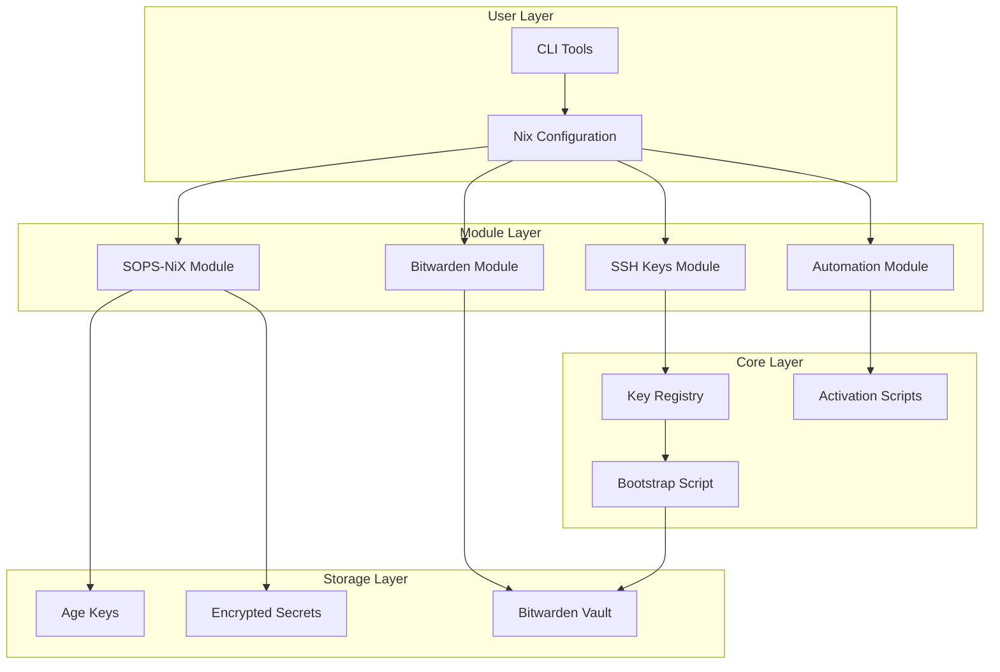
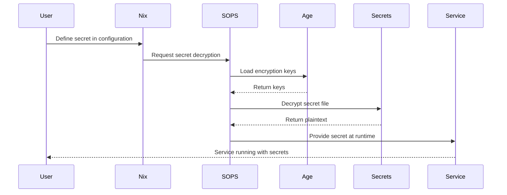

# Developer Documentation

## Architecture Overview

### System Design Philosophy

The NixOS SSH key and secrets management system follows these core principles:

1. **Declarative Configuration**: All secrets and keys defined in Nix expressions
2. **Security by Default**: Encrypted at rest, minimal permissions, audit trails
3. **Composability**: Modular design allowing mix-and-match components
4. **Reproducibility**: Deterministic builds and deployments
5. **Extensibility**: Clear extension points for custom functionality

### Component Architecture



### Data Flow



## Module API Reference

### Core Modules

#### 1. SSH Public Keys Registry (`ssh-keys-registry.nix`)

**Purpose**: Centralized management of SSH public keys for users and deployment accounts.

**Options**:
```nix
{
  options.sshKeyRegistry = {
    users = mkOption {
      type = types.attrsOf (types.listOf types.str);
      default = {};
      description = "SSH public keys for each user";
      example = {
        alice = [ "ssh-rsa AAAAB3..." ];
        bob = [ "ssh-ed25519 AAAAC3..." ];
      };
    };
    
    deployKeys = mkOption {
      type = types.attrsOf types.str;
      default = {};
      description = "Deployment-specific SSH keys";
      example = {
        ci = "ssh-rsa AAAAB3...";
        backup = "ssh-ed25519 AAAAC3...";
      };
    };
    
    groups = mkOption {
      type = types.attrsOf (types.listOf types.str);
      default = {};
      description = "Group users for key management";
      example = {
        admins = [ "alice" "bob" ];
        developers = [ "charlie" "diana" ];
      };
    };
  };
}
```

**Functions**:
```nix
# Get all keys for a user
getUserKeys = user: config.sshKeyRegistry.users.${user} or [];

# Get keys for all users in a group  
getGroupKeys = group: 
  flatten (map getUserKeys config.sshKeyRegistry.groups.${group});

# Merge keys from multiple sources
mergeKeys = sources: unique (flatten sources);
```

#### 2. SOPS-NiX Integration (`sops-nix.nix`)

**Purpose**: Manage encrypted secrets using SOPS with age encryption.

**Options**:
```nix
{
  options.sopsNix = {
    enable = mkEnableOption "SOPS-NiX secrets management";
    
    defaultSopsFile = mkOption {
      type = types.nullOr types.path;
      default = null;
      description = "Default SOPS file for secrets";
    };
    
    age = {
      keyFile = mkOption {
        type = types.nullOr types.path;
        default = "/var/lib/sops/age/keys.txt";
        description = "Path to age key file";
      };
      
      generateKey = mkOption {
        type = types.bool;
        default = true;
        description = "Auto-generate age key if missing";
      };
    };
    
    secrets = mkOption {
      type = types.attrsOf (types.submodule secretModule);
      default = {};
      description = "Secret definitions";
    };
    
    validateOnBuild = mkOption {
      type = types.bool;
      default = true;
      description = "Validate secrets during build";
    };
  };
}
```

**Secret Module**:
```nix
secretModule = {
  options = {
    sopsFile = mkOption {
      type = types.path;
      description = "SOPS file containing the secret";
    };
    
    key = mkOption {
      type = types.str;
      description = "Key path within SOPS file";
    };
    
    format = mkOption {
      type = types.enum [ "yaml" "json" "binary" "dotenv" ];
      default = "yaml";
      description = "Secret file format";
    };
    
    owner = mkOption {
      type = types.str;
      default = "root";
      description = "Secret file owner";
    };
    
    group = mkOption {
      type = types.str;
      default = "root";
      description = "Secret file group";
    };
    
    mode = mkOption {
      type = types.str;
      default = "0400";
      description = "Secret file permissions";
    };
    
    path = mkOption {
      type = types.nullOr types.path;
      default = null;
      description = "Custom output path for secret";
    };
    
    restartUnits = mkOption {
      type = types.listOf types.str;
      default = [];
      description = "Services to restart on secret change";
    };
  };
};
```

#### 3. Bitwarden Integration (`bitwarden-ssh-keys.nix`)

**Purpose**: Sync SSH keys with Bitwarden vault for centralized management.

**Options**:
```nix
{
  options.services.bitwardenSSHKeys = {
    enable = mkEnableOption "Bitwarden SSH key management";
    
    vaultUrl = mkOption {
      type = types.str;
      default = "https://vault.bitwarden.com";
      description = "Bitwarden vault URL";
    };
    
    email = mkOption {
      type = types.str;
      description = "Bitwarden account email";
    };
    
    sessionFile = mkOption {
      type = types.path;
      default = "/var/lib/bitwarden/session";
      description = "Path to store session token";
    };
    
    syncInterval = mkOption {
      type = types.str;
      default = "hourly";
      description = "Sync frequency (systemd calendar format)";
    };
    
    keyItems = mkOption {
      type = types.attrsOf (types.submodule {
        options = {
          name = mkOption {
            type = types.str;
            description = "Item name in Bitwarden";
          };
          
          folder = mkOption {
            type = types.nullOr types.str;
            default = null;
            description = "Bitwarden folder";
          };
          
          type = mkOption {
            type = types.enum [ "ssh" "age" "gpg" ];
            default = "ssh";
            description = "Key type";
          };
          
          users = mkOption {
            type = types.listOf types.str;
            default = [];
            description = "Users to grant access";
          };
        };
      });
      default = {};
      description = "Keys to manage in Bitwarden";
    };
  };
}
```

### Extension Points

#### 1. Custom Secret Backends

Create a new backend by implementing the secret provider interface:

```nix
# custom-vault-backend.nix
{ config, lib, pkgs, ... }:
let
  cfg = config.services.customVault;
in {
  options.services.customVault = {
    enable = mkEnableOption "Custom vault backend";
    
    secrets = mkOption {
      type = types.attrsOf types.attrs;
      default = {};
      description = "Secrets to fetch from custom vault";
    };
  };
  
  config = mkIf cfg.enable {
    # Implement secret provider interface
    systemd.services.custom-vault-sync = {
      description = "Sync secrets from custom vault";
      
      serviceConfig = {
        Type = "oneshot";
        ExecStart = "${pkgs.custom-vault-cli}/bin/vault-sync";
      };
      
      # Hook into SOPS-NiX activation
      before = [ "sops-nix.service" ];
      wantedBy = [ "multi-user.target" ];
    };
    
    # Register with secret management system
    sops.secretProviders.customVault = {
      type = "custom";
      
      fetchSecret = name: secret: ''
        ${pkgs.custom-vault-cli}/bin/vault get \
          --path ${secret.path} \
          --key ${secret.key} \
          > /run/secrets/${name}
      '';
      
      validateSecret = name: secret: ''
        test -f /run/secrets/${name} && \
        test -s /run/secrets/${name}
      '';
    };
  };
}
```

#### 2. Custom Key Providers

Extend the key management system with new key sources:

```nix
# yubikey-provider.nix
{ config, lib, pkgs, ... }:
{
  options.security.yubikey = {
    enable = mkEnableOption "YubiKey key provider";
    
    slots = mkOption {
      type = types.attrsOf types.attrs;
      default = {};
      description = "YubiKey slot configurations";
    };
  };
  
  config = mkIf config.security.yubikey.enable {
    # Add YubiKey as age key source
    sops.age.keyProviders.yubikey = {
      priority = 10;  # Higher priority than file-based keys
      
      getKey = ''
        ${pkgs.age-plugin-yubikey}/bin/age-plugin-yubikey \
          --slot ${toString cfg.slots.default.slot} \
          identity
      '';
      
      validateKey = ''
        ${pkgs.yubikey-manager}/bin/ykman info && \
        ${pkgs.age-plugin-yubikey}/bin/age-plugin-yubikey list
      '';
    };
    
    # Auto-unlock on boot
    boot.initrd.postDeviceCommands = ''
      echo "Waiting for YubiKey..."
      while ! ${pkgs.yubikey-manager}/bin/ykman info; do
        sleep 1
      done
    '';
  };
}
```

#### 3. Custom Activation Scripts

Add pre/post hooks to the secret activation process:

```nix
# secret-validation-hooks.nix
{ config, lib, pkgs, ... }:
{
  options.secrets.validation = {
    enable = mkEnableOption "Secret validation hooks";
    
    preActivation = mkOption {
      type = types.lines;
      default = "";
      description = "Script to run before secret activation";
    };
    
    postActivation = mkOption {
      type = types.lines;
      default = "";
      description = "Script to run after secret activation";
    };
    
    validators = mkOption {
      type = types.attrsOf types.lines;
      default = {};
      description = "Per-secret validation scripts";
    };
  };
  
  config = mkIf config.secrets.validation.enable {
    system.activationScripts.secretValidation = {
      text = ''
        echo "Running pre-activation validation..."
        ${cfg.preActivation}
        
        # Run per-secret validators
        ${lib.concatStringsSep "\n" (lib.mapAttrsToList (name: validator: ''
          if [ -f /run/secrets/${name} ]; then
            echo "Validating secret: ${name}"
            ${validator}
          fi
        '') cfg.validators)}
        
        echo "Running post-activation validation..."
        ${cfg.postActivation}
      '';
      
      deps = [ "sops-nix" ];
    };
  };
}
```

## Testing Guidelines

### Unit Testing

#### Testing Nix Modules

```nix
# tests/modules/ssh-keys-test.nix
{ pkgs, lib, ... }:
let
  testLib = import ./test-lib.nix { inherit pkgs lib; };
in
testLib.runModuleTests {
  name = "ssh-keys-registry";
  
  tests = {
    "empty registry returns empty list" = {
      config = {
        sshKeyRegistry.users = {};
      };
      
      assertion = config:
        (getUserKeys "nonexistent") == [];
    };
    
    "user keys are properly retrieved" = {
      config = {
        sshKeyRegistry.users.alice = [ "key1" "key2" ];
      };
      
      assertion = config:
        (getUserKeys "alice") == [ "key1" "key2" ];
    };
    
    "group keys aggregate correctly" = {
      config = {
        sshKeyRegistry.users = {
          alice = [ "key1" ];
          bob = [ "key2" ];
        };
        sshKeyRegistry.groups.admins = [ "alice" "bob" ];
      };
      
      assertion = config:
        (getGroupKeys "admins") == [ "key1" "key2" ];
    };
  };
}
```

#### Testing Secret Operations

```nix
# tests/secrets/sops-test.nix
{ pkgs, ... }:
pkgs.nixosTest {
  name = "sops-secret-operations";
  
  nodes.machine = { config, pkgs, ... }: {
    imports = [ ../../modules/nixos/sops-nix.nix ];
    
    sopsNix = {
      enable = true;
      defaultSopsFile = ./test-secrets.yaml;
      
      secrets.test-secret = {
        owner = "testuser";
        group = "testgroup";
        mode = "0440";
      };
    };
    
    users.users.testuser = {
      isSystemUser = true;
      group = "testgroup";
    };
    
    users.groups.testgroup = {};
  };
  
  testScript = ''
    machine.wait_for_unit("multi-user.target")
    
    # Verify secret exists
    machine.succeed("test -f /run/secrets/test-secret")
    
    # Check permissions
    machine.succeed("stat -c %U:%G /run/secrets/test-secret | grep -q testuser:testgroup")
    machine.succeed("stat -c %a /run/secrets/test-secret | grep -q 440")
    
    # Verify content
    actual = machine.succeed("cat /run/secrets/test-secret")
    assert actual == "test-value", f"Expected 'test-value', got '{actual}'"
  '';
}
```

### Integration Testing

#### Multi-Host Test Environment

```nix
# tests/integration/multi-host.nix
{ pkgs, ... }:
pkgs.nixosTest {
  name = "multi-host-secret-sharing";
  
  nodes = {
    vault = { config, pkgs, ... }: {
      services.bitwarden-rs = {
        enable = true;
        config = {
          domain = "https://vault.local";
          signupsAllowed = true;
        };
      };
      
      networking.firewall.allowedTCPPorts = [ 80 443 ];
    };
    
    host1 = { config, pkgs, ... }: {
      imports = [ ../../modules ];
      
      services.bitwardenSSHKeys = {
        enable = true;
        vaultUrl = "https://vault.local";
        email = "test@example.com";
      };
    };
    
    host2 = { config, pkgs, ... }: {
      imports = [ ../../modules ];
      
      services.bitwardenSSHKeys = {
        enable = true;
        vaultUrl = "https://vault.local";
        email = "test@example.com";
      };
    };
  };
  
  testScript = ''
    vault.wait_for_unit("bitwarden-rs.service")
    vault.wait_for_open_port(443)
    
    # Setup Bitwarden account
    vault.succeed("""
      bw config server https://vault.local
      bw register test@example.com password123 --name "Test User"
      export BW_SESSION=$(bw login test@example.com password123 --raw)
      bw sync
    """)
    
    # Create shared secret
    vault.succeed("""
      echo "shared-secret-value" | \
      bw create item --type secureNote \
        --name "shared-secret" \
        --notes -
    """)
    
    # Verify both hosts can access
    host1.wait_for_unit("bitwarden-ssh-keys.service")
    host2.wait_for_unit("bitwarden-ssh-keys.service")
    
    secret1 = host1.succeed("bw get item shared-secret | jq -r .notes")
    secret2 = host2.succeed("bw get item shared-secret | jq -r .notes")
    
    assert secret1 == secret2 == "shared-secret-value"
  '';
}
```

### Performance Testing

```nix
# tests/performance/scale-test.nix
{ pkgs, ... }:
let
  # Generate test secrets
  generateSecrets = count: 
    lib.genAttrs (map (i: "secret-${toString i}") (lib.range 1 count)) 
      (name: { owner = "root"; });
in
pkgs.nixosTest {
  name = "scale-performance-test";
  
  nodes.machine = { config, pkgs, ... }: {
    imports = [ ../../modules ];
    
    # Configure with many secrets
    sops.secrets = generateSecrets 1000;
    
    # Performance monitoring
    services.prometheus = {
      enable = true;
      exporters.node.enable = true;
    };
  };
  
  testScript = ''
    import time
    
    machine.wait_for_unit("multi-user.target")
    
    # Measure activation time
    start_time = time.time()
    machine.succeed("systemctl restart sops-nix.service")
    machine.wait_for_unit("sops-nix.service")
    activation_time = time.time() - start_time
    
    print(f"Activation time for 1000 secrets: {activation_time:.2f}s")
    
    # Check memory usage
    memory_usage = machine.succeed("""
      systemctl status sops-nix.service | \
      grep Memory | \
      awk '{print $2}'
    """).strip()
    
    print(f"Memory usage: {memory_usage}")
    
    # Verify all secrets exist
    secret_count = int(machine.succeed("find /run/secrets -type f | wc -l"))
    assert secret_count == 1000, f"Expected 1000 secrets, found {secret_count}"
    
    # Performance assertions
    assert activation_time < 60, f"Activation took too long: {activation_time}s"
  '';
}
```

## Contributing Guidelines

### Code Style

#### Nix Formatting

Use `nixpkgs-fmt` for consistent formatting:

```bash
# Format single file
nixpkgs-fmt modules/my-module.nix

# Format entire directory
nixpkgs-fmt modules/

# Check formatting (CI)
nixpkgs-fmt --check modules/
```

#### Style Conventions

1. **Module Structure**:
```nix
{ config, lib, pkgs, ... }:
let
  cfg = config.services.myService;
  
  # Local helpers
  helper = x: x + 1;
in
{
  # Interface (options)
  options.services.myService = {
    # Options in logical order
  };
  
  # Implementation
  config = mkIf cfg.enable {
    # System configuration
  };
  
  # Metadata
  meta.maintainers = [ lib.maintainers.yourname ];
}
```

2. **Naming Conventions**:
   - Options: `camelCase` (e.g., `enableFeature`)
   - Packages: `kebab-case` (e.g., `my-package`)
   - Functions: `camelCase` (e.g., `getUserKeys`)
   - Tests: `descriptive-name-test`

3. **Documentation**:
   - Every option needs a `description`
   - Complex options need an `example`
   - Add inline comments for non-obvious logic

### Pull Request Process

#### 1. Fork and Branch

```bash
# Fork the repository on GitHub
git clone https://github.com/yourusername/nixcfg.git
cd nixcfg

# Create feature branch
git checkout -b feature/your-feature-name
```

#### 2. Development Workflow

```bash
# Make changes
$EDITOR modules/your-module.nix

# Test locally
nixos-rebuild test --flake '.#test-system'

# Run module tests
nix build .#checks.x86_64-linux.modules

# Run integration tests
nix build .#checks.x86_64-linux.integration
```

#### 3. Commit Guidelines

Follow conventional commits:

```bash
# Format: <type>(<scope>): <subject>

# Feature
git commit -m "feat(ssh-keys): add YubiKey support"

# Bug fix
git commit -m "fix(sops): correct permission handling"

# Documentation
git commit -m "docs(api): update module reference"

# Performance
git commit -m "perf(secrets): optimize decryption caching"

# Tests
git commit -m "test(bitwarden): add multi-host scenarios"
```

#### 4. Submit PR

```markdown
## Description
Brief description of changes

## Type of Change
- [ ] Bug fix
- [ ] New feature
- [ ] Breaking change
- [ ] Documentation update

## Testing
- [ ] Unit tests pass
- [ ] Integration tests pass
- [ ] Manual testing completed

## Checklist
- [ ] Code follows style guidelines
- [ ] Self-review completed
- [ ] Documentation updated
- [ ] Tests added/updated
```

### Adding New Features

#### Feature Development Checklist

1. **Planning**:
   - [ ] Define clear requirements
   - [ ] Check for existing similar features
   - [ ] Design module interface

2. **Implementation**:
   - [ ] Create module with options
   - [ ] Add configuration logic
   - [ ] Handle edge cases

3. **Testing**:
   - [ ] Write unit tests
   - [ ] Add integration tests
   - [ ] Performance testing if applicable

4. **Documentation**:
   - [ ] Update module documentation
   - [ ] Add usage examples
   - [ ] Update troubleshooting guide

5. **Review**:
   - [ ] Code review from maintainer
   - [ ] Security review if handling secrets
   - [ ] Performance review for scale

#### Example: Adding HashiCorp Vault Support

```nix
# modules/hashicorp-vault.nix
{ config, lib, pkgs, ... }:
let
  cfg = config.services.hashicorpVault;
in
{
  options.services.hashicorpVault = {
    enable = mkEnableOption "HashiCorp Vault integration";
    
    address = mkOption {
      type = types.str;
      default = "http://127.0.0.1:8200";
      description = "Vault server address";
    };
    
    tokenFile = mkOption {
      type = types.path;
      description = "Path to Vault token file";
    };
    
    secrets = mkOption {
      type = types.attrsOf (types.submodule {
        options = {
          path = mkOption {
            type = types.str;
            description = "Vault secret path";
          };
          
          field = mkOption {
            type = types.nullOr types.str;
            default = null;
            description = "Specific field to extract";
          };
          
          destination = mkOption {
            type = types.path;
            description = "Local destination path";
          };
        };
      });
      default = {};
      description = "Secrets to fetch from Vault";
    };
  };
  
  config = mkIf cfg.enable {
    # Implementation
    systemd.services.vault-agent = {
      description = "HashiCorp Vault agent";
      
      serviceConfig = {
        ExecStart = "${pkgs.vault}/bin/vault agent -config=${vaultConfig}";
        Restart = "always";
      };
      
      wantedBy = [ "multi-user.target" ];
    };
    
    # Integration with existing system
    sops.secretProviders.vault = {
      type = "hashicorp-vault";
      fetchSecret = name: secret: ''
        ${pkgs.vault}/bin/vault kv get \
          -address=${cfg.address} \
          -format=json \
          ${secret.path} | \
          jq -r '.data.data.${secret.field}' > ${secret.destination}
      '';
    };
  };
}
```

## Debugging Techniques

### Debug Output

Enable verbose logging:

```nix
# In configuration
{
  # Enable debug mode
  sops.debug = true;
  
  # Verbose systemd logging
  systemd.services.sops-nix.serviceConfig = {
    Environment = "SOPS_LOG_LEVEL=debug";
    StandardOutput = "journal+console";
    StandardError = "journal+console";
  };
}
```

### Tracing Execution

```bash
# Trace module evaluation
nix eval --trace-verbose '.#nixosConfigurations.hostname.config.sops'

# Debug activation scripts
nixos-rebuild test --flake '.#hostname' --show-trace

# Trace systemd service
systemctl status sops-nix --full --no-pager
journalctl -u sops-nix -f --since "10 minutes ago"
```

### Common Debugging Commands

```bash
# Check if secrets are properly decrypted
sops -d /path/to/secret.yaml

# Verify age keys
age-keygen -y ~/.config/sops/age/keys.txt

# Test Bitwarden connection
bw login --check
bw sync
bw list items --search "test"

# Check file permissions
namei -l /run/secrets/my-secret

# Monitor file changes
inotifywait -m /run/secrets/

# Trace system calls
strace -f -e open,read,write systemctl restart sops-nix

# Profile performance
perf record -g systemctl restart sops-nix
perf report
```

### Interactive Debugging

```nix
# Add debug shell to module
{
  systemd.services.debug-shell = {
    description = "Debug shell for secret management";
    
    serviceConfig = {
      Type = "simple";
      ExecStart = "${pkgs.bash}/bin/bash";
      StandardInput = "tty";
      StandardOutput = "tty";
      StandardError = "tty";
      TTYPath = "/dev/tty8";
      TTYReset = true;
      TTYVHangup = true;
    };
    
    # Enable with: systemctl start debug-shell
    # Access with: Ctrl+Alt+F8
  };
}
```

## Architecture Deep Dive

### Security Model

The system implements defense-in-depth with multiple security layers:

1. **Encryption at Rest**: All secrets encrypted with age
2. **Access Control**: Fine-grained Unix permissions
3. **Process Isolation**: Systemd sandboxing
4. **Audit Trail**: Comprehensive logging
5. **Key Separation**: Different keys for different trust levels

### Performance Considerations

1. **Lazy Loading**: Secrets only decrypted when needed
2. **Caching**: Decrypted secrets cached in tmpfs
3. **Parallel Processing**: Multiple secrets decrypted concurrently
4. **Resource Limits**: Memory and CPU constraints

### Scalability Design

The system scales through:

1. **Horizontal scaling**: Multiple hosts share vault
2. **Vertical scaling**: Handles thousands of secrets per host
3. **Sharding**: Secrets distributed across multiple files
4. **Caching**: Reduces repeated decryption overhead

## FAQ

**Q: How do I add support for a new secret backend?**
A: Implement the secret provider interface shown in the Extension Points section.

**Q: Can I use GPG instead of age?**
A: Yes, SOPS supports GPG. Configure `sops.gnupg.home` and `sops.gnupg.sshKeyPaths`.

**Q: How do I debug permission denied errors?**
A: Check ownership with `stat`, trace with `strace`, and verify SELinux/AppArmor contexts.

**Q: Can this work with Kubernetes?**
A: Yes, through the CSI driver or by pre-populating secrets during node provisioning.

**Q: How do I handle secret rotation?**
A: Use `systemd.timers` to periodically run rotation scripts that update SOPS files.

## Summary

This developer documentation provides comprehensive technical guidance for:

- Understanding the system architecture
- Using and extending the module APIs
- Testing changes thoroughly
- Contributing improvements
- Debugging issues effectively

The modular design and clear extension points enable developers to adapt the system to their specific needs while maintaining security and reliability.