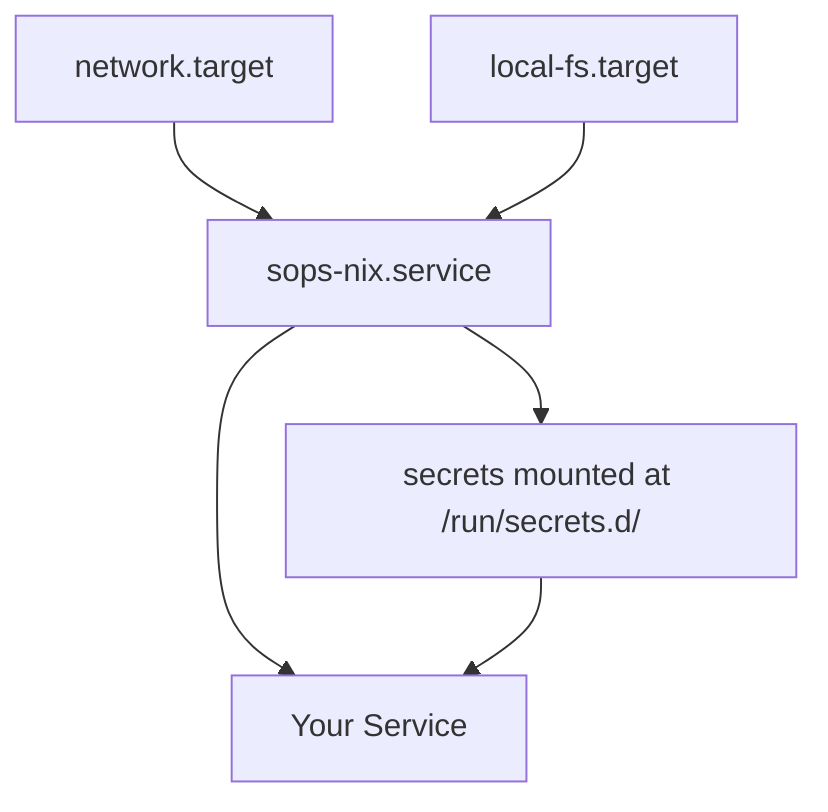

# Troubleshooting Guide

This guide helps you diagnose and resolve common issues with the SSH key management and SOPS-NiX secrets system.

## Table of Contents

1. [Common Error Messages](#common-error-messages)
2. [Permission Issues](#permission-issues)
3. [Key Recovery](#key-recovery)
4. [Secret Rotation Issues](#secret-rotation-issues)
5. [Multi-User Conflicts](#multi-user-conflicts)
6. [Debugging Activation Scripts](#debugging-activation-scripts)
7. [SOPS Decryption Failures](#sops-decryption-failures)
8. [Bitwarden Connection Problems](#bitwarden-connection-problems)
9. [SSH Key Issues](#ssh-key-issues)
10. [System Integration Problems](#system-integration-problems)

## Common Error Messages

### Error: "sops metadata not found"

**Symptom:**
```
Error: sops metadata not found
Could not find a key named "sops" in the input document
```

**Causes:**
- YAML file is not encrypted with SOPS
- File was manually edited without using `sops` command
- SOPS metadata was accidentally removed

**Solutions:**

1. **Re-encrypt the file:**
```bash
# Backup the current file
cp secrets/common/services.yaml secrets/common/services.yaml.backup

# Create new encrypted file with content
sops secrets/common/services.yaml
```

2. **Recover from git:**
```bash
# Check git history for last working version
git log --oneline secrets/common/services.yaml

# Restore previous version
git checkout <commit-hash> -- secrets/common/services.yaml
```

3. **Start fresh with template:**
```bash
# Use the template to create new file
cp secrets/common/example.yaml.template secrets/common/services.yaml
sops secrets/common/services.yaml
```

### Error: "no valid keys found"

**Symptom:**
```
Error: no valid keys found
Failed to decrypt file: no valid keys found for decryption
```

**Causes:**
- Age key not available on the system
- Wrong age key being used
- .sops.yaml configuration incorrect

**Solutions:**

1. **Verify age key exists:**
```bash
# Check if host key exists
ls -la /etc/ssh/ssh_host_ed25519_key

# Check if age key was generated
ls -la ~/.config/sops/age/keys.txt

# For root/system services
sudo ls -la /root/.config/sops/age/keys.txt
```

2. **Regenerate age key from SSH host key:**
```bash
# As root
sudo mkdir -p /root/.config/sops/age
sudo ssh-to-age -private-key -i /etc/ssh/ssh_host_ed25519_key > /root/.config/sops/age/keys.txt
sudo chmod 600 /root/.config/sops/age/keys.txt
```

3. **Update .sops.yaml with correct public key:**
```bash
# Get the public age key
sudo ssh-to-age < /etc/ssh/ssh_host_ed25519_key.pub

# Update .sops.yaml with this key
```

### Error: "could not import SSH host key"

**Symptom:**
```
Error: Could not import SSH host key as age key
The SSH host key may not be in a supported format (ed25519 required)
```

**Causes:**
- SSH host key is not ed25519 type
- SSH host key file missing or corrupted
- Permissions issue on SSH key file

**Solutions:**

1. **Generate ed25519 host key:**
```bash
# Generate new ed25519 host key
sudo ssh-keygen -t ed25519 -f /etc/ssh/ssh_host_ed25519_key -N ""

# Restart SSH service
sudo systemctl restart sshd
```

2. **Fix permissions:**
```bash
# Correct permissions for SSH host keys
sudo chmod 600 /etc/ssh/ssh_host_ed25519_key
sudo chmod 644 /etc/ssh/ssh_host_ed25519_key.pub
sudo chown root:root /etc/ssh/ssh_host_ed25519_key*
```

## Permission Issues

### Secret File Permission Denied

**Symptom:**
```
Permission denied: /run/secrets.d/1/database/password
```

**Causes:**
- Incorrect owner/group specified in SOPS configuration
- Service running as unexpected user
- Mode too restrictive

**Solutions:**

1. **Check and fix ownership:**
```nix
# In your NixOS configuration
sops.secrets."database/password" = {
  owner = "postgres";  # Must match service user
  group = "postgres";  # Must match service group
  mode = "0440";      # Allow group read
};
```

2. **Verify service user:**
```bash
# Check what user the service runs as
systemctl show postgresql -p User -p Group

# Check current secret permissions
ls -la /run/secrets.d/1/database/password
```

3. **Debug with broader permissions (temporary):**
```nix
sops.secrets."database/password" = {
  owner = "root";
  group = "root";
  mode = "0444";  # World readable - ONLY FOR DEBUGGING
};
```

### Cannot Write to Secrets Directory

**Symptom:**
```
Error: Read-only file system: /run/secrets.d/
```

**Causes:**
- SOPS-NiX service not started
- Tmpfs mount failed
- System in emergency/recovery mode

**Solutions:**

1. **Check SOPS-NiX service status:**
```bash
systemctl status sops-nix.service

# Restart if needed
sudo systemctl restart sops-nix.service

# Check logs
journalctl -u sops-nix.service -n 50
```

2. **Verify mount:**
```bash
# Check if secrets directory is mounted
mount | grep secrets

# Should show something like:
# tmpfs on /run/secrets.d type tmpfs (rw,nosuid,nodev,mode=755)
```

## Key Recovery

### Lost Age Private Key

**Scenario:** Age private key was deleted or corrupted, but you have access to Bitwarden.

**Recovery Steps:**

1. **Retrieve key from Bitwarden:**
```bash
# Login to Bitwarden CLI
bw login

# Search for the age key
bw list items --search "age-key"

# Get the specific item
bw get item <item-id> | jq -r '.notes'
```

2. **Restore age key:**
```bash
# Create age directory
mkdir -p ~/.config/sops/age

# Save key from Bitwarden
echo "AGE-SECRET-KEY-..." > ~/.config/sops/age/keys.txt
chmod 600 ~/.config/sops/age/keys.txt
```

3. **Test decryption:**
```bash
# Try to decrypt a secret file
sops -d secrets/common/services.yaml
```

### Lost SSH Private Key

**Scenario:** User SSH private key lost but public key is in the registry.

**Recovery Options:**

1. **If backed up in Bitwarden:**
```bash
# Retrieve from Bitwarden
bw get item "SSH Key - username" | jq -r '.notes' > ~/.ssh/id_ed25519
chmod 600 ~/.ssh/id_ed25519

# Generate public key from private
ssh-keygen -y -f ~/.ssh/id_ed25519 > ~/.ssh/id_ed25519.pub
```

2. **Generate new key pair:**
```bash
# Generate new SSH key
ssh-keygen -t ed25519 -C "user@hostname"

# Update the registry
# In your NixOS configuration, update the public key
```

3. **Use bootstrap key temporarily:**
```bash
# The bootstrap script provides temporary access
/run/current-system/sw/bin/add-bootstrap-ssh-keys.sh username
```

## Secret Rotation Issues

### Rotation Script Fails

**Symptom:**
```
Error: Failed to rotate secrets
Cannot update keys: file is already encrypted with new key
```

**Causes:**
- Secret already encrypted with new key
- Partial rotation from previous attempt
- Git merge conflict in SOPS metadata

**Solutions:**

1. **Force re-encryption:**
```bash
# Decrypt to plain text (CAREFUL!)
sops -d secrets/common/services.yaml > /tmp/services-plain.yaml

# Re-encrypt with new keys
sops -e /tmp/services-plain.yaml > secrets/common/services.yaml

# Clean up
shred -u /tmp/services-plain.yaml
```

2. **Update keys for all files:**
```bash
# Update all secret files in directory
for file in secrets/common/*.yaml; do
  sops updatekeys "$file"
done
```

3. **Resolve git conflicts:**
```bash
# If git merge conflict in SOPS metadata
git status
# Edit the file manually to resolve conflicts in the 'sops' section
# Re-encrypt after resolving
```

### Automated Rotation Not Running

**Symptom:** Secrets not rotating according to schedule.

**Check Steps:**

1. **Verify timer status:**
```bash
systemctl status rotate-secrets.timer
systemctl list-timers | grep rotate
```

2. **Check last rotation:**
```bash
journalctl -u rotate-secrets.service --since "1 month ago"
```

3. **Manual trigger:**
```bash
sudo systemctl start rotate-secrets.service
```

## Multi-User Conflicts

### Concurrent SOPS Edits

**Symptom:**
```
Error: File has been modified by another process
Merge conflict in SOPS metadata
```

**Prevention:**

1. **Use git branches for changes:**
```bash
# Create branch for your changes
git checkout -b update-wifi-passwords

# Make changes
sops secrets/common/wifi.yaml

# Commit and merge
git add secrets/common/wifi.yaml
git commit -m "Update WiFi passwords"
git checkout main
git merge update-wifi-passwords
```

2. **Lock file during edits:**
```bash
# Use flock for exclusive access
flock /tmp/sops.lock sops secrets/common/services.yaml
```

### Different Keys Between Users

**Issue:** Different users have different age keys, causing decryption failures.

**Solution:**

1. **Share secrets with all authorized keys:**
```yaml
# .sops.yaml
creation_rules:
  - path_regex: .*\.yaml$
    age: |
      age1user1...,
      age1user2...,
      age1host1...
```

2. **Re-encrypt after adding new key:**
```bash
# After updating .sops.yaml
sops updatekeys secrets/common/*.yaml
```

## Debugging Activation Scripts

### Script Fails Silently

**Diagnostic Steps:**

1. **Enable debug output:**
```nix
# In your module
system.activationScripts.myScript = {
  text = ''
    set -x  # Enable debug output
    set -e  # Exit on error
    
    echo "Starting my activation script"
    # Your script here
  '';
};
```

2. **Check activation logs:**
```bash
# View recent activation
journalctl -b | grep -A10 -B10 "activation"

# Run activation manually with debug
sudo NIXOS_DEBUG=1 /run/current-system/activate
```

3. **Test script separately:**
```bash
# Extract script and test
sudo bash -x -c 'YOUR_SCRIPT_CONTENT_HERE'
```

### Activation Order Issues

**Symptom:** Script runs before dependencies are ready.

**Solution:**

```nix
system.activationScripts.myScript = {
  deps = [ "users" "groups" "specialfs" ];  # Specify dependencies
  text = ''
    # Your script here
  '';
};
```

## SOPS Decryption Failures

### Age Key Format Issues

**Symptom:**
```
Error: Invalid age key format
age: error: invalid key format
```

**Diagnosis and Fix:**

1. **Check key format:**
```bash
# Age key should start with AGE-SECRET-KEY-
cat ~/.config/sops/age/keys.txt

# Should look like:
# AGE-SECRET-KEY-1XXXXXXXXXXXXXXXXXXXXXXXXXXXXXXXXXXXXXXXXXXXXXXXXXXXXXXX
```

2. **Validate key file:**
```bash
# No extra whitespace or newlines
wc -l ~/.config/sops/age/keys.txt  # Should be 1

# Check for hidden characters
cat -A ~/.config/sops/age/keys.txt
```

3. **Test key directly:**
```bash
# Test decryption with age directly
age -d -i ~/.config/sops/age/keys.txt test-file.age
```

### YAML Parsing Errors

**Symptom:**
```
Error: yaml: line 10: did not find expected key
```

**Common Causes and Fixes:**

1. **Indentation issues:**
```yaml
# WRONG - tabs mixed with spaces
services:
	database:  # This is a tab
    password: secret

# RIGHT - consistent spaces
services:
  database:
    password: secret
```

2. **Special characters:**
```yaml
# WRONG - unquoted special chars
password: my@pass#word!

# RIGHT - quoted
password: "my@pass#word!"
```

3. **Multi-line values:**
```yaml
# Use literal block scalar for multi-line
certificate: |
  -----BEGIN CERTIFICATE-----
  MIIDXTCCAkWgAwIBAgIJAKl...
  -----END CERTIFICATE-----
```

## Bitwarden Connection Problems

### Cannot Connect to Vault

**Symptom:**
```
Error: Cannot connect to Bitwarden vault
Request timeout
```

**Troubleshooting:**

1. **Check Bitwarden CLI status:**
```bash
# Test connection
bw status

# If locked, unlock
bw unlock
```

2. **Verify network access:**
```bash
# Test Bitwarden API
curl -I https://vault.bitwarden.com/api/

# Check DNS
nslookup vault.bitwarden.com
```

3. **Clear Bitwarden cache:**
```bash
# Clear potentially corrupted cache
rm -rf ~/.config/Bitwarden\ CLI/

# Re-login
bw login
```

### Two-Factor Authentication Issues

**Problem:** 2FA preventing automated access.

**Solutions:**

1. **Use API key for automation:**
```bash
# Set up API key authentication
export BW_CLIENTID="user.xxxxxxxx-xxxx-xxxx-xxxx-xxxxxxxxxxxx"
export BW_CLIENTSECRET="xxxxxxxxxxxxxxxxxxxxxxxxxxxx"

# Login with API key
bw login --apikey
```

2. **Generate long-lived session:**
```bash
# Unlock and export session
export BW_SESSION=$(bw unlock --raw)

# Use in scripts
bw list items --session $BW_SESSION
```

## SSH Key Issues

### SSH Key Not Accepted

**Symptom:**
```
Permission denied (publickey).
```

**Diagnostic Steps:**

1. **Verify key is in authorized_keys:**
```bash
# Check authorized_keys
cat ~/.ssh/authorized_keys | grep "your-key-comment"

# Check permissions
ls -la ~/.ssh/
ls -la ~/.ssh/authorized_keys
```

2. **Test with verbose SSH:**
```bash
ssh -vvv user@host

# Look for:
# - Which key files are being tried
# - Server's response to each key
# - Permission denied reasons
```

3. **Check SSH daemon configuration:**
```bash
# On the server
sudo sshd -T | grep -E "(PubkeyAuthentication|AuthorizedKeysFile)"
```

### SSH Agent Not Working

**Symptom:** Repeatedly asked for passphrase.

**Fixes:**

1. **Start SSH agent:**
```bash
# Check if agent running
echo $SSH_AUTH_SOCK

# Start if needed
eval $(ssh-agent)

# Add key
ssh-add ~/.ssh/id_ed25519
```

2. **Configure agent forwarding:**
```nix
# In NixOS configuration
programs.ssh = {
  startAgent = true;
  agentTimeout = "1h";
  extraConfig = ''
    AddKeysToAgent yes
    ForwardAgent yes
  '';
};
```

## System Integration Problems

### Service Cannot Read Secrets

**Symptom:** Service fails to start, cannot read secret file.

**Complete Diagnostic Process:**

1. **Check service dependencies:**
```bash
# View service configuration
systemctl cat your-service.service | grep -E "(After|Requires)"

# Should include:
# After=sops-nix.service
```

2. **Verify secret exists:**
```bash
# List all secrets
sudo ls -la /run/secrets.d/*/

# Check specific secret
sudo cat /run/secrets.d/1/your-secret
```

3. **Test as service user:**
```bash
# Switch to service user
sudo -u service-user bash

# Try to read secret
cat /run/secrets.d/1/your-secret
```

4. **Fix in NixOS configuration:**
```nix
systemd.services.your-service = {
  after = [ "sops-nix.service" ];
  requires = [ "sops-nix.service" ];
  
  serviceConfig = {
    # Ensure correct user
    User = "service-user";
    
    # Pass secret as environment variable
    EnvironmentFile = config.sops.secrets."service/env".path;
  };
};
```

### NixOS Rebuild Fails

**Symptom:**
```
error: The option `sops.secrets.mykey.sopsFile' does not exist
```

**Common Issues and Fixes:**

1. **Module not imported:**
```nix
# Ensure sops-nix module is imported
imports = [
  "${inputs.sops-nix}/modules/sops"
  # Other imports...
];
```

2. **Flake input missing:**
```nix
# In flake.nix
inputs = {
  sops-nix = {
    url = "github:Mic92/sops-nix";
    inputs.nixpkgs.follows = "nixpkgs";
  };
};
```

3. **Secret file path incorrect:**
```nix
# Use relative path from configuration file
sops.secrets."mykey" = {
  sopsFile = ../../secrets/common/services.yaml;  # Relative to this file
  # OR absolute path
  sopsFile = /etc/nixos/secrets/common/services.yaml;
};
```

## Performance Issues

### Slow Secret Decryption

**Symptom:** System boot delayed by secret decryption.

**Optimizations:**

1. **Parallel decryption:**
```nix
# Enable parallel processing
sops.age.concurrent = true;
```

2. **Reduce secret count:**
```nix
# Combine related secrets into one file
sops.secrets."app-config" = {
  format = "yaml";
  sopsFile = ./app-config.yaml;
  # Access subkeys with config.sops.secrets."app-config".path
};
```

3. **Cache decrypted secrets:**
```nix
# Keep secrets in memory (careful with security)
sops.secrets."frequently-used" = {
  mode = "0400";
  neededForUsers = false;  # Don't block user creation
};
```

## Getting Help

If you encounter issues not covered here:

1. **Check logs:**
```bash
# System logs
journalctl -xe

# Service-specific logs
journalctl -u sops-nix.service -n 100

# Boot logs
journalctl -b
```

2. **Enable debug mode:**
```nix
# In configuration
sops.debug = true;
```

3. **Community resources:**
- NixOS Discourse: https://discourse.nixos.org/
- SOPS-NiX Issues: https://github.com/Mic92/sops-nix/issues
- NixOS Matrix: #nixos:nixos.org

4. **Collect diagnostic information:**
```bash
# System information
nix-info

# SOPS version
sops --version

# Age version
age --version

# Current configuration
sudo nixos-rebuild dry-build
```

## Quick Reference Card

### Essential Commands

```bash
# Edit secrets
sops secrets/common/services.yaml

# Update keys
sops updatekeys secrets/common/services.yaml

# Check secret status
sudo ls -la /run/secrets.d/

# Test SOPS decryption
sops -d secrets/common/services.yaml > /dev/null && echo "Success"

# Restart SOPS service
sudo systemctl restart sops-nix.service

# View SOPS logs
journalctl -u sops-nix.service -f

# Generate age key from SSH
ssh-to-age -private-key -i ~/.ssh/id_ed25519

# Check NixOS configuration
nixos-rebuild dry-build

# Apply configuration
sudo nixos-rebuild switch
```

### File Locations

```
/run/secrets.d/            - Decrypted secrets (runtime)
~/.config/sops/age/        - User age keys
/root/.config/sops/age/    - System age keys
/etc/ssh/ssh_host_*_key    - SSH host keys
~/.ssh/                    - User SSH keys
.sops.yaml                 - SOPS configuration
secrets/                   - Encrypted secret files
```

### Service Dependencies



Remember: Most issues stem from permissions, missing dependencies, or incorrect paths. Always check these first!