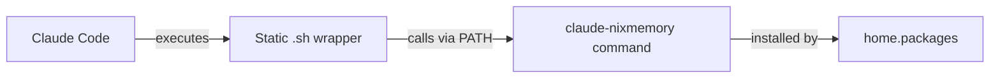

# Slash Commands Migration: From Symlinks to Static Wrappers

## Problem Statement

The current slash command implementation creates symlinks to Nix store paths:
```
claude-runtime/.claude-pro/commands/nixmemory.sh -> /nix/store/xxx/nixmemory
```

Every `home-manager switch` generates new store paths, causing git to see changes even when the actual script content hasn't changed. This creates unnecessary git noise.

## Solution: Static Wrappers + PATH Commands

### Architecture Overview



### Key Benefits

1. **No Git Churn**: Static files with unchanging content
2. **Clean Updates**: Commands on PATH updated by Nix
3. **Simpler Design**: Clear separation of interface and implementation
4. **Maintainable**: Easy to understand and debug

## Migration Steps

### Step 1: Enable Static Commands (Testing Phase)

```nix
# In your home configuration
programs.claude-code = {
  enable = true;
  memoryCommands.enable = true;
  staticCommands.enable = true;  # New option
};
```

### Step 2: Import the New Module

```nix
# In home/modules/default.nix or your imports
imports = [
  ./claude-code/memory-commands-static.nix  # Add this
  # ... other imports
];
```

### Step 3: Rebuild and Test

```bash
# Apply the configuration
home-manager switch --flake '.#tim@tblack-t14-nixos'

# Verify commands are on PATH
which claude-nixmemory
which claude-nixremember

# Test the commands work
claude-nixmemory    # Should show memory file location
claude-nixremember "Test entry"  # Should add to memory
```

### Step 4: Verify Git Status

```bash
# Check that command files are no longer symlinks
ls -la claude-runtime/.claude-pro/commands/nixmemory.sh
# Should show a regular file, not a symlink

# Verify no changes after rebuild
home-manager switch --flake '.#tim@tblack-t14-nixos'
git status claude-runtime/
# Should show no changes!
```

### Step 5: Clean Migration

Once verified working:

1. **Disable old implementation**:
   ```nix
   # In memory-commands.nix, wrap the config section:
   config = mkIf (cfg.enable && cfg.memoryCommands.enable && !cfg.staticCommands.enable) {
     # ... existing implementation
   };
   ```

2. **Commit the static files**:
   ```bash
   git add claude-runtime/**/*.sh claude-runtime/**/*.md
   git commit -m "Migrate slash commands to static wrappers"
   ```

3. **Make static commands the default**:
   ```nix
   staticCommands.enable = mkDefault true;
   ```

## Technical Details

### Static Wrapper Example
```bash
#!/usr/bin/env bash
exec claude-nixmemory "$@"
```
This never changes, so git sees it as stable.

### Command on PATH
```nix
claudeNixmemoryCmd = pkgs.writeShellApplication {
  name = "claude-nixmemory";
  # ... implementation
};
```
This gets updated via `home.packages`, transparent to git.

### File Structure
```
claude-runtime/
└── .claude-pro/
    └── commands/
        ├── nixmemory.sh       # Static: exec claude-nixmemory "$@"
        ├── nixmemory.md       # Static: documentation
        ├── nixremember.sh     # Static: exec claude-nixremember "$@"
        └── nixremember.md     # Static: documentation
```

## Rollback Plan

If issues arise:

1. Set `staticCommands.enable = false`
2. Run `home-manager switch`
3. The old symlink-based implementation will be restored

## Future Enhancements

1. **Apply to all slash commands**: Once proven, apply this pattern to all Claude Code slash commands
2. **Command versioning**: Add version checks to ensure compatibility
3. **Auto-migration**: Script to convert existing symlinks to static wrappers

## FAQ

**Q: Will Claude Code notice the difference?**
A: No, Claude Code just executes the .sh files. It doesn't care if they're symlinks or static files.

**Q: What about updates to the scripts?**
A: Updates happen via the commands on PATH. The wrapper stays the same, the implementation updates transparently.

**Q: Can both implementations coexist?**
A: Yes, during migration. Use the `staticCommands.enable` flag to switch between them.

**Q: What about other accounts (claude-max)?**
A: The static implementation handles all accounts identically to the current implementation.