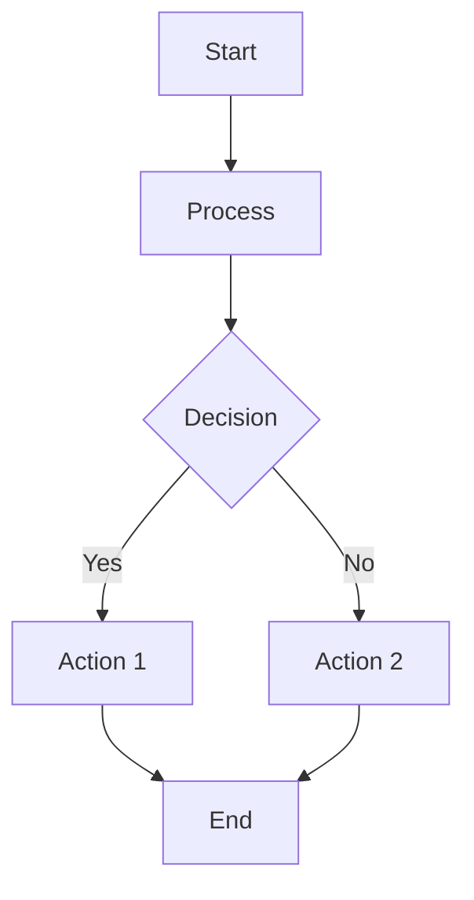
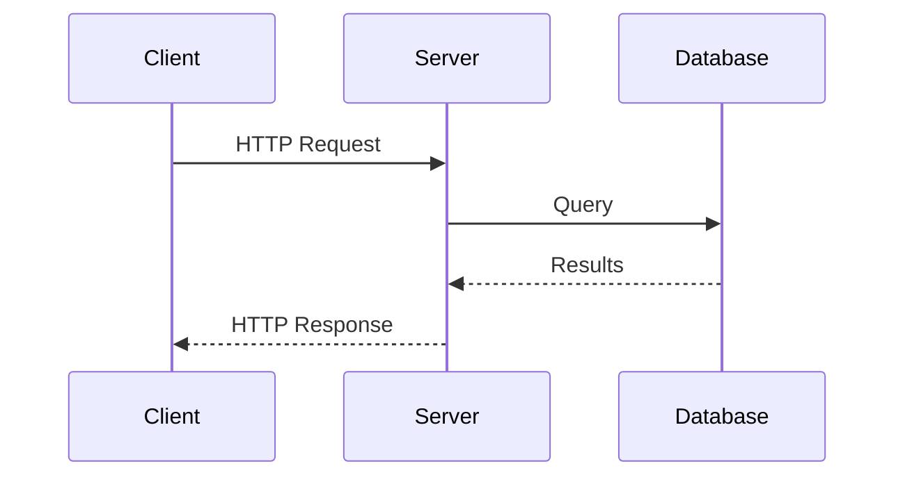
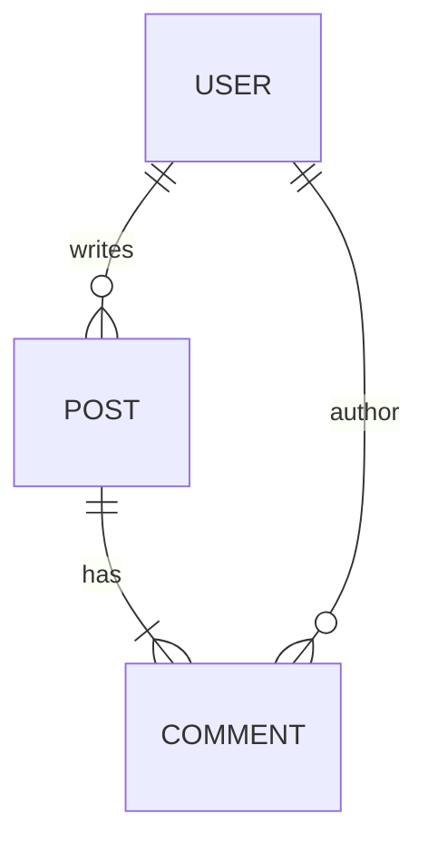

# Diagram Creation and Editing Skill

**Version**: 1.1.0
**Last Updated**: 2026-02-02

## Changelog

### v1.1.0 (2026-02-02)
- Added Section 14: Multi-Page DrawIO Support (page structure, ID namespacing, cross-page referencing)
- Added Section 15: Post-Render Critical Analysis (mandatory QA workflow, visual quality checklist)
- Added Section 16: Large File Handling (extraction methods for 400KB+ files)
- Added Section 17: Grouping Pattern for Similar Elements (container + single connection pattern)

## Overview

This skill enables creating and editing diagrams with automatic format selection based on complexity:

| Complexity | Format | Rationale |
|------------|--------|-----------|
| Simple | Mermaid | Text-based, renderer handles layout, works in GitHub/GitLab |
| Complex | DrawIO | Precise spatial control, custom positioning, rich styling |

**Supported Input Formats**:
- `.drawio.svg` - DrawIO with embedded mxGraphModel (PREFERRED)
- `.drawio` - Raw DrawIO XML
- Mermaid code blocks in markdown
- ASCII art diagrams

**Output Formats**:
- Mermaid - for simple diagrams (embedded in markdown)
- `.drawio.svg` - for complex diagrams (ALWAYS with embedded diagram)

---

## Section 1: Format Selection Heuristic

Before creating a diagram, determine the appropriate format:

### Use Mermaid When:

- Linear flows (A → B → C → D)
- Simple trees (2-3 levels max)
- Sequence diagrams
- Basic flowcharts with decision nodes
- Class/ER diagrams without custom positioning
- Diagram will be viewed primarily on GitHub/GitLab

### Use DrawIO When:

- Side-by-side comparisons (Option A vs Option B)
- Multi-region architecture (Frontend/Backend/Database groups)
- Custom spatial layout required
- Layered/stacked architecture views
- User explicitly requests DrawIO
- Precise positioning matters
- Complex styling (gradients, icons, custom colors)

### Decision Flowchart

```
START: User requests diagram
  │
  ├─► Is spatial layout critical?
  │     YES → DrawIO
  │     NO  ↓
  │
  ├─► Multiple interconnected regions?
  │     YES → DrawIO
  │     NO  ↓
  │
  ├─► Side-by-side comparison?
  │     YES → DrawIO
  │     NO  ↓
  │
  ├─► Simple linear/tree structure?
  │     YES → Mermaid
  │     NO  ↓
  │
  └─► Default → Mermaid (simpler is better)
```

---

## Section 2: Creating Mermaid Diagrams

Mermaid diagrams are text-based and let the renderer handle layout.

### Flowchart



**Syntax Notes**:
- `TD` = top-down, `LR` = left-right
- `[]` = rectangle, `{}` = diamond, `()` = rounded, `(())` = circle
- `-->` = arrow, `---` = line, `-.->` = dashed arrow
- `|label|` = edge label

### Sequence Diagram



**Syntax Notes**:
- `->>` = solid arrow (synchronous)
- `-->>` = dashed arrow (response/async)
- `participant X as Label` = named participant

### Entity Relationship



**Syntax Notes**:
- `||--o{` = one-to-many
- `||--|{` = one-to-one-or-more
- `}o--||` = many-to-one (optional)

### Best Practices for Mermaid

1. Keep diagrams focused - one concept per diagram
2. Use meaningful node IDs (not just A, B, C)
3. Add labels to edges for clarity
4. Test in GitHub preview before committing

---

## Section 3: Creating DrawIO Diagrams

DrawIO diagrams use mxGraphModel XML for precise control.

### Complete Boilerplate Template

Use this exact template for new `.drawio.svg` files:

```xml
<svg xmlns="http://www.w3.org/2000/svg" xmlns:xlink="http://www.w3.org/1999/xlink"
     version="1.1" width="850px" height="600px"
     viewBox="-0.5 -0.5 850 600"
     content="&lt;mxfile host=&quot;Claude&quot; modified=&quot;2026-02-01&quot;&gt;&lt;diagram name=&quot;Page-1&quot; id=&quot;diagram-1&quot;&gt;&lt;mxGraphModel dx=&quot;800&quot; dy=&quot;600&quot; grid=&quot;1&quot; gridSize=&quot;10&quot; guides=&quot;1&quot; tooltips=&quot;1&quot; connect=&quot;1&quot; arrows=&quot;1&quot; fold=&quot;1&quot; page=&quot;1&quot; pageScale=&quot;1&quot; pageWidth=&quot;850&quot; pageHeight=&quot;600&quot;&gt;&lt;root&gt;&lt;mxCell id=&quot;0&quot;/&gt;&lt;mxCell id=&quot;1&quot; parent=&quot;0&quot;/&gt;&lt;/root&gt;&lt;/mxGraphModel&gt;&lt;/diagram&gt;&lt;/mxfile&gt;"
     style="background-color: rgb(255, 255, 255);">
  <defs/>
  <!-- SVG body will be generated by drawio-svg-sync -->
  <g>
    <text x="400" y="300" text-anchor="middle" font-size="14">
      Run drawio-svg-sync to render this diagram
    </text>
  </g>
</svg>
```

**CRITICAL**: The `content` attribute contains the HTML-entity-encoded mxGraphModel. This is what makes the file editable in DrawIO.

### Decoded mxGraphModel Structure

When decoded, the content attribute contains:

```xml
<mxfile host="Claude" modified="2026-02-01">
  <diagram name="Page-1" id="diagram-1">
    <mxGraphModel dx="800" dy="600" grid="1" gridSize="10"
                  guides="1" tooltips="1" connect="1" arrows="1"
                  fold="1" page="1" pageScale="1"
                  pageWidth="850" pageHeight="600">
      <root>
        <mxCell id="0"/>                    <!-- Root cell - REQUIRED -->
        <mxCell id="1" parent="0"/>         <!-- Default parent - REQUIRED -->

        <!-- Your shapes and connectors go here -->

      </root>
    </mxGraphModel>
  </diagram>
</mxfile>
```

### Invariants (MUST be preserved)

| Invariant | Rule | Consequence if Violated |
|-----------|------|-------------------------|
| Cell 0 | MUST exist, no parent | Diagram won't load |
| Cell 1 | MUST exist, `parent="0"` | Shapes won't render |
| IDs | MUST be unique within diagram | Unpredictable behavior |
| Parent refs | All visible cells have `parent="1"` | Element won't appear |
| vertex/edge | Exactly one of `vertex="1"` or `edge="1"` | Rendering issues |
| mxGeometry | Required child for position/size | Element has no location |

---

## Section 4: Adding Shapes

### Basic Rectangle

```xml
<mxCell id="box-1" value="My Label"
        style="rounded=0;whiteSpace=wrap;html=1;"
        vertex="1" parent="1">
  <mxGeometry x="100" y="100" width="120" height="60" as="geometry"/>
</mxCell>
```

### Rounded Rectangle with Color

```xml
<mxCell id="box-2" value="Success"
        style="rounded=1;whiteSpace=wrap;html=1;fillColor=#d5e8d4;strokeColor=#82b366;"
        vertex="1" parent="1">
  <mxGeometry x="100" y="200" width="120" height="60" as="geometry"/>
</mxCell>
```

### Text Box

```xml
<mxCell id="text-1" value="Label Text"
        style="text;html=1;align=center;verticalAlign=middle;whiteSpace=wrap;rounded=0;"
        vertex="1" parent="1">
  <mxGeometry x="100" y="300" width="80" height="30" as="geometry"/>
</mxCell>
```

### Dashed Container (for grouping)

```xml
<mxCell id="container-1" value="Group Name"
        style="rounded=1;whiteSpace=wrap;html=1;dashed=1;dashPattern=8 8;fillColor=none;strokeColor=#00CC66;strokeWidth=2;"
        vertex="1" parent="1">
  <mxGeometry x="80" y="400" width="200" height="150" as="geometry"/>
</mxCell>
```

### Common Style Attributes

| Attribute | Values | Purpose |
|-----------|--------|---------|
| `rounded` | `0`, `1` | Corner style (0=sharp, 1=rounded) |
| `whiteSpace` | `wrap` | Text wrapping |
| `html` | `1` | Enable HTML in labels |
| `fillColor` | `#RRGGBB`, `none` | Background color |
| `strokeColor` | `#RRGGBB` | Border color |
| `strokeWidth` | number | Border thickness |
| `fontColor` | `#RRGGBB` | Text color |
| `fontSize` | number | Font size (points) |
| `fontStyle` | `1` | Bold text |
| `dashed` | `0`, `1` | Dashed border |
| `dashPattern` | `N N` | Dash/gap pattern |

### Color Palette (User Preference)

| Theme | fillColor | strokeColor | Use Case |
|-------|-----------|-------------|----------|
| Green (success) | `#d5e8d4` | `#82b366` | Positive states |
| Red (error) | `#f8cecc` | `#b85450` | Warnings, issues |
| Yellow (warning) | `#fff2cc` | `#d6b656` | Caution, pending |
| Orange | `#ffe6cc` | `#d79b00` | Configuration |
| Purple | `#e1d5e7` | `#9673a6` | Services |
| Blue (light) | `#dae8fc` | `#6c8ebf` | Infrastructure |
| Blue (dark) | `#0050ef` | `#001DBC` | Network |

---

## Section 5: Adding Connectors

### Basic Arrow (Orthogonal Routing)

```xml
<mxCell id="conn-1" value=""
        style="edgeStyle=orthogonalEdgeStyle;rounded=0;orthogonalLoop=1;jettySize=auto;html=1;endArrow=classic;"
        edge="1" parent="1" source="box-1" target="box-2">
  <mxGeometry relative="1" as="geometry"/>
</mxCell>
```

### Arrow with Label

```xml
<mxCell id="conn-2" value="sends data"
        style="edgeStyle=orthogonalEdgeStyle;rounded=0;html=1;endArrow=classic;"
        edge="1" parent="1" source="box-1" target="box-2">
  <mxGeometry relative="1" as="geometry"/>
</mxCell>
```

### Explicit Anchor Points

For left-to-right flow (user preference):

```xml
<mxCell id="conn-3" value=""
        style="edgeStyle=orthogonalEdgeStyle;exitX=1;exitY=0.5;exitDx=0;exitDy=0;entryX=0;entryY=0.5;entryDx=0;entryDy=0;endArrow=classic;html=1;"
        edge="1" parent="1" source="left-box" target="right-box">
  <mxGeometry relative="1" as="geometry"/>
</mxCell>
```

### Anchor Point Reference

```
      (0.5, 0) = top center
           ↓
(0, 0.5) → ┌────────────┐ ← (1, 0.5)
left       │   SHAPE    │   right
center     └────────────┘   center
                ↑
           (0.5, 1) = bottom center
```

| Position | exitX/entryX | exitY/entryY |
|----------|--------------|--------------|
| Left center | 0 | 0.5 |
| Right center | 1 | 0.5 |
| Top center | 0.5 | 0 |
| Bottom center | 0.5 | 1 |

### Floating Edge (No Source/Target)

```xml
<mxCell id="float-1" value=""
        style="endArrow=classic;html=1;"
        edge="1" parent="1">
  <mxGeometry width="50" height="50" relative="1" as="geometry">
    <mxPoint x="100" y="200" as="sourcePoint"/>
    <mxPoint x="300" y="200" as="targetPoint"/>
  </mxGeometry>
</mxCell>
```

### Arrow Styles

| Pattern | Style Attributes |
|---------|-----------------|
| Standard arrow | `endArrow=classic;` |
| Filled triangle | `endArrow=block;endFill=1;` |
| Open arrow | `endArrow=open;` |
| Bidirectional | `startArrow=oval;startFill=1;endArrow=oval;endFill=1;` |
| No arrows | `startArrow=none;endArrow=none;` |
| Dashed line | `dashed=1;dashPattern=8 8;` |

---

## Section 6: Complete Creation Examples

### Example 1: 3-Tier Architecture

**Request**: "Create a 3-tier architecture diagram with Web, API, and Database layers"

**Result** (decoded mxGraphModel, shapes only):

```xml
<!-- Web Tier -->
<mxCell id="web" value="Web Tier"
        style="rounded=1;whiteSpace=wrap;html=1;fillColor=#dae8fc;strokeColor=#6c8ebf;"
        vertex="1" parent="1">
  <mxGeometry x="100" y="50" width="120" height="60" as="geometry"/>
</mxCell>

<!-- API Tier -->
<mxCell id="api" value="API Tier"
        style="rounded=1;whiteSpace=wrap;html=1;fillColor=#d5e8d4;strokeColor=#82b366;"
        vertex="1" parent="1">
  <mxGeometry x="100" y="150" width="120" height="60" as="geometry"/>
</mxCell>

<!-- Database Tier -->
<mxCell id="db" value="Database"
        style="rounded=1;whiteSpace=wrap;html=1;fillColor=#fff2cc;strokeColor=#d6b656;"
        vertex="1" parent="1">
  <mxGeometry x="100" y="250" width="120" height="60" as="geometry"/>
</mxCell>

<!-- Web → API Connector -->
<mxCell id="conn-web-api"
        style="edgeStyle=orthogonalEdgeStyle;exitX=0.5;exitY=1;entryX=0.5;entryY=0;endArrow=classic;html=1;"
        edge="1" parent="1" source="web" target="api">
  <mxGeometry relative="1" as="geometry"/>
</mxCell>

<!-- API → Database Connector -->
<mxCell id="conn-api-db"
        style="edgeStyle=orthogonalEdgeStyle;exitX=0.5;exitY=1;entryX=0.5;entryY=0;endArrow=classic;html=1;"
        edge="1" parent="1" source="api" target="db">
  <mxGeometry relative="1" as="geometry"/>
</mxCell>
```

### Example 2: Pipeline Workflow (Left-to-Right)

**Request**: "Create a CI/CD pipeline: Fetch → Build → Test → Deploy"

**Result**:

```xml
<!-- Phase boxes - horizontal arrangement -->
<mxCell id="fetch" value="Fetch"
        style="rounded=1;whiteSpace=wrap;html=1;fillColor=#dae8fc;strokeColor=#6c8ebf;"
        vertex="1" parent="1">
  <mxGeometry x="50" y="100" width="100" height="60" as="geometry"/>
</mxCell>

<mxCell id="build" value="Build"
        style="rounded=1;whiteSpace=wrap;html=1;fillColor=#d5e8d4;strokeColor=#82b366;"
        vertex="1" parent="1">
  <mxGeometry x="200" y="100" width="100" height="60" as="geometry"/>
</mxCell>

<mxCell id="test" value="Test"
        style="rounded=1;whiteSpace=wrap;html=1;fillColor=#fff2cc;strokeColor=#d6b656;"
        vertex="1" parent="1">
  <mxGeometry x="350" y="100" width="100" height="60" as="geometry"/>
</mxCell>

<mxCell id="deploy" value="Deploy"
        style="rounded=1;whiteSpace=wrap;html=1;fillColor=#e1d5e7;strokeColor=#9673a6;"
        vertex="1" parent="1">
  <mxGeometry x="500" y="100" width="100" height="60" as="geometry"/>
</mxCell>

<!-- Connectors: exit RIGHT (1, 0.5), enter LEFT (0, 0.5) -->
<mxCell id="conn-1"
        style="edgeStyle=orthogonalEdgeStyle;exitX=1;exitY=0.5;entryX=0;entryY=0.5;endArrow=classic;html=1;"
        edge="1" parent="1" source="fetch" target="build">
  <mxGeometry relative="1" as="geometry"/>
</mxCell>

<mxCell id="conn-2"
        style="edgeStyle=orthogonalEdgeStyle;exitX=1;exitY=0.5;entryX=0;entryY=0.5;endArrow=classic;html=1;"
        edge="1" parent="1" source="build" target="test">
  <mxGeometry relative="1" as="geometry"/>
</mxCell>

<mxCell id="conn-3"
        style="edgeStyle=orthogonalEdgeStyle;exitX=1;exitY=0.5;entryX=0;entryY=0.5;endArrow=classic;html=1;"
        edge="1" parent="1" source="test" target="deploy">
  <mxGeometry relative="1" as="geometry"/>
</mxCell>
```

### Example 3: Side-by-Side Comparison

**Request**: "Create a comparison: Before (3 items) vs After (3 items)"

**Result**:

```xml
<!-- Headers -->
<mxCell id="before-header" value="&lt;b&gt;BEFORE&lt;/b&gt;"
        style="text;html=1;align=center;verticalAlign=middle;fontSize=16;"
        vertex="1" parent="1">
  <mxGeometry x="50" y="30" width="150" height="40" as="geometry"/>
</mxCell>

<mxCell id="after-header" value="&lt;b&gt;AFTER&lt;/b&gt;"
        style="text;html=1;align=center;verticalAlign=middle;fontSize=16;"
        vertex="1" parent="1">
  <mxGeometry x="350" y="30" width="150" height="40" as="geometry"/>
</mxCell>

<!-- Before column -->
<mxCell id="before-1" value="Manual process"
        style="rounded=1;whiteSpace=wrap;html=1;fillColor=#f8cecc;strokeColor=#b85450;"
        vertex="1" parent="1">
  <mxGeometry x="50" y="100" width="150" height="50" as="geometry"/>
</mxCell>

<mxCell id="before-2" value="Slow deployment"
        style="rounded=1;whiteSpace=wrap;html=1;fillColor=#f8cecc;strokeColor=#b85450;"
        vertex="1" parent="1">
  <mxGeometry x="50" y="170" width="150" height="50" as="geometry"/>
</mxCell>

<mxCell id="before-3" value="Error-prone"
        style="rounded=1;whiteSpace=wrap;html=1;fillColor=#f8cecc;strokeColor=#b85450;"
        vertex="1" parent="1">
  <mxGeometry x="50" y="240" width="150" height="50" as="geometry"/>
</mxCell>

<!-- After column -->
<mxCell id="after-1" value="Automated CI/CD"
        style="rounded=1;whiteSpace=wrap;html=1;fillColor=#d5e8d4;strokeColor=#82b366;"
        vertex="1" parent="1">
  <mxGeometry x="350" y="100" width="150" height="50" as="geometry"/>
</mxCell>

<mxCell id="after-2" value="Fast deployment"
        style="rounded=1;whiteSpace=wrap;html=1;fillColor=#d5e8d4;strokeColor=#82b366;"
        vertex="1" parent="1">
  <mxGeometry x="350" y="170" width="150" height="50" as="geometry"/>
</mxCell>

<mxCell id="after-3" value="Reliable"
        style="rounded=1;whiteSpace=wrap;html=1;fillColor=#d5e8d4;strokeColor=#82b366;"
        vertex="1" parent="1">
  <mxGeometry x="350" y="240" width="150" height="50" as="geometry"/>
</mxCell>

<!-- Transformation arrows -->
<mxCell id="transform-1"
        style="edgeStyle=orthogonalEdgeStyle;exitX=1;exitY=0.5;entryX=0;entryY=0.5;endArrow=classic;html=1;dashed=1;"
        edge="1" parent="1" source="before-1" target="after-1">
  <mxGeometry relative="1" as="geometry"/>
</mxCell>

<mxCell id="transform-2"
        style="edgeStyle=orthogonalEdgeStyle;exitX=1;exitY=0.5;entryX=0;entryY=0.5;endArrow=classic;html=1;dashed=1;"
        edge="1" parent="1" source="before-2" target="after-2">
  <mxGeometry relative="1" as="geometry"/>
</mxCell>

<mxCell id="transform-3"
        style="edgeStyle=orthogonalEdgeStyle;exitX=1;exitY=0.5;entryX=0;entryY=0.5;endArrow=classic;html=1;dashed=1;"
        edge="1" parent="1" source="before-3" target="after-3">
  <mxGeometry relative="1" as="geometry"/>
</mxCell>
```

---

## Section 7: Coordinate System

### Basics

- Origin: Top-left corner (0, 0)
- X-axis: Increases rightward
- Y-axis: Increases downward
- Units: Pixels

### mxGeometry Attributes

```xml
<mxGeometry x="100" y="200" width="120" height="60" as="geometry"/>
```

| Attribute | Purpose |
|-----------|---------|
| `x` | Left edge position |
| `y` | Top edge position |
| `width` | Element width |
| `height` | Element height |
| `as` | Always `"geometry"` |

### Parent-Child Coordinates

When `parent="1"` (default): coordinates are **ABSOLUTE**.

When `parent="other-id"` (container): coordinates are **RELATIVE** to parent.

```xml
<!-- Parent at absolute (100, 200) -->
<mxCell id="container" ... parent="1">
  <mxGeometry x="100" y="200" width="200" height="150" as="geometry"/>
</mxCell>

<!-- Child at relative (20, 30) = absolute (120, 230) -->
<mxCell id="child" ... parent="container">
  <mxGeometry x="20" y="30" width="80" height="40" as="geometry"/>
</mxCell>
```

### Layout Guidelines (User Preferences)

| Preference | Implementation |
|------------|----------------|
| Arrows enter LEFT | `entryX=0;entryY=0.5;` |
| Arrows exit RIGHT | `exitX=1;exitY=0.5;` |
| Use grid multiples | x, y, width, height in multiples of 10 |
| Consistent spacing | 50px gaps between shapes |

---

## Section 8: Rendering Workflow

After creating or editing the mxGraphModel XML, you MUST render it to update the visible SVG body.

### Pre-Render Validation Checklist

Before running the renderer, verify your XML:

- [ ] Cell 0 exists with no `parent` attribute
- [ ] Cell 1 exists with `parent="0"`
- [ ] All element IDs are unique
- [ ] All edges have valid `source`/`target` IDs (or explicit sourcePoint/targetPoint)
- [ ] All shapes have `vertex="1" parent="1"`
- [ ] All edges have `edge="1" parent="1"`
- [ ] All shapes have `<mxGeometry>` with x, y, width, height
- [ ] The `content` attribute is properly HTML-entity-encoded
- [ ] No unclosed XML tags

### Step 1: Create/Edit the .drawio.svg File

Write the complete SVG with encoded mxGraphModel in the `content` attribute.

### Step 2: Run drawio-svg-sync

```bash
nix run 'github:timblaktu/drawio-svg-sync' -- path/to/diagram.drawio.svg
```

**What drawio-svg-sync does**:
1. Reads the mxGraphModel from `content` attribute
2. Launches DrawIO CLI (using native X11 or xvfb-run fallback)
3. Exports the diagram to SVG using `drawio -x`
4. Re-injects the `content` attribute to preserve editability
5. Replaces the file with the updated SVG

**Expected success output**:
```
Processing: path/to/diagram.drawio.svg
Rendering diagram...
Successfully updated SVG body
```

**Expected runtime**: 5-15 seconds (Docker container startup + rendering)

### Step 3: Verify Rendering Success

#### Quick Verification

```bash
# Check file was modified (mtime should be recent)
ls -la path/to/diagram.drawio.svg

# Confirm SVG body was regenerated (should see actual shapes, not placeholder)
rg '<rect |<path |<ellipse ' path/to/diagram.drawio.svg | head -5
```

**Success indicators**:
- File modification time updated
- SVG body contains `<rect>`, `<path>`, `<g>`, etc. (actual graphics)
- Placeholder text ("Run drawio-svg-sync...") is gone

#### Detailed Verification (Optional)

```bash
# View in browser to confirm visual correctness
xdg-open path/to/diagram.drawio.svg

# Check the file opens in DrawIO desktop (confirms content attribute valid)
drawio path/to/diagram.drawio.svg
```

### Post-Render Validation Checklist

After successful rendering:

- [ ] File modification time updated
- [ ] SVG body contains actual graphic elements (not placeholder)
- [ ] Diagram displays correctly in browser
- [ ] Diagram opens in DrawIO desktop without errors
- [ ] Expected elements visible (shapes, connectors, labels)
- [ ] Colors and styling match intent

### Step 4: Git Workflow Integration

#### Staging

The `.drawio.svg` file is self-contained - it includes both:
- The encoded mxGraphModel (source of truth, editable in DrawIO)
- The rendered SVG body (visual representation)

Stage the single file:
```bash
git add path/to/diagram.drawio.svg
```

**Important**: Never stage intermediate states. Only stage after successful rendering.

#### Commit Message Conventions

Follow this pattern for diagram commits:

```bash
# For new diagrams
git commit -m "Add diagram: <what it shows>

<Brief description of purpose/context>"

# For diagram edits
git commit -m "Update diagram: <what changed>

<Why the change was made>"
```

**Examples**:
```bash
git commit -m "Add diagram: 3-tier architecture overview

Shows Web, API, and Database layers with connectivity"

git commit -m "Update diagram: rename 'Fetch' to 'Download' phase

Aligns terminology with upstream documentation"

git commit -m "Update diagram: add Cache component between API and Database

Illustrates caching layer for performance discussion"
```

#### PR Description (if applicable)

When diagram changes are part of a PR:
1. Mention the diagram change in the PR summary
2. Note what the diagram shows (GitHub/GitLab render .drawio.svg inline)
3. If the change is visual-only, say so ("no functional changes")

### Error Handling: Common Failures and Recovery

#### Failure: Docker Not Running

**Symptoms**:
```
Error: Cannot connect to Docker daemon
Error: docker: command not found
```

**Recovery**:
```bash
# Start Docker
sudo systemctl start docker

# Or, if using Docker Desktop
# Open Docker Desktop application

# Retry
nix run 'github:timblaktu/drawio-svg-sync' -- path/to/diagram.drawio.svg
```

#### Failure: Invalid XML in content Attribute

**Symptoms**:
```
Error: Failed to parse mxGraphModel
Error: XML parsing error at line X
```

**Recovery**:
1. Decode the content attribute
2. Validate XML (look for unclosed tags, mismatched quotes)
3. Common issues:
   - Unescaped `&` (should be `&amp;`)
   - Unescaped `<` in label text (should be `&lt;`)
   - Missing closing `</mxCell>`
4. Fix the XML, re-encode, and retry

#### Failure: Missing Required Cells

**Symptoms**:
```
Error: Root cell not found
Error: Default parent cell missing
```

**Recovery**:
Ensure your mxGraphModel has the required structure:
```xml
<root>
  <mxCell id="0"/>                    <!-- REQUIRED -->
  <mxCell id="1" parent="0"/>         <!-- REQUIRED -->
  <!-- Your shapes here -->
</root>
```

#### Failure: Duplicate IDs

**Symptoms**:
- Diagram loads but elements overlap unexpectedly
- Some elements don't appear
- DrawIO shows warnings about duplicate IDs

**Recovery**:
```bash
# Find duplicate IDs
rg -o 'id="[^"]+"' path/to/diagram.drawio.svg | sort | uniq -d
```
Rename duplicates to unique values.

#### Failure: Invalid Edge References

**Symptoms**:
- Edges don't appear
- Edges appear disconnected (floating)

**Recovery**:
```bash
# List all source/target references
rg 'source="([^"]+)"|target="([^"]+)"' -o path/to/diagram.drawio.svg

# List all shape IDs
rg 'id="([^"]+)".*vertex="1"' -o path/to/diagram.drawio.svg
```
Ensure every `source` and `target` value matches an existing shape ID.

#### Failure: Encoding Issues

**Symptoms**:
- File appears corrupted after editing
- `content` attribute truncated
- Special characters rendered incorrectly

**Recovery**:
Verify encoding is correct:
- `<` → `&lt;`
- `>` → `&gt;`
- `"` → `&quot;`
- `&` → `&amp;`
- Newlines → `&#10;`

Do NOT double-encode (e.g., `&amp;lt;` is wrong, should be `&lt;`).

### Workflow Summary

```
┌─────────────────────────────────────────────────────────┐
│                    RENDERING WORKFLOW                    │
├─────────────────────────────────────────────────────────┤
│                                                          │
│  1. Edit mxGraphModel XML                               │
│     └─► Pre-render checklist ✓                          │
│                                                          │
│  2. Re-encode content attribute                         │
│     └─► HTML entities properly escaped                  │
│                                                          │
│  3. Run drawio-svg-sync                                 │
│     └─► nix run 'github:timblaktu/drawio-svg-sync' -- FILE │
│                                                          │
│  4. Verify success                                      │
│     └─► Post-render checklist ✓                         │
│                                                          │
│  5. Stage and commit                                    │
│     └─► git add FILE && git commit -m "..."             │
│                                                          │
└─────────────────────────────────────────────────────────┘
```

---

## Section 9: Encoding the content Attribute

When writing a `.drawio.svg` file, the mxGraphModel must be HTML-entity-encoded in the `content` attribute.

### Encoding Rules

| Character | Encoded |
|-----------|---------|
| `<` | `&lt;` |
| `>` | `&gt;` |
| `"` | `&quot;` |
| `&` | `&amp;` |
| newline | `&#10;` |

### Example Encoding

**Before** (raw XML):
```xml
<mxfile host="Claude">
  <diagram name="Page-1" id="1">
    <mxGraphModel>
      <root>
        <mxCell id="0"/>
        <mxCell id="1" parent="0"/>
      </root>
    </mxGraphModel>
  </diagram>
</mxfile>
```

**After** (for content attribute):
```
&lt;mxfile host=&quot;Claude&quot;&gt;&#10;  &lt;diagram name=&quot;Page-1&quot; id=&quot;1&quot;&gt;&#10;    &lt;mxGraphModel&gt;&#10;      &lt;root&gt;&#10;        &lt;mxCell id=&quot;0&quot;/&gt;&#10;        &lt;mxCell id=&quot;1&quot; parent=&quot;0&quot;/&gt;&#10;      &lt;/root&gt;&#10;    &lt;/mxGraphModel&gt;&#10;  &lt;/diagram&gt;&#10;&lt;/mxfile&gt;
```

### Implementation Pattern

When creating a new diagram:

1. Build the mxGraphModel XML structure
2. Encode special characters
3. Insert into `content="..."` attribute
4. Include placeholder SVG body
5. Run drawio-svg-sync to render

---

## Quick Reference Card

### New Diagram Checklist

- [ ] Cell 0 exists (no parent attribute)
- [ ] Cell 1 exists (parent="0")
- [ ] All shapes have unique IDs
- [ ] All shapes have `vertex="1" parent="1"`
- [ ] All shapes have `<mxGeometry>` child
- [ ] All edges have `edge="1" parent="1"`
- [ ] All edges have source/target OR sourcePoint/targetPoint
- [ ] content attribute is properly encoded
- [ ] Run drawio-svg-sync after editing

### Minimal Shape

```xml
<mxCell id="UNIQUE_ID" value="LABEL"
        style="rounded=1;whiteSpace=wrap;html=1;"
        vertex="1" parent="1">
  <mxGeometry x="X" y="Y" width="W" height="H" as="geometry"/>
</mxCell>
```

### Minimal Connector

```xml
<mxCell id="UNIQUE_ID"
        style="edgeStyle=orthogonalEdgeStyle;endArrow=classic;html=1;"
        edge="1" parent="1" source="FROM_ID" target="TO_ID">
  <mxGeometry relative="1" as="geometry"/>
</mxCell>
```

For detailed technical reference on shapes, styles, and patterns, see [REFERENCE.md](REFERENCE.md).

---

## Section 10: Editing Existing Diagrams

When editing an existing `.drawio.svg` file, follow this workflow to make surgical changes without breaking the diagram.

### Step 1: Format Detection

First, determine what kind of file you're editing:

```bash
# Check for content attribute (DrawIO format)
rg -o 'content="[^"]{0,50}' file.drawio.svg
```

**DrawIO Format** (has `content` attribute with mxfile):
- The `content` attribute contains the editable mxGraphModel
- SVG body is just rendered output (regenerated by drawio-svg-sync)
- Edit the XML inside `content`, not the SVG elements

**Pure SVG** (no `content` attribute, or content doesn't contain mxfile):
- Out of scope for this skill
- These are hand-crafted SVGs, not DrawIO diagrams
- Inform user and decline to edit

### Step 2: Extract and Decode the mxGraphModel

The `content` attribute is HTML-entity-encoded. To edit:

1. **Extract** the content attribute value
2. **Decode** HTML entities:
   - `&lt;` → `<`
   - `&gt;` → `>`
   - `&quot;` → `"`
   - `&amp;` → `&`
   - `&#10;` → newline
3. **Parse** as XML to find target elements

### Step 3: Find Target Elements

#### By Text Content (User-Friendly)

Users think in terms of labels, not IDs. Search by `value` attribute:

```xml
<!-- Looking for "Fetch" -->
<mxCell id="phase-1" value="Fetch" .../>
```

**Pattern**: `value="TARGET_TEXT"` or `value="&lt;b&gt;TARGET_TEXT&lt;/b&gt;"` (HTML formatted)

**Caution**: Text might be HTML-encoded within the value:
- `&lt;b&gt;Title&lt;/b&gt;` = bold text
- `&lt;br&gt;` = line break

#### By ID (Precise)

When you know the exact ID:

```xml
<mxCell id="exact-id" .../>
```

**Pattern**: `id="TARGET_ID"`

#### By Style (Type-Based)

Find all shapes of a certain type:

```xml
<!-- All containers -->
<mxCell ... style="...container=1..." .../>

<!-- All edges -->
<mxCell ... edge="1" .../>

<!-- All vertices (shapes) -->
<mxCell ... vertex="1" .../>
```

### Step 4: Modify Text (value Attribute)

**SAFE**: Change only the `value` attribute, preserve everything else.

**Before**:
```xml
<mxCell id="step-1" value="Fetch"
        style="rounded=1;whiteSpace=wrap;html=1;fillColor=#dae8fc;strokeColor=#6c8ebf;"
        vertex="1" parent="1">
  <mxGeometry x="50" y="100" width="100" height="60" as="geometry"/>
</mxCell>
```

**After** (changing "Fetch" to "Download"):
```xml
<mxCell id="step-1" value="Download"
        style="rounded=1;whiteSpace=wrap;html=1;fillColor=#dae8fc;strokeColor=#6c8ebf;"
        vertex="1" parent="1">
  <mxGeometry x="50" y="100" width="100" height="60" as="geometry"/>
</mxCell>
```

**Verification**: The diff should show ONLY the value change:
```diff
-<mxCell id="step-1" value="Fetch"
+<mxCell id="step-1" value="Download"
```

### Step 5: Modify Style Attributes

The `style` attribute is a semicolon-separated key=value string. To modify:

1. Parse into key-value pairs
2. Update specific keys
3. Rebuild the string
4. Preserve key order when possible

**Example: Change fill color to light green**

**Before**:
```
style="rounded=1;whiteSpace=wrap;html=1;fillColor=#dae8fc;strokeColor=#6c8ebf;"
```

**After**:
```
style="rounded=1;whiteSpace=wrap;html=1;fillColor=#d5e8d4;strokeColor=#82b366;"
```

**Common Style Modifications**:

| Goal | Key(s) to Modify |
|------|-----------------|
| Change background color | `fillColor=#RRGGBB` |
| Change border color | `strokeColor=#RRGGBB` |
| Make dashed | `dashed=1;dashPattern=8 8;` |
| Make bold text | `fontStyle=1;` |
| Change font size | `fontSize=14;` |
| Remove fill | `fillColor=none;` |
| Add rounded corners | `rounded=1;` |

**Caution**: Some keys are flags (presence = true). Don't add `=1` unnecessarily:
- `html=1` ✓
- `dashed=1` ✓
- `text;` (no value - it's a shape type flag) ✓

### Step 6: Move Elements (Update Position)

To move an element, update the `x` and `y` attributes in `<mxGeometry>`:

**Before** (at position 100, 200):
```xml
<mxCell id="box-1" ...>
  <mxGeometry x="100" y="200" width="120" height="60" as="geometry"/>
</mxCell>
```

**After** (moved to 250, 150):
```xml
<mxCell id="box-1" ...>
  <mxGeometry x="250" y="150" width="120" height="60" as="geometry"/>
</mxCell>
```

**Important**: If moving a connected shape:
- Edges with `source` or `target` referencing this ID will auto-update endpoints
- Floating edges (using sourcePoint/targetPoint) will NOT update - you must manually adjust

### Step 7: Resize Elements

To resize, update `width` and `height` in `<mxGeometry>`:

**Before**:
```xml
<mxGeometry x="100" y="100" width="120" height="60" as="geometry"/>
```

**After** (larger):
```xml
<mxGeometry x="100" y="100" width="180" height="80" as="geometry"/>
```

**Text Consideration**: If the element has `whiteSpace=wrap;html=1;`, text will reflow to new size. Without wrapping, text may overflow.

### Step 8: Add New Elements

When adding elements to an existing diagram:

1. **Generate unique ID** - check existing IDs, use descriptive names
2. **Set parent="1"** for top-level elements
3. **Include vertex="1" or edge="1"** as appropriate
4. **Provide complete mxGeometry**

**Adding a Shape**:

```xml
<!-- Add after existing mxCell elements, before </root> -->
<mxCell id="new-box" value="New Component"
        style="rounded=1;whiteSpace=wrap;html=1;fillColor=#e1d5e7;strokeColor=#9673a6;"
        vertex="1" parent="1">
  <mxGeometry x="300" y="200" width="120" height="60" as="geometry"/>
</mxCell>
```

**Adding a Connector**:

```xml
<mxCell id="new-conn"
        style="edgeStyle=orthogonalEdgeStyle;exitX=1;exitY=0.5;entryX=0;entryY=0.5;endArrow=classic;html=1;"
        edge="1" parent="1" source="existing-box" target="new-box">
  <mxGeometry relative="1" as="geometry"/>
</mxCell>
```

**Verify References**: Ensure `source` and `target` IDs exist in the diagram!

### Step 9: Delete Elements Safely

Deleting requires removing the element AND cleaning up references.

#### Delete a Shape

1. Remove the `<mxCell>` element
2. Find ALL edges that reference this ID
3. Remove those edges too (or update their source/target)

**Example**: Deleting "box-to-remove"

**Step 1 - Find connected edges**:
```bash
rg 'source="box-to-remove"|target="box-to-remove"' file.drawio.svg
```

**Step 2 - Remove the shape and ALL referencing edges**:
```xml
<!-- REMOVE these: -->
<mxCell id="box-to-remove" ... vertex="1" .../>
<mxCell id="edge-to-box" ... source="other" target="box-to-remove" edge="1"/>
<mxCell id="edge-from-box" ... source="box-to-remove" target="other" edge="1"/>
```

#### Delete an Edge

Simpler - just remove the `<mxCell>` with `edge="1"`:

```xml
<!-- REMOVE: -->
<mxCell id="edge-to-remove" ... edge="1" .../>
```

**No cascading cleanup needed** - edges don't have dependents.

### Step 10: Preserve Diagram Integrity

**CRITICAL RULES - Never Violate These**:

| Rule | Consequence if Violated |
|------|------------------------|
| Never delete cell 0 | Diagram won't load |
| Never delete cell 1 | Shapes won't render |
| Never duplicate IDs | Unpredictable behavior |
| Never orphan edge references | Edge won't render |
| Never remove mxGeometry | Shape has no location |
| Never break parent references | Element won't appear |

**Pre-Edit Checklist**:
- [ ] Confirmed file has `content` attribute with mxfile
- [ ] Identified target element(s) by text or ID
- [ ] Noted any connected edges (if deleting/moving)
- [ ] Planned minimal changes (don't change what you don't need to)

**Post-Edit Checklist**:
- [ ] Cells 0 and 1 still exist
- [ ] All IDs remain unique
- [ ] All edge source/target references point to existing cells
- [ ] All cells have parent references
- [ ] Re-encoded content attribute properly
- [ ] Run drawio-svg-sync to verify rendering

### Complete Editing Example

**Request**: "In the pipeline diagram, change 'Build' to 'Compile' and make it green"

**Step 1**: Read and decode the content attribute

**Step 2**: Find the target element
```xml
<mxCell id="build" value="Build"
        style="rounded=1;whiteSpace=wrap;html=1;fillColor=#dae8fc;strokeColor=#6c8ebf;"
        vertex="1" parent="1">
  <mxGeometry x="200" y="100" width="100" height="60" as="geometry"/>
</mxCell>
```

**Step 3**: Make surgical changes (value and style only)
```xml
<mxCell id="build" value="Compile"
        style="rounded=1;whiteSpace=wrap;html=1;fillColor=#d5e8d4;strokeColor=#82b366;"
        vertex="1" parent="1">
  <mxGeometry x="200" y="100" width="100" height="60" as="geometry"/>
</mxCell>
```

**Step 4**: Re-encode and update content attribute

**Step 5**: Run drawio-svg-sync

**Step 6**: Verify the diff shows only expected changes

---

## Section 11: Splitting and Rerouting Connectors

When adding an element "between" two connected elements, you need to handle the existing connector.

### Scenario: Add Element Between Two Connected Elements

**Original**: Box A → Box B (via edge-1)
**Goal**: Box A → New Box → Box B

**Approach 1: Split the Existing Edge** (recommended)

1. **Update edge-1** to connect A → New Box
2. **Add edge-2** to connect New Box → B

```xml
<!-- Modified edge-1: now ends at new-box instead of B -->
<mxCell id="edge-1" ...
        source="box-a" target="new-box" edge="1">
  ...
</mxCell>

<!-- New edge: new-box to B -->
<mxCell id="edge-2"
        style="edgeStyle=orthogonalEdgeStyle;exitX=1;exitY=0.5;entryX=0;entryY=0.5;endArrow=classic;html=1;"
        edge="1" parent="1" source="new-box" target="box-b">
  <mxGeometry relative="1" as="geometry"/>
</mxCell>
```

**Approach 2: Delete and Recreate** (cleaner for complex routing)

1. Delete edge-1 entirely
2. Create edge-1-new: A → New Box
3. Create edge-2-new: New Box → B

### Connector Waypoint Considerations

If the original edge has custom waypoints:
```xml
<mxGeometry relative="1" as="geometry">
  <Array as="points">
    <mxPoint x="200" y="100"/>
    <mxPoint x="200" y="300"/>
  </Array>
</mxGeometry>
```

You may need to:
- Clear waypoints (let orthogonal routing recalculate)
- Or manually adjust waypoints to route around the new element

**Safest approach**: Remove waypoints, let drawio-svg-sync recalculate:
```xml
<mxGeometry relative="1" as="geometry"/>
```

---

## Section 12: Common Editing Patterns

### Pattern 1: Rename Multiple Elements

When renaming a concept across the diagram (e.g., "Server" → "API Gateway"):

1. Find all occurrences: `rg 'value="[^"]*Server[^"]*"'`
2. Update each value attribute
3. Do NOT change IDs (would break edge references)

### Pattern 2: Change Color Scheme

To recolor all elements of a type:

1. Identify elements by current fillColor
2. Search: `fillColor=#dae8fc` (current blue)
3. Replace with: `fillColor=#d5e8d4` (new green)
4. Update strokeColor to match

### Pattern 3: Reposition a Group

When multiple elements need to move together:

1. Calculate the offset (new position - current position)
2. Add offset to each element's x and y
3. Edges with source/target references auto-update

**Example**: Move everything right by 100px
```
x="100" → x="200"
x="250" → x="350"
```

### Pattern 4: Convert Edge Style

Change from straight to orthogonal routing:

**Before**:
```
style="endArrow=classic;html=1;"
```

**After**:
```
style="edgeStyle=orthogonalEdgeStyle;rounded=0;orthogonalLoop=1;jettySize=auto;html=1;endArrow=classic;"
```

---

## Section 13: Editing Troubleshooting

### Problem: Element Not Visible After Edit

**Check**:
- Does element have `parent="1"` (or valid parent)?
- Does element have `vertex="1"` or `edge="1"`?
- Does element have `<mxGeometry>` with valid x, y, width, height?
- Are coordinates within the page bounds?

### Problem: Edge Not Connecting

**Check**:
- Do `source` and `target` IDs exist?
- Does edge have `edge="1"` attribute?
- Is mxGeometry present (even if minimal)?

### Problem: Diagram Won't Load in DrawIO

**Check**:
- Cell 0 exists with no parent attribute
- Cell 1 exists with `parent="0"`
- All IDs are unique
- XML is valid (no unclosed tags)
- content attribute is properly encoded

### Problem: Changes Not Visible After Sync

**Check**:
- Did you modify the `content` attribute (not just SVG body)?
- Is the content attribute properly encoded?
- Did drawio-svg-sync run without errors?

### Problem: Connector Routing Looks Wrong

**Solution**: Clear waypoints to let DrawIO recalculate:
```xml
<!-- Remove Array as="points" if present -->
<mxGeometry relative="1" as="geometry"/>
```

Then run drawio-svg-sync to regenerate routing.

---

## Section 14: Multi-Page DrawIO Support

DrawIO supports multiple pages (tabs) within a single file. Use this for complex diagrams that benefit from separate views.

### When to Use Multiple Pages

| Use Case | Page Structure |
|----------|---------------|
| Physical vs Logical views | Page 1: Physical topology, Page 2: Logical connections |
| Overview vs Detail | Page 1: High-level architecture, Page 2+: Component details |
| Before/After states | Page 1: Current state, Page 2: Target state |
| Layered architecture | Page 1: Network layer, Page 2: Application layer, Page 3: Data layer |
| Deployment variants | Page 1: Dev environment, Page 2: Staging, Page 3: Production |

### Multi-Page XML Structure

Multiple pages are represented as multiple `<diagram>` elements inside `<mxfile>`:

```xml
<mxfile host="Claude" modified="2026-02-02">
  <diagram name="Physical Network" id="phys">
    <mxGraphModel dx="800" dy="600" grid="1" gridSize="10" guides="1" tooltips="1" connect="1" arrows="1" fold="1" page="1" pageScale="1" pageWidth="850" pageHeight="600">
      <root>
        <mxCell id="0"/>
        <mxCell id="1" parent="0"/>
        <!-- Physical network elements here -->
        <mxCell id="phys-switch-1" value="Core Switch" ... />
      </root>
    </mxGraphModel>
  </diagram>
  <diagram name="Logical Network" id="logic">
    <mxGraphModel dx="800" dy="600" grid="1" gridSize="10" guides="1" tooltips="1" connect="1" arrows="1" fold="1" page="1" pageScale="1" pageWidth="850" pageHeight="600">
      <root>
        <mxCell id="0"/>
        <mxCell id="1" parent="0"/>
        <!-- Logical network elements here -->
        <mxCell id="logic-vlan-10" value="VLAN 10" ... />
      </root>
    </mxGraphModel>
  </diagram>
</mxfile>
```

### ID Namespacing Strategy (CRITICAL)

**Problem**: Cell IDs must be unique across the ENTIRE file, not just per page.

**Solution**: Use page-specific prefixes for all IDs:

| Page | ID Prefix | Example IDs |
|------|-----------|-------------|
| Physical Network | `phys-` | `phys-switch-1`, `phys-server-rack`, `phys-conn-1` |
| Logical Network | `logic-` | `logic-vlan-10`, `logic-subnet-a`, `logic-conn-1` |
| Overview | `ov-` | `ov-cloud`, `ov-datacenter`, `ov-conn-1` |
| Detail | `det-` | `det-service-1`, `det-database`, `det-conn-1` |

**Exception**: Cells 0 and 1 are special:
- Each page has its OWN cell 0 and cell 1 with id="0" and id="1"
- These are scoped to the `<root>` within each `<diagram>`
- This is the ONLY case where IDs can repeat across pages

### Page Naming Conventions

| Pattern | Example Names | Use Case |
|---------|---------------|----------|
| View-based | "Physical View", "Logical View" | Different perspectives |
| Layer-based | "Network Layer", "Application Layer" | Architecture layers |
| State-based | "Current State", "Target State" | Before/after |
| Scope-based | "Overview", "Component A Detail" | Zoom levels |
| Environment-based | "Development", "Production" | Deployment variants |

**Guidelines**:
- Keep names short (< 20 characters) for tab display
- Use Title Case for consistency
- Make names self-descriptive (avoid "Page 1", "Page 2")

### Creating Multi-Page Diagrams

**Step 1**: Define the page structure and ID prefixes:

```
Diagram: Network Architecture
├── Page 1: "Physical Topology" (prefix: pt-)
│   └── Shows: racks, cables, physical ports
├── Page 2: "Logical Topology" (prefix: lt-)
│   └── Shows: VLANs, subnets, routing
└── Page 3: "Service Map" (prefix: sm-)
    └── Shows: applications, dependencies
```

**Step 2**: Build each page with namespaced IDs:

```xml
<!-- Page 1 content -->
<mxCell id="pt-rack-1" value="Rack A" ... />
<mxCell id="pt-server-1" value="Web Server" ... />
<mxCell id="pt-conn-1" ... source="pt-rack-1" target="pt-server-1" />

<!-- Page 2 content -->
<mxCell id="lt-vlan-10" value="VLAN 10 (Users)" ... />
<mxCell id="lt-subnet-1" value="10.0.10.0/24" ... />
<mxCell id="lt-conn-1" ... source="lt-vlan-10" target="lt-subnet-1" />
```

**Step 3**: Encode all pages into single content attribute

### Multi-Page Boilerplate Template

```xml
<svg xmlns="http://www.w3.org/2000/svg" xmlns:xlink="http://www.w3.org/1999/xlink"
     version="1.1" width="850px" height="600px"
     viewBox="-0.5 -0.5 850 600"
     content="&lt;mxfile host=&quot;Claude&quot; modified=&quot;2026-02-02&quot;&gt;&lt;diagram name=&quot;Page 1&quot; id=&quot;p1&quot;&gt;&lt;mxGraphModel dx=&quot;800&quot; dy=&quot;600&quot; grid=&quot;1&quot; gridSize=&quot;10&quot; guides=&quot;1&quot; tooltips=&quot;1&quot; connect=&quot;1&quot; arrows=&quot;1&quot; fold=&quot;1&quot; page=&quot;1&quot; pageScale=&quot;1&quot; pageWidth=&quot;850&quot; pageHeight=&quot;600&quot;&gt;&lt;root&gt;&lt;mxCell id=&quot;0&quot;/&gt;&lt;mxCell id=&quot;1&quot; parent=&quot;0&quot;/&gt;&lt;mxCell id=&quot;p1-example&quot; value=&quot;Page 1 Content&quot; style=&quot;rounded=1;whiteSpace=wrap;html=1;&quot; vertex=&quot;1&quot; parent=&quot;1&quot;&gt;&lt;mxGeometry x=&quot;100&quot; y=&quot;100&quot; width=&quot;120&quot; height=&quot;60&quot; as=&quot;geometry&quot;/&gt;&lt;/mxCell&gt;&lt;/root&gt;&lt;/mxGraphModel&gt;&lt;/diagram&gt;&lt;diagram name=&quot;Page 2&quot; id=&quot;p2&quot;&gt;&lt;mxGraphModel dx=&quot;800&quot; dy=&quot;600&quot; grid=&quot;1&quot; gridSize=&quot;10&quot; guides=&quot;1&quot; tooltips=&quot;1&quot; connect=&quot;1&quot; arrows=&quot;1&quot; fold=&quot;1&quot; page=&quot;1&quot; pageScale=&quot;1&quot; pageWidth=&quot;850&quot; pageHeight=&quot;600&quot;&gt;&lt;root&gt;&lt;mxCell id=&quot;0&quot;/&gt;&lt;mxCell id=&quot;1&quot; parent=&quot;0&quot;/&gt;&lt;mxCell id=&quot;p2-example&quot; value=&quot;Page 2 Content&quot; style=&quot;rounded=1;whiteSpace=wrap;html=1;&quot; vertex=&quot;1&quot; parent=&quot;1&quot;&gt;&lt;mxGeometry x=&quot;100&quot; y=&quot;100&quot; width=&quot;120&quot; height=&quot;60&quot; as=&quot;geometry&quot;/&gt;&lt;/mxCell&gt;&lt;/root&gt;&lt;/mxGraphModel&gt;&lt;/diagram&gt;&lt;/mxfile&gt;"
     style="background-color: rgb(255, 255, 255);">
  <defs/>
  <g>
    <text x="400" y="300" text-anchor="middle" font-size="14">
      Run drawio-svg-sync to render this diagram
    </text>
  </g>
</svg>
```

### Cross-Page Referencing

Elements CANNOT reference IDs across pages (edges cannot span pages). Instead:

1. **Use consistent element naming**: If "Database Server" appears on multiple pages, use recognizable names:
   - Physical: `phys-db-server` with value "DB Server (Physical)"
   - Logical: `logic-db-server` with value "DB Server (Logical)"

2. **Visual linking**: Add annotation text like "See Logical View for VLAN details"

3. **Color coding**: Use consistent colors for the same concept across pages

### Editing Multi-Page Diagrams

When editing, first identify which page contains the target element:

```bash
# Find which page contains an element
python3 -c "
import html, re
with open('diagram.drawio.svg') as f:
    content = html.unescape(re.search(r'content=\"([^\"]+)\"', f.read()).group(1))
# Search in decoded content for element and its surrounding <diagram> tag
"
```

**Common mistakes to avoid**:
- Adding element with ID `foo` when `foo` exists on another page
- Forgetting to namespace new IDs
- Referencing cross-page IDs in edge source/target

### Multi-Page Rendering Notes

When running drawio-svg-sync:
- Only the **first page** is rendered to the SVG body by default
- The content attribute preserves ALL pages
- DrawIO desktop can switch between pages when opening the file
- GitHub/GitLab preview shows only the first page

---

## Section 15: Post-Render Critical Analysis

After rendering a diagram with drawio-svg-sync, you MUST perform visual quality analysis before considering the task complete.

### Mandatory Analysis Workflow

```
┌─────────────────────────────────────────────────────────────┐
│                POST-RENDER ANALYSIS WORKFLOW                 │
├─────────────────────────────────────────────────────────────┤
│                                                              │
│  1. Run drawio-svg-sync                                     │
│     └─► Rendering complete                                  │
│                                                              │
│  2. Request visual verification                             │
│     └─► "Please share a screenshot of the rendered diagram" │
│     └─► OR: View file directly if in web context            │
│                                                              │
│  3. Analyze for common issues (see checklist below)         │
│     └─► Identify ALL visual problems                        │
│                                                              │
│  4. Propose specific fixes                                  │
│     └─► Describe exact changes needed                       │
│     └─► Offer to implement fixes                            │
│                                                              │
│  5. Iterate until quality acceptable                        │
│                                                              │
└─────────────────────────────────────────────────────────────┘
```

### Visual Quality Checklist

After viewing the rendered diagram, systematically check for:

#### Label Issues

| Issue | Symptom | Typical Fix |
|-------|---------|-------------|
| **Label overlap** | Text overlaps connectors or other labels | Move labels, adjust element positions, or use shorter text |
| **Stacked labels** | Multiple labels pile on same spot | Offset labels with mxGeometry adjustments |
| **Truncated text** | Words cut off or "..." shown | Increase element width/height |
| **Illegible text** | Font too small or poor contrast | Increase fontSize, adjust colors |

#### Connector Issues

| Issue | Symptom | Typical Fix |
|-------|---------|-------------|
| **Messy bundles** | Multiple connectors overlap creating visual noise | Adjust exit/entry points, add waypoints, or reposition elements |
| **Redundant labels** | Same label (e.g., "1x Eth") on every connector | Use one label for the group, or remove individual labels |
| **Awkward routing** | Connectors route through unrelated element groups | Add explicit waypoints or reposition elements |
| **Crossing connectors** | Connectors cross unnecessarily | Reorder elements or adjust anchor points |

#### Layout Issues

| Issue | Symptom | Typical Fix |
|-------|---------|-------------|
| **Insufficient spacing** | Elements too close together | Increase gaps to 50-100px minimum |
| **Uneven alignment** | Elements not on grid | Snap to grid (multiples of 10) |
| **Poor grouping** | Related elements not visually clustered | Use containers or adjust positioning |
| **Legend interference** | Legend overlaps diagram content | Move legend to corner or separate area |
| **Asymmetric layout** | Diagram feels unbalanced | Center elements, equalize spacing |

#### Content Issues

| Issue | Symptom | Typical Fix |
|-------|---------|-------------|
| **Missing elements** | Expected components not visible | Check mxGraphModel for missing cells |
| **Wrong colors** | Colors don't match semantic meaning | Update fillColor/strokeColor |
| **Incorrect connections** | Edges connect wrong elements | Fix source/target IDs |

### Analysis Response Template

When reporting analysis results, use this format:

```
**Visual Analysis Results**

✓ **Good**:
- [What works well]
- [Successful aspects]

✗ **Issues Found**:
1. **[Issue Type]**: [Description]
   - Location: [Where in diagram]
   - Fix: [Specific remedy]

2. **[Issue Type]**: [Description]
   - Location: [Where in diagram]
   - Fix: [Specific remedy]

**Recommended Actions**:
- [ ] [Action 1]
- [ ] [Action 2]

Shall I implement these fixes?
```

### Example Analysis

**Input**: User shares screenshot of network diagram

**Analysis**:

```
**Visual Analysis Results**

✓ **Good**:
- Color scheme clearly distinguishes network zones
- Overall left-to-right flow is correct
- Element labels are readable

✗ **Issues Found**:
1. **Connector bundle**: Three Ethernet connections between switch and server rack create visual clutter
   - Location: Center of diagram, switch-to-rack area
   - Fix: Use grouping pattern (single labeled connection to container)

2. **Redundant labels**: Every connection labeled "1x Eth" - redundant information
   - Location: All 12 connection arrows
   - Fix: Remove individual labels, add single legend entry or group label

3. **Insufficient spacing**: Dev boards row too close to server row
   - Location: Bottom third of diagram
   - Fix: Increase y-coordinate of dev board elements by 60px

4. **Legend overlap**: Legend box overlaps the rightmost server icon
   - Location: Bottom-right corner
   - Fix: Move legend 80px left or reposition to top-right

**Recommended Actions**:
- [ ] Replace individual connections with grouped container pattern
- [ ] Remove redundant "1x Eth" labels
- [ ] Add 60px vertical spacing between server and dev board rows
- [ ] Reposition legend to avoid overlap

Shall I implement these fixes?
```

### When to Skip Analysis

Analysis can be abbreviated (not skipped entirely) when:
- Diagram is very simple (< 5 elements)
- User explicitly says "quick draft, don't polish"
- Iterating on specific element (user already verified rest of diagram)

Even in these cases, do a quick scan for obvious issues.

---

## Section 16: Large File Handling

After rendering, `.drawio.svg` files can become very large (400KB+) due to embedded SVG graphics in the body. This section covers strategies for working with these files.

### Why Files Become Large

| Component | Typical Size | Notes |
|-----------|--------------|-------|
| `content` attribute | 5-50 KB | The mxGraphModel (your editable source) |
| SVG body | 50-500+ KB | Rendered graphics (paths, shapes, text) |
| Embedded images | Variable | Icons, logos add significant size |

The **content attribute is what you edit**. The SVG body is regenerated by drawio-svg-sync.

### Problem: Read Tool Limits

The Read tool has token limits. A 400KB+ file will:
- Exceed read limits
- Consume excessive context
- Potentially truncate the content attribute

### Solution: Targeted Extraction

Instead of reading the entire file, extract only the mxGraphModel content:

#### Method 1: Extract Content Attribute with Python

```bash
python3 -c "
import html, re
with open('diagram.drawio.svg') as f:
    content = f.read()
match = re.search(r'content=\"([^\"]+)\"', content)
if match:
    decoded = html.unescape(match.group(1))
    print(decoded)
else:
    print('ERROR: No content attribute found')
"
```

This extracts and decodes just the mxGraphModel (~5-50KB), ignoring the large SVG body.

#### Method 2: Read SVG Header Only

```bash
# Get first 100 lines (usually includes content attribute)
head -100 diagram.drawio.svg
```

Useful for quick inspection of attributes and start of content.

#### Method 3: Search for Specific Elements

```bash
# Find all cell IDs in the content
python3 -c "
import html, re
with open('diagram.drawio.svg') as f:
    content = html.unescape(re.search(r'content=\"([^\"]+)\"', f.read()).group(1))
for match in re.finditer(r'id=\"([^\"]+)\"', content):
    print(match.group(1))
"
```

#### Method 4: Extract and Pretty-Print

```bash
python3 -c "
import html, re
import xml.dom.minidom
with open('diagram.drawio.svg') as f:
    content = html.unescape(re.search(r'content=\"([^\"]+)\"', f.read()).group(1))
dom = xml.dom.minidom.parseString(content)
print(dom.toprettyxml(indent='  '))
" | head -200
```

### Reading Strategy by Task

| Task | Approach |
|------|----------|
| **Find element by label** | Extract content, search for `value="..."` |
| **List all IDs** | Extract content, regex for `id="..."` |
| **Understand structure** | Extract + pretty-print, read first 200 lines |
| **Edit specific element** | Extract content, find element, make change |
| **Full diagram review** | Request screenshot from user |
| **Verify rendering** | Check file exists and mtime updated |

### Writing Large Files

When writing updates to large files:

1. **Extract** the current content attribute
2. **Modify** the mxGraphModel XML as needed
3. **Re-encode** with HTML entities
4. **Use Edit tool** to replace ONLY the content attribute value
5. **Run drawio-svg-sync** to regenerate SVG body

**Never attempt to write the entire file** including SVG body - the sync tool handles that.

### File Size Guidelines

| File Size | Handling |
|-----------|----------|
| < 50 KB | Safe to Read directly |
| 50-200 KB | Extract content attribute preferred |
| 200-500 KB | Must extract content attribute |
| > 500 KB | Extract + consider if diagram is too complex |

**If a diagram exceeds 500KB**, consider:
- Splitting into multiple pages
- Simplifying (use grouping patterns)
- Removing embedded images
- Using external image references

### Example: Edit Large File Workflow

**Task**: Change "Database" to "PostgreSQL" in a 350KB diagram

**Step 1**: Extract and find element
```bash
python3 -c "
import html, re
with open('big-diagram.drawio.svg') as f:
    content = html.unescape(re.search(r'content=\"([^\"]+)\"', f.read()).group(1))
# Find the element
for line in content.split('\\n'):
    if 'Database' in line:
        print(line)
"
```

**Step 2**: Extract full content for editing
```bash
python3 -c "
import html, re
with open('big-diagram.drawio.svg') as f:
    content = html.unescape(re.search(r'content=\"([^\"]+)\"', f.read()).group(1))
print(content)
" > /tmp/content.xml
```

**Step 3**: Edit the extracted XML (change value="Database" to value="PostgreSQL")

**Step 4**: Re-encode and update file
```bash
python3 -c "
import html
with open('/tmp/content.xml') as f:
    content = f.read()
encoded = html.escape(content, quote=True)
print(encoded)
" > /tmp/encoded.txt
```

**Step 5**: Use Edit tool to replace content attribute value in the .drawio.svg

**Step 6**: Run drawio-svg-sync to regenerate SVG body

---

## Section 17: Grouping Pattern for Similar Elements

When a diagram has N similar elements (e.g., multiple servers, dev boards, or workstations), connecting to each individually creates visual clutter. Use the grouping pattern instead.

### Problem: N-to-1 Connection Clutter

**Bad Example**: 8 dev boards each with individual connection to switch

```
┌─────────┐     ┌─────────┐
│ Board 1 │─────│         │
├─────────┤     │         │
│ Board 2 │─────│         │
├─────────┤     │         │
│ Board 3 │─────│  Switch │  ← 8 overlapping arrows!
├─────────┤     │         │
│ Board 4 │─────│         │
├─────────┤     │         │
│  ...    │─────│         │
└─────────┘     └─────────┘
```

**Issues**:
- 8 connector lines overlap, creating visual noise
- Labels on each line (e.g., "1x Eth") are redundant
- Hard to trace individual connections
- Diagram scales poorly (what if 20 boards?)

### Solution: Container + Single Connection

**Good Example**: Dashed container around group with single labeled connection

```
┌ ─ ─ ─ ─ ─ ─ ─ ─ ─ ─ ─ ┐
│  Dev Boards (8x)       │     ┌─────────┐
│  ┌───┐ ┌───┐ ┌───┐    │────►│         │
│  │ 1 │ │ 2 │ │...│    │     │  Switch │
│  └───┘ └───┘ └───┘    │     │         │
│       ┌───┐            │     └─────────┘
│       │ N │            │
│       └───┘            │        8x Gigabit Ethernet
└ ─ ─ ─ ─ ─ ─ ─ ─ ─ ─ ─ ┘
```

**Benefits**:
- Single clean connection
- Label describes the group ("8x Gigabit Ethernet")
- Scales to any N
- Clear visual hierarchy

### Implementation Pattern

#### Step 1: Create the Dashed Container

```xml
<mxCell id="group-devboards" value="Dev Boards (8x)"
        style="rounded=1;whiteSpace=wrap;html=1;dashed=1;dashPattern=8 8;fillColor=none;strokeColor=#00CC66;strokeWidth=2;verticalAlign=top;align=left;spacingLeft=10;spacingTop=5;"
        vertex="1" parent="1">
  <mxGeometry x="50" y="200" width="300" height="150" as="geometry"/>
</mxCell>
```

**Key style attributes**:
- `dashed=1;dashPattern=8 8;` - Creates dashed border
- `fillColor=none;` - Transparent background
- `strokeWidth=2;` - Visible but not heavy
- `verticalAlign=top;align=left;` - Label in top-left corner

#### Step 2: Add Representative Elements Inside

Show 2-3 actual instances plus ellipsis to indicate more:

```xml
<!-- Board 1 -->
<mxCell id="board-1" value="Board 1"
        style="rounded=1;whiteSpace=wrap;html=1;fillColor=#dae8fc;strokeColor=#6c8ebf;fontSize=10;"
        vertex="1" parent="1">
  <mxGeometry x="70" y="250" width="60" height="40" as="geometry"/>
</mxCell>

<!-- Board 2 -->
<mxCell id="board-2" value="Board 2"
        style="rounded=1;whiteSpace=wrap;html=1;fillColor=#dae8fc;strokeColor=#6c8ebf;fontSize=10;"
        vertex="1" parent="1">
  <mxGeometry x="140" y="250" width="60" height="40" as="geometry"/>
</mxCell>

<!-- Ellipsis indicator -->
<mxCell id="board-ellipsis" value="..."
        style="text;html=1;align=center;verticalAlign=middle;fontSize=14;fontStyle=1;"
        vertex="1" parent="1">
  <mxGeometry x="210" y="250" width="30" height="40" as="geometry"/>
</mxCell>

<!-- Board N -->
<mxCell id="board-n" value="Board N"
        style="rounded=1;whiteSpace=wrap;html=1;fillColor=#dae8fc;strokeColor=#6c8ebf;fontSize=10;"
        vertex="1" parent="1">
  <mxGeometry x="250" y="250" width="60" height="40" as="geometry"/>
</mxCell>
```

#### Step 3: Single Connector to Container

Connect to the container, not individual elements:

```xml
<mxCell id="conn-group-switch" value="8x Gigabit Ethernet"
        style="edgeStyle=orthogonalEdgeStyle;exitX=1;exitY=0.5;entryX=0;entryY=0.5;endArrow=classic;html=1;strokeWidth=2;"
        edge="1" parent="1" source="group-devboards" target="switch">
  <mxGeometry relative="1" as="geometry"/>
</mxCell>
```

**Key points**:
- `source="group-devboards"` - Connects FROM the container
- `strokeWidth=2;` - Thicker line for group connection
- Label describes the aggregate ("8x Gigabit Ethernet")

### When to Use Grouping

| Scenario | Use Grouping? | Notes |
|----------|---------------|-------|
| 3+ identical elements to same target | YES | Always group when N ≥ 3 |
| 2 elements | MAYBE | Judgment call based on complexity |
| Elements with different connection types | NO | Can't aggregate different things |
| Need to show routing details | NO | Individual connections may be needed |
| Conceptual/logical diagrams | YES | Focus on relationships, not wiring |
| Physical topology diagrams | MAYBE | May need to show actual ports |

### Group Label Conventions

| Pattern | Example |
|---------|---------|
| Count + Type | "8x Gigabit Ethernet" |
| Name + Count | "Dev Boards (8)" |
| Range | "Servers 1-10" |
| Category | "Test Equipment" |

### Nested Grouping

For complex hierarchies, groups can nest:

```xml
<!-- Outer group: All test equipment -->
<mxCell id="group-test-equipment" value="Test Equipment"
        style="rounded=1;dashed=1;dashPattern=12 12;fillColor=none;strokeColor=#666666;"
        vertex="1" parent="1">
  <mxGeometry x="50" y="100" width="400" height="300" as="geometry"/>
</mxCell>

<!-- Inner group: Dev boards -->
<mxCell id="group-devboards" value="Dev Boards (8)"
        style="rounded=1;dashed=1;dashPattern=8 8;fillColor=none;strokeColor=#00CC66;"
        vertex="1" parent="1">
  <mxGeometry x="70" y="140" width="150" height="100" as="geometry"/>
</mxCell>

<!-- Inner group: Analyzers -->
<mxCell id="group-analyzers" value="Analyzers (3)"
        style="rounded=1;dashed=1;dashPattern=8 8;fillColor=none;strokeColor=#FF9900;"
        vertex="1" parent="1">
  <mxGeometry x="250" y="140" width="150" height="100" as="geometry"/>
</mxCell>
```

**Visual hierarchy**:
- Outer container: Larger dash pattern, neutral color
- Inner containers: Smaller dash pattern, distinct colors
- Connections to outer container represent combined traffic

### Complete Grouping Example

**Request**: "Show 6 workstations connected to a switch"

**Result**:

```xml
<!-- Container for workstations -->
<mxCell id="group-ws" value="Workstations (6)"
        style="rounded=1;whiteSpace=wrap;html=1;dashed=1;dashPattern=8 8;fillColor=none;strokeColor=#9673a6;strokeWidth=2;verticalAlign=top;align=left;spacingLeft=10;spacingTop=5;fontSize=12;"
        vertex="1" parent="1">
  <mxGeometry x="50" y="100" width="250" height="120" as="geometry"/>
</mxCell>

<!-- Representative workstations -->
<mxCell id="ws-1" value="WS-1"
        style="rounded=1;whiteSpace=wrap;html=1;fillColor=#e1d5e7;strokeColor=#9673a6;fontSize=10;"
        vertex="1" parent="1">
  <mxGeometry x="70" y="140" width="50" height="35" as="geometry"/>
</mxCell>

<mxCell id="ws-2" value="WS-2"
        style="rounded=1;whiteSpace=wrap;html=1;fillColor=#e1d5e7;strokeColor=#9673a6;fontSize=10;"
        vertex="1" parent="1">
  <mxGeometry x="130" y="140" width="50" height="35" as="geometry"/>
</mxCell>

<mxCell id="ws-dots" value="..."
        style="text;html=1;align=center;verticalAlign=middle;fontSize=14;fontStyle=1;"
        vertex="1" parent="1">
  <mxGeometry x="190" y="140" width="30" height="35" as="geometry"/>
</mxCell>

<mxCell id="ws-6" value="WS-6"
        style="rounded=1;whiteSpace=wrap;html=1;fillColor=#e1d5e7;strokeColor=#9673a6;fontSize=10;"
        vertex="1" parent="1">
  <mxGeometry x="230" y="140" width="50" height="35" as="geometry"/>
</mxCell>

<!-- Switch -->
<mxCell id="switch" value="Core Switch"
        style="rounded=1;whiteSpace=wrap;html=1;fillColor=#dae8fc;strokeColor=#6c8ebf;fontSize=12;"
        vertex="1" parent="1">
  <mxGeometry x="400" y="130" width="100" height="60" as="geometry"/>
</mxCell>

<!-- Single grouped connection -->
<mxCell id="conn-ws-switch" value="6x 1Gbps"
        style="edgeStyle=orthogonalEdgeStyle;exitX=1;exitY=0.5;entryX=0;entryY=0.5;endArrow=classic;html=1;strokeWidth=2;fontSize=11;"
        edge="1" parent="1" source="group-ws" target="switch">
  <mxGeometry relative="1" as="geometry"/>
</mxCell>
```

This produces a clean diagram with:
- Dashed container labeled "Workstations (6)"
- 3 representative boxes (WS-1, WS-2, ..., WS-6)
- Single connection labeled "6x 1Gbps"
- No visual clutter from 6 individual arrows
