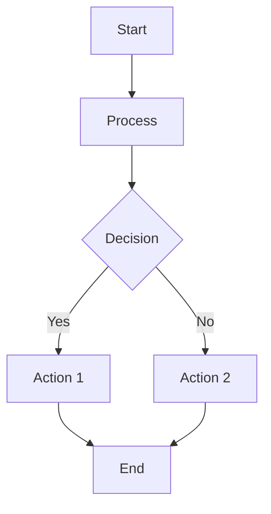
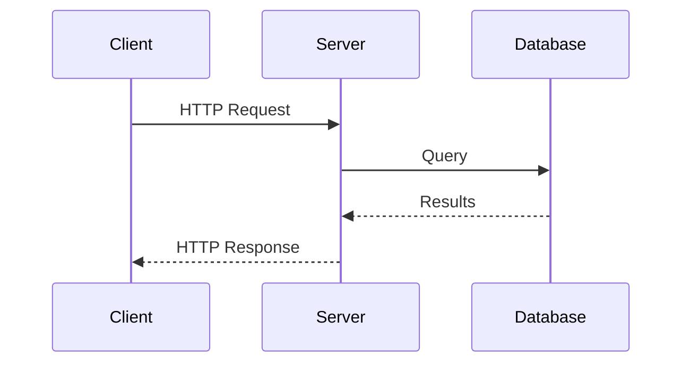
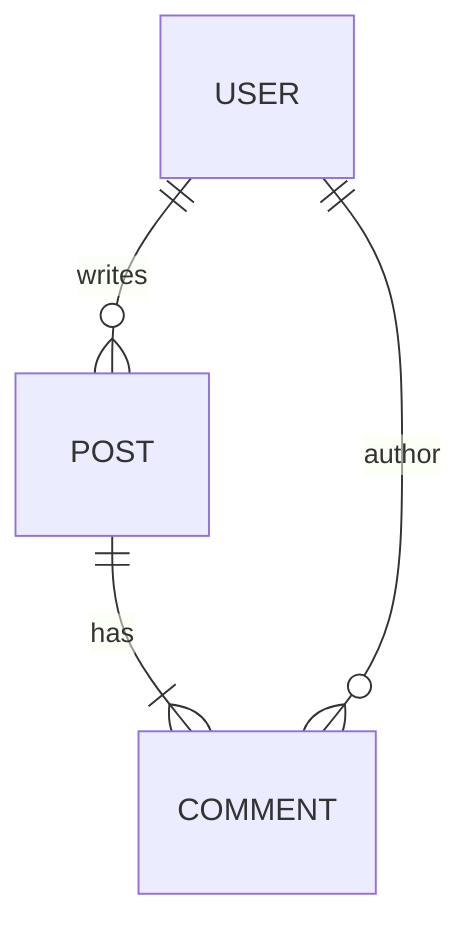

# Diagram Creation and Editing Skill

**Version**: 1.0.0
**Last Updated**: 2026-02-01

## Overview

This skill enables creating and editing diagrams with automatic format selection based on complexity:

| Complexity | Format | Rationale |
|------------|--------|-----------|
| Simple | Mermaid | Text-based, renderer handles layout, works in GitHub/GitLab |
| Complex | DrawIO | Precise spatial control, custom positioning, rich styling |

**Supported Input Formats**:
- `.drawio.svg` - DrawIO with embedded mxGraphModel (PREFERRED)
- `.drawio` - Raw DrawIO XML
- Mermaid code blocks in markdown
- ASCII art diagrams

**Output Formats**:
- Mermaid - for simple diagrams (embedded in markdown)
- `.drawio.svg` - for complex diagrams (ALWAYS with embedded diagram)

---

## Section 1: Format Selection Heuristic

Before creating a diagram, determine the appropriate format:

### Use Mermaid When:

- Linear flows (A → B → C → D)
- Simple trees (2-3 levels max)
- Sequence diagrams
- Basic flowcharts with decision nodes
- Class/ER diagrams without custom positioning
- Diagram will be viewed primarily on GitHub/GitLab

### Use DrawIO When:

- Side-by-side comparisons (Option A vs Option B)
- Multi-region architecture (Frontend/Backend/Database groups)
- Custom spatial layout required
- Layered/stacked architecture views
- User explicitly requests DrawIO
- Precise positioning matters
- Complex styling (gradients, icons, custom colors)

### Decision Flowchart

```
START: User requests diagram
  │
  ├─► Is spatial layout critical?
  │     YES → DrawIO
  │     NO  ↓
  │
  ├─► Multiple interconnected regions?
  │     YES → DrawIO
  │     NO  ↓
  │
  ├─► Side-by-side comparison?
  │     YES → DrawIO
  │     NO  ↓
  │
  ├─► Simple linear/tree structure?
  │     YES → Mermaid
  │     NO  ↓
  │
  └─► Default → Mermaid (simpler is better)
```

---

## Section 2: Creating Mermaid Diagrams

Mermaid diagrams are text-based and let the renderer handle layout.

### Flowchart



**Syntax Notes**:
- `TD` = top-down, `LR` = left-right
- `[]` = rectangle, `{}` = diamond, `()` = rounded, `(())` = circle
- `-->` = arrow, `---` = line, `-.->` = dashed arrow
- `|label|` = edge label

### Sequence Diagram



**Syntax Notes**:
- `->>` = solid arrow (synchronous)
- `-->>` = dashed arrow (response/async)
- `participant X as Label` = named participant

### Entity Relationship



**Syntax Notes**:
- `||--o{` = one-to-many
- `||--|{` = one-to-one-or-more
- `}o--||` = many-to-one (optional)

### Best Practices for Mermaid

1. Keep diagrams focused - one concept per diagram
2. Use meaningful node IDs (not just A, B, C)
3. Add labels to edges for clarity
4. Test in GitHub preview before committing

---

## Section 3: Creating DrawIO Diagrams

DrawIO diagrams use mxGraphModel XML for precise control.

### Complete Boilerplate Template

Use this exact template for new `.drawio.svg` files:

```xml
<svg xmlns="http://www.w3.org/2000/svg" xmlns:xlink="http://www.w3.org/1999/xlink"
     version="1.1" width="850px" height="600px"
     viewBox="-0.5 -0.5 850 600"
     content="&lt;mxfile host=&quot;Claude&quot; modified=&quot;2026-02-01&quot;&gt;&lt;diagram name=&quot;Page-1&quot; id=&quot;diagram-1&quot;&gt;&lt;mxGraphModel dx=&quot;800&quot; dy=&quot;600&quot; grid=&quot;1&quot; gridSize=&quot;10&quot; guides=&quot;1&quot; tooltips=&quot;1&quot; connect=&quot;1&quot; arrows=&quot;1&quot; fold=&quot;1&quot; page=&quot;1&quot; pageScale=&quot;1&quot; pageWidth=&quot;850&quot; pageHeight=&quot;600&quot;&gt;&lt;root&gt;&lt;mxCell id=&quot;0&quot;/&gt;&lt;mxCell id=&quot;1&quot; parent=&quot;0&quot;/&gt;&lt;/root&gt;&lt;/mxGraphModel&gt;&lt;/diagram&gt;&lt;/mxfile&gt;"
     style="background-color: rgb(255, 255, 255);">
  <defs/>
  <!-- SVG body will be generated by drawio-svg-sync -->
  <g>
    <text x="400" y="300" text-anchor="middle" font-size="14">
      Run drawio-svg-sync to render this diagram
    </text>
  </g>
</svg>
```

**CRITICAL**: The `content` attribute contains the HTML-entity-encoded mxGraphModel. This is what makes the file editable in DrawIO.

### Decoded mxGraphModel Structure

When decoded, the content attribute contains:

```xml
<mxfile host="Claude" modified="2026-02-01">
  <diagram name="Page-1" id="diagram-1">
    <mxGraphModel dx="800" dy="600" grid="1" gridSize="10"
                  guides="1" tooltips="1" connect="1" arrows="1"
                  fold="1" page="1" pageScale="1"
                  pageWidth="850" pageHeight="600">
      <root>
        <mxCell id="0"/>                    <!-- Root cell - REQUIRED -->
        <mxCell id="1" parent="0"/>         <!-- Default parent - REQUIRED -->

        <!-- Your shapes and connectors go here -->

      </root>
    </mxGraphModel>
  </diagram>
</mxfile>
```

### Invariants (MUST be preserved)

| Invariant | Rule | Consequence if Violated |
|-----------|------|-------------------------|
| Cell 0 | MUST exist, no parent | Diagram won't load |
| Cell 1 | MUST exist, `parent="0"` | Shapes won't render |
| IDs | MUST be unique within diagram | Unpredictable behavior |
| Parent refs | All visible cells have `parent="1"` | Element won't appear |
| vertex/edge | Exactly one of `vertex="1"` or `edge="1"` | Rendering issues |
| mxGeometry | Required child for position/size | Element has no location |

---

## Section 4: Adding Shapes

### Basic Rectangle

```xml
<mxCell id="box-1" value="My Label"
        style="rounded=0;whiteSpace=wrap;html=1;"
        vertex="1" parent="1">
  <mxGeometry x="100" y="100" width="120" height="60" as="geometry"/>
</mxCell>
```

### Rounded Rectangle with Color

```xml
<mxCell id="box-2" value="Success"
        style="rounded=1;whiteSpace=wrap;html=1;fillColor=#d5e8d4;strokeColor=#82b366;"
        vertex="1" parent="1">
  <mxGeometry x="100" y="200" width="120" height="60" as="geometry"/>
</mxCell>
```

### Text Box

```xml
<mxCell id="text-1" value="Label Text"
        style="text;html=1;align=center;verticalAlign=middle;whiteSpace=wrap;rounded=0;"
        vertex="1" parent="1">
  <mxGeometry x="100" y="300" width="80" height="30" as="geometry"/>
</mxCell>
```

### Dashed Container (for grouping)

```xml
<mxCell id="container-1" value="Group Name"
        style="rounded=1;whiteSpace=wrap;html=1;dashed=1;dashPattern=8 8;fillColor=none;strokeColor=#00CC66;strokeWidth=2;"
        vertex="1" parent="1">
  <mxGeometry x="80" y="400" width="200" height="150" as="geometry"/>
</mxCell>
```

### Common Style Attributes

| Attribute | Values | Purpose |
|-----------|--------|---------|
| `rounded` | `0`, `1` | Corner style (0=sharp, 1=rounded) |
| `whiteSpace` | `wrap` | Text wrapping |
| `html` | `1` | Enable HTML in labels |
| `fillColor` | `#RRGGBB`, `none` | Background color |
| `strokeColor` | `#RRGGBB` | Border color |
| `strokeWidth` | number | Border thickness |
| `fontColor` | `#RRGGBB` | Text color |
| `fontSize` | number | Font size (points) |
| `fontStyle` | `1` | Bold text |
| `dashed` | `0`, `1` | Dashed border |
| `dashPattern` | `N N` | Dash/gap pattern |

### Color Palette (User Preference)

| Theme | fillColor | strokeColor | Use Case |
|-------|-----------|-------------|----------|
| Green (success) | `#d5e8d4` | `#82b366` | Positive states |
| Red (error) | `#f8cecc` | `#b85450` | Warnings, issues |
| Yellow (warning) | `#fff2cc` | `#d6b656` | Caution, pending |
| Orange | `#ffe6cc` | `#d79b00` | Configuration |
| Purple | `#e1d5e7` | `#9673a6` | Services |
| Blue (light) | `#dae8fc` | `#6c8ebf` | Infrastructure |
| Blue (dark) | `#0050ef` | `#001DBC` | Network |

---

## Section 5: Adding Connectors

### Basic Arrow (Orthogonal Routing)

```xml
<mxCell id="conn-1" value=""
        style="edgeStyle=orthogonalEdgeStyle;rounded=0;orthogonalLoop=1;jettySize=auto;html=1;endArrow=classic;"
        edge="1" parent="1" source="box-1" target="box-2">
  <mxGeometry relative="1" as="geometry"/>
</mxCell>
```

### Arrow with Label

```xml
<mxCell id="conn-2" value="sends data"
        style="edgeStyle=orthogonalEdgeStyle;rounded=0;html=1;endArrow=classic;"
        edge="1" parent="1" source="box-1" target="box-2">
  <mxGeometry relative="1" as="geometry"/>
</mxCell>
```

### Explicit Anchor Points

For left-to-right flow (user preference):

```xml
<mxCell id="conn-3" value=""
        style="edgeStyle=orthogonalEdgeStyle;exitX=1;exitY=0.5;exitDx=0;exitDy=0;entryX=0;entryY=0.5;entryDx=0;entryDy=0;endArrow=classic;html=1;"
        edge="1" parent="1" source="left-box" target="right-box">
  <mxGeometry relative="1" as="geometry"/>
</mxCell>
```

### Anchor Point Reference

```
      (0.5, 0) = top center
           ↓
(0, 0.5) → ┌────────────┐ ← (1, 0.5)
left       │   SHAPE    │   right
center     └────────────┘   center
                ↑
           (0.5, 1) = bottom center
```

| Position | exitX/entryX | exitY/entryY |
|----------|--------------|--------------|
| Left center | 0 | 0.5 |
| Right center | 1 | 0.5 |
| Top center | 0.5 | 0 |
| Bottom center | 0.5 | 1 |

### Floating Edge (No Source/Target)

```xml
<mxCell id="float-1" value=""
        style="endArrow=classic;html=1;"
        edge="1" parent="1">
  <mxGeometry width="50" height="50" relative="1" as="geometry">
    <mxPoint x="100" y="200" as="sourcePoint"/>
    <mxPoint x="300" y="200" as="targetPoint"/>
  </mxGeometry>
</mxCell>
```

### Arrow Styles

| Pattern | Style Attributes |
|---------|-----------------|
| Standard arrow | `endArrow=classic;` |
| Filled triangle | `endArrow=block;endFill=1;` |
| Open arrow | `endArrow=open;` |
| Bidirectional | `startArrow=oval;startFill=1;endArrow=oval;endFill=1;` |
| No arrows | `startArrow=none;endArrow=none;` |
| Dashed line | `dashed=1;dashPattern=8 8;` |

---

## Section 6: Complete Creation Examples

### Example 1: 3-Tier Architecture

**Request**: "Create a 3-tier architecture diagram with Web, API, and Database layers"

**Result** (decoded mxGraphModel, shapes only):

```xml
<!-- Web Tier -->
<mxCell id="web" value="Web Tier"
        style="rounded=1;whiteSpace=wrap;html=1;fillColor=#dae8fc;strokeColor=#6c8ebf;"
        vertex="1" parent="1">
  <mxGeometry x="100" y="50" width="120" height="60" as="geometry"/>
</mxCell>

<!-- API Tier -->
<mxCell id="api" value="API Tier"
        style="rounded=1;whiteSpace=wrap;html=1;fillColor=#d5e8d4;strokeColor=#82b366;"
        vertex="1" parent="1">
  <mxGeometry x="100" y="150" width="120" height="60" as="geometry"/>
</mxCell>

<!-- Database Tier -->
<mxCell id="db" value="Database"
        style="rounded=1;whiteSpace=wrap;html=1;fillColor=#fff2cc;strokeColor=#d6b656;"
        vertex="1" parent="1">
  <mxGeometry x="100" y="250" width="120" height="60" as="geometry"/>
</mxCell>

<!-- Web → API Connector -->
<mxCell id="conn-web-api"
        style="edgeStyle=orthogonalEdgeStyle;exitX=0.5;exitY=1;entryX=0.5;entryY=0;endArrow=classic;html=1;"
        edge="1" parent="1" source="web" target="api">
  <mxGeometry relative="1" as="geometry"/>
</mxCell>

<!-- API → Database Connector -->
<mxCell id="conn-api-db"
        style="edgeStyle=orthogonalEdgeStyle;exitX=0.5;exitY=1;entryX=0.5;entryY=0;endArrow=classic;html=1;"
        edge="1" parent="1" source="api" target="db">
  <mxGeometry relative="1" as="geometry"/>
</mxCell>
```

### Example 2: Pipeline Workflow (Left-to-Right)

**Request**: "Create a CI/CD pipeline: Fetch → Build → Test → Deploy"

**Result**:

```xml
<!-- Phase boxes - horizontal arrangement -->
<mxCell id="fetch" value="Fetch"
        style="rounded=1;whiteSpace=wrap;html=1;fillColor=#dae8fc;strokeColor=#6c8ebf;"
        vertex="1" parent="1">
  <mxGeometry x="50" y="100" width="100" height="60" as="geometry"/>
</mxCell>

<mxCell id="build" value="Build"
        style="rounded=1;whiteSpace=wrap;html=1;fillColor=#d5e8d4;strokeColor=#82b366;"
        vertex="1" parent="1">
  <mxGeometry x="200" y="100" width="100" height="60" as="geometry"/>
</mxCell>

<mxCell id="test" value="Test"
        style="rounded=1;whiteSpace=wrap;html=1;fillColor=#fff2cc;strokeColor=#d6b656;"
        vertex="1" parent="1">
  <mxGeometry x="350" y="100" width="100" height="60" as="geometry"/>
</mxCell>

<mxCell id="deploy" value="Deploy"
        style="rounded=1;whiteSpace=wrap;html=1;fillColor=#e1d5e7;strokeColor=#9673a6;"
        vertex="1" parent="1">
  <mxGeometry x="500" y="100" width="100" height="60" as="geometry"/>
</mxCell>

<!-- Connectors: exit RIGHT (1, 0.5), enter LEFT (0, 0.5) -->
<mxCell id="conn-1"
        style="edgeStyle=orthogonalEdgeStyle;exitX=1;exitY=0.5;entryX=0;entryY=0.5;endArrow=classic;html=1;"
        edge="1" parent="1" source="fetch" target="build">
  <mxGeometry relative="1" as="geometry"/>
</mxCell>

<mxCell id="conn-2"
        style="edgeStyle=orthogonalEdgeStyle;exitX=1;exitY=0.5;entryX=0;entryY=0.5;endArrow=classic;html=1;"
        edge="1" parent="1" source="build" target="test">
  <mxGeometry relative="1" as="geometry"/>
</mxCell>

<mxCell id="conn-3"
        style="edgeStyle=orthogonalEdgeStyle;exitX=1;exitY=0.5;entryX=0;entryY=0.5;endArrow=classic;html=1;"
        edge="1" parent="1" source="test" target="deploy">
  <mxGeometry relative="1" as="geometry"/>
</mxCell>
```

### Example 3: Side-by-Side Comparison

**Request**: "Create a comparison: Before (3 items) vs After (3 items)"

**Result**:

```xml
<!-- Headers -->
<mxCell id="before-header" value="&lt;b&gt;BEFORE&lt;/b&gt;"
        style="text;html=1;align=center;verticalAlign=middle;fontSize=16;"
        vertex="1" parent="1">
  <mxGeometry x="50" y="30" width="150" height="40" as="geometry"/>
</mxCell>

<mxCell id="after-header" value="&lt;b&gt;AFTER&lt;/b&gt;"
        style="text;html=1;align=center;verticalAlign=middle;fontSize=16;"
        vertex="1" parent="1">
  <mxGeometry x="350" y="30" width="150" height="40" as="geometry"/>
</mxCell>

<!-- Before column -->
<mxCell id="before-1" value="Manual process"
        style="rounded=1;whiteSpace=wrap;html=1;fillColor=#f8cecc;strokeColor=#b85450;"
        vertex="1" parent="1">
  <mxGeometry x="50" y="100" width="150" height="50" as="geometry"/>
</mxCell>

<mxCell id="before-2" value="Slow deployment"
        style="rounded=1;whiteSpace=wrap;html=1;fillColor=#f8cecc;strokeColor=#b85450;"
        vertex="1" parent="1">
  <mxGeometry x="50" y="170" width="150" height="50" as="geometry"/>
</mxCell>

<mxCell id="before-3" value="Error-prone"
        style="rounded=1;whiteSpace=wrap;html=1;fillColor=#f8cecc;strokeColor=#b85450;"
        vertex="1" parent="1">
  <mxGeometry x="50" y="240" width="150" height="50" as="geometry"/>
</mxCell>

<!-- After column -->
<mxCell id="after-1" value="Automated CI/CD"
        style="rounded=1;whiteSpace=wrap;html=1;fillColor=#d5e8d4;strokeColor=#82b366;"
        vertex="1" parent="1">
  <mxGeometry x="350" y="100" width="150" height="50" as="geometry"/>
</mxCell>

<mxCell id="after-2" value="Fast deployment"
        style="rounded=1;whiteSpace=wrap;html=1;fillColor=#d5e8d4;strokeColor=#82b366;"
        vertex="1" parent="1">
  <mxGeometry x="350" y="170" width="150" height="50" as="geometry"/>
</mxCell>

<mxCell id="after-3" value="Reliable"
        style="rounded=1;whiteSpace=wrap;html=1;fillColor=#d5e8d4;strokeColor=#82b366;"
        vertex="1" parent="1">
  <mxGeometry x="350" y="240" width="150" height="50" as="geometry"/>
</mxCell>

<!-- Transformation arrows -->
<mxCell id="transform-1"
        style="edgeStyle=orthogonalEdgeStyle;exitX=1;exitY=0.5;entryX=0;entryY=0.5;endArrow=classic;html=1;dashed=1;"
        edge="1" parent="1" source="before-1" target="after-1">
  <mxGeometry relative="1" as="geometry"/>
</mxCell>

<mxCell id="transform-2"
        style="edgeStyle=orthogonalEdgeStyle;exitX=1;exitY=0.5;entryX=0;entryY=0.5;endArrow=classic;html=1;dashed=1;"
        edge="1" parent="1" source="before-2" target="after-2">
  <mxGeometry relative="1" as="geometry"/>
</mxCell>

<mxCell id="transform-3"
        style="edgeStyle=orthogonalEdgeStyle;exitX=1;exitY=0.5;entryX=0;entryY=0.5;endArrow=classic;html=1;dashed=1;"
        edge="1" parent="1" source="before-3" target="after-3">
  <mxGeometry relative="1" as="geometry"/>
</mxCell>
```

---

## Section 7: Coordinate System

### Basics

- Origin: Top-left corner (0, 0)
- X-axis: Increases rightward
- Y-axis: Increases downward
- Units: Pixels

### mxGeometry Attributes

```xml
<mxGeometry x="100" y="200" width="120" height="60" as="geometry"/>
```

| Attribute | Purpose |
|-----------|---------|
| `x` | Left edge position |
| `y` | Top edge position |
| `width` | Element width |
| `height` | Element height |
| `as` | Always `"geometry"` |

### Parent-Child Coordinates

When `parent="1"` (default): coordinates are **ABSOLUTE**.

When `parent="other-id"` (container): coordinates are **RELATIVE** to parent.

```xml
<!-- Parent at absolute (100, 200) -->
<mxCell id="container" ... parent="1">
  <mxGeometry x="100" y="200" width="200" height="150" as="geometry"/>
</mxCell>

<!-- Child at relative (20, 30) = absolute (120, 230) -->
<mxCell id="child" ... parent="container">
  <mxGeometry x="20" y="30" width="80" height="40" as="geometry"/>
</mxCell>
```

### Layout Guidelines (User Preferences)

| Preference | Implementation |
|------------|----------------|
| Arrows enter LEFT | `entryX=0;entryY=0.5;` |
| Arrows exit RIGHT | `exitX=1;exitY=0.5;` |
| Use grid multiples | x, y, width, height in multiples of 10 |
| Consistent spacing | 50px gaps between shapes |

---

## Section 8: Rendering Workflow

After creating or editing the mxGraphModel XML, you MUST render it:

### Step 1: Create/Edit the .drawio.svg File

Write the complete SVG with encoded mxGraphModel in the `content` attribute.

### Step 2: Run drawio-svg-sync

```bash
nix run 'github:timblaktu/drawio-svg-sync' -- path/to/diagram.drawio.svg
```

This:
1. Reads the mxGraphModel from `content` attribute
2. Launches headless DrawIO to render the diagram
3. Replaces the SVG body with rendered graphics
4. Preserves the `content` attribute (keeps it editable)

### Step 3: Verify Success

```bash
# Check file was modified
ls -la path/to/diagram.drawio.svg

# View in browser (optional)
xdg-open path/to/diagram.drawio.svg
```

### Step 4: Commit

```bash
git add path/to/diagram.drawio.svg
git commit -m "Add/Update diagram: [description]"
```

### Error Handling

If drawio-svg-sync fails:
- Check Docker is running (it uses containerized DrawIO)
- Verify XML is valid (no unclosed tags)
- Check cells 0 and 1 exist
- Verify all IDs are unique

---

## Section 9: Encoding the content Attribute

When writing a `.drawio.svg` file, the mxGraphModel must be HTML-entity-encoded in the `content` attribute.

### Encoding Rules

| Character | Encoded |
|-----------|---------|
| `<` | `&lt;` |
| `>` | `&gt;` |
| `"` | `&quot;` |
| `&` | `&amp;` |
| newline | `&#10;` |

### Example Encoding

**Before** (raw XML):
```xml
<mxfile host="Claude">
  <diagram name="Page-1" id="1">
    <mxGraphModel>
      <root>
        <mxCell id="0"/>
        <mxCell id="1" parent="0"/>
      </root>
    </mxGraphModel>
  </diagram>
</mxfile>
```

**After** (for content attribute):
```
&lt;mxfile host=&quot;Claude&quot;&gt;&#10;  &lt;diagram name=&quot;Page-1&quot; id=&quot;1&quot;&gt;&#10;    &lt;mxGraphModel&gt;&#10;      &lt;root&gt;&#10;        &lt;mxCell id=&quot;0&quot;/&gt;&#10;        &lt;mxCell id=&quot;1&quot; parent=&quot;0&quot;/&gt;&#10;      &lt;/root&gt;&#10;    &lt;/mxGraphModel&gt;&#10;  &lt;/diagram&gt;&#10;&lt;/mxfile&gt;
```

### Implementation Pattern

When creating a new diagram:

1. Build the mxGraphModel XML structure
2. Encode special characters
3. Insert into `content="..."` attribute
4. Include placeholder SVG body
5. Run drawio-svg-sync to render

---

## Quick Reference Card

### New Diagram Checklist

- [ ] Cell 0 exists (no parent attribute)
- [ ] Cell 1 exists (parent="0")
- [ ] All shapes have unique IDs
- [ ] All shapes have `vertex="1" parent="1"`
- [ ] All shapes have `<mxGeometry>` child
- [ ] All edges have `edge="1" parent="1"`
- [ ] All edges have source/target OR sourcePoint/targetPoint
- [ ] content attribute is properly encoded
- [ ] Run drawio-svg-sync after editing

### Minimal Shape

```xml
<mxCell id="UNIQUE_ID" value="LABEL"
        style="rounded=1;whiteSpace=wrap;html=1;"
        vertex="1" parent="1">
  <mxGeometry x="X" y="Y" width="W" height="H" as="geometry"/>
</mxCell>
```

### Minimal Connector

```xml
<mxCell id="UNIQUE_ID"
        style="edgeStyle=orthogonalEdgeStyle;endArrow=classic;html=1;"
        edge="1" parent="1" source="FROM_ID" target="TO_ID">
  <mxGeometry relative="1" as="geometry"/>
</mxCell>
```

For detailed technical reference on shapes, styles, and patterns, see [REFERENCE.md](REFERENCE.md).
