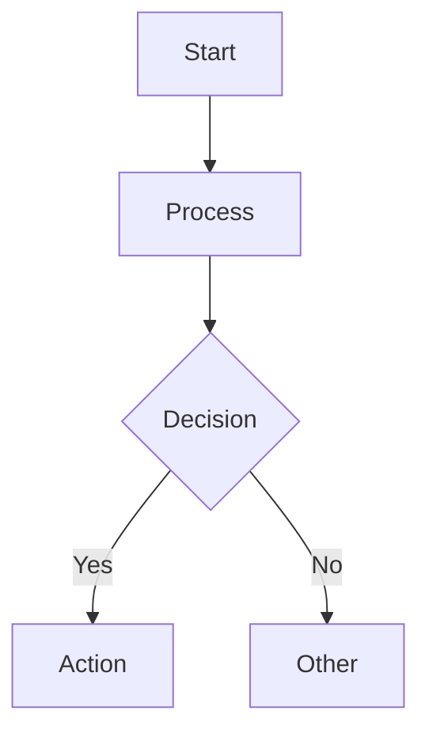
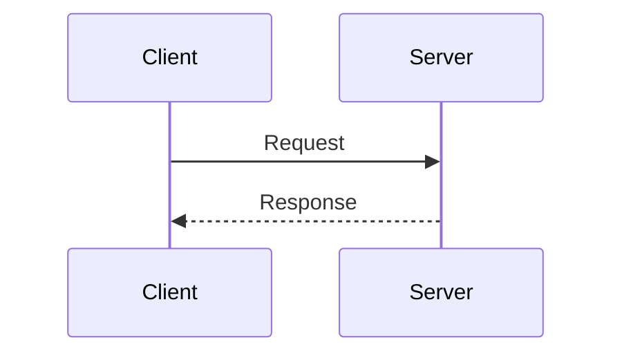
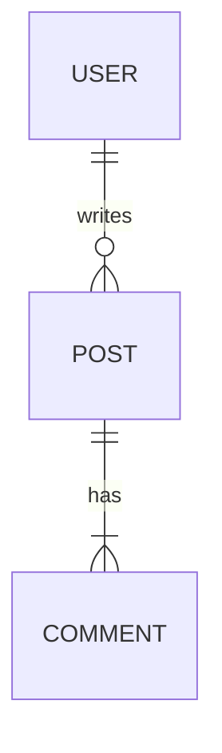
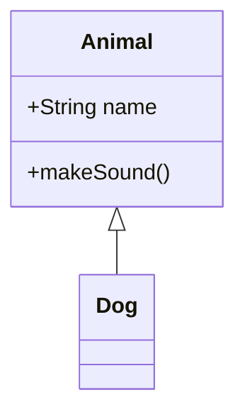

# DrawIO mxGraphModel Technical Reference

**Version**: 1.0.0
**Last Updated**: 2026-02-01

This document provides technical details for the mxGraphModel XML format used in `.drawio.svg` files. Use this as a lookup reference when creating or editing diagrams.

---

## Table of Contents

1. [File Format Structure](#file-format-structure)
2. [mxGraphModel Elements](#mxgraphmodel-elements)
3. [Shape Reference](#shape-reference)
4. [Style Attribute Dictionary](#style-attribute-dictionary)
5. [Connector Reference](#connector-reference)
6. [Geometry and Coordinates](#geometry-and-coordinates)
7. [Color Palettes](#color-palettes)
8. [User Layout Preferences](#user-layout-preferences)
9. [Mermaid Quick Reference](#mermaid-quick-reference)
10. [Troubleshooting](#troubleshooting)

---

## File Format Structure

### .drawio.svg File Layout

```xml
<svg xmlns="http://www.w3.org/2000/svg"
     version="1.1" width="850px" height="600px"
     viewBox="-0.5 -0.5 850 600"
     content="ENCODED_MXGRAPHMODEL"
     style="background-color: rgb(255, 255, 255);">
  <defs/>
  <g><!-- Rendered SVG elements --></g>
</svg>
```

The `content` attribute contains the HTML-entity-encoded mxGraphModel. This is the source of truth; the SVG body is regenerated by drawio-svg-sync.

### Content Attribute Encoding

| Character | Encoded As |
|-----------|------------|
| `<` | `&lt;` |
| `>` | `&gt;` |
| `"` | `&quot;` |
| `&` | `&amp;` |
| newline | `&#10;` |

### Decoded mxGraphModel Structure

```xml
<mxfile host="Claude" modified="2026-02-01">
  <diagram name="Page-1" id="unique-diagram-id">
    <mxGraphModel dx="800" dy="600" grid="1" gridSize="10"
                  guides="1" tooltips="1" connect="1" arrows="1"
                  fold="1" page="1" pageScale="1"
                  pageWidth="850" pageHeight="600">
      <root>
        <mxCell id="0"/>                    <!-- Root cell - REQUIRED -->
        <mxCell id="1" parent="0"/>         <!-- Default parent - REQUIRED -->
        <!-- Shapes and edges go here -->
      </root>
    </mxGraphModel>
  </diagram>
</mxfile>
```

---

## mxGraphModel Elements

### Required Root Cells

Every diagram MUST have these two cells:

```xml
<mxCell id="0"/>                    <!-- Root cell, no parent -->
<mxCell id="1" parent="0"/>         <!-- Default parent for all shapes -->
```

**Consequence of missing**: Diagram fails to load.

### mxGraphModel Attributes

| Attribute | Purpose | Typical Value |
|-----------|---------|---------------|
| `dx`, `dy` | Canvas translation offset | 800, 600 |
| `grid` | Show grid | 1 |
| `gridSize` | Grid cell size (pixels) | 10 |
| `pageWidth` | Page width | 850 |
| `pageHeight` | Page height | 600 |
| `page` | Show page boundary | 1 |
| `guides` | Enable alignment guides | 1 |

### mxCell Attributes (Shapes/Vertices)

| Attribute | Required | Values | Purpose |
|-----------|----------|--------|---------|
| `id` | Yes | unique string | Element identifier |
| `value` | No | string or HTML | Display label |
| `style` | Yes | semicolon-separated | Visual styling |
| `vertex` | Yes | `"1"` | Marks as shape (not edge) |
| `parent` | Yes | `"1"` or container ID | Parent element |

### mxCell Attributes (Connectors/Edges)

| Attribute | Required | Values | Purpose |
|-----------|----------|--------|---------|
| `id` | Yes | unique string | Element identifier |
| `value` | No | string | Edge label |
| `style` | Yes | semicolon-separated | Visual styling |
| `edge` | Yes | `"1"` | Marks as edge (not shape) |
| `parent` | Yes | `"1"` | Parent element |
| `source` | Recommended | shape ID | Start shape |
| `target` | Recommended | shape ID | End shape |

### mxGeometry Attributes

```xml
<mxGeometry x="100" y="200" width="120" height="60" as="geometry"/>
```

| Attribute | Vertices | Edges | Notes |
|-----------|----------|-------|-------|
| `x` | Required | N/A | Left edge position |
| `y` | Required | N/A | Top edge position |
| `width` | Required | Optional | Element width |
| `height` | Required | Optional | Element height |
| `relative` | N/A | `"1"` | Edges use relative coords |
| `as` | Required | `"geometry"` | Always this value |

### Multi-Page Diagrams

```xml
<mxfile pages="3">
  <diagram name="Page-1" id="id-1">...</diagram>
  <diagram name="Page-2" id="id-2">...</diagram>
  <diagram name="Page-3" id="id-3">...</diagram>
</mxfile>
```

---

## Shape Reference

### Basic Rectangle

```xml
<mxCell id="rect-1" value="Label"
        style="rounded=0;whiteSpace=wrap;html=1;"
        vertex="1" parent="1">
  <mxGeometry x="100" y="100" width="120" height="60" as="geometry"/>
</mxCell>
```

### Rounded Rectangle

```xml
<mxCell id="rounded-1" value="Label"
        style="rounded=1;whiteSpace=wrap;html=1;fillColor=#d5e8d4;strokeColor=#82b366;"
        vertex="1" parent="1">
  <mxGeometry x="100" y="100" width="120" height="60" as="geometry"/>
</mxCell>
```

### Text Box

```xml
<mxCell id="text-1" value="Text"
        style="text;html=1;align=center;verticalAlign=middle;whiteSpace=wrap;rounded=0;"
        vertex="1" parent="1">
  <mxGeometry x="100" y="100" width="80" height="30" as="geometry"/>
</mxCell>
```

### Text Box with Border

```xml
<mxCell id="label-1" value="Label"
        style="text;html=1;align=center;verticalAlign=middle;whiteSpace=wrap;rounded=0;strokeColor=#d6b656;fillColor=#fff2cc;"
        vertex="1" parent="1">
  <mxGeometry x="100" y="100" width="60" height="30" as="geometry"/>
</mxCell>
```

### Dashed Container

```xml
<mxCell id="container-1" value="Group"
        style="rounded=1;whiteSpace=wrap;html=1;dashed=1;dashPattern=8 8;fillColor=none;strokeColor=#00CC66;strokeWidth=2;"
        vertex="1" parent="1">
  <mxGeometry x="80" y="80" width="200" height="150" as="geometry"/>
</mxCell>
```

### Rich Text Box (HTML Content)

```xml
<mxCell id="rich-1"
        value="&lt;h1&gt;Title&lt;/h1&gt;&lt;p&gt;Description&lt;/p&gt;"
        style="text;html=1;whiteSpace=wrap;overflow=hidden;rounded=0;"
        vertex="1" parent="1">
  <mxGeometry x="100" y="100" width="180" height="110" as="geometry"/>
</mxCell>
```

### Ellipse

```xml
<mxCell id="ellipse-1" value="Circle"
        style="ellipse;whiteSpace=wrap;html=1;"
        vertex="1" parent="1">
  <mxGeometry x="100" y="100" width="80" height="80" as="geometry"/>
</mxCell>
```

### Cloud Shape

```xml
<mxCell id="cloud-1" value="Cloud"
        style="ellipse;shape=cloud;whiteSpace=wrap;html=1;"
        vertex="1" parent="1">
  <mxGeometry x="100" y="100" width="120" height="80" as="geometry"/>
</mxCell>
```

### Shape Type Summary

| Shape | Style Start | Key Attributes |
|-------|-------------|----------------|
| Rectangle | (none) | `whiteSpace=wrap;html=1;` |
| Rounded | (none) | `rounded=1;whiteSpace=wrap;html=1;` |
| Text | `text;` | `html=1;` |
| Ellipse | `ellipse;` | `whiteSpace=wrap;html=1;` |
| Cloud | `ellipse;shape=cloud;` | `whiteSpace=wrap;html=1;` |
| Module | `shape=module;` | `jettyWidth=8;jettyHeight=4;` |
| Process | `shape=process;` | `whiteSpace=wrap;html=1;` |
| UML Lifeline | `shape=umlLifeline;` | `perimeter=lifelinePerimeter;html=1;container=1;` |
| UML Frame | `shape=umlFrame;` | `whiteSpace=wrap;html=1;` |

---

## Style Attribute Dictionary

The `style` attribute is a semicolon-separated string: `key1=value1;key2=value2;`

### Common Attributes

| Attribute | Values | Purpose |
|-----------|--------|---------|
| `rounded` | `0`, `1` | Corner style (0=sharp, 1=rounded) |
| `whiteSpace` | `wrap` | Text wrapping in shape |
| `html` | `1` | Enable HTML formatting in labels |
| `fillColor` | `#RRGGBB`, `none`, `default` | Background color |
| `strokeColor` | `#RRGGBB`, `default` | Border color |
| `strokeWidth` | number | Border thickness (pixels) |
| `fontColor` | `#RRGGBB` | Text color |
| `fontSize` | number | Font size (points) |
| `fontStyle` | `1` | Bold text |
| `align` | `left`, `center`, `right` | Horizontal text alignment |
| `verticalAlign` | `top`, `middle`, `bottom` | Vertical text alignment |
| `dashed` | `0`, `1` | Dashed border |
| `dashPattern` | `N N` | Dash/gap pattern (e.g., `8 8`) |
| `overflow` | `hidden` | Text overflow handling |
| `gradientColor` | `#RRGGBB`, `default` | Gradient fill |
| `container` | `1` | Mark as container for child shapes |
| `collapsible` | `0` | Prevent collapse |
| `autosize` | `1` | Auto-size to fit content |

### Edge-Specific Attributes

| Attribute | Values | Purpose |
|-----------|--------|---------|
| `edgeStyle` | `none`, `orthogonalEdgeStyle`, `elbowEdgeStyle`, `entityRelationEdgeStyle` | Routing algorithm |
| `curved` | `0`, `1` | Enable curved lines |
| `orthogonalLoop` | `1` | Enable orthogonal self-loops |
| `jettySize` | `auto`, integer | Size of connection stubs |
| `startArrow` | `none`, `classic`, `block`, `oval`, `open`, `diamond` | Arrow at source |
| `endArrow` | (same values) | Arrow at target |
| `startFill` | `0`, `1` | Fill start arrow |
| `endFill` | `0`, `1` | Fill end arrow |
| `startSize` | integer | Start arrow size |
| `endSize` | integer | End arrow size |

### Anchor Point Attributes

| Attribute | Values | Purpose |
|-----------|--------|---------|
| `exitX` | 0.0 - 1.0 | X position on source (0=left, 1=right) |
| `exitY` | 0.0 - 1.0 | Y position on source (0=top, 1=bottom) |
| `entryX` | 0.0 - 1.0 | X position on target |
| `entryY` | 0.0 - 1.0 | Y position on target |
| `exitDx`, `exitDy` | integer | Pixel offset from exit point |
| `entryDx`, `entryDy` | integer | Pixel offset from entry point |
| `entryPerimeter` | `0`, `1` | Constrain to shape perimeter |
| `exitPerimeter` | `0`, `1` | Constrain to shape perimeter |

---

## Connector Reference

### Basic Orthogonal Connector

```xml
<mxCell id="conn-1" value=""
        style="edgeStyle=orthogonalEdgeStyle;rounded=0;orthogonalLoop=1;jettySize=auto;html=1;endArrow=classic;"
        edge="1" parent="1" source="box-1" target="box-2">
  <mxGeometry relative="1" as="geometry"/>
</mxCell>
```

### Connector with Label

```xml
<mxCell id="conn-2" value="sends data"
        style="edgeStyle=orthogonalEdgeStyle;rounded=0;html=1;endArrow=classic;"
        edge="1" parent="1" source="box-1" target="box-2">
  <mxGeometry relative="1" as="geometry"/>
</mxCell>
```

### Connector with Explicit Anchors

```xml
<mxCell id="conn-3" value=""
        style="edgeStyle=orthogonalEdgeStyle;exitX=1;exitY=0.5;exitDx=0;exitDy=0;entryX=0;entryY=0.5;entryDx=0;entryDy=0;endArrow=classic;html=1;"
        edge="1" parent="1" source="left-box" target="right-box">
  <mxGeometry relative="1" as="geometry"/>
</mxCell>
```

### Floating Edge (No Source/Target)

```xml
<mxCell id="float-1" value=""
        style="endArrow=classic;html=1;"
        edge="1" parent="1">
  <mxGeometry width="50" height="50" relative="1" as="geometry">
    <mxPoint x="100" y="200" as="sourcePoint"/>
    <mxPoint x="300" y="200" as="targetPoint"/>
  </mxGeometry>
</mxCell>
```

### Edge with Custom Waypoints

```xml
<mxCell id="routed-1"
        style="edgeStyle=orthogonalEdgeStyle;rounded=0;html=1;endArrow=classic;"
        edge="1" parent="1" source="a" target="b">
  <mxGeometry relative="1" as="geometry">
    <Array as="points">
      <mxPoint x="200" y="100"/>
      <mxPoint x="200" y="300"/>
    </Array>
  </mxGeometry>
</mxCell>
```

### Arrow Style Patterns

| Pattern | Style Attributes |
|---------|-----------------|
| Standard arrow | `endArrow=classic;` |
| Filled triangle | `endArrow=block;endFill=1;` |
| Open arrow | `endArrow=open;` |
| Bidirectional | `startArrow=oval;startFill=1;endArrow=oval;endFill=1;` |
| No arrows | `startArrow=none;endArrow=none;` |
| Diamond (aggregation) | `startArrow=diamond;startFill=0;` |
| Filled diamond | `startArrow=diamondThin;startFill=1;` |

### Line Style Patterns

| Pattern | Style Attributes |
|---------|-----------------|
| Solid | (default) |
| Dashed | `dashed=1;dashPattern=8 8;` |
| Dotted | `dashed=1;dashPattern=2 4;` |
| Thick | `strokeWidth=4;` |
| Colored | `strokeColor=#001DBC;` |

### Anchor Point Reference

```
      (0.5, 0) = top center
           ↓
(0, 0.5) → ┌────────────┐ ← (1, 0.5)
left       │   SHAPE    │   right
center     └────────────┘   center
                ↑
           (0.5, 1) = bottom center
```

| Position | exitX/entryX | exitY/entryY |
|----------|--------------|--------------|
| Left center | 0 | 0.5 |
| Right center | 1 | 0.5 |
| Top center | 0.5 | 0 |
| Bottom center | 0.5 | 1 |
| Top-left | 0 | 0 |
| Bottom-right | 1 | 1 |

### UML Sequence Diagram Messages

**Synchronous Message** (solid line, filled arrow):
```xml
<mxCell value="Request"
        style="html=1;verticalAlign=bottom;endArrow=block;curved=0;rounded=0;"
        edge="1">
```

**Async/Return Message** (dashed line, open arrow):
```xml
<mxCell value="Response"
        style="html=1;verticalAlign=bottom;endArrow=open;dashed=1;endSize=8;curved=0;rounded=0;"
        edge="1">
```

---

## Geometry and Coordinates

### Coordinate System

- **Origin**: Top-left corner (0, 0)
- **X-axis**: Increases rightward
- **Y-axis**: Increases downward
- **Units**: Pixels
- **Negative coordinates**: Allowed (extends canvas)

### Parent-Child Positioning

**When `parent="1"`** (default layer): Coordinates are **ABSOLUTE**.

**When `parent="other-id"`** (container): Coordinates are **RELATIVE** to parent.

```xml
<!-- Parent at absolute (100, 200) -->
<mxCell id="container" parent="1" vertex="1">
  <mxGeometry x="100" y="200" width="200" height="150" as="geometry"/>
</mxCell>

<!-- Child at relative (20, 30) = absolute (120, 230) -->
<mxCell id="child" parent="container" vertex="1">
  <mxGeometry x="20" y="30" width="80" height="40" as="geometry"/>
</mxCell>
```

### Edge Geometry Rules

- `relative="1"` on mxGeometry: Edge uses relative coordinate mode
- Waypoints in `<Array as="points">`: Always **ABSOLUTE** coordinates
- `sourcePoint` and `targetPoint`: Only used for floating edges (no source/target attributes)

### Canvas vs Page

- Canvas is infinite; shapes can have negative coordinates
- `dx`/`dy` control which portion is visible (scroll position)
- `pageWidth`/`pageHeight` define the visible page area
- Shapes can exist outside page bounds

---

## Color Palettes

### Standard Theme Colors

| Theme | fillColor | strokeColor | Use Case |
|-------|-----------|-------------|----------|
| Green (success) | `#d5e8d4` | `#82b366` | Positive states, success |
| Green (dark) | `#6d8764` | `#3A5431` | Darker variant |
| Green (bright) | `#60a917` | `#2D7600` | Highlights |
| Red (error) | `#f8cecc` | `#b85450` | Warnings, errors |
| Yellow (warning) | `#fff2cc` | `#d6b656` | Caution, pending |
| Yellow (gold) | `#e3c800` | `#B09500` | Labels, tags |
| Orange | `#ffe6cc` | `#d79b00` | Configuration |
| Purple | `#e1d5e7` | `#9673a6` | Services |
| Blue (light) | `#dae8fc` | `#6c8ebf` | Infrastructure |
| Blue (accent) | `#1ba1e2` | `#006EAF` | OS layers |
| Blue (dark) | `#0050ef` | `#001DBC` | Network |

### Usage Patterns

| Diagram Type | Primary Color | Secondary Color |
|--------------|---------------|-----------------|
| Architecture (layers) | Blue light | Green success |
| Pipeline (phases) | Alternating blues/greens | Yellow for warnings |
| Comparison (before/after) | Red (before) | Green (after) |
| Error states | Red error | Yellow warning |
| Success flows | Green success | Blue accent |

---

## User Layout Preferences

These preferences were extracted from user's existing diagrams:

### Arrow Direction

| Preference | Implementation |
|------------|----------------|
| Arrows exit RIGHT | `exitX=1;exitY=0.5;` |
| Arrows enter LEFT | `entryX=0;entryY=0.5;` |
| Horizontal flow | Sources left of targets |

### Standard Left-to-Right Edge

```xml
<mxCell style="edgeStyle=orthogonalEdgeStyle;exitX=1;exitY=0.5;exitDx=0;exitDy=0;entryX=0;entryY=0.5;entryDx=0;entryDy=0;endArrow=classic;html=1;"
        edge="1" source="left-box" target="right-box">
```

### Spacing and Alignment

| Preference | Value |
|------------|-------|
| Grid snapping | Use multiples of 10 |
| Gap between shapes | 50px |
| Phase blocks | Align at canvas edges |
| Terminology | "Build" preferred over "Compile" |
| Optional steps | Dashed borders |

### Vertical Flow Standard Edge

```xml
<mxCell style="edgeStyle=orthogonalEdgeStyle;exitX=0.5;exitY=1;entryX=0.5;entryY=0;endArrow=classic;html=1;"
        edge="1" source="top-box" target="bottom-box">
```

---

## Mermaid Quick Reference

### Flowchart



**Direction**: `TD` (top-down), `LR` (left-right), `BT`, `RL`

**Shapes**: `[]` rectangle, `{}` diamond, `()` rounded, `(())` circle, `[[]]` subroutine

**Edges**: `-->` arrow, `---` line, `-.->` dashed, `==>` thick

### Sequence Diagram



**Arrows**: `->>` solid, `-->>` dashed, `-x` lost, `-)` async

### Entity Relationship



**Cardinality**: `||` one, `o{` zero-or-many, `|{` one-or-many

### Class Diagram



---

## Troubleshooting

### Diagram Won't Load

| Symptom | Cause | Fix |
|---------|-------|-----|
| "Root cell not found" | Missing `<mxCell id="0"/>` | Add root cell |
| "Default parent missing" | Missing `<mxCell id="1" parent="0"/>` | Add parent cell |
| Blank diagram | Invalid XML | Check for unclosed tags |

### Elements Not Visible

| Symptom | Cause | Fix |
|---------|-------|-----|
| Shape missing | No `vertex="1"` | Add vertex attribute |
| Shape missing | Invalid parent reference | Use `parent="1"` |
| Shape missing | No mxGeometry | Add geometry element |
| Edge missing | No `edge="1"` | Add edge attribute |
| Edge missing | Invalid source/target | Check referenced IDs exist |

### Rendering Issues

| Symptom | Cause | Fix |
|---------|-------|-----|
| Encoding errors | Double-encoded entities | Decode once, encode once |
| Truncated content | Unescaped special chars | Escape `<`, `>`, `"`, `&` |
| Broken after edit | Modified SVG body instead of content | Edit content attribute |

### Connector Problems

| Symptom | Cause | Fix |
|---------|-------|-----|
| Edge not connecting | Invalid source/target ID | Verify IDs exist |
| Edge floating | No source/target attributes | Add source/target or use sourcePoint/targetPoint |
| Routing wrong | Custom waypoints | Remove `<Array as="points">` to auto-route |

### Finding Duplicate IDs

```bash
rg -o 'id="[^"]+"' file.drawio.svg | sort | uniq -d
```

### Finding Invalid Edge References

```bash
# List all source/target references
rg 'source="([^"]+)"|target="([^"]+)"' -o file.drawio.svg

# List all shape IDs
rg 'id="([^"]+)".*vertex="1"' -o file.drawio.svg
```

---

## Invariants Summary

| Invariant | Rule | Consequence |
|-----------|------|-------------|
| Cell 0 | MUST exist, no parent | Diagram won't load |
| Cell 1 | MUST exist, `parent="0"` | Shapes won't render |
| IDs | MUST be unique | Unpredictable behavior |
| Parent refs | All visible cells need `parent` | Element won't appear |
| vertex/edge | Exactly one per cell | Rendering issues |
| mxGeometry | Required for shapes | No position/size |
| content attribute | Must be properly encoded | Parse errors |

---

## ID Conventions

- IDs 0 and 1 are **RESERVED** for root structure
- Can be sequential numbers: `"2"`, `"3"`, `"4"`...
- Can be descriptive: `"web-tier"`, `"api-layer"`, `"conn-1"`
- DrawIO desktop uses UUIDs for auto-generated IDs
- Custom IDs are recommended for programmatic editing
