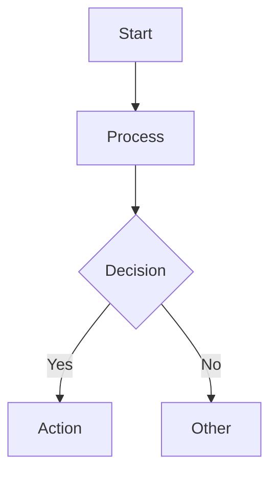
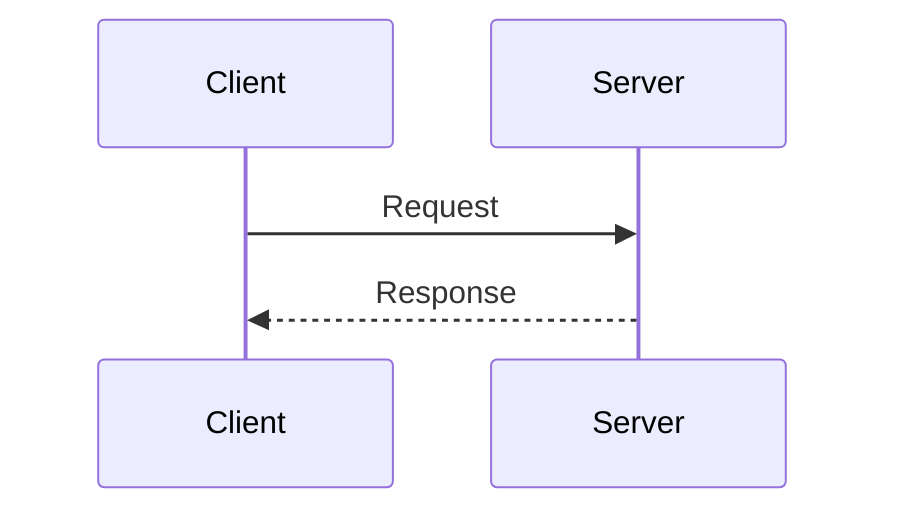
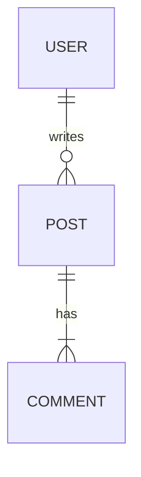
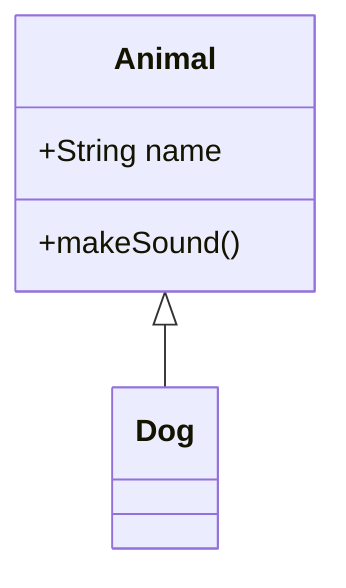

# DrawIO mxGraphModel Technical Reference

**Version**: 1.0.0
**Last Updated**: 2026-02-01

This document provides technical details for the mxGraphModel XML format used in `.drawio.svg` files. Use this as a lookup reference when creating or editing diagrams.

---

## Table of Contents

1. [File Format Structure](#file-format-structure)
2. [mxGraphModel Elements](#mxgraphmodel-elements)
3. [Shape Reference](#shape-reference)
4. [Style Attribute Dictionary](#style-attribute-dictionary)
5. [Connector Reference](#connector-reference)
6. [Geometry and Coordinates](#geometry-and-coordinates)
7. [Color Palettes](#color-palettes)
8. [User Layout Preferences](#user-layout-preferences)
9. [Mermaid Quick Reference](#mermaid-quick-reference)
10. [Troubleshooting](#troubleshooting)

---

## File Format Structure

### .drawio.svg File Layout

```xml
<svg xmlns="http://www.w3.org/2000/svg"
     version="1.1" width="850px" height="600px"
     viewBox="-0.5 -0.5 850 600"
     content="ENCODED_MXGRAPHMODEL"
     style="background-color: rgb(255, 255, 255);">
  <defs/>
  <g><!-- Rendered SVG elements --></g>
</svg>
```

The `content` attribute contains the HTML-entity-encoded mxGraphModel. This is the source of truth; the SVG body is regenerated by drawio-svg-sync.

### Content Attribute Encoding

| Character | Encoded As |
|-----------|------------|
| `<` | `&lt;` |
| `>` | `&gt;` |
| `"` | `&quot;` |
| `&` | `&amp;` |
| newline | `&#10;` |

### Decoded mxGraphModel Structure

```xml
<mxfile host="Claude" modified="2026-02-01">
  <diagram name="Page-1" id="unique-diagram-id">
    <mxGraphModel dx="800" dy="600" grid="1" gridSize="10"
                  guides="1" tooltips="1" connect="1" arrows="1"
                  fold="1" page="1" pageScale="1"
                  pageWidth="850" pageHeight="600">
      <root>
        <mxCell id="0"/>                    <!-- Root cell - REQUIRED -->
        <mxCell id="1" parent="0"/>         <!-- Default parent - REQUIRED -->
        <!-- Shapes and edges go here -->
      </root>
    </mxGraphModel>
  </diagram>
</mxfile>
```

---

## mxGraphModel Elements

### Required Root Cells

Every diagram MUST have these two cells:

```xml
<mxCell id="0"/>                    <!-- Root cell, no parent -->
<mxCell id="1" parent="0"/>         <!-- Default parent for all shapes -->
```

**Consequence of missing**: Diagram fails to load.

### mxGraphModel Attributes

| Attribute | Purpose | Typical Value |
|-----------|---------|---------------|
| `dx`, `dy` | Canvas translation offset | 800, 600 |
| `grid` | Show grid | 1 |
| `gridSize` | Grid cell size (pixels) | 10 |
| `pageWidth` | Page width | 850 |
| `pageHeight` | Page height | 600 |
| `page` | Show page boundary | 1 |
| `guides` | Enable alignment guides | 1 |

### mxCell Attributes (Shapes/Vertices)

| Attribute | Required | Values | Purpose |
|-----------|----------|--------|---------|
| `id` | Yes | unique string | Element identifier |
| `value` | No | string or HTML | Display label |
| `style` | Yes | semicolon-separated | Visual styling |
| `vertex` | Yes | `"1"` | Marks as shape (not edge) |
| `parent` | Yes | `"1"` or container ID | Parent element |

### mxCell Attributes (Connectors/Edges)

| Attribute | Required | Values | Purpose |
|-----------|----------|--------|---------|
| `id` | Yes | unique string | Element identifier |
| `value` | No | string | Edge label |
| `style` | Yes | semicolon-separated | Visual styling |
| `edge` | Yes | `"1"` | Marks as edge (not shape) |
| `parent` | Yes | `"1"` | Parent element |
| `source` | Recommended | shape ID | Start shape |
| `target` | Recommended | shape ID | End shape |

### mxGeometry Attributes

```xml
<mxGeometry x="100" y="200" width="120" height="60" as="geometry"/>
```

| Attribute | Vertices | Edges | Notes |
|-----------|----------|-------|-------|
| `x` | Required | N/A | Left edge position |
| `y` | Required | N/A | Top edge position |
| `width` | Required | Optional | Element width |
| `height` | Required | Optional | Element height |
| `relative` | N/A | `"1"` | Edges use relative coords |
| `as` | Required | `"geometry"` | Always this value |

### Multi-Page Diagrams

```xml
<mxfile pages="3">
  <diagram name="Page-1" id="id-1">...</diagram>
  <diagram name="Page-2" id="id-2">...</diagram>
  <diagram name="Page-3" id="id-3">...</diagram>
</mxfile>
```

---

## Shape Reference

### Basic Rectangle

```xml
<mxCell id="rect-1" value="Label"
        style="rounded=0;whiteSpace=wrap;html=1;"
        vertex="1" parent="1">
  <mxGeometry x="100" y="100" width="120" height="60" as="geometry"/>
</mxCell>
```

### Rounded Rectangle

```xml
<mxCell id="rounded-1" value="Label"
        style="rounded=1;whiteSpace=wrap;html=1;fillColor=#d5e8d4;strokeColor=#82b366;"
        vertex="1" parent="1">
  <mxGeometry x="100" y="100" width="120" height="60" as="geometry"/>
</mxCell>
```

### Text Box

```xml
<mxCell id="text-1" value="Text"
        style="text;html=1;align=center;verticalAlign=middle;whiteSpace=wrap;rounded=0;"
        vertex="1" parent="1">
  <mxGeometry x="100" y="100" width="80" height="30" as="geometry"/>
</mxCell>
```

### Text Box with Border

```xml
<mxCell id="label-1" value="Label"
        style="text;html=1;align=center;verticalAlign=middle;whiteSpace=wrap;rounded=0;strokeColor=#d6b656;fillColor=#fff2cc;"
        vertex="1" parent="1">
  <mxGeometry x="100" y="100" width="60" height="30" as="geometry"/>
</mxCell>
```

### Dashed Container

```xml
<mxCell id="container-1" value="Group"
        style="rounded=1;whiteSpace=wrap;html=1;dashed=1;dashPattern=8 8;fillColor=none;strokeColor=#00CC66;strokeWidth=2;"
        vertex="1" parent="1">
  <mxGeometry x="80" y="80" width="200" height="150" as="geometry"/>
</mxCell>
```

### Rich Text Box (HTML Content)

```xml
<mxCell id="rich-1"
        value="&lt;h1&gt;Title&lt;/h1&gt;&lt;p&gt;Description&lt;/p&gt;"
        style="text;html=1;whiteSpace=wrap;overflow=hidden;rounded=0;"
        vertex="1" parent="1">
  <mxGeometry x="100" y="100" width="180" height="110" as="geometry"/>
</mxCell>
```

### Ellipse

```xml
<mxCell id="ellipse-1" value="Circle"
        style="ellipse;whiteSpace=wrap;html=1;"
        vertex="1" parent="1">
  <mxGeometry x="100" y="100" width="80" height="80" as="geometry"/>
</mxCell>
```

### Cloud Shape

```xml
<mxCell id="cloud-1" value="Cloud"
        style="ellipse;shape=cloud;whiteSpace=wrap;html=1;"
        vertex="1" parent="1">
  <mxGeometry x="100" y="100" width="120" height="80" as="geometry"/>
</mxCell>
```

### Custom Polygon (Stencil)

For L-shapes, T-shapes, U-shapes, and arbitrary polygons. The stencil data
must be compressed (`encodeURIComponent → deflateRaw → base64`) — raw base64 silently fails,
rendering a full-size rectangle over the bounding box.

In a cell style:

```
shape=stencil(COMPRESSED_STRING);fillColor=#f8cecc;strokeColor=#b85450;opacity=40;
```

```xml
<mxCell id="lshape-1" value=""
        style="shape=stencil(COMPRESSED_STRING);fillColor=#f8cecc;strokeColor=#b85450;opacity=40;"
        vertex="1" parent="1">
  <mxGeometry x="40" y="80" width="400" height="300" as="geometry"/>
</mxCell>
```

**Label placement**: Use a separate text mxCell. Do NOT put text in the stencil
cell's value — it centers in the bounding box, not the visible shape.

**Z-order**: Declare the stencil cell BEFORE any children it should contain.

**Connections**: Arrows route to the bounding box edge, not the shape outline.
Custom `<connections>` in the stencil XML do not change this behavior.

**L-shape orientations** (arm_w=0.5, arm_h=0.4):

```
bl (bottom-left)     br (bottom-right)    tl (top-left)       tr (top-right)
┌──┐                      ┌──┐            ┌────────┐          ┌────────┐
│  │                      │  │            │        │          │        │
│  └─────┐          ┌─────┘  │            └──┐     │          │     ┌──┘
│        │          │        │               │     │          │     │
└────────┘          └────────┘               └─────┘          └─────┘
```

**JSON spec** (via `drawio_gen.py generate`):

```json
{"id": "l1", "type": "stencil", "stencil": "L", "orientation": "br",
 "arm_w": 0.5, "arm_h": 0.4, "x": 40, "y": 80, "w": 400, "h": 300,
 "style": "fillColor=#f8cecc;strokeColor=#b85450;opacity=40;"}
```

Supported stencil types: `L` (4 orientations), `T` (stem_w, bar_h), `U` (arm_w, bar_h).

### Shape Type Summary

| Shape | Style Start | Key Attributes |
|-------|-------------|----------------|
| Rectangle | (none) | `whiteSpace=wrap;html=1;` |
| Rounded | (none) | `rounded=1;whiteSpace=wrap;html=1;` |
| Text | `text;` | `html=1;` |
| Ellipse | `ellipse;` | `whiteSpace=wrap;html=1;` |
| Cloud | `ellipse;shape=cloud;` | `whiteSpace=wrap;html=1;` |
| Stencil | `shape=stencil(DATA);` | Compressed XML polygon |
| Module | `shape=module;` | `jettyWidth=8;jettyHeight=4;` |
| Process | `shape=process;` | `whiteSpace=wrap;html=1;` |
| UML Lifeline | `shape=umlLifeline;` | `perimeter=lifelinePerimeter;html=1;container=1;` |
| UML Frame | `shape=umlFrame;` | `whiteSpace=wrap;html=1;` |

---

## Style Attribute Dictionary

The `style` attribute is a semicolon-separated string: `key1=value1;key2=value2;`

### Common Attributes

| Attribute | Values | Purpose |
|-----------|--------|---------|
| `rounded` | `0`, `1` | Corner style (0=sharp, 1=rounded) |
| `whiteSpace` | `wrap` | Text wrapping in shape |
| `html` | `1` | Enable HTML formatting in labels |
| `fillColor` | `#RRGGBB`, `none`, `default` | Background color |
| `strokeColor` | `#RRGGBB`, `default` | Border color |
| `strokeWidth` | number | Border thickness (pixels) |
| `fontColor` | `#RRGGBB` | Text color |
| `fontSize` | number | Font size (points) |
| `fontStyle` | `1` | Bold text |
| `align` | `left`, `center`, `right` | Horizontal text alignment |
| `verticalAlign` | `top`, `middle`, `bottom` | Vertical text alignment |
| `dashed` | `0`, `1` | Dashed border |
| `dashPattern` | `N N` | Dash/gap pattern (e.g., `8 8`) |
| `overflow` | `hidden` | Text overflow handling |
| `gradientColor` | `#RRGGBB`, `default` | Gradient fill |
| `container` | `1` | Mark as container for child shapes |
| `collapsible` | `0` | Prevent collapse |
| `autosize` | `1` | Auto-size to fit content |

### Edge-Specific Attributes

| Attribute | Values | Purpose |
|-----------|--------|---------|
| `edgeStyle` | `none`, `orthogonalEdgeStyle`, `elbowEdgeStyle`, `entityRelationEdgeStyle` | Routing algorithm |
| `curved` | `0`, `1` | Enable curved lines |
| `orthogonalLoop` | `1` | Enable orthogonal self-loops |
| `jettySize` | `auto`, integer | Size of connection stubs |
| `startArrow` | `none`, `classic`, `block`, `oval`, `open`, `diamond` | Arrow at source |
| `endArrow` | (same values) | Arrow at target |
| `startFill` | `0`, `1` | Fill start arrow |
| `endFill` | `0`, `1` | Fill end arrow |
| `startSize` | integer | Start arrow size |
| `endSize` | integer | End arrow size |

### Anchor Point Attributes

| Attribute | Values | Purpose |
|-----------|--------|---------|
| `exitX` | 0.0 - 1.0 | X position on source (0=left, 1=right) |
| `exitY` | 0.0 - 1.0 | Y position on source (0=top, 1=bottom) |
| `entryX` | 0.0 - 1.0 | X position on target |
| `entryY` | 0.0 - 1.0 | Y position on target |
| `exitDx`, `exitDy` | integer | Pixel offset from exit point |
| `entryDx`, `entryDy` | integer | Pixel offset from entry point |
| `entryPerimeter` | `0`, `1` | Constrain to shape perimeter |
| `exitPerimeter` | `0`, `1` | Constrain to shape perimeter |

---

## Connector Reference

### Basic Orthogonal Connector

```xml
<mxCell id="conn-1" value=""
        style="edgeStyle=orthogonalEdgeStyle;rounded=0;orthogonalLoop=1;jettySize=auto;html=1;endArrow=classic;"
        edge="1" parent="1" source="box-1" target="box-2">
  <mxGeometry relative="1" as="geometry"/>
</mxCell>
```

### Connector with Label

```xml
<mxCell id="conn-2" value="sends data"
        style="edgeStyle=orthogonalEdgeStyle;rounded=0;html=1;endArrow=classic;"
        edge="1" parent="1" source="box-1" target="box-2">
  <mxGeometry relative="1" as="geometry"/>
</mxCell>
```

### Connector with Explicit Anchors

```xml
<mxCell id="conn-3" value=""
        style="edgeStyle=orthogonalEdgeStyle;exitX=1;exitY=0.5;exitDx=0;exitDy=0;entryX=0;entryY=0.5;entryDx=0;entryDy=0;endArrow=classic;html=1;"
        edge="1" parent="1" source="left-box" target="right-box">
  <mxGeometry relative="1" as="geometry"/>
</mxCell>
```

### Floating Edge (No Source/Target)

```xml
<mxCell id="float-1" value=""
        style="endArrow=classic;html=1;"
        edge="1" parent="1">
  <mxGeometry width="50" height="50" relative="1" as="geometry">
    <mxPoint x="100" y="200" as="sourcePoint"/>
    <mxPoint x="300" y="200" as="targetPoint"/>
  </mxGeometry>
</mxCell>
```

### Edge with Custom Waypoints

```xml
<mxCell id="routed-1"
        style="edgeStyle=orthogonalEdgeStyle;rounded=0;html=1;endArrow=classic;"
        edge="1" parent="1" source="a" target="b">
  <mxGeometry relative="1" as="geometry">
    <Array as="points">
      <mxPoint x="200" y="100"/>
      <mxPoint x="200" y="300"/>
    </Array>
  </mxGeometry>
</mxCell>
```

### Arrow Style Patterns

| Pattern | Style Attributes |
|---------|-----------------|
| Standard arrow | `endArrow=classic;` |
| Filled triangle | `endArrow=block;endFill=1;` |
| Open arrow | `endArrow=open;` |
| Bidirectional | `startArrow=oval;startFill=1;endArrow=oval;endFill=1;` |
| No arrows | `startArrow=none;endArrow=none;` |
| Diamond (aggregation) | `startArrow=diamond;startFill=0;` |
| Filled diamond | `startArrow=diamondThin;startFill=1;` |

### Line Style Patterns

| Pattern | Style Attributes |
|---------|-----------------|
| Solid | (default) |
| Dashed | `dashed=1;dashPattern=8 8;` |
| Dotted | `dashed=1;dashPattern=2 4;` |
| Thick | `strokeWidth=4;` |
| Colored | `strokeColor=#001DBC;` |

### Anchor Point Reference

```
      (0.5, 0) = top center
           ↓
(0, 0.5) → ┌────────────┐ ← (1, 0.5)
left       │   SHAPE    │   right
center     └────────────┘   center
                ↑
           (0.5, 1) = bottom center
```

| Position | exitX/entryX | exitY/entryY |
|----------|--------------|--------------|
| Left center | 0 | 0.5 |
| Right center | 1 | 0.5 |
| Top center | 0.5 | 0 |
| Bottom center | 0.5 | 1 |
| Top-left | 0 | 0 |
| Bottom-right | 1 | 1 |

### UML Sequence Diagram Messages

**Synchronous Message** (solid line, filled arrow):
```xml
<mxCell value="Request"
        style="html=1;verticalAlign=bottom;endArrow=block;curved=0;rounded=0;"
        edge="1">
```

**Async/Return Message** (dashed line, open arrow):
```xml
<mxCell value="Response"
        style="html=1;verticalAlign=bottom;endArrow=open;dashed=1;endSize=8;curved=0;rounded=0;"
        edge="1">
```

---

## Geometry and Coordinates

### Coordinate System

- **Origin**: Top-left corner (0, 0)
- **X-axis**: Increases rightward
- **Y-axis**: Increases downward
- **Units**: Pixels
- **Negative coordinates**: Allowed (extends canvas)

### Parent-Child Positioning

**When `parent="1"`** (default layer): Coordinates are **ABSOLUTE**.

**When `parent="other-id"`** (container): Coordinates are **RELATIVE** to parent.

```xml
<!-- Parent at absolute (100, 200) -->
<mxCell id="container" parent="1" vertex="1">
  <mxGeometry x="100" y="200" width="200" height="150" as="geometry"/>
</mxCell>

<!-- Child at relative (20, 30) = absolute (120, 230) -->
<mxCell id="child" parent="container" vertex="1">
  <mxGeometry x="20" y="30" width="80" height="40" as="geometry"/>
</mxCell>
```

### Edge Geometry Rules

- `relative="1"` on mxGeometry: Edge uses relative coordinate mode
- Waypoints in `<Array as="points">`: Always **ABSOLUTE** coordinates
- `sourcePoint` and `targetPoint`: Only used for floating edges (no source/target attributes)

### Canvas vs Page

- Canvas is infinite; shapes can have negative coordinates
- `dx`/`dy` control which portion is visible (scroll position)
- `pageWidth`/`pageHeight` define the visible page area
- Shapes can exist outside page bounds

---

## Color Palettes

### Standard Theme Colors

| Theme | fillColor | strokeColor | Use Case |
|-------|-----------|-------------|----------|
| Green (success) | `#d5e8d4` | `#82b366` | Positive states, success |
| Green (dark) | `#6d8764` | `#3A5431` | Darker variant |
| Green (bright) | `#60a917` | `#2D7600` | Highlights |
| Red (error) | `#f8cecc` | `#b85450` | Warnings, errors |
| Yellow (warning) | `#fff2cc` | `#d6b656` | Caution, pending |
| Yellow (gold) | `#e3c800` | `#B09500` | Labels, tags |
| Orange | `#ffe6cc` | `#d79b00` | Configuration |
| Purple | `#e1d5e7` | `#9673a6` | Services |
| Blue (light) | `#dae8fc` | `#6c8ebf` | Infrastructure |
| Blue (accent) | `#1ba1e2` | `#006EAF` | OS layers |
| Blue (dark) | `#0050ef` | `#001DBC` | Network |

### Usage Patterns

| Diagram Type | Primary Color | Secondary Color |
|--------------|---------------|-----------------|
| Architecture (layers) | Blue light | Green success |
| Pipeline (phases) | Alternating blues/greens | Yellow for warnings |
| Comparison (before/after) | Red (before) | Green (after) |
| Error states | Red error | Yellow warning |
| Success flows | Green success | Blue accent |

---

## User Layout Preferences

These preferences were extracted from user's existing diagrams:

### Arrow Direction

| Preference | Implementation |
|------------|----------------|
| Arrows exit RIGHT | `exitX=1;exitY=0.5;` |
| Arrows enter LEFT | `entryX=0;entryY=0.5;` |
| Horizontal flow | Sources left of targets |

### Standard Left-to-Right Edge

```xml
<mxCell style="edgeStyle=orthogonalEdgeStyle;exitX=1;exitY=0.5;exitDx=0;exitDy=0;entryX=0;entryY=0.5;entryDx=0;entryDy=0;endArrow=classic;html=1;"
        edge="1" source="left-box" target="right-box">
```

### Spacing and Alignment

| Preference | Value |
|------------|-------|
| Grid snapping | Use multiples of 10 |
| Gap between shapes | 50px |
| Phase blocks | Align at canvas edges |
| Terminology | "Build" preferred over "Compile" |
| Optional steps | Dashed borders |

### Vertical Flow Standard Edge

```xml
<mxCell style="edgeStyle=orthogonalEdgeStyle;exitX=0.5;exitY=1;entryX=0.5;entryY=0;endArrow=classic;html=1;"
        edge="1" source="top-box" target="bottom-box">
```

---

## Mermaid Quick Reference

### Flowchart


```mermaid
flowchart TD
    A[Start] --> B[Process]
    B --> C{Decision}
    C -->|Yes| D[Action]
    C -->|No| E[Other]
```

**Direction**: `TD` (top-down), `LR` (left-right), `BT`, `RL`

**Shapes**: `[]` rectangle, `{}` diamond, `()` rounded, `(())` circle, `[[]]` subroutine

**Edges**: `-->` arrow, `---` line, `-.->` dashed, `==>` thick

### Sequence Diagram


```mermaid
sequenceDiagram
    participant C as Client
    participant S as Server
    C->>S: Request
    S-->>C: Response
```

**Arrows**: `->>` solid, `-->>` dashed, `-x` lost, `-)` async

### Entity Relationship


```mermaid
erDiagram
    USER ||--o{ POST : writes
    POST ||--|{ COMMENT : has
```

**Cardinality**: `||` one, `o{` zero-or-many, `|{` one-or-many

### Class Diagram


```mermaid
classDiagram
    class Animal {
        +String name
        +makeSound()
    }
    Animal <|-- Dog
```

---

## Troubleshooting

### Diagram Won't Load

| Symptom | Cause | Fix |
|---------|-------|-----|
| "Root cell not found" | Missing `<mxCell id="0"/>` | Add root cell |
| "Default parent missing" | Missing `<mxCell id="1" parent="0"/>` | Add parent cell |
| Blank diagram | Invalid XML | Check for unclosed tags |

### Elements Not Visible

| Symptom | Cause | Fix |
|---------|-------|-----|
| Shape missing | No `vertex="1"` | Add vertex attribute |
| Shape missing | Invalid parent reference | Use `parent="1"` |
| Shape missing | No mxGeometry | Add geometry element |
| Edge missing | No `edge="1"` | Add edge attribute |
| Edge missing | Invalid source/target | Check referenced IDs exist |

### Rendering Issues

| Symptom | Cause | Fix |
|---------|-------|-----|
| Encoding errors | Double-encoded entities | Decode once, encode once |
| Truncated content | Unescaped special chars | Escape `<`, `>`, `"`, `&` |
| Broken after edit | Modified SVG body instead of content | Edit content attribute |

### Connector Problems

| Symptom | Cause | Fix |
|---------|-------|-----|
| Edge not connecting | Invalid source/target ID | Verify IDs exist |
| Edge floating | No source/target attributes | Add source/target or use sourcePoint/targetPoint |
| Routing wrong | Custom waypoints | Remove `<Array as="points">` to auto-route |

### Finding Duplicate IDs

```bash
rg -o 'id="[^"]+"' file.drawio.svg | sort | uniq -d
```

### Finding Invalid Edge References

```bash
# List all source/target references
rg 'source="([^"]+)"|target="([^"]+)"' -o file.drawio.svg

# List all shape IDs
rg 'id="([^"]+)".*vertex="1"' -o file.drawio.svg
```

---

## Invariants Summary

| Invariant | Rule | Consequence |
|-----------|------|-------------|
| Cell 0 | MUST exist, no parent | Diagram won't load |
| Cell 1 | MUST exist, `parent="0"` | Shapes won't render |
| IDs | MUST be unique | Unpredictable behavior |
| Parent refs | All visible cells need `parent` | Element won't appear |
| vertex/edge | Exactly one per cell | Rendering issues |
| mxGeometry | Required for shapes | No position/size |
| content attribute | Must be properly encoded | Parse errors |

---

## ID Conventions

- IDs 0 and 1 are **RESERVED** for root structure
- Can be sequential numbers: `"2"`, `"3"`, `"4"`...
- Can be descriptive: `"web-tier"`, `"api-layer"`, `"conn-1"`
- DrawIO desktop uses UUIDs for auto-generated IDs
- Custom IDs are recommended for programmatic editing

---

# Extended Examples (moved from SKILL.md)

These sections were moved out of SKILL.md to keep its always-loaded
context small. They are worked examples / reference dumps - load this file
on demand when you need them.

## Section 6: Complete Creation Examples


### Example 1: 3-Tier Architecture

**Request**: "Create a 3-tier architecture diagram with Web, API, and Database layers"

**Result** (decoded mxGraphModel, shapes only):

```xml
<!-- Web Tier -->
<mxCell id="web" value="Web Tier"
        style="rounded=1;whiteSpace=wrap;html=1;fillColor=#dae8fc;strokeColor=#6c8ebf;"
        vertex="1" parent="1">
  <mxGeometry x="100" y="50" width="120" height="60" as="geometry"/>
</mxCell>

<!-- API Tier -->
<mxCell id="api" value="API Tier"
        style="rounded=1;whiteSpace=wrap;html=1;fillColor=#d5e8d4;strokeColor=#82b366;"
        vertex="1" parent="1">
  <mxGeometry x="100" y="150" width="120" height="60" as="geometry"/>
</mxCell>

<!-- Database Tier -->
<mxCell id="db" value="Database"
        style="rounded=1;whiteSpace=wrap;html=1;fillColor=#fff2cc;strokeColor=#d6b656;"
        vertex="1" parent="1">
  <mxGeometry x="100" y="250" width="120" height="60" as="geometry"/>
</mxCell>

<!-- Web → API Connector -->
<mxCell id="conn-web-api"
        style="edgeStyle=orthogonalEdgeStyle;exitX=0.5;exitY=1;entryX=0.5;entryY=0;endArrow=classic;html=1;"
        edge="1" parent="1" source="web" target="api">
  <mxGeometry relative="1" as="geometry"/>
</mxCell>

<!-- API → Database Connector -->
<mxCell id="conn-api-db"
        style="edgeStyle=orthogonalEdgeStyle;exitX=0.5;exitY=1;entryX=0.5;entryY=0;endArrow=classic;html=1;"
        edge="1" parent="1" source="api" target="db">
  <mxGeometry relative="1" as="geometry"/>
</mxCell>
```

### Example 2: Pipeline Workflow (Left-to-Right)

**Request**: "Create a CI/CD pipeline: Fetch → Build → Test → Deploy"

**Result**:

```xml
<!-- Phase boxes - horizontal arrangement -->
<mxCell id="fetch" value="Fetch"
        style="rounded=1;whiteSpace=wrap;html=1;fillColor=#dae8fc;strokeColor=#6c8ebf;"
        vertex="1" parent="1">
  <mxGeometry x="50" y="100" width="100" height="60" as="geometry"/>
</mxCell>

<mxCell id="build" value="Build"
        style="rounded=1;whiteSpace=wrap;html=1;fillColor=#d5e8d4;strokeColor=#82b366;"
        vertex="1" parent="1">
  <mxGeometry x="200" y="100" width="100" height="60" as="geometry"/>
</mxCell>

<mxCell id="test" value="Test"
        style="rounded=1;whiteSpace=wrap;html=1;fillColor=#fff2cc;strokeColor=#d6b656;"
        vertex="1" parent="1">
  <mxGeometry x="350" y="100" width="100" height="60" as="geometry"/>
</mxCell>

<mxCell id="deploy" value="Deploy"
        style="rounded=1;whiteSpace=wrap;html=1;fillColor=#e1d5e7;strokeColor=#9673a6;"
        vertex="1" parent="1">
  <mxGeometry x="500" y="100" width="100" height="60" as="geometry"/>
</mxCell>

<!-- Connectors: exit RIGHT (1, 0.5), enter LEFT (0, 0.5) -->
<mxCell id="conn-1"
        style="edgeStyle=orthogonalEdgeStyle;exitX=1;exitY=0.5;entryX=0;entryY=0.5;endArrow=classic;html=1;"
        edge="1" parent="1" source="fetch" target="build">
  <mxGeometry relative="1" as="geometry"/>
</mxCell>

<mxCell id="conn-2"
        style="edgeStyle=orthogonalEdgeStyle;exitX=1;exitY=0.5;entryX=0;entryY=0.5;endArrow=classic;html=1;"
        edge="1" parent="1" source="build" target="test">
  <mxGeometry relative="1" as="geometry"/>
</mxCell>

<mxCell id="conn-3"
        style="edgeStyle=orthogonalEdgeStyle;exitX=1;exitY=0.5;entryX=0;entryY=0.5;endArrow=classic;html=1;"
        edge="1" parent="1" source="test" target="deploy">
  <mxGeometry relative="1" as="geometry"/>
</mxCell>
```

### Example 3: Side-by-Side Comparison

**Request**: "Create a comparison: Before (3 items) vs After (3 items)"

**Result**:

```xml
<!-- Headers -->
<mxCell id="before-header" value="&lt;b&gt;BEFORE&lt;/b&gt;"
        style="text;html=1;align=center;verticalAlign=middle;fontSize=16;"
        vertex="1" parent="1">
  <mxGeometry x="50" y="30" width="150" height="40" as="geometry"/>
</mxCell>

<mxCell id="after-header" value="&lt;b&gt;AFTER&lt;/b&gt;"
        style="text;html=1;align=center;verticalAlign=middle;fontSize=16;"
        vertex="1" parent="1">
  <mxGeometry x="350" y="30" width="150" height="40" as="geometry"/>
</mxCell>

<!-- Before column -->
<mxCell id="before-1" value="Manual process"
        style="rounded=1;whiteSpace=wrap;html=1;fillColor=#f8cecc;strokeColor=#b85450;"
        vertex="1" parent="1">
  <mxGeometry x="50" y="100" width="150" height="50" as="geometry"/>
</mxCell>

<mxCell id="before-2" value="Slow deployment"
        style="rounded=1;whiteSpace=wrap;html=1;fillColor=#f8cecc;strokeColor=#b85450;"
        vertex="1" parent="1">
  <mxGeometry x="50" y="170" width="150" height="50" as="geometry"/>
</mxCell>

<mxCell id="before-3" value="Error-prone"
        style="rounded=1;whiteSpace=wrap;html=1;fillColor=#f8cecc;strokeColor=#b85450;"
        vertex="1" parent="1">
  <mxGeometry x="50" y="240" width="150" height="50" as="geometry"/>
</mxCell>

<!-- After column -->
<mxCell id="after-1" value="Automated CI/CD"
        style="rounded=1;whiteSpace=wrap;html=1;fillColor=#d5e8d4;strokeColor=#82b366;"
        vertex="1" parent="1">
  <mxGeometry x="350" y="100" width="150" height="50" as="geometry"/>
</mxCell>

<mxCell id="after-2" value="Fast deployment"
        style="rounded=1;whiteSpace=wrap;html=1;fillColor=#d5e8d4;strokeColor=#82b366;"
        vertex="1" parent="1">
  <mxGeometry x="350" y="170" width="150" height="50" as="geometry"/>
</mxCell>

<mxCell id="after-3" value="Reliable"
        style="rounded=1;whiteSpace=wrap;html=1;fillColor=#d5e8d4;strokeColor=#82b366;"
        vertex="1" parent="1">
  <mxGeometry x="350" y="240" width="150" height="50" as="geometry"/>
</mxCell>

<!-- Transformation arrows -->
<mxCell id="transform-1"
        style="edgeStyle=orthogonalEdgeStyle;exitX=1;exitY=0.5;entryX=0;entryY=0.5;endArrow=classic;html=1;dashed=1;"
        edge="1" parent="1" source="before-1" target="after-1">
  <mxGeometry relative="1" as="geometry"/>
</mxCell>

<mxCell id="transform-2"
        style="edgeStyle=orthogonalEdgeStyle;exitX=1;exitY=0.5;entryX=0;entryY=0.5;endArrow=classic;html=1;dashed=1;"
        edge="1" parent="1" source="before-2" target="after-2">
  <mxGeometry relative="1" as="geometry"/>
</mxCell>

<mxCell id="transform-3"
        style="edgeStyle=orthogonalEdgeStyle;exitX=1;exitY=0.5;entryX=0;entryY=0.5;endArrow=classic;html=1;dashed=1;"
        edge="1" parent="1" source="before-3" target="after-3">
  <mxGeometry relative="1" as="geometry"/>
</mxCell>
```

## Section 17: Grouping Pattern for Similar Elements


When a diagram has N similar elements (e.g., multiple servers, dev boards, or workstations), connecting to each individually creates visual clutter. Use the grouping pattern instead.

### Problem: N-to-1 Connection Clutter

**Bad Example**: 8 dev boards each with individual connection to switch

```
┌─────────┐     ┌─────────┐
│ Board 1 │─────│         │
├─────────┤     │         │
│ Board 2 │─────│         │
├─────────┤     │         │
│ Board 3 │─────│  Switch │  ← 8 overlapping arrows!
├─────────┤     │         │
│ Board 4 │─────│         │
├─────────┤     │         │
│  ...    │─────│         │
└─────────┘     └─────────┘
```

**Issues**:
- 8 connector lines overlap, creating visual noise
- Labels on each line (e.g., "1x Eth") are redundant
- Hard to trace individual connections
- Diagram scales poorly (what if 20 boards?)

### Solution: Container + Single Connection

**Good Example**: Dashed container around group with single labeled connection

```
┌ ─ ─ ─ ─ ─ ─ ─ ─ ─ ─ ─ ┐
│  Dev Boards (8x)       │     ┌─────────┐
│  ┌───┐ ┌───┐ ┌───┐    │────►│         │
│  │ 1 │ │ 2 │ │...│    │     │  Switch │
│  └───┘ └───┘ └───┘    │     │         │
│       ┌───┐            │     └─────────┘
│       │ N │            │
│       └───┘            │        8x Gigabit Ethernet
└ ─ ─ ─ ─ ─ ─ ─ ─ ─ ─ ─ ┘
```

**Benefits**:
- Single clean connection
- Label describes the group ("8x Gigabit Ethernet")
- Scales to any N
- Clear visual hierarchy

### Implementation Pattern

#### Step 1: Create the Dashed Container

```xml
<mxCell id="group-devboards" value="Dev Boards (8x)"
        style="rounded=1;whiteSpace=wrap;html=1;dashed=1;dashPattern=8 8;fillColor=none;strokeColor=#00CC66;strokeWidth=2;verticalAlign=top;align=left;spacingLeft=10;spacingTop=5;"
        vertex="1" parent="1">
  <mxGeometry x="50" y="200" width="300" height="150" as="geometry"/>
</mxCell>
```

**Key style attributes**:
- `dashed=1;dashPattern=8 8;` - Creates dashed border
- `fillColor=none;` - Transparent background
- `strokeWidth=2;` - Visible but not heavy
- `verticalAlign=top;align=left;` - Label in top-left corner

#### Step 2: Add Representative Elements Inside

Show 2-3 actual instances plus ellipsis to indicate more:

```xml
<!-- Board 1 -->
<mxCell id="board-1" value="Board 1"
        style="rounded=1;whiteSpace=wrap;html=1;fillColor=#dae8fc;strokeColor=#6c8ebf;fontSize=10;"
        vertex="1" parent="1">
  <mxGeometry x="70" y="250" width="60" height="40" as="geometry"/>
</mxCell>

<!-- Board 2 -->
<mxCell id="board-2" value="Board 2"
        style="rounded=1;whiteSpace=wrap;html=1;fillColor=#dae8fc;strokeColor=#6c8ebf;fontSize=10;"
        vertex="1" parent="1">
  <mxGeometry x="140" y="250" width="60" height="40" as="geometry"/>
</mxCell>

<!-- Ellipsis indicator -->
<mxCell id="board-ellipsis" value="..."
        style="text;html=1;align=center;verticalAlign=middle;fontSize=14;fontStyle=1;"
        vertex="1" parent="1">
  <mxGeometry x="210" y="250" width="30" height="40" as="geometry"/>
</mxCell>

<!-- Board N -->
<mxCell id="board-n" value="Board N"
        style="rounded=1;whiteSpace=wrap;html=1;fillColor=#dae8fc;strokeColor=#6c8ebf;fontSize=10;"
        vertex="1" parent="1">
  <mxGeometry x="250" y="250" width="60" height="40" as="geometry"/>
</mxCell>
```

#### Step 3: Single Connector to Container

Connect to the container, not individual elements:

```xml
<mxCell id="conn-group-switch" value="8x Gigabit Ethernet"
        style="edgeStyle=orthogonalEdgeStyle;exitX=1;exitY=0.5;entryX=0;entryY=0.5;endArrow=classic;html=1;strokeWidth=2;"
        edge="1" parent="1" source="group-devboards" target="switch">
  <mxGeometry relative="1" as="geometry"/>
</mxCell>
```

**Key points**:
- `source="group-devboards"` - Connects FROM the container
- `strokeWidth=2;` - Thicker line for group connection
- Label describes the aggregate ("8x Gigabit Ethernet")

### When to Use Grouping

| Scenario | Use Grouping? | Notes |
|----------|---------------|-------|
| 3+ identical elements to same target | YES | Always group when N ≥ 3 |
| 2 elements | MAYBE | Judgment call based on complexity |
| Elements with different connection types | NO | Can't aggregate different things |
| Need to show routing details | NO | Individual connections may be needed |
| Conceptual/logical diagrams | YES | Focus on relationships, not wiring |
| Physical topology diagrams | MAYBE | May need to show actual ports |

### Group Label Conventions

| Pattern | Example |
|---------|---------|
| Count + Type | "8x Gigabit Ethernet" |
| Name + Count | "Dev Boards (8)" |
| Range | "Servers 1-10" |
| Category | "Test Equipment" |

### Nested Grouping

For complex hierarchies, groups can nest:

```xml
<!-- Outer group: All test equipment -->
<mxCell id="group-test-equipment" value="Test Equipment"
        style="rounded=1;dashed=1;dashPattern=12 12;fillColor=none;strokeColor=#666666;"
        vertex="1" parent="1">
  <mxGeometry x="50" y="100" width="400" height="300" as="geometry"/>
</mxCell>

<!-- Inner group: Dev boards -->
<mxCell id="group-devboards" value="Dev Boards (8)"
        style="rounded=1;dashed=1;dashPattern=8 8;fillColor=none;strokeColor=#00CC66;"
        vertex="1" parent="1">
  <mxGeometry x="70" y="140" width="150" height="100" as="geometry"/>
</mxCell>

<!-- Inner group: Analyzers -->
<mxCell id="group-analyzers" value="Analyzers (3)"
        style="rounded=1;dashed=1;dashPattern=8 8;fillColor=none;strokeColor=#FF9900;"
        vertex="1" parent="1">
  <mxGeometry x="250" y="140" width="150" height="100" as="geometry"/>
</mxCell>
```

**Visual hierarchy**:
- Outer container: Larger dash pattern, neutral color
- Inner containers: Smaller dash pattern, distinct colors
- Connections to outer container represent combined traffic

### Complete Grouping Example

**Request**: "Show 6 workstations connected to a switch"

**Result**:

```xml
<!-- Container for workstations -->
<mxCell id="group-ws" value="Workstations (6)"
        style="rounded=1;whiteSpace=wrap;html=1;dashed=1;dashPattern=8 8;fillColor=none;strokeColor=#9673a6;strokeWidth=2;verticalAlign=top;align=left;spacingLeft=10;spacingTop=5;fontSize=12;"
        vertex="1" parent="1">
  <mxGeometry x="50" y="100" width="250" height="120" as="geometry"/>
</mxCell>

<!-- Representative workstations -->
<mxCell id="ws-1" value="WS-1"
        style="rounded=1;whiteSpace=wrap;html=1;fillColor=#e1d5e7;strokeColor=#9673a6;fontSize=10;"
        vertex="1" parent="1">
  <mxGeometry x="70" y="140" width="50" height="35" as="geometry"/>
</mxCell>

<mxCell id="ws-2" value="WS-2"
        style="rounded=1;whiteSpace=wrap;html=1;fillColor=#e1d5e7;strokeColor=#9673a6;fontSize=10;"
        vertex="1" parent="1">
  <mxGeometry x="130" y="140" width="50" height="35" as="geometry"/>
</mxCell>

<mxCell id="ws-dots" value="..."
        style="text;html=1;align=center;verticalAlign=middle;fontSize=14;fontStyle=1;"
        vertex="1" parent="1">
  <mxGeometry x="190" y="140" width="30" height="35" as="geometry"/>
</mxCell>

<mxCell id="ws-6" value="WS-6"
        style="rounded=1;whiteSpace=wrap;html=1;fillColor=#e1d5e7;strokeColor=#9673a6;fontSize=10;"
        vertex="1" parent="1">
  <mxGeometry x="230" y="140" width="50" height="35" as="geometry"/>
</mxCell>

<!-- Switch -->
<mxCell id="switch" value="Core Switch"
        style="rounded=1;whiteSpace=wrap;html=1;fillColor=#dae8fc;strokeColor=#6c8ebf;fontSize=12;"
        vertex="1" parent="1">
  <mxGeometry x="400" y="130" width="100" height="60" as="geometry"/>
</mxCell>

<!-- Single grouped connection -->
<mxCell id="conn-ws-switch" value="6x 1Gbps"
        style="edgeStyle=orthogonalEdgeStyle;exitX=1;exitY=0.5;entryX=0;entryY=0.5;endArrow=classic;html=1;strokeWidth=2;fontSize=11;"
        edge="1" parent="1" source="group-ws" target="switch">
  <mxGeometry relative="1" as="geometry"/>
</mxCell>
```

This produces a clean diagram with:
- Dashed container labeled "Workstations (6)"
- 3 representative boxes (WS-1, WS-2, ..., WS-6)
- Single connection labeled "6x 1Gbps"
- No visual clutter from 6 individual arrows

## Section 18: Rounded Container Label Positioning


When placing corner labels inside rounded containers (e.g., "Lab Bench", "Network Zone"), the label must be offset from the container corner to avoid overlapping the curved edge.

### The arcSize Formula

DrawIO's `rounded=1` style uses a formula to calculate corner radius:

```
corner_radius = 0.15 × min(container_width, container_height)
```

This is the **default arcSize** (15%). The corner radius adapts to container size.

### Visual Offset Formula (Validated)

To position a label inside a rounded corner without overlapping the curve:

```
offset = max(corner_radius × 0.35, 15)
```

Where:
- `corner_radius` = calculated from arcSize formula above
- Minimum offset is 15px to ensure labels don't touch small corners
- The 0.35 factor provides comfortable visual padding from the curve

### Calculation Examples

| Container Size | min(w,h) | corner_radius | offset |
|----------------|----------|---------------|--------|
| 800×680 | 680 | 102px | 35px |
| 900×420 | 420 | 63px | 22px (or 35px visual override) |
| 400×130 | 130 | 19.5px | 15px (minimum) |
| 260×180 | 180 | 27px | 15px (minimum) |

**Note**: For larger containers (corner_radius > 60px), a visual override of 35px often looks better than the calculated value.

### Implementation Pattern

#### Step 1: Calculate the offset

```python
# Example calculation
container_width = 800
container_height = 680
corner_radius = 0.15 * min(container_width, container_height)  # = 102
offset = max(corner_radius * 0.35, 15)  # = 35.7 → 35px
```

#### Step 2: Position the label

```xml
<!-- Container at x=280, y=50 -->
<mxCell id="container" value=""
        style="rounded=1;whiteSpace=wrap;html=1;dashed=1;dashPattern=8 8;fillColor=none;strokeColor=#999999;strokeWidth=2;"
        vertex="1" parent="1">
  <mxGeometry x="280" y="50" width="800" height="680" as="geometry"/>
</mxCell>

<!-- Label offset by 35px from container origin -->
<mxCell id="container-label" value="&lt;b&gt;Container Label&lt;/b&gt;"
        style="text;html=1;align=left;verticalAlign=top;fontSize=14;fontColor=#666666;"
        vertex="1" parent="1">
  <mxGeometry x="315" y="85" width="100" height="25" as="geometry"/>
</mxCell>
```

The label position is:
- `label_x = container_x + offset` (280 + 35 = 315)
- `label_y = container_y + offset` (50 + 35 = 85)

### Label Style for Corner Positioning

```
style="text;html=1;align=left;verticalAlign=top;fontSize=14;fontColor=#666666;"
```

Key attributes:
- `align=left` - Text starts from the label's x position
- `verticalAlign=top` - Text starts from the label's y position
- No background color - label floats over container

### Y-Offset Adjustment

In practice, y-offset is often 5px larger than x-offset for visual balance:

| Container Size | x-offset | y-offset |
|----------------|----------|----------|
| Large (800×680) | 35px | 35px |
| Medium (400×130) | 15px | 20px |
| Small (260×180) | 15px | 20px |

This accounts for visual perception and potential stroke width.

### Quick Reference

| Container Size Category | Recommended Offset |
|-------------------------|-------------------|
| Large (min dim > 400px) | 35px |
| Medium (min dim 150-400px) | 20px |
| Small (min dim < 150px) | 15px |

## Section 32: Custom Shape Containers (Stencils)


When you need non-rectangular background shapes — L-shapes wrapping asymmetric box groups, T-shapes for top bars with stems, U-shapes for side-by-side arms — use DrawIO's inline `shape=stencil(DATA)` syntax with compressed stencil XML.

### When to Use Custom Stencils vs Alternatives

| Approach | Use When |
|----------|----------|
| **Custom stencil** | Need a single unified polygon fill (L, T, U shapes) with no visible seams |
| **Grouped rectangles** | Acceptable seams, or shapes that decompose into non-overlapping rectangles |
| **Dashed container** | Logical grouping only, no filled background needed |

### Compression Requirement

DrawIO requires stencil data to be compressed: `encodeURIComponent(xml) → zlib deflateRaw → base64`. Raw base64 **silently fails** — DrawIO's `Graph.decompress()` falls back to rendering a full-size rectangle over the bounding box with no error message.

The `drawio_gen.py` tool handles compression automatically via the `"type": "stencil"` cell type. Never manually construct `shape=stencil()` strings.

### Label Strategy

**Always use a separate text cell for labels on stencil shapes.** The stencil cell's `value` attribute must be `""` (empty string). DrawIO's built-in label positioning centers text in the bounding box, which lands in the empty space of non-rectangular shapes.

```json
{"id": "tier-band", "type": "stencil", "stencil": "L", "orientation": "br",
 "arm_w": 0.5, "arm_h": 0.4, "x": 40, "y": 80, "w": 400, "h": 300,
 "style": "fillColor=#f8cecc;strokeColor=#b85450;opacity=40;"},
{"id": "tier-label", "type": "text", "label": "<b>Tier 1</b>",
 "x": 45, "y": 85, "w": 80, "h": 20,
 "style": {"fontSize": "11", "fontColor": "#b85450"}}
```

### Z-Order Rule

Declare the stencil cell **before** any children it should contain. XML declaration order = rendering order: earlier elements render behind later ones (Section 26).

### Connection Limitation

Arrows route to the **bounding box** edge, not the visible shape outline. Custom `<connections>` defined in the stencil XML do not change this behavior for inline stencils. This is acceptable for background containers (which rarely have arrows pointing at them) but worth noting if you need precise arrow targeting — use standard rectangles instead.

### Quick Recipe: L-Shaped Tier Band

The most common use case is an L-shaped background wrapping two groups of boxes arranged asymmetrically (e.g., 3 boxes on top, 2 on the side).

```json
{
  "page": {"width": 800, "height": 600},
  "cells": [
    {"id": "tier1-bg", "type": "stencil", "stencil": "L", "orientation": "br",
     "arm_w": 0.5, "arm_h": 0.4, "x": 40, "y": 80, "w": 400, "h": 300,
     "style": "fillColor=#f8cecc;strokeColor=#b85450;opacity=40;"},
    {"id": "tier1-label", "type": "text", "label": "<b>Tier 1</b>",
     "x": 45, "y": 85, "w": 80, "h": 20,
     "style": {"fontSize": "11", "fontColor": "#b85450"}},
    {"id": "box-a", "type": "box", "label": "Service A", "preset": "red",
     "x": 260, "y": 100, "w": 160, "h": 60},
    {"id": "box-b", "type": "box", "label": "Service B", "preset": "red",
     "x": 260, "y": 200, "w": 160, "h": 60},
    {"id": "box-c", "type": "box", "label": "Worker", "preset": "red",
     "x": 60, "y": 260, "w": 160, "h": 60}
  ]
}
```

### Stencil Parameters

| Stencil | Parameters | Default |
|---------|-----------|---------|
| `L` | `orientation` (bl/br/tl/tr), `arm_w`, `arm_h` | bl, 0.5, 0.4 |
| `T` | `stem_w`, `bar_h` | 0.4, 0.3 |
| `U` | `arm_w`, `bar_h` | 0.3, 0.3 |

All ratio parameters are fractions of the total bounding box (0.0–1.0). Ratios are baked into the stencil at generation time — resizing in DrawIO preserves the ratio proportionally.

