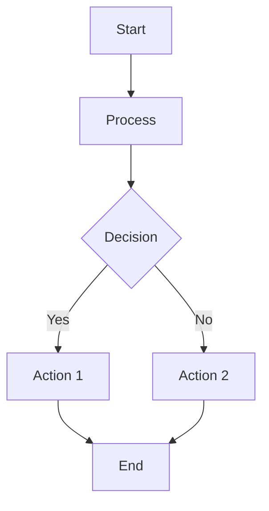
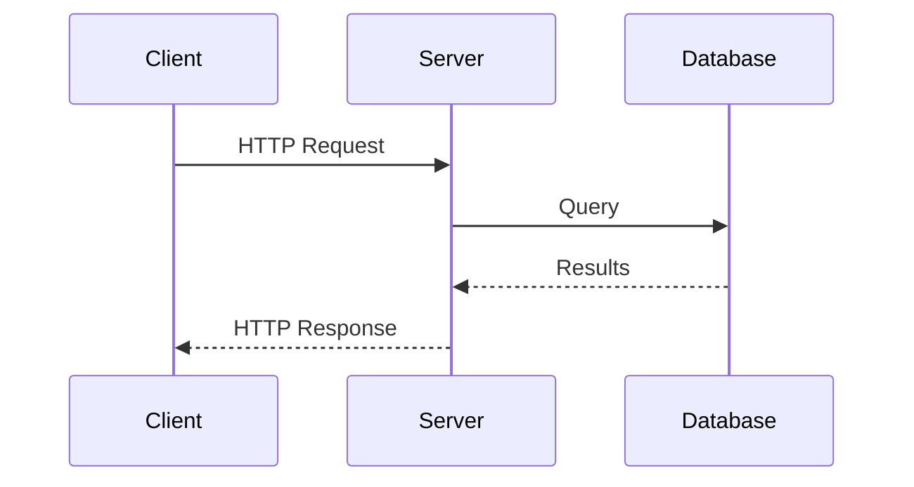
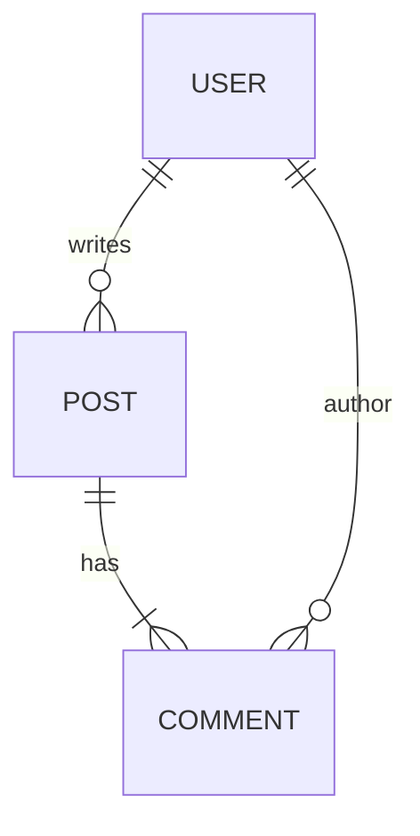

# Diagram Creation and Editing Skill

**Version**: 1.11.0
**Last Updated**: 2026-07-01

## Changelog

### v1.11.0 (2026-07-01)
- Integrated four capabilities adapted from Agents365-ai/drawio-skill (MIT):
  - **Deterministic structural linter** (`validate.py`): dangling/duplicate/reserved
    IDs, broken parents, bad geometry, sibling overlaps, and edge crossing /
    edge-through-vertex for waypointed edges. `drawio_gen.py verify` now delegates
    to it, and `--render` runs it as a **pre-render gate** (aborts on errors).
    SUPERSEDES: the manual pre-render checklist in Section 8 and the
    dup-ID/dangling-edge shell recipes in Section 13 (both removed).
  - **Graphviz auto-layout** (`autolayout.py`) + `drawio_gen.py wrap` for dense
    graphs (>~15 nodes) — new Section 34. Removes the manual-coordinate ceiling.
  - **Vision self-check loop**: Section 15 rewritten from "ask the user for a
    screenshot" into an active render -> validate -> raster -> self-read ->
    auto-fix (<=2 rounds) loop. Collapsed the old templates/example; gutted the
    five redundant extraction one-liners in Section 16 to a pointer at
    `drawio_gen.py extract`/`verify`.
  - **Shape & AI-icon search** (`shapesearch.py`, `aiicons.py`) — new Section 35:
    exact official draw.io vendor style strings (10k+ shapes) and AI/LLM brand
    logos.
- Added a Helper Scripts toolbox table (below Overview) so the tools are discoverable.

### v1.10.0 (2026-06-16)
- Section 5: added the "Arrows in label TEXT" rule - use a real Unicode arrow glyph
  (`&#8594;` ->) in any label/annotation text, never the ASCII `->`/`=>`, which renders
  broken in proportional fonts (the fix needs no font change). This is about text content,
  not `endArrow=` arrowheads.
- Section 33: added "Reviewing rendered PNGs" - collect exports in ONE folder with
  lexicographically-sorting names and open the FOLDER in Explorer; never open images
  one-by-one (spawns many Photos windows).

### v1.9.0 (2026-06-14)
- Section 20: hardened the no-background-on-edge-labels rule into a hard prohibition with a
  single narrow exception (user asks, or a container legend on its own border), and added the
  label-offset technique as the readable alternative.
- Section 29: added "Container / Group Title Justification (Default: Left)" - left-justify
  container titles to reserve the top-right corner for badges/annotations; added two
  anti-pattern rows (edge-label background, centered container title).

### v1.8.0 (2026-06-14)
- Rewrote Section 33 to make the backslash-escaping rule unmissable:
  - Added "THE #1 GOTCHA" explainer - bash double-quotes eat one backslash from
    every `\\`, so UNC paths need FOUR leading + double separators (`\\\\...\\`).
    Documents the exact symptom (app opens, no file) as an under-escaped path.
  - Added mandatory Test-Path / Write-Output verification step before launching.
  - Added distro-name note (`nixos` via `$WSL_DISTRO`, case-insensitive host).
  - Added `-ArgumentList` to the canonical command; single-instance caveat.
  - Added general principle for Windows paths in ANY WSL interop call.
  - Added headless export recipe (PNG/SVG/PDF; `-p` is 1-BASED; GPU errors harmless).

### v1.7.0 (2026-06-12)
- Added Section 33: Opening .drawio Files in Draw.io Desktop (WSL)
  - PowerShell + UNC path is the only reliable method
  - Documents pre-open XML validation requirements
  - Consolidates scattered memory entries into single source of truth

### v1.6.0 (2026-05-11)
- Added Section 32: Custom Shape Containers (L/T/U stencil polygons via `drawio_gen.py`)
- Added `compress_stencil()`, `make_lshape_stencil()`, `make_tshape_stencil()`, `make_ushape_stencil()` to `drawio_gen.py`
- Added `"type": "stencil"` support in JSON spec cell processing
- Added Custom Polygon (Stencil) section to REFERENCE.md

### v1.5.0 (2026-02-03)
- Added Section 29: Proactive Best Practices (consolidates defaults to apply when CREATING diagrams)
  - Annotation element ordering (z-order by default)
  - Edge label offset as default style
  - Creation checklist
  - Anti-patterns to avoid
  - Quick reference templates

### v1.4.0 (2026-02-03)
- Added Section 26: Z-Order and Layer Management (use z-order vs repositioning for overlaps)
- Added Section 27: Edge Label Positioning (offset labels from lines for readability)
- Added Section 28: Arrowhead Sizing (smaller arrowheads via strokeWidth or endSize)

### v1.3.0 (2026-02-03)
- Added Section 19: Integrated Edge Labels (prefer over separate text boxes)
- Added Section 20: Edge Label Styling Rules (no background, match line color)
- Added Section 21: Explicit Anchor Points (always use exitDx/exitDy/entryDx/entryDy=0)
- Added Section 22: Preserving User Content (never overwrite manual edits)
- Added Section 23: Network Connection Arrow Conventions (no arrows for physical links)
- Added Section 24: PDU Positioning (compact, near powered devices)
- Added Section 25: Cloud Shape Sizing (accommodate internal elements)

### v1.2.0 (2026-02-03)
- Added Section 18: Rounded Container Label Positioning (arcSize formula, visual offset calculation, implementation examples)

### v1.1.0 (2026-02-02)
- Added Section 14: Multi-Page DrawIO Support (page structure, ID namespacing, cross-page referencing)
- Added Section 15: Post-Render Critical Analysis (mandatory QA workflow, visual quality checklist)
- Added Section 16: Large File Handling (extraction methods for 400KB+ files)
- Added Section 17: Grouping Pattern for Similar Elements (container + single connection pattern)

## Overview

This skill enables creating and editing diagrams with automatic format selection based on complexity:

| Complexity | Format | Rationale |
|------------|--------|-----------|
| Simple | Mermaid | Text-based, renderer handles layout, works in GitHub/GitLab |
| Complex | DrawIO | Precise spatial control, custom positioning, rich styling |

**Supported Input Formats**:
- `.drawio.svg` - DrawIO with embedded mxGraphModel (PREFERRED)
- `.drawio` - Raw DrawIO XML
- Mermaid code blocks in markdown
- ASCII art diagrams

**Output Formats**:
- Mermaid - for simple diagrams (embedded in markdown)
- `.drawio.svg` - for complex diagrams (ALWAYS with embedded diagram)

---

## Helper Scripts (Toolbox)

All scripts live in this skill directory. Python scripts are executable and use
only the standard library (except `autolayout.py`, which shells out to Graphviz
`dot`). Run `dot`-dependent commands under `nix shell nixpkgs#graphviz -c ...`.

| Script | Use it to |
|--------|-----------|
| `drawio_gen.py` | Generate/extract/inject/wrap/verify `.drawio.svg`; the render entry point (Section 31) |
| `validate.py` | Deterministically lint a `.drawio`/`.drawio.svg` for structural + geometry defects (Section 8) |
| `autolayout.py` | Auto-place a dense graph (>~15 nodes) with Graphviz instead of hand coordinates (Section 34) |
| `shapesearch.py` | Resolve exact official draw.io vendor style strings (AWS/Azure/GCP/K8s/Cisco/UML/…) (Section 35) |
| `aiicons.py` | Resolve AI/LLM brand logos (OpenAI/Claude/Gemini/…) to draw.io image styles (Section 35) |

**The validator is a hard gate**: `drawio_gen.py generate|wrap --render` runs
`validate.py` on the model *before* invoking the renderer and aborts on structural
errors. Run `python3 drawio_gen.py verify FILE` any time to check a file by hand.

---

## Section 1: Format Selection Heuristic

Before creating a diagram, determine the appropriate format:

### Use Mermaid When:

- Linear flows (A → B → C → D)
- Simple trees (2-3 levels max)
- Sequence diagrams
- Basic flowcharts with decision nodes
- Class/ER diagrams without custom positioning
- Diagram will be viewed primarily on GitHub/GitLab

### Use DrawIO When:

- Side-by-side comparisons (Option A vs Option B)
- Multi-region architecture (Frontend/Backend/Database groups)
- Custom spatial layout required
- Layered/stacked architecture views
- User explicitly requests DrawIO
- Precise positioning matters
- Complex styling (gradients, icons, custom colors)

**Dense graphs (>~15 nodes, dependency/relationship graphs)**: still DrawIO, but
do not hand-place coordinates - use Graphviz auto-layout (Section 34). Hand
placement is for small, deliberately-composed diagrams; auto-layout is for graphs
where readable positioning is mechanical.

### Decision Flowchart

```
START: User requests diagram
  │
  ├─► Is spatial layout critical?
  │     YES → DrawIO
  │     NO  ↓
  │
  ├─► Multiple interconnected regions?
  │     YES → DrawIO
  │     NO  ↓
  │
  ├─► Side-by-side comparison?
  │     YES → DrawIO
  │     NO  ↓
  │
  ├─► Simple linear/tree structure?
  │     YES → Mermaid
  │     NO  ↓
  │
  └─► Default → Mermaid (simpler is better)
```

---

## Section 2: Creating Mermaid Diagrams

Mermaid diagrams are text-based and let the renderer handle layout.

### Flowchart



**Syntax Notes**:
- `TD` = top-down, `LR` = left-right
- `[]` = rectangle, `{}` = diamond, `()` = rounded, `(())` = circle
- `-->` = arrow, `---` = line, `-.->` = dashed arrow
- `|label|` = edge label

### Sequence Diagram



**Syntax Notes**:
- `->>` = solid arrow (synchronous)
- `-->>` = dashed arrow (response/async)
- `participant X as Label` = named participant

### Entity Relationship



**Syntax Notes**:
- `||--o{` = one-to-many
- `||--|{` = one-to-one-or-more
- `}o--||` = many-to-one (optional)

### Best Practices for Mermaid

1. Keep diagrams focused - one concept per diagram
2. Use meaningful node IDs (not just A, B, C)
3. Add labels to edges for clarity
4. Test in GitHub preview before committing

---

## Section 3: Creating DrawIO Diagrams

DrawIO diagrams use mxGraphModel XML for precise control.

### Complete Boilerplate Template

Use this exact template for new `.drawio.svg` files:

```xml
<svg xmlns="http://www.w3.org/2000/svg" xmlns:xlink="http://www.w3.org/1999/xlink"
     version="1.1" width="850px" height="600px"
     viewBox="-0.5 -0.5 850 600"
     content="&lt;mxfile host=&quot;Claude&quot; modified=&quot;2026-02-01&quot;&gt;&lt;diagram name=&quot;Page-1&quot; id=&quot;diagram-1&quot;&gt;&lt;mxGraphModel dx=&quot;800&quot; dy=&quot;600&quot; grid=&quot;1&quot; gridSize=&quot;10&quot; guides=&quot;1&quot; tooltips=&quot;1&quot; connect=&quot;1&quot; arrows=&quot;1&quot; fold=&quot;1&quot; page=&quot;1&quot; pageScale=&quot;1&quot; pageWidth=&quot;850&quot; pageHeight=&quot;600&quot;&gt;&lt;root&gt;&lt;mxCell id=&quot;0&quot;/&gt;&lt;mxCell id=&quot;1&quot; parent=&quot;0&quot;/&gt;&lt;/root&gt;&lt;/mxGraphModel&gt;&lt;/diagram&gt;&lt;/mxfile&gt;"
     style="background-color: rgb(255, 255, 255);">
  <defs/>
  <!-- SVG body will be generated by drawio-svg-sync -->
  <g>
    <text x="400" y="300" text-anchor="middle" font-size="14">
      Run drawio-svg-sync to render this diagram
    </text>
  </g>
</svg>
```

**CRITICAL**: The `content` attribute contains the HTML-entity-encoded mxGraphModel. This is what makes the file editable in DrawIO.

### Decoded mxGraphModel Structure

When decoded, the content attribute contains:

```xml
<mxfile host="Claude" modified="2026-02-01">
  <diagram name="Page-1" id="diagram-1">
    <mxGraphModel dx="800" dy="600" grid="1" gridSize="10"
                  guides="1" tooltips="1" connect="1" arrows="1"
                  fold="1" page="1" pageScale="1"
                  pageWidth="850" pageHeight="600">
      <root>
        <mxCell id="0"/>                    <!-- Root cell - REQUIRED -->
        <mxCell id="1" parent="0"/>         <!-- Default parent - REQUIRED -->

        <!-- Your shapes and connectors go here -->

      </root>
    </mxGraphModel>
  </diagram>
</mxfile>
```

### Invariants (MUST be preserved)

| Invariant | Rule | Consequence if Violated |
|-----------|------|-------------------------|
| Cell 0 | MUST exist, no parent | Diagram won't load |
| Cell 1 | MUST exist, `parent="0"` | Shapes won't render |
| IDs | MUST be unique within diagram | Unpredictable behavior |
| Parent refs | All visible cells have `parent="1"` | Element won't appear |
| vertex/edge | Exactly one of `vertex="1"` or `edge="1"` | Rendering issues |
| mxGeometry | Required child for position/size | Element has no location |

---

## Section 4: Adding Shapes

### Basic Rectangle

```xml
<mxCell id="box-1" value="My Label"
        style="rounded=0;whiteSpace=wrap;html=1;"
        vertex="1" parent="1">
  <mxGeometry x="100" y="100" width="120" height="60" as="geometry"/>
</mxCell>
```

### Rounded Rectangle with Color

```xml
<mxCell id="box-2" value="Success"
        style="rounded=1;whiteSpace=wrap;html=1;fillColor=#d5e8d4;strokeColor=#82b366;"
        vertex="1" parent="1">
  <mxGeometry x="100" y="200" width="120" height="60" as="geometry"/>
</mxCell>
```

### Text Box

```xml
<mxCell id="text-1" value="Label Text"
        style="text;html=1;align=center;verticalAlign=middle;whiteSpace=wrap;rounded=0;"
        vertex="1" parent="1">
  <mxGeometry x="100" y="300" width="80" height="30" as="geometry"/>
</mxCell>
```

### Dashed Container (for grouping)

```xml
<mxCell id="container-1" value="Group Name"
        style="rounded=1;whiteSpace=wrap;html=1;dashed=1;dashPattern=8 8;fillColor=none;strokeColor=#00CC66;strokeWidth=2;"
        vertex="1" parent="1">
  <mxGeometry x="80" y="400" width="200" height="150" as="geometry"/>
</mxCell>
```

### Common Style Attributes

| Attribute | Values | Purpose |
|-----------|--------|---------|
| `rounded` | `0`, `1` | Corner style (0=sharp, 1=rounded) |
| `whiteSpace` | `wrap` | Text wrapping |
| `html` | `1` | Enable HTML in labels |
| `fillColor` | `#RRGGBB`, `none` | Background color |
| `strokeColor` | `#RRGGBB` | Border color |
| `strokeWidth` | number | Border thickness |
| `fontColor` | `#RRGGBB` | Text color |
| `fontSize` | number | Font size (points) |
| `fontStyle` | `1` | Bold text |
| `dashed` | `0`, `1` | Dashed border |
| `dashPattern` | `N N` | Dash/gap pattern |

### Color Palette (User Preference)

| Theme | fillColor | strokeColor | Use Case |
|-------|-----------|-------------|----------|
| Green (success) | `#d5e8d4` | `#82b366` | Positive states |
| Red (error) | `#f8cecc` | `#b85450` | Warnings, issues |
| Yellow (warning) | `#fff2cc` | `#d6b656` | Caution, pending |
| Orange | `#ffe6cc` | `#d79b00` | Configuration |
| Purple | `#e1d5e7` | `#9673a6` | Services |
| Blue (light) | `#dae8fc` | `#6c8ebf` | Infrastructure |
| Blue (dark) | `#0050ef` | `#001DBC` | Network |

---

## Section 5: Adding Connectors

### Basic Arrow (Orthogonal Routing)

```xml
<mxCell id="conn-1" value=""
        style="edgeStyle=orthogonalEdgeStyle;rounded=0;orthogonalLoop=1;jettySize=auto;html=1;endArrow=classic;"
        edge="1" parent="1" source="box-1" target="box-2">
  <mxGeometry relative="1" as="geometry"/>
</mxCell>
```

### Arrow with Label

```xml
<mxCell id="conn-2" value="sends data"
        style="edgeStyle=orthogonalEdgeStyle;rounded=0;html=1;endArrow=classic;"
        edge="1" parent="1" source="box-1" target="box-2">
  <mxGeometry relative="1" as="geometry"/>
</mxCell>
```

### Arrows in label TEXT (not arrowheads)

When an arrow appears in **label or annotation text** (e.g. `"reschedule -> Box B"`,
a `"t -> recover"` clock pill), always use a real Unicode arrow glyph via its HTML
entity - `&#8594;` (->) - never the ASCII `->` or `=>`. The pill/label fonts are
proportional, so ASCII `->` renders as a hyphen jammed against a `>` and looks broken;
the glyph renders cleanly with no font change. (This is independent of the edge's own
`endArrow=` arrowhead style.) Other useful glyphs: `&#8592;` (<-), `&#8596;` (<->),
`&#8776;` (approx).

### Explicit Anchor Points

For left-to-right flow (user preference):

```xml
<mxCell id="conn-3" value=""
        style="edgeStyle=orthogonalEdgeStyle;exitX=1;exitY=0.5;exitDx=0;exitDy=0;entryX=0;entryY=0.5;entryDx=0;entryDy=0;endArrow=classic;html=1;"
        edge="1" parent="1" source="left-box" target="right-box">
  <mxGeometry relative="1" as="geometry"/>
</mxCell>
```

### Anchor Point Reference

```
      (0.5, 0) = top center
           ↓
(0, 0.5) → ┌────────────┐ ← (1, 0.5)
left       │   SHAPE    │   right
center     └────────────┘   center
                ↑
           (0.5, 1) = bottom center
```

| Position | exitX/entryX | exitY/entryY |
|----------|--------------|--------------|
| Left center | 0 | 0.5 |
| Right center | 1 | 0.5 |
| Top center | 0.5 | 0 |
| Bottom center | 0.5 | 1 |

### Floating Edge (No Source/Target)

```xml
<mxCell id="float-1" value=""
        style="endArrow=classic;html=1;"
        edge="1" parent="1">
  <mxGeometry width="50" height="50" relative="1" as="geometry">
    <mxPoint x="100" y="200" as="sourcePoint"/>
    <mxPoint x="300" y="200" as="targetPoint"/>
  </mxGeometry>
</mxCell>
```

### Arrow Styles

| Pattern | Style Attributes |
|---------|-----------------|
| Standard arrow | `endArrow=classic;` |
| Filled triangle | `endArrow=block;endFill=1;` |
| Open arrow | `endArrow=open;` |
| Bidirectional | `startArrow=oval;startFill=1;endArrow=oval;endFill=1;` |
| No arrows | `startArrow=none;endArrow=none;` |
| Dashed line | `dashed=1;dashPattern=8 8;` |

---

## Section 6: Complete Creation Examples

Moved to REFERENCE.md (loaded on demand) to keep SKILL.md's always-loaded
context small. See REFERENCE.md -> "Section 6: Complete Creation Examples".

---

## Section 7: Coordinate System

### Basics

- Origin: Top-left corner (0, 0)
- X-axis: Increases rightward
- Y-axis: Increases downward
- Units: Pixels

### mxGeometry Attributes

```xml
<mxGeometry x="100" y="200" width="120" height="60" as="geometry"/>
```

| Attribute | Purpose |
|-----------|---------|
| `x` | Left edge position |
| `y` | Top edge position |
| `width` | Element width |
| `height` | Element height |
| `as` | Always `"geometry"` |

### Parent-Child Coordinates

When `parent="1"` (default): coordinates are **ABSOLUTE**.

When `parent="other-id"` (container): coordinates are **RELATIVE** to parent.

```xml
<!-- Parent at absolute (100, 200) -->
<mxCell id="container" ... parent="1">
  <mxGeometry x="100" y="200" width="200" height="150" as="geometry"/>
</mxCell>

<!-- Child at relative (20, 30) = absolute (120, 230) -->
<mxCell id="child" ... parent="container">
  <mxGeometry x="20" y="30" width="80" height="40" as="geometry"/>
</mxCell>
```

### Layout Guidelines (User Preferences)

| Preference | Implementation |
|------------|----------------|
| Arrows enter LEFT | `entryX=0;entryY=0.5;` |
| Arrows exit RIGHT | `exitX=1;exitY=0.5;` |
| Use grid multiples | x, y, width, height in multiples of 10 |
| Consistent spacing | 50px gaps between shapes |

---

## Section 8: Rendering Workflow

After creating or editing the mxGraphModel XML, you MUST render it to update the visible SVG body.

### Pre-Render Validation (Automated Gate)

Do not hand-check invariants - run the deterministic linter, which is also the
automatic pre-render gate:

```bash
python3 drawio_gen.py verify path/to/diagram.drawio.svg
```

It reports (and, via `--render`, blocks on) missing/duplicate/reserved IDs,
broken parent references, dangling edge endpoints, missing/invalid geometry, and
- as warnings - sibling overlaps and edge crossings for waypointed edges. Fix
every ERROR before rendering; treat WARNINGs as review items. `generate`/`wrap`
with `--render` run this gate for you and abort on errors.

### Step 1: Create/Edit the .drawio.svg File

Write the complete SVG with encoded mxGraphModel in the `content` attribute.

### Step 2: Run drawio-svg-sync

```bash
nix run 'github:timblaktu/drawio-svg-sync' -- path/to/diagram.drawio.svg
```

**What drawio-svg-sync does**:
1. Reads the mxGraphModel from `content` attribute
2. Launches DrawIO CLI (using native X11 or xvfb-run fallback)
3. Exports the diagram to SVG using `drawio -x`
4. Re-injects the `content` attribute to preserve editability
5. Replaces the file with the updated SVG

**Expected success output**:
```
Processing: path/to/diagram.drawio.svg
Rendering diagram...
Successfully updated SVG body
```

**Expected runtime**: 5-15 seconds (Docker container startup + rendering)

### Step 3: Verify Rendering Success

#### Quick Verification

```bash
# Check file was modified (mtime should be recent)
ls -la path/to/diagram.drawio.svg

# Confirm SVG body was regenerated (should see actual shapes, not placeholder)
rg '<rect |<path |<ellipse ' path/to/diagram.drawio.svg | head -5
```

**Success indicators**:
- File modification time updated
- SVG body contains `<rect>`, `<path>`, `<g>`, etc. (actual graphics)
- Placeholder text ("Run drawio-svg-sync...") is gone

#### Detailed Verification (Optional)

```bash
# View in browser to confirm visual correctness
xdg-open path/to/diagram.drawio.svg

# Check the file opens in DrawIO desktop (confirms content attribute valid)
drawio path/to/diagram.drawio.svg
```

### Post-Render Validation Checklist

After successful rendering:

- [ ] File modification time updated
- [ ] SVG body contains actual graphic elements (not placeholder)
- [ ] Diagram displays correctly in browser
- [ ] Diagram opens in DrawIO desktop without errors
- [ ] Expected elements visible (shapes, connectors, labels)
- [ ] Colors and styling match intent

### Step 4: Git Workflow Integration

#### Staging

The `.drawio.svg` file is self-contained - it includes both:
- The encoded mxGraphModel (source of truth, editable in DrawIO)
- The rendered SVG body (visual representation)

Stage the single file:
```bash
git add path/to/diagram.drawio.svg
```

**Important**: Never stage intermediate states. Only stage after successful rendering.

#### Commit Message Conventions

Follow this pattern for diagram commits:

```bash
# For new diagrams
git commit -m "Add diagram: <what it shows>

<Brief description of purpose/context>"

# For diagram edits
git commit -m "Update diagram: <what changed>

<Why the change was made>"
```

**Examples**:
```bash
git commit -m "Add diagram: 3-tier architecture overview

Shows Web, API, and Database layers with connectivity"

git commit -m "Update diagram: rename 'Fetch' to 'Download' phase

Aligns terminology with upstream documentation"

git commit -m "Update diagram: add Cache component between API and Database

Illustrates caching layer for performance discussion"
```

#### PR Description (if applicable)

When diagram changes are part of a PR:
1. Mention the diagram change in the PR summary
2. Note what the diagram shows (GitHub/GitLab render .drawio.svg inline)
3. If the change is visual-only, say so ("no functional changes")

### Error Handling: Common Failures and Recovery

#### Failure: Docker Not Running

**Symptoms**:
```
Error: Cannot connect to Docker daemon
Error: docker: command not found
```

**Recovery**:
```bash
# Start Docker
sudo systemctl start docker

# Or, if using Docker Desktop
# Open Docker Desktop application

# Retry
nix run 'github:timblaktu/drawio-svg-sync' -- path/to/diagram.drawio.svg
```

#### Failure: Invalid XML in content Attribute

**Symptoms**:
```
Error: Failed to parse mxGraphModel
Error: XML parsing error at line X
```

**Recovery**:
1. Decode the content attribute
2. Validate XML (look for unclosed tags, mismatched quotes)
3. Common issues:
   - Unescaped `&` (should be `&amp;`)
   - Unescaped `<` in label text (should be `&lt;`)
   - Missing closing `</mxCell>`
4. Fix the XML, re-encode, and retry

#### Failure: Missing Required Cells

**Symptoms**:
```
Error: Root cell not found
Error: Default parent cell missing
```

**Recovery**:
Ensure your mxGraphModel has the required structure:
```xml
<root>
  <mxCell id="0"/>                    <!-- REQUIRED -->
  <mxCell id="1" parent="0"/>         <!-- REQUIRED -->
  <!-- Your shapes here -->
</root>
```

#### Failure: Duplicate IDs

**Symptoms**:
- Diagram loads but elements overlap unexpectedly
- Some elements don't appear
- DrawIO shows warnings about duplicate IDs

**Recovery**:
```bash
# Find duplicate IDs
rg -o 'id="[^"]+"' path/to/diagram.drawio.svg | sort | uniq -d
```
Rename duplicates to unique values.

#### Failure: Invalid Edge References

**Symptoms**:
- Edges don't appear
- Edges appear disconnected (floating)

**Recovery**:
```bash
# List all source/target references
rg 'source="([^"]+)"|target="([^"]+)"' -o path/to/diagram.drawio.svg

# List all shape IDs
rg 'id="([^"]+)".*vertex="1"' -o path/to/diagram.drawio.svg
```
Ensure every `source` and `target` value matches an existing shape ID.

#### Failure: Encoding Issues

**Symptoms**:
- File appears corrupted after editing
- `content` attribute truncated
- Special characters rendered incorrectly

**Recovery**:
Verify encoding is correct:
- `<` → `&lt;`
- `>` → `&gt;`
- `"` → `&quot;`
- `&` → `&amp;`
- Newlines → `&#10;`

Do NOT double-encode (e.g., `&amp;lt;` is wrong, should be `&lt;`).

### Workflow Summary

```
┌─────────────────────────────────────────────────────────┐
│                    RENDERING WORKFLOW                    │
├─────────────────────────────────────────────────────────┤
│                                                          │
│  1. Edit mxGraphModel XML                               │
│     └─► Pre-render checklist ✓                          │
│                                                          │
│  2. Re-encode content attribute                         │
│     └─► HTML entities properly escaped                  │
│                                                          │
│  3. Run drawio-svg-sync                                 │
│     └─► nix run 'github:timblaktu/drawio-svg-sync' -- FILE │
│                                                          │
│  4. Verify success                                      │
│     └─► Post-render checklist ✓                         │
│                                                          │
│  5. Stage and commit                                    │
│     └─► git add FILE && git commit -m "..."             │
│                                                          │
└─────────────────────────────────────────────────────────┘
```

---

## Section 9: Encoding the content Attribute

When writing a `.drawio.svg` file, the mxGraphModel must be HTML-entity-encoded in the `content` attribute.

### Encoding Rules

| Character | Encoded |
|-----------|---------|
| `<` | `&lt;` |
| `>` | `&gt;` |
| `"` | `&quot;` |
| `&` | `&amp;` |
| newline | `&#10;` |

### Example Encoding

**Before** (raw XML):
```xml
<mxfile host="Claude">
  <diagram name="Page-1" id="1">
    <mxGraphModel>
      <root>
        <mxCell id="0"/>
        <mxCell id="1" parent="0"/>
      </root>
    </mxGraphModel>
  </diagram>
</mxfile>
```

**After** (for content attribute):
```
&lt;mxfile host=&quot;Claude&quot;&gt;&#10;  &lt;diagram name=&quot;Page-1&quot; id=&quot;1&quot;&gt;&#10;    &lt;mxGraphModel&gt;&#10;      &lt;root&gt;&#10;        &lt;mxCell id=&quot;0&quot;/&gt;&#10;        &lt;mxCell id=&quot;1&quot; parent=&quot;0&quot;/&gt;&#10;      &lt;/root&gt;&#10;    &lt;/mxGraphModel&gt;&#10;  &lt;/diagram&gt;&#10;&lt;/mxfile&gt;
```

### Implementation Pattern

When creating a new diagram:

1. Build the mxGraphModel XML structure
2. Encode special characters
3. Insert into `content="..."` attribute
4. Include placeholder SVG body
5. Run drawio-svg-sync to render

---

## Quick Reference Card

### New Diagram Checklist

- [ ] Cell 0 exists (no parent attribute)
- [ ] Cell 1 exists (parent="0")
- [ ] All shapes have unique IDs
- [ ] All shapes have `vertex="1" parent="1"`
- [ ] All shapes have `<mxGeometry>` child
- [ ] All edges have `edge="1" parent="1"`
- [ ] All edges have source/target OR sourcePoint/targetPoint
- [ ] content attribute is properly encoded
- [ ] Run drawio-svg-sync after editing

### Minimal Shape

```xml
<mxCell id="UNIQUE_ID" value="LABEL"
        style="rounded=1;whiteSpace=wrap;html=1;"
        vertex="1" parent="1">
  <mxGeometry x="X" y="Y" width="W" height="H" as="geometry"/>
</mxCell>
```

### Minimal Connector

```xml
<mxCell id="UNIQUE_ID"
        style="edgeStyle=orthogonalEdgeStyle;endArrow=classic;html=1;"
        edge="1" parent="1" source="FROM_ID" target="TO_ID">
  <mxGeometry relative="1" as="geometry"/>
</mxCell>
```

For detailed technical reference on shapes, styles, and patterns, see [REFERENCE.md](REFERENCE.md).

---

## Section 10: Editing Existing Diagrams

When editing an existing `.drawio.svg` file, follow this workflow to make surgical changes without breaking the diagram.

### Step 1: Format Detection

First, determine what kind of file you're editing:

```bash
# Check for content attribute (DrawIO format)
rg -o 'content="[^"]{0,50}' file.drawio.svg
```

**DrawIO Format** (has `content` attribute with mxfile):
- The `content` attribute contains the editable mxGraphModel
- SVG body is just rendered output (regenerated by drawio-svg-sync)
- Edit the XML inside `content`, not the SVG elements

**Pure SVG** (no `content` attribute, or content doesn't contain mxfile):
- Out of scope for this skill
- These are hand-crafted SVGs, not DrawIO diagrams
- Inform user and decline to edit

### Step 2: Extract and Decode the mxGraphModel

The `content` attribute is HTML-entity-encoded. To edit:

1. **Extract** the content attribute value
2. **Decode** HTML entities:
   - `&lt;` → `<`
   - `&gt;` → `>`
   - `&quot;` → `"`
   - `&amp;` → `&`
   - `&#10;` → newline
3. **Parse** as XML to find target elements

### Step 3: Find Target Elements

#### By Text Content (User-Friendly)

Users think in terms of labels, not IDs. Search by `value` attribute:

```xml
<!-- Looking for "Fetch" -->
<mxCell id="phase-1" value="Fetch" .../>
```

**Pattern**: `value="TARGET_TEXT"` or `value="&lt;b&gt;TARGET_TEXT&lt;/b&gt;"` (HTML formatted)

**Caution**: Text might be HTML-encoded within the value:
- `&lt;b&gt;Title&lt;/b&gt;` = bold text
- `&lt;br&gt;` = line break

#### By ID (Precise)

When you know the exact ID:

```xml
<mxCell id="exact-id" .../>
```

**Pattern**: `id="TARGET_ID"`

#### By Style (Type-Based)

Find all shapes of a certain type:

```xml
<!-- All containers -->
<mxCell ... style="...container=1..." .../>

<!-- All edges -->
<mxCell ... edge="1" .../>

<!-- All vertices (shapes) -->
<mxCell ... vertex="1" .../>
```

### Step 4: Modify Text (value Attribute)

**SAFE**: Change only the `value` attribute, preserve everything else.

**Before**:
```xml
<mxCell id="step-1" value="Fetch"
        style="rounded=1;whiteSpace=wrap;html=1;fillColor=#dae8fc;strokeColor=#6c8ebf;"
        vertex="1" parent="1">
  <mxGeometry x="50" y="100" width="100" height="60" as="geometry"/>
</mxCell>
```

**After** (changing "Fetch" to "Download"):
```xml
<mxCell id="step-1" value="Download"
        style="rounded=1;whiteSpace=wrap;html=1;fillColor=#dae8fc;strokeColor=#6c8ebf;"
        vertex="1" parent="1">
  <mxGeometry x="50" y="100" width="100" height="60" as="geometry"/>
</mxCell>
```

**Verification**: The diff should show ONLY the value change:
```diff
-<mxCell id="step-1" value="Fetch"
+<mxCell id="step-1" value="Download"
```

### Step 5: Modify Style Attributes

The `style` attribute is a semicolon-separated key=value string. To modify:

1. Parse into key-value pairs
2. Update specific keys
3. Rebuild the string
4. Preserve key order when possible

**Example: Change fill color to light green**

**Before**:
```
style="rounded=1;whiteSpace=wrap;html=1;fillColor=#dae8fc;strokeColor=#6c8ebf;"
```

**After**:
```
style="rounded=1;whiteSpace=wrap;html=1;fillColor=#d5e8d4;strokeColor=#82b366;"
```

**Common Style Modifications**:

| Goal | Key(s) to Modify |
|------|-----------------|
| Change background color | `fillColor=#RRGGBB` |
| Change border color | `strokeColor=#RRGGBB` |
| Make dashed | `dashed=1;dashPattern=8 8;` |
| Make bold text | `fontStyle=1;` |
| Change font size | `fontSize=14;` |
| Remove fill | `fillColor=none;` |
| Add rounded corners | `rounded=1;` |

**Caution**: Some keys are flags (presence = true). Don't add `=1` unnecessarily:
- `html=1` ✓
- `dashed=1` ✓
- `text;` (no value - it's a shape type flag) ✓

### Step 6: Move Elements (Update Position)

To move an element, update the `x` and `y` attributes in `<mxGeometry>`:

**Before** (at position 100, 200):
```xml
<mxCell id="box-1" ...>
  <mxGeometry x="100" y="200" width="120" height="60" as="geometry"/>
</mxCell>
```

**After** (moved to 250, 150):
```xml
<mxCell id="box-1" ...>
  <mxGeometry x="250" y="150" width="120" height="60" as="geometry"/>
</mxCell>
```

**Important**: If moving a connected shape:
- Edges with `source` or `target` referencing this ID will auto-update endpoints
- Floating edges (using sourcePoint/targetPoint) will NOT update - you must manually adjust

### Step 7: Resize Elements

To resize, update `width` and `height` in `<mxGeometry>`:

**Before**:
```xml
<mxGeometry x="100" y="100" width="120" height="60" as="geometry"/>
```

**After** (larger):
```xml
<mxGeometry x="100" y="100" width="180" height="80" as="geometry"/>
```

**Text Consideration**: If the element has `whiteSpace=wrap;html=1;`, text will reflow to new size. Without wrapping, text may overflow.

### Step 8: Add New Elements

When adding elements to an existing diagram:

1. **Generate unique ID** - check existing IDs, use descriptive names
2. **Set parent="1"** for top-level elements
3. **Include vertex="1" or edge="1"** as appropriate
4. **Provide complete mxGeometry**

**Adding a Shape**:

```xml
<!-- Add after existing mxCell elements, before </root> -->
<mxCell id="new-box" value="New Component"
        style="rounded=1;whiteSpace=wrap;html=1;fillColor=#e1d5e7;strokeColor=#9673a6;"
        vertex="1" parent="1">
  <mxGeometry x="300" y="200" width="120" height="60" as="geometry"/>
</mxCell>
```

**Adding a Connector**:

```xml
<mxCell id="new-conn"
        style="edgeStyle=orthogonalEdgeStyle;exitX=1;exitY=0.5;entryX=0;entryY=0.5;endArrow=classic;html=1;"
        edge="1" parent="1" source="existing-box" target="new-box">
  <mxGeometry relative="1" as="geometry"/>
</mxCell>
```

**Verify References**: Ensure `source` and `target` IDs exist in the diagram!

### Step 9: Delete Elements Safely

Deleting requires removing the element AND cleaning up references.

#### Delete a Shape

1. Remove the `<mxCell>` element
2. Find ALL edges that reference this ID
3. Remove those edges too (or update their source/target)

**Example**: Deleting "box-to-remove"

**Step 1 - Find connected edges**:
```bash
rg 'source="box-to-remove"|target="box-to-remove"' file.drawio.svg
```

**Step 2 - Remove the shape and ALL referencing edges**:
```xml
<!-- REMOVE these: -->
<mxCell id="box-to-remove" ... vertex="1" .../>
<mxCell id="edge-to-box" ... source="other" target="box-to-remove" edge="1"/>
<mxCell id="edge-from-box" ... source="box-to-remove" target="other" edge="1"/>
```

#### Delete an Edge

Simpler - just remove the `<mxCell>` with `edge="1"`:

```xml
<!-- REMOVE: -->
<mxCell id="edge-to-remove" ... edge="1" .../>
```

**No cascading cleanup needed** - edges don't have dependents.

### Step 10: Preserve Diagram Integrity

**CRITICAL RULES - Never Violate These**:

| Rule | Consequence if Violated |
|------|------------------------|
| Never delete cell 0 | Diagram won't load |
| Never delete cell 1 | Shapes won't render |
| Never duplicate IDs | Unpredictable behavior |
| Never orphan edge references | Edge won't render |
| Never remove mxGeometry | Shape has no location |
| Never break parent references | Element won't appear |

**Pre-Edit Checklist**:
- [ ] Confirmed file has `content` attribute with mxfile
- [ ] Identified target element(s) by text or ID
- [ ] Noted any connected edges (if deleting/moving)
- [ ] Planned minimal changes (don't change what you don't need to)

**Post-Edit Checklist**:
- [ ] Cells 0 and 1 still exist
- [ ] All IDs remain unique
- [ ] All edge source/target references point to existing cells
- [ ] All cells have parent references
- [ ] Re-encoded content attribute properly
- [ ] Run drawio-svg-sync to verify rendering

### Complete Editing Example

**Request**: "In the pipeline diagram, change 'Build' to 'Compile' and make it green"

**Step 1**: Read and decode the content attribute

**Step 2**: Find the target element
```xml
<mxCell id="build" value="Build"
        style="rounded=1;whiteSpace=wrap;html=1;fillColor=#dae8fc;strokeColor=#6c8ebf;"
        vertex="1" parent="1">
  <mxGeometry x="200" y="100" width="100" height="60" as="geometry"/>
</mxCell>
```

**Step 3**: Make surgical changes (value and style only)
```xml
<mxCell id="build" value="Compile"
        style="rounded=1;whiteSpace=wrap;html=1;fillColor=#d5e8d4;strokeColor=#82b366;"
        vertex="1" parent="1">
  <mxGeometry x="200" y="100" width="100" height="60" as="geometry"/>
</mxCell>
```

**Step 4**: Re-encode and update content attribute

**Step 5**: Run drawio-svg-sync

**Step 6**: Verify the diff shows only expected changes

---

## Section 11: Splitting and Rerouting Connectors

When adding an element "between" two connected elements, you need to handle the existing connector.

### Scenario: Add Element Between Two Connected Elements

**Original**: Box A → Box B (via edge-1)
**Goal**: Box A → New Box → Box B

**Approach 1: Split the Existing Edge** (recommended)

1. **Update edge-1** to connect A → New Box
2. **Add edge-2** to connect New Box → B

```xml
<!-- Modified edge-1: now ends at new-box instead of B -->
<mxCell id="edge-1" ...
        source="box-a" target="new-box" edge="1">
  ...
</mxCell>

<!-- New edge: new-box to B -->
<mxCell id="edge-2"
        style="edgeStyle=orthogonalEdgeStyle;exitX=1;exitY=0.5;entryX=0;entryY=0.5;endArrow=classic;html=1;"
        edge="1" parent="1" source="new-box" target="box-b">
  <mxGeometry relative="1" as="geometry"/>
</mxCell>
```

**Approach 2: Delete and Recreate** (cleaner for complex routing)

1. Delete edge-1 entirely
2. Create edge-1-new: A → New Box
3. Create edge-2-new: New Box → B

### Connector Waypoint Considerations

If the original edge has custom waypoints:
```xml
<mxGeometry relative="1" as="geometry">
  <Array as="points">
    <mxPoint x="200" y="100"/>
    <mxPoint x="200" y="300"/>
  </Array>
</mxGeometry>
```

You may need to:
- Clear waypoints (let orthogonal routing recalculate)
- Or manually adjust waypoints to route around the new element

**Safest approach**: Remove waypoints, let drawio-svg-sync recalculate:
```xml
<mxGeometry relative="1" as="geometry"/>
```

---

## Section 12: Common Editing Patterns

### Pattern 1: Rename Multiple Elements

When renaming a concept across the diagram (e.g., "Server" → "API Gateway"):

1. Find all occurrences: `rg 'value="[^"]*Server[^"]*"'`
2. Update each value attribute
3. Do NOT change IDs (would break edge references)

### Pattern 2: Change Color Scheme

To recolor all elements of a type:

1. Identify elements by current fillColor
2. Search: `fillColor=#dae8fc` (current blue)
3. Replace with: `fillColor=#d5e8d4` (new green)
4. Update strokeColor to match

### Pattern 3: Reposition a Group

When multiple elements need to move together:

1. Calculate the offset (new position - current position)
2. Add offset to each element's x and y
3. Edges with source/target references auto-update

**Example**: Move everything right by 100px
```
x="100" → x="200"
x="250" → x="350"
```

### Pattern 4: Convert Edge Style

Change from straight to orthogonal routing:

**Before**:
```
style="endArrow=classic;html=1;"
```

**After**:
```
style="edgeStyle=orthogonalEdgeStyle;rounded=0;orthogonalLoop=1;jettySize=auto;html=1;endArrow=classic;"
```

---

## Section 13: Editing Troubleshooting

### Structural problems (element not visible, edge not connecting, won't load)

These are all structural and are diagnosed deterministically - do not eyeball
them. Run the validator; it pinpoints the exact cell:

```bash
python3 drawio_gen.py verify diagram.drawio.svg
```

It covers the common causes: missing `vertex`/`edge`/`parent`, missing or invalid
`<mxGeometry>`, non-existent `source`/`target`, missing cells 0/1, duplicate IDs.
Fix the reported ERROR and re-verify. The two problems below are *not* structural,
so the validator won't flag them:

### Problem: Changes Not Visible After Sync

**Check**:
- Did you modify the `content` attribute (not just SVG body)?
- Is the content attribute properly encoded?
- Did drawio-svg-sync run without errors?

### Problem: Connector Routing Looks Wrong

**Solution**: Clear waypoints to let DrawIO recalculate:
```xml
<!-- Remove Array as="points" if present -->
<mxGeometry relative="1" as="geometry"/>
```

Then run drawio-svg-sync to regenerate routing.

---

## Section 14: Multi-Page DrawIO Support

DrawIO supports multiple pages (tabs) within a single file. Use this for complex diagrams that benefit from separate views.

### When to Use Multiple Pages

| Use Case | Page Structure |
|----------|---------------|
| Physical vs Logical views | Page 1: Physical topology, Page 2: Logical connections |
| Overview vs Detail | Page 1: High-level architecture, Page 2+: Component details |
| Before/After states | Page 1: Current state, Page 2: Target state |
| Layered architecture | Page 1: Network layer, Page 2: Application layer, Page 3: Data layer |
| Deployment variants | Page 1: Dev environment, Page 2: Staging, Page 3: Production |

### Multi-Page XML Structure

Multiple pages are represented as multiple `<diagram>` elements inside `<mxfile>`:

```xml
<mxfile host="Claude" modified="2026-02-02">
  <diagram name="Physical Network" id="phys">
    <mxGraphModel dx="800" dy="600" grid="1" gridSize="10" guides="1" tooltips="1" connect="1" arrows="1" fold="1" page="1" pageScale="1" pageWidth="850" pageHeight="600">
      <root>
        <mxCell id="0"/>
        <mxCell id="1" parent="0"/>
        <!-- Physical network elements here -->
        <mxCell id="phys-switch-1" value="Core Switch" ... />
      </root>
    </mxGraphModel>
  </diagram>
  <diagram name="Logical Network" id="logic">
    <mxGraphModel dx="800" dy="600" grid="1" gridSize="10" guides="1" tooltips="1" connect="1" arrows="1" fold="1" page="1" pageScale="1" pageWidth="850" pageHeight="600">
      <root>
        <mxCell id="0"/>
        <mxCell id="1" parent="0"/>
        <!-- Logical network elements here -->
        <mxCell id="logic-vlan-10" value="VLAN 10" ... />
      </root>
    </mxGraphModel>
  </diagram>
</mxfile>
```

### ID Namespacing Strategy (CRITICAL)

**Problem**: Cell IDs must be unique across the ENTIRE file, not just per page.

**Solution**: Use page-specific prefixes for all IDs:

| Page | ID Prefix | Example IDs |
|------|-----------|-------------|
| Physical Network | `phys-` | `phys-switch-1`, `phys-server-rack`, `phys-conn-1` |
| Logical Network | `logic-` | `logic-vlan-10`, `logic-subnet-a`, `logic-conn-1` |
| Overview | `ov-` | `ov-cloud`, `ov-datacenter`, `ov-conn-1` |
| Detail | `det-` | `det-service-1`, `det-database`, `det-conn-1` |

**Exception**: Cells 0 and 1 are special:
- Each page has its OWN cell 0 and cell 1 with id="0" and id="1"
- These are scoped to the `<root>` within each `<diagram>`
- This is the ONLY case where IDs can repeat across pages

### Page Naming Conventions

| Pattern | Example Names | Use Case |
|---------|---------------|----------|
| View-based | "Physical View", "Logical View" | Different perspectives |
| Layer-based | "Network Layer", "Application Layer" | Architecture layers |
| State-based | "Current State", "Target State" | Before/after |
| Scope-based | "Overview", "Component A Detail" | Zoom levels |
| Environment-based | "Development", "Production" | Deployment variants |

**Guidelines**:
- Keep names short (< 20 characters) for tab display
- Use Title Case for consistency
- Make names self-descriptive (avoid "Page 1", "Page 2")

### Creating Multi-Page Diagrams

**Step 1**: Define the page structure and ID prefixes:

```
Diagram: Network Architecture
├── Page 1: "Physical Topology" (prefix: pt-)
│   └── Shows: racks, cables, physical ports
├── Page 2: "Logical Topology" (prefix: lt-)
│   └── Shows: VLANs, subnets, routing
└── Page 3: "Service Map" (prefix: sm-)
    └── Shows: applications, dependencies
```

**Step 2**: Build each page with namespaced IDs:

```xml
<!-- Page 1 content -->
<mxCell id="pt-rack-1" value="Rack A" ... />
<mxCell id="pt-server-1" value="Web Server" ... />
<mxCell id="pt-conn-1" ... source="pt-rack-1" target="pt-server-1" />

<!-- Page 2 content -->
<mxCell id="lt-vlan-10" value="VLAN 10 (Users)" ... />
<mxCell id="lt-subnet-1" value="10.0.10.0/24" ... />
<mxCell id="lt-conn-1" ... source="lt-vlan-10" target="lt-subnet-1" />
```

**Step 3**: Encode all pages into single content attribute

### Multi-Page Boilerplate Template

```xml
<svg xmlns="http://www.w3.org/2000/svg" xmlns:xlink="http://www.w3.org/1999/xlink"
     version="1.1" width="850px" height="600px"
     viewBox="-0.5 -0.5 850 600"
     content="&lt;mxfile host=&quot;Claude&quot; modified=&quot;2026-02-02&quot;&gt;&lt;diagram name=&quot;Page 1&quot; id=&quot;p1&quot;&gt;&lt;mxGraphModel dx=&quot;800&quot; dy=&quot;600&quot; grid=&quot;1&quot; gridSize=&quot;10&quot; guides=&quot;1&quot; tooltips=&quot;1&quot; connect=&quot;1&quot; arrows=&quot;1&quot; fold=&quot;1&quot; page=&quot;1&quot; pageScale=&quot;1&quot; pageWidth=&quot;850&quot; pageHeight=&quot;600&quot;&gt;&lt;root&gt;&lt;mxCell id=&quot;0&quot;/&gt;&lt;mxCell id=&quot;1&quot; parent=&quot;0&quot;/&gt;&lt;mxCell id=&quot;p1-example&quot; value=&quot;Page 1 Content&quot; style=&quot;rounded=1;whiteSpace=wrap;html=1;&quot; vertex=&quot;1&quot; parent=&quot;1&quot;&gt;&lt;mxGeometry x=&quot;100&quot; y=&quot;100&quot; width=&quot;120&quot; height=&quot;60&quot; as=&quot;geometry&quot;/&gt;&lt;/mxCell&gt;&lt;/root&gt;&lt;/mxGraphModel&gt;&lt;/diagram&gt;&lt;diagram name=&quot;Page 2&quot; id=&quot;p2&quot;&gt;&lt;mxGraphModel dx=&quot;800&quot; dy=&quot;600&quot; grid=&quot;1&quot; gridSize=&quot;10&quot; guides=&quot;1&quot; tooltips=&quot;1&quot; connect=&quot;1&quot; arrows=&quot;1&quot; fold=&quot;1&quot; page=&quot;1&quot; pageScale=&quot;1&quot; pageWidth=&quot;850&quot; pageHeight=&quot;600&quot;&gt;&lt;root&gt;&lt;mxCell id=&quot;0&quot;/&gt;&lt;mxCell id=&quot;1&quot; parent=&quot;0&quot;/&gt;&lt;mxCell id=&quot;p2-example&quot; value=&quot;Page 2 Content&quot; style=&quot;rounded=1;whiteSpace=wrap;html=1;&quot; vertex=&quot;1&quot; parent=&quot;1&quot;&gt;&lt;mxGeometry x=&quot;100&quot; y=&quot;100&quot; width=&quot;120&quot; height=&quot;60&quot; as=&quot;geometry&quot;/&gt;&lt;/mxCell&gt;&lt;/root&gt;&lt;/mxGraphModel&gt;&lt;/diagram&gt;&lt;/mxfile&gt;"
     style="background-color: rgb(255, 255, 255);">
  <defs/>
  <g>
    <text x="400" y="300" text-anchor="middle" font-size="14">
      Run drawio-svg-sync to render this diagram
    </text>
  </g>
</svg>
```

### Cross-Page Referencing

Elements CANNOT reference IDs across pages (edges cannot span pages). Instead:

1. **Use consistent element naming**: If "Database Server" appears on multiple pages, use recognizable names:
   - Physical: `phys-db-server` with value "DB Server (Physical)"
   - Logical: `logic-db-server` with value "DB Server (Logical)"

2. **Visual linking**: Add annotation text like "See Logical View for VLAN details"

3. **Color coding**: Use consistent colors for the same concept across pages

### Editing Multi-Page Diagrams

When editing, first identify which page contains the target element:

```bash
# Find which page contains an element
python3 -c "
import html, re
with open('diagram.drawio.svg') as f:
    content = html.unescape(re.search(r'content=\"([^\"]+)\"', f.read()).group(1))
# Search in decoded content for element and its surrounding <diagram> tag
"
```

**Common mistakes to avoid**:
- Adding element with ID `foo` when `foo` exists on another page
- Forgetting to namespace new IDs
- Referencing cross-page IDs in edge source/target

### Multi-Page Rendering Notes

When running drawio-svg-sync:
- Only the **first page** is rendered to the SVG body by default
- The content attribute preserves ALL pages
- DrawIO desktop can switch between pages when opening the file
- GitHub/GitLab preview shows only the first page

---

## Section 15: Post-Render Self-Check Loop

After rendering, run an active self-check loop before presenting the diagram.
Two passes catch different defect classes: a deterministic structural pass, then
a visual pass you perform yourself by reading the rendered raster.

### The loop

1. **Render** (`drawio_gen.py ... --render`, or `drawio-svg-sync` directly).
2. **Structural pass (free, deterministic):** the render gate already ran
   `validate.py`. If it reported sibling overlaps or edge crossings as WARNINGs,
   treat them as real defects to fix here - the linter sees geometry you might miss.
3. **Visual pass (you read the raster):** the `.drawio.svg` body is vector, so
   rasterize to a PNG and read it with your own vision to actually "see" layout.
   The Read tool does NOT render `.drawio.svg` as an image (it returns the SVG
   XML as text), so rasterizing to PNG first is mandatory - do not try to Read
   the `.drawio.svg` directly. Use draw.io's own renderer via a nix shell (a bare
   `drawio` is not on PATH here; only draw.io's renderer is faithful - `resvg`
   turns `light-dark()` fills black and ImageMagick cannot render the
   `<foreignObject>` label text):
   ```bash
   # 1-based page index; cap width so the PNG stays under the vision 2576x2576 ceiling
   nix shell nixpkgs#drawio nixpkgs#xvfb-run -c \
     xvfb-run --auto-servernum drawio -x -f png --width 2000 -p 1 \
     -o /tmp/diagram-check.png diagram.drawio.svg
   ```
   The GLX/EGL/ANGLE stderr lines are harmless (export still returns exit 0 with a
   good PNG). Do NOT add `--no-sandbox`/`--disable-gpu` - they break drawio's CLI
   arg parser. If Windows draw.io is installed, the `draw.io.exe` path in
   Section 33 is an alternative. Then read `/tmp/diagram-check.png` and scan for
   the issues in the checklist below.
4. **Auto-fix, at most 2 rounds:** apply concrete XML fixes for what you find,
   re-render, re-read. After 2 rounds, stop and present what you have with a note
   on any residual issue - do not loop indefinitely.
5. **Present** to the user; for diagrams they will iterate on, also offer the
   fixes you deliberately did not auto-apply.

Skip the visual pass only for trivial diagrams (<5 elements) or when the user
said "quick draft" - the structural pass always runs. If you cannot rasterize
(the nix shell above fails and no Windows draw.io is available), fall back to
asking the user for a screenshot and analyze that.

### Visual Quality Checklist

After viewing the rendered diagram, systematically check for:

#### Label Issues

| Issue | Symptom | Typical Fix |
|-------|---------|-------------|
| **Label overlap** | Text overlaps connectors or other labels | Move labels, adjust element positions, or use shorter text |
| **Stacked labels** | Multiple labels pile on same spot | Offset labels with mxGeometry adjustments |
| **Truncated text** | Words cut off or "..." shown | Increase element width/height |
| **Illegible text** | Font too small or poor contrast | Increase fontSize, adjust colors |

#### Connector Issues

| Issue | Symptom | Typical Fix |
|-------|---------|-------------|
| **Messy bundles** | Multiple connectors overlap creating visual noise | Adjust exit/entry points, add waypoints, or reposition elements |
| **Redundant labels** | Same label (e.g., "1x Eth") on every connector | Use one label for the group, or remove individual labels |
| **Awkward routing** | Connectors route through unrelated element groups | Add explicit waypoints or reposition elements |
| **Crossing connectors** | Connectors cross unnecessarily | Reorder elements or adjust anchor points |

#### Layout Issues

| Issue | Symptom | Typical Fix |
|-------|---------|-------------|
| **Insufficient spacing** | Elements too close together | Increase gaps to 50-100px minimum |
| **Uneven alignment** | Elements not on grid | Snap to grid (multiples of 10) |
| **Poor grouping** | Related elements not visually clustered | Use containers or adjust positioning |
| **Legend interference** | Legend overlaps diagram content | Move legend to corner or separate area |
| **Asymmetric layout** | Diagram feels unbalanced | Center elements, equalize spacing |

#### Content Issues

| Issue | Symptom | Typical Fix |
|-------|---------|-------------|
| **Missing elements** | Expected components not visible | Check mxGraphModel for missing cells |
| **Wrong colors** | Colors don't match semantic meaning | Update fillColor/strokeColor |
| **Incorrect connections** | Edges connect wrong elements | Fix source/target IDs |

### Applying fixes

Fix the highest-impact issues first (missing elements > overlap/clipping >
routing noise > spacing polish). Make concrete, minimal XML edits - move or
resize a cell, distribute edge anchors, add a waypoint, shorten a label - then
re-render and re-read. Keep each round's changes small enough to verify in the
next raster.

## Section 16: Large File Handling

After rendering, `.drawio.svg` files can become very large (400KB+) due to embedded SVG graphics in the body. This section covers strategies for working with these files.

### Why Files Become Large

| Component | Typical Size | Notes |
|-----------|--------------|-------|
| `content` attribute | 5-50 KB | The mxGraphModel (your editable source) |
| SVG body | 50-500+ KB | Rendered graphics (paths, shapes, text) |
| Embedded images | Variable | Icons, logos add significant size |

The **content attribute is what you edit**. The SVG body is regenerated by drawio-svg-sync.

### Problem: Read Tool Limits

The Read tool has token limits. A 400KB+ file will:
- Exceed read limits
- Consume excessive context
- Potentially truncate the content attribute

### Solution: Extract, Don't Read Whole

The editable model is small (5-50KB); the rendered SVG body is what bloats the
file. Never Read a large `.drawio.svg` whole - use the helper to pull just the
model, edit it, and re-inject:

```bash
python3 drawio_gen.py extract diagram.drawio.svg > /tmp/model.xml   # decoded mxfile XML
# ...edit /tmp/model.xml (find by value="...", change, etc.)...
python3 drawio_gen.py inject  diagram.drawio.svg < /tmp/model.xml   # re-encode into content attr
python3 drawio_gen.py verify  diagram.drawio.svg                    # structural lint
nix run 'github:timblaktu/drawio-svg-sync' -- diagram.drawio.svg    # re-render SVG body
```

`extract` is also the way to inspect a multi-page file (grep its output to find
which page holds an element). This replaces the ad-hoc `python3 -c "import
html,re..."` extraction snippets - the helper does the decode/encode correctly.

### Writing Large Files

When writing updates to large files:

1. **Extract** the current content attribute
2. **Modify** the mxGraphModel XML as needed
3. **Re-encode** with HTML entities
4. **Use Edit tool** to replace ONLY the content attribute value
5. **Run drawio-svg-sync** to regenerate SVG body

**Never attempt to write the entire file** including SVG body - the sync tool handles that.

### File Size Guidelines

| File Size | Handling |
|-----------|----------|
| < 50 KB | Safe to Read directly |
| 50-200 KB | Extract content attribute preferred |
| 200-500 KB | Must extract content attribute |
| > 500 KB | Extract + consider if diagram is too complex |

**If a diagram exceeds 500KB**, consider:
- Splitting into multiple pages
- Simplifying (use grouping patterns)
- Removing embedded images
- Using external image references

## Section 17: Grouping Pattern for Similar Elements

Moved to REFERENCE.md (loaded on demand) to keep SKILL.md's always-loaded
context small. See REFERENCE.md -> "Section 17: Grouping Pattern for Similar Elements".

---

## Section 18: Rounded Container Label Positioning

Moved to REFERENCE.md (loaded on demand) to keep SKILL.md's always-loaded
context small. See REFERENCE.md -> "Section 18: Rounded Container Label Positioning".

---

## Section 19: Integrated Edge Labels

When labeling edges, use the `value` attribute on the edge cell directly rather than separate text boxes. This ensures labels move with their edges.

### Problem: Separate Text Box Labels

Using separate text boxes requires manual repositioning when edges move:

```xml
<!-- BAD: Separate text box -->
<mxCell id="conn-1" style="..." edge="1" source="a" target="b">...</mxCell>
<mxCell id="conn-1-label" value="Label" style="text;..." vertex="1">
  <mxGeometry x="150" y="200" .../>
</mxCell>
```

### Solution: Integrated Labels

```xml
<!-- GOOD: Integrated label -->
<mxCell id="conn-1" value="Label"
        style="...;labelBackgroundColor=none;fontColor=#0050ef;"
        edge="1" source="a" target="b">
  <mxGeometry relative="1" as="geometry"/>
</mxCell>
```

### Key Style Attributes for Edge Labels

| Attribute | Value | Purpose |
|-----------|-------|---------|
| `labelBackgroundColor` | `none` | No background (critical for visual consistency) |
| `fontColor` | `#333333` | Neutral - do NOT match the edge color (line-colored label text is a defect) |
| `fontSize` | `9` or `10` | Smaller font often works better |

### Multiline Labels

Use `<br>` for vertical formatting when horizontal space is tight:

```xml
value="USB&lt;br&gt;serial+&lt;br&gt;debug"
value="lock/&lt;br&gt;unlock"
```

---

## Section 20: Edge Label Styling Rules

### Core Rules

1. **NEVER put a background color behind a label on a line or arrow.** Do not set
   `labelBackgroundColor` to any color (`#ffffff`, etc.) on an edge. Use
   `labelBackgroundColor=none` or omit it entirely. This is a hard rule - a filled box
   behind arrow text looks like a sticker and breaks visual consistency.
   - **Only exception:** the user explicitly asks for it, OR a label is unavoidably sitting
     ON A BORDER/GRID LINE where it would otherwise be bisected (the fieldset/legend pattern -
     a *container* title centered on its own dashed border, NOT an arrow label). Even then,
     prefer offsetting the label off the line (Rule 5) over adding a background.
2. **Neutral label text, NOT line color**: set edge-label `fontColor=#333333`. Do NOT match
   the connector's `strokeColor` - line-colored label text reads as a defect. The line keeps its
   color; the label stays neutral. (`drawio_gen.py` now defaults edge labels to `#333333` +
   `labelBackgroundColor=none`; this supersedes the earlier "match line color" guidance.)
3. **Consider vertical formatting**: Long labels can use `<br>` to stack vertically
4. **Contrast**: Choose foreground color that contrasts with underlying objects
5. **Offset the label off the line** instead of reaching for a background: add
   `<mxPoint x="0" y="-7" as="offset"/>` inside the edge `<mxGeometry>` so the text floats just
   above the stroke. This is what keeps a no-background label readable (see Section 27).

### Color Matching Reference

| Line Type | strokeColor | fontColor |
|-----------|-------------|-----------|
| Ethernet | `#0050ef` | `#0050ef` |
| USB (green) | `#82b366` | `#82b366` |
| USB (orange) | `#d79b00` | `#d79b00` |
| Power | `#9673a6` | `#9673a6` |
| Remote/VPN | `#666666` | `#666666` |

### Example: Styled Edge with Label

```xml
<mxCell id="eth-conn" value="1 Gbps"
        style="edgeStyle=orthogonalEdgeStyle;rounded=0;html=1;endArrow=none;strokeColor=#0050ef;strokeWidth=2;labelBackgroundColor=none;fontColor=#0050ef;fontSize=9;"
        edge="1" parent="1" source="switch" target="server">
  <mxGeometry relative="1" as="geometry"/>
</mxCell>
```

---

## Section 21: Explicit Anchor Points

ALWAYS specify exit and entry points with Dx/Dy set to 0. Edges without explicit anchors create "dangling lines" when shapes are moved or resized.

### Required Attributes

```xml
<mxCell id="conn-1"
        style="exitX=1;exitY=0.5;exitDx=0;exitDy=0;entryX=0;entryY=0.5;entryDx=0;entryDy=0;..."
        edge="1" source="a" target="b">
  <mxGeometry relative="1" as="geometry"/>
</mxCell>
```

### Anchor Point Reference

```
exitX/entryX: 0=left, 0.5=center, 1=right
exitY/entryY: 0=top, 0.5=center, 1=bottom
exitDx/exitDy/entryDx/entryDy: ALWAYS set to 0
```

### Common Anchor Combinations

| Flow Direction | Exit | Entry |
|----------------|------|-------|
| Left → Right | `exitX=1;exitY=0.5` | `entryX=0;entryY=0.5` |
| Top → Bottom | `exitX=0.5;exitY=1` | `entryX=0.5;entryY=0` |
| Right → Left | `exitX=0;exitY=0.5` | `entryX=1;entryY=0.5` |
| Bottom → Top | `exitX=0.5;exitY=0` | `entryX=0.5;entryY=1` |

### Complete Example

```xml
<mxCell id="flow-1"
        style="edgeStyle=orthogonalEdgeStyle;exitX=1;exitY=0.5;exitDx=0;exitDy=0;entryX=0;entryY=0.5;entryDx=0;entryDy=0;endArrow=classic;html=1;"
        edge="1" parent="1" source="box-a" target="box-b">
  <mxGeometry relative="1" as="geometry"/>
</mxCell>
```

---

## Section 22: Preserving User Content

**CRITICAL**: When a user mentions they "manually edited" content, NEVER overwrite it.

### Rules

1. **Extract before regenerating**: Before regenerating any part of a diagram, extract and preserve user-modified `value` attributes
2. **Ask when uncertain**: If uncertain about content origin, ASK before changing
3. **Diff your changes**: Read the existing diagram first; compare your proposed changes against it
4. **Minimal modifications**: Only modify what was explicitly requested

### Anti-Pattern Example

**User**: "I manually edited the devlock box"

**BAD**:
```
Regenerate entire diagram with simplified devlock text
```

**GOOD**:
```
Preserve exact devlock value, only change the elements explicitly requested
```

### Pre-Edit Workflow

1. Read existing diagram content
2. Note any user-mentioned manual edits
3. Extract those specific values
4. Make only requested changes
5. Verify preserved content is unchanged in output

---

## Section 23: Network Connection Arrow Conventions

For physical network diagrams, switch/device connections typically don't need directional arrows.

### Physical Layer Connections (No Arrows)

```xml
<!-- Ethernet cable - bidirectional by nature -->
<mxCell id="eth-1" value="1 Gbps"
        style="endArrow=none;startArrow=none;strokeColor=#0050ef;..."
        edge="1" source="switch" target="server">
```

### When TO Use Arrows

| Connection Type | Use Arrows? | Example |
|-----------------|-------------|---------|
| Ethernet cable | NO | Switch ↔ Server |
| USB cable | NO | Host ↔ Device |
| Power cable | NO | PDU ↔ Device |
| Data flow | YES | Request → Response |
| Control flow | YES | Lock command → Device |
| Remote access | YES | User → System |

### Arrow Style by Semantic

```xml
<!-- Data request/response -->
style="endArrow=classic;startArrow=none;..."

<!-- Bidirectional data flow (when shown as single arrow) -->
style="endArrow=classic;startArrow=classic;..."

<!-- Control signal -->
style="endArrow=block;endFill=1;startArrow=none;..."
```

---

## Section 24: PDU Positioning

Power Distribution Units (PDUs) should be positioned near the devices they power with compact representation.

### Sizing Guidelines

| PDU Type | Recommended Size |
|----------|-----------------|
| Single device | 60×30 px |
| Multiple devices | 80×40 px |
| Rack PDU | 40×120 px (vertical) |

### Position Guidelines

- **Preferred**: Bottom-right or right side near target devices
- **Alternative**: Bottom of diagram in power section
- **Avoid**: Center of diagram or between logical groups

### Power Connection Style

```xml
<!-- Power connection: dashed purple -->
<mxCell id="power-1" value="Power"
        style="endArrow=none;startArrow=none;dashed=1;dashPattern=4 4;strokeColor=#9673a6;fontColor=#9673a6;labelBackgroundColor=none;"
        edge="1" source="pdu" target="device">
```

### Example PDU Element

```xml
<mxCell id="pdu-1" value="PDU"
        style="rounded=1;whiteSpace=wrap;html=1;fillColor=#e1d5e7;strokeColor=#9673a6;fontSize=10;"
        vertex="1" parent="1">
  <mxGeometry x="500" y="400" width="60" height="30" as="geometry"/>
</mxCell>
```

---

## Section 25: Cloud Shape Sizing

When placing elements inside cloud shapes (e.g., Internet icons, external services), expand the cloud to accommodate internal elements comfortably.

### Sizing Rules

1. **Minimum padding**: 30px on all sides from internal elements
2. **Label space**: Reserve top 30-40px for cloud label
3. **Icon space**: Account for any icons placed inside

### Example Cloud with Internal Element

```xml
<!-- Cloud container -->
<mxCell id="cloud-internet" value="Internet"
        style="ellipse;shape=cloud;whiteSpace=wrap;html=1;fillColor=#f5f5f5;strokeColor=#666666;"
        vertex="1" parent="1">
  <mxGeometry x="600" y="50" width="180" height="120" as="geometry"/>
</mxCell>

<!-- Icon inside cloud (positioned with padding) -->
<mxCell id="gitlab-icon" value="GitLab"
        style="rounded=1;whiteSpace=wrap;html=1;fillColor=#e1d5e7;strokeColor=#9673a6;fontSize=10;"
        vertex="1" parent="1">
  <mxGeometry x="640" y="90" width="60" height="40" as="geometry"/>
</mxCell>
```

### Adjusting Related Elements

When expanding a cloud, check for overlaps with:
- Nearby labels
- Connection endpoints
- Adjacent shapes (e.g., "Remote User" icons)

Move related external elements to maintain consistent spacing (typically 50px minimum gap).

---

## Section 26: Z-Order and Layer Management

When elements overlap, control visual presentation through **z-order** (render order) rather than always repositioning. Sometimes intentional overlap with correct layering looks more natural than avoiding overlap entirely.

### Z-Order Concept

DrawIO renders elements in the order they appear in the XML. Elements defined later appear **on top** of elements defined earlier.

```
Earlier in XML → Renders first → Appears behind
Later in XML   → Renders last  → Appears in front
```

### Bring to Front Pattern

To bring an element to front, move its `<mxCell>` definition to appear **after** the elements it should overlap:

```xml
<!-- Background elements first -->
<mxCell id="container-1" ... />
<mxCell id="arrow-1" ... />

<!-- Flow number on top - defined LAST so it renders in front -->
<mxCell id="step-1" value="①"
        style="ellipse;whiteSpace=wrap;html=1;fillColor=#fff2cc;strokeColor=#d6b656;fontStyle=1;"
        vertex="1" parent="1">
  <mxGeometry x="95" y="85" width="30" height="30" as="geometry"/>
</mxCell>
```

### When to Use Z-Order vs Repositioning

| Situation | Approach | Rationale |
|-----------|----------|-----------|
| Flow numbers overlapping boxes | **Z-order** (bring to front) | Numbers as annotations look natural overlapping edges |
| Labels overlapping arrows | **Z-order** (bring label to front) | Label must be readable |
| Two content boxes overlapping | **Reposition** | Both need full visibility |
| Connector crossing another connector | **Z-order** or waypoints | Depends on visual clarity |
| Annotation callout overlapping diagram | **Z-order** (callout on top) | Annotations should overlay content |

### Decision Framework

1. **Is one element an annotation/callout?** → Z-order (annotation on top)
2. **Is one element decorative/supporting?** → Z-order (main content on top)
3. **Are both elements primary content?** → Reposition to avoid overlap
4. **Would overlap look intentional/natural?** → Z-order
5. **Would overlap look like an error?** → Reposition

### Implementation Note

When editing existing diagrams, search for the element ID and move the entire `<mxCell>` block to the appropriate position in the XML sequence.

### CRITICAL: Fix ALL Annotations, Not Just Visible Problems

**When fixing z-order issues, move ALL annotation elements to the end, not just the ones currently showing problems.**

Reactive fixing (moving only visibly-occluded elements) leaves other annotations vulnerable to future occlusion when new elements are added or existing elements are repositioned.

**Correct approach**:
1. Identify ALL annotation elements in the page (flow numbers, callouts, legends)
2. Move ALL of them to the end of the cell list
3. Maintain their relative order among annotations

**Why this matters**: An annotation that renders correctly today may become occluded after:
- Adding new elements (which render after existing elements by default)
- Repositioning existing elements to overlap the annotation
- Changing element sizes or styles

---

## Section 27: Edge Label Positioning (Offset from Line)

**User Preference**: Edge labels should be positioned **offset from the line**, not directly on top of it. This dramatically improves readability without requiring background colors.

### Default vs Preferred Positioning

```
DEFAULT (hard to read):        PREFERRED (offset):

    ──────label──────              label
                                  ────────────

```

### Implementation with labelPosition

Use `verticalLabelPosition` and `labelPosition` to offset labels:

```xml
<!-- Label above the line -->
<mxCell id="conn-1" value="lock request"
        style="edgeStyle=orthogonalEdgeStyle;html=1;endArrow=classic;
               verticalLabelPosition=top;labelPosition=center;
               align=center;verticalAlign=bottom;"
        edge="1" parent="1" source="a" target="b">
  <mxGeometry relative="1" as="geometry"/>
</mxCell>

<!-- Label below the line -->
<mxCell id="conn-2" value="response"
        style="edgeStyle=orthogonalEdgeStyle;html=1;endArrow=classic;
               verticalLabelPosition=bottom;labelPosition=center;
               align=center;verticalAlign=top;"
        edge="1" parent="1" source="a" target="b">
  <mxGeometry relative="1" as="geometry"/>
</mxCell>
```

### Label Position Reference

| Attribute | Value | Effect |
|-----------|-------|--------|
| `verticalLabelPosition` | `top` | Label above line |
| `verticalLabelPosition` | `bottom` | Label below line |
| `labelPosition` | `left` | Label left of center point |
| `labelPosition` | `right` | Label right of center point |
| `verticalAlign` | `top`/`middle`/`bottom` | Fine-tune within position |
| `align` | `left`/`center`/`right` | Horizontal alignment |

### Alternative: Manual Offset via mxPoint

For precise control, add an offset to the label position:

```xml
<mxCell id="conn-3" value="manages"
        style="edgeStyle=orthogonalEdgeStyle;html=1;endArrow=classic;"
        edge="1" parent="1" source="a" target="b">
  <mxGeometry relative="1" as="geometry">
    <mxPoint as="offset" x="0" y="-15"/>  <!-- 15px above line -->
  </mxGeometry>
</mxCell>
```

### When Labels Must Be On Line

Some cases where on-line labels are acceptable:
- Very short labels (1-2 characters)
- Labels with opaque background explicitly requested
- Diagram style where on-line is the convention

---

## Section 28: Arrowhead Sizing

**User Preference**: Smaller arrowheads generally look cleaner and more professional. Large arrowheads can dominate the diagram and distract from content.

### Controlling Arrowhead Size

Two approaches to smaller arrowheads:

#### 1. Reduce strokeWidth (Proportional Scaling)

Arrowhead size scales with `strokeWidth`. Thinner lines = smaller arrowheads:

```xml
<!-- Thinner line = smaller arrowhead -->
<mxCell id="conn-1" value=""
        style="edgeStyle=orthogonalEdgeStyle;html=1;endArrow=classic;strokeWidth=1;"
        edge="1" parent="1" source="a" target="b">
  <mxGeometry relative="1" as="geometry"/>
</mxCell>
```

| strokeWidth | Arrowhead Size | Use Case |
|-------------|----------------|----------|
| 1 (default) | Small | Clean, minimal diagrams |
| 2 | Medium | Emphasis, important flows |
| 3+ | Large | High visibility requirements |

#### 2. Explicit endSize/startSize

For independent control of arrowhead size:

```xml
<!-- Explicit small arrowhead -->
<mxCell id="conn-2" value=""
        style="edgeStyle=orthogonalEdgeStyle;html=1;endArrow=classic;endSize=6;"
        edge="1" parent="1" source="a" target="b">
  <mxGeometry relative="1" as="geometry"/>
</mxCell>

<!-- Bidirectional with small arrows -->
<mxCell id="conn-3" value=""
        style="html=1;startArrow=classic;endArrow=classic;startSize=4;endSize=4;"
        edge="1" parent="1" source="a" target="b">
  <mxGeometry relative="1" as="geometry"/>
</mxCell>
```

| Attribute | Default | Recommended | Effect |
|-----------|---------|-------------|--------|
| `endSize` | ~8 | 4-6 | Smaller endpoint arrow |
| `startSize` | ~8 | 4-6 | Smaller start arrow |

### Recommended Defaults

For most diagrams, use these connector defaults:

```xml
style="edgeStyle=orthogonalEdgeStyle;html=1;endArrow=classic;strokeWidth=1;endSize=6;"
```

This produces clean, proportionate arrows that don't overwhelm the diagram.

---

## Section 29: Proactive Best Practices (Apply By Default)

This section consolidates patterns that should be applied **when creating diagrams**, not just when fixing problems. Following these from the start prevents common visual issues.

### Annotation Element Ordering (Z-Order)

**ALWAYS define annotation elements LAST in the XML** so they render on top:

```xml
<!-- 1. Containers and background elements FIRST -->
<mxCell id="container-1" ... />

<!-- 2. Shapes (boxes, icons) -->
<mxCell id="box-1" ... />
<mxCell id="box-2" ... />

<!-- 3. Connectors/edges -->
<mxCell id="conn-1" ... edge="1" ... />
<mxCell id="conn-2" ... edge="1" ... />

<!-- 4. Annotation elements LAST (render on top) -->
<mxCell id="step-1" value="①" ... />  <!-- Flow numbers -->
<mxCell id="step-2" value="②" ... />
<mxCell id="callout-1" value="Note: ..." ... />  <!-- Callouts -->
<mxCell id="legend" ... />  <!-- Legend if overlapping content -->
```

**Annotation elements include**:
- Flow/step numbers (①②③④)
- Callout boxes
- Floating labels not attached to shapes
- Legend boxes (when positioned over diagram content)

### Edge Label Offset (Default Style)

**ALWAYS include label offset** in edge styles when the edge has a label:

```xml
<!-- CORRECT: Label offset from line -->
<mxCell id="conn-1" value="lock"
        style="edgeStyle=orthogonalEdgeStyle;html=1;endArrow=classic;
               labelBackgroundColor=none;fontColor=#996600;"
        edge="1" parent="1" source="a" target="b">
  <mxGeometry relative="1" as="geometry">
    <mxPoint as="offset" x="0" y="-15"/>
  </mxGeometry>
</mxCell>

<!-- WRONG: Label sits on line (hard to read) -->
<mxCell id="conn-2" value="lock"
        style="edgeStyle=orthogonalEdgeStyle;html=1;endArrow=classic;"
        edge="1" parent="1" source="a" target="b">
  <mxGeometry relative="1" as="geometry"/>
</mxCell>
```

**Standard offsets**:
- `y="-15"` - Label above horizontal line
- `y="15"` - Label below horizontal line
- `x="-15"` - Label left of vertical line
- `x="15"` - Label right of vertical line

### Container / Group Title Justification (Default: Left)

**Left-justify the title of any container or group box** (`align=left;spacingLeft=6;` with
`verticalAlign=top`), rather than the draw.io default of center. A centered title runs along the
middle of the top edge and collides with anything you later place in the top-right corner
(status badges, annotations, counts, icons). Left-justifying parks the title in the top-left and
permanently reserves the top-right corner for annotations.

```
CENTERED (default) - title fights top-right badge:        LEFT-JUSTIFIED (preferred):
+---------------------------------+                       +---------------------------------+
|        Chassis Core Board [BADGE]|  <- overlap          | Chassis Core Board       [BADGE]|  <- clear
|   ...                           |                       |   ...                           |
```

- Apply consistently to ALL sibling container titles in a diagram (boxes, boards, modules,
  groups) so it reads as an intentional standard, not a one-off. Leaf/content labels (a single
  CPU block, a daemon pill) can stay centered.
- This also frees the top edge for more consistent port/connector indicator placement.
- Do NOT instead shrink or rename the title to dodge an overlap - that loses meaning and is fragile.

### Creation Checklist

Before running drawio-svg-sync on a new diagram, verify:

| Check | How to Verify |
|-------|---------------|
| ☐ Annotations at end of XML | Search for ①②③④ or "callout" - should be in last 10 cells |
| ☐ Edge labels have offset | All `<mxCell ... edge="1" ... value="...">` have `<mxPoint as="offset">` |
| ☐ No labelBackgroundColor | Edge labels use `labelBackgroundColor=none` |
| ☐ Explicit anchor points | All edges have `exitX/exitY/entryX/entryY` with `Dx=0;Dy=0` |
| ☐ Consistent spacing | Elements aligned to grid (multiples of 10px) |

### Anti-Patterns to Avoid

| Anti-Pattern | Problem | Solution |
|--------------|---------|----------|
| Flow numbers defined early in XML | Render behind edges | Move to end of mxCell list |
| Edge labels without offset | Hard to read over line | Add `<mxPoint as="offset" y="-15"/>` |
| Separate text boxes for edge labels | Don't move with edge | Use `value` attribute on edge |
| Missing anchor points | Edges detach on resize | Always specify exit/entry X/Y/Dx/Dy |
| Large strokeWidth on edges | Oversized arrowheads | Use strokeWidth=1 or 2 max |
| Background behind an arrow/line label | Looks like a sticker, breaks consistency | Never set `labelBackgroundColor` to a color on an edge; offset the label instead (Section 20) |
| Centered container title | Collides with top-right badges/annotations | Left-justify: `align=left;spacingLeft=6` |

### Quick Reference: Recommended Defaults

**Connector with label**:
```xml
<mxCell id="conn-1" value="label text"
        style="edgeStyle=orthogonalEdgeStyle;exitX=1;exitY=0.5;exitDx=0;exitDy=0;
               entryX=0;entryY=0.5;entryDx=0;entryDy=0;endArrow=classic;html=1;
               strokeWidth=2;labelBackgroundColor=none;fontColor=#996600;fontSize=12;"
        edge="1" parent="1" source="box-a" target="box-b">
  <mxGeometry relative="1" as="geometry">
    <mxPoint as="offset" x="0" y="-15"/>
  </mxGeometry>
</mxCell>
```

**Flow number annotation**:
```xml
<!-- Define LAST in the XML -->
<mxCell id="flow-1" value="①"
        style="text;html=1;align=center;verticalAlign=middle;fontSize=18;fontColor=#E24329;fontStyle=1;"
        vertex="1" parent="1">
  <mxGeometry x="100" y="85" width="30" height="30" as="geometry"/>
</mxCell>
```

---

## Section 30: .drawio.svg File Format and Safe Editing

**.drawio.svg files have a DUAL STRUCTURE** that must be preserved:

1. **`content` attribute**: URL-encoded mxFile XML (the editable source)
2. **SVG body**: Rendered visual output

### File Structure

**VALID .drawio.svg file** (editable in Draw.io app):
```xml
<?xml version="1.0" encoding="UTF-8"?>
<!DOCTYPE svg PUBLIC "-//W3C//DTD SVG 1.1//EN" "http://www.w3.org/Graphics/SVG/1.1/DTD/svg11.dtd">
<svg content="&lt;mxfile host=&quot;Electron&quot; ..." xmlns="http://www.w3.org/2000/svg" ...>
  <!-- Rendered SVG content follows -->
</svg>
```

**INVALID/CORRUPTED file** (view-only, NOT editable):
```xml
<?xml version="1.0" encoding="UTF-8"?>
<svg xmlns="http://www.w3.org/2000/svg" style="background:...">
  <!-- Pure SVG - NO content attribute = Draw.io source LOST -->
</svg>
```

### Pre-Edit Verification

**ALWAYS check before editing a .drawio.svg file**:

```bash
# Quick check - should show content="&lt;mxfile
head -c 300 diagram.drawio.svg | grep -o 'content="[^"]*' | head -c 50

# If this returns empty or no match, file is ALREADY corrupted
```

### Safe Editing Methods

**Method 1: Edit embedded mxFile XML directly** (preferred for small fixes)
1. Decode the `content` attribute (URL-decode the value)
2. Parse the mxFile XML to find the mxGraphModel and mxCell elements
3. Make targeted changes to specific mxCell attributes
4. Re-encode and update the `content` attribute
5. Re-render the SVG body (or use drawio-svg-sync)

**Method 2: Use Draw.io application**
1. Open file in Draw.io desktop app or draw.io website
2. Make visual changes
3. Save - Draw.io preserves the dual structure automatically

**Method 3: Use drawio-svg-sync tool** (for Mermaid→DrawIO conversion)
- Only for creating NEW diagrams from Mermaid source
- Does NOT help with editing existing .drawio.svg files

### CRITICAL: Never Do This

**NEVER replace the entire file with rendered SVG output**:

```bash
# WRONG - Destroys embedded source!
drawio --export --format svg diagram.drawio.svg -o diagram.drawio.svg

# WRONG - Writing pure SVG destroys content attribute
echo '<svg xmlns="...">' > diagram.drawio.svg
```

### Recovery

If a .drawio.svg file has been corrupted (content attribute lost):

```bash
# Check git history for last good version
git log --oneline -- diagram.drawio.svg

# Restore from specific commit
git checkout <commit-hash> -- diagram.drawio.svg
```

### Detection Script

```bash
#!/bin/bash
# Check if .drawio.svg file is valid (has embedded source)
check_drawio_svg() {
    local file="$1"
    if head -c 500 "$file" | grep -q 'content="&lt;mxfile'; then
        echo "✓ VALID: $file has embedded Draw.io source"
        return 0
    else
        echo "✗ INVALID: $file is missing embedded source (view-only)"
        return 1
    fi
}
```

### Why This Matters

- **Editable**: File with `content` attribute can be opened and modified in Draw.io
- **View-only**: File without `content` attribute is just an image - no editing possible
- **Version control**: Changes to the embedded mxFile XML are what you want to track
- **Collaboration**: Other users need the embedded source to continue editing

---

## Section 31: DrawIO Generator Tool (drawio_gen.py)

A Python CLI tool that generates `.drawio.svg` files from compact JSON specs, eliminating the need to construct verbose mxGraphModel XML inline. Located alongside this skill at `drawio_gen.py`.

### When to Use

- **New diagrams**: Describe layout as JSON, let the tool handle XML generation and encoding
- **Manual XML**: Still preferred for small edits to existing diagrams (Section 10)

### CLI Reference

```bash
# Generate .drawio.svg from JSON spec (stdin or --input)
python3 drawio_gen.py generate [--input spec.json] [--output diagram.drawio.svg] [--render]

# Extract decoded mxFile XML from existing .drawio.svg
python3 drawio_gen.py extract diagram.drawio.svg

# Inject mxFile XML (stdin) as content attribute
python3 drawio_gen.py inject diagram.drawio.svg < mxfile.xml

# Wrap raw mxFile XML (stdin) into a fresh .drawio.svg (e.g. autolayout.py output; Section 34)
python3 drawio_gen.py wrap --output diagram.drawio.svg [--render] < mxfile.xml

# Structural lint (delegates to validate.py; Section 8)
python3 drawio_gen.py verify diagram.drawio.svg

# HTML-encode mxFile XML (stdin) for manual content attribute insertion
python3 drawio_gen.py encode < mxfile.xml

# List all style presets (text or --format json)
python3 drawio_gen.py presets [--format json]
```

The `--render` flag on `generate`/`wrap` runs the structural gate (`validate.py`,
aborting on errors), then `drawio-svg-sync`, re-injects content if stripped, and
verifies the result.

### JSON Spec Format

```json
{
  "page": {"width": 1000, "height": 780, "name": "Page-1", "background": "#ffffff"},
  "cells": [
    {"id": "b1", "type": "box", "label": "<b>Title</b>", "x": 100, "y": 100, "w": 120, "h": 60, "preset": "blue"},
    {"id": "c1", "type": "container", "label": "Group", "x": 50, "y": 50, "w": 300, "h": 200, "preset": "dark-blue"},
    {"id": "t1", "type": "text", "label": "Note", "x": 200, "y": 300, "w": 100, "h": 30},
    {"id": "e1", "type": "edge", "source": "b1", "target": "b2", "label": "flow",
     "exit": [1, 0.5], "entry": [0, 0.5], "preset": "blue-arrow"}
  ]
}
```

**Cell types**: `box` (default), `container`, `text`, `edge`, `stencil`

**Parenting**: Set `"parent": "container-id"` to nest cells inside containers.

**Style overrides**: Any `"style": {"key": "value"}` dict merges over preset defaults.

### Box/Container Presets

`green`, `dark-green`, `red`, `dark-red`, `blue`, `dark-blue`, `purple`, `dark-purple`, `yellow`, `dark-yellow`, `orange`, `dark-bg`, `dark-fg`, `white`, `none`

### Edge Presets

`blue-arrow`, `purple-arrow`, `green-arrow`, `green-dashed`, `red-arrow`, `orange-arrow`, `no-arrow`, `dashed`

Run `python3 drawio_gen.py presets` for colors and details.

## Section 32: Custom Shape Containers (Stencils)

Moved to REFERENCE.md (loaded on demand) to keep SKILL.md's always-loaded
context small. See REFERENCE.md -> "Section 32: Custom Shape Containers (Stencils)".

## Section 33: Opening .drawio Files in Draw.io Desktop (WSL)

On WSL, `xdg-open` does NOT reliably open `.drawio` files in the Draw.io desktop app. It may launch Draw.io with no file loaded, or fail silently. Always use the PowerShell + UNC path approach below.

### THE #1 GOTCHA: backslash escaping (read this first)

A WSL file referenced from Windows uses a UNC path that begins with TWO backslashes and separates components with single backslashes:

```
\\wsl.localhost\nixos\home\tim\src\project\diagrams\overview.drawio
```

That is the string draw.io must ultimately receive. The trap is that when you wrap the PowerShell call in a **bash double-quoted** `-Command "..."`, bash consumes one backslash from every `\\` pair BEFORE PowerShell ever runs. So you must DOUBLE every backslash in the source so it survives bash:

| Layer | Leading UNC marker | Each separator |
|-------|--------------------|----------------|
| What draw.io needs | `\\` | `\` |
| What you must TYPE inside bash `"-Command \"...\""` | `\\\\` | `\\` |

Net rule: **inside a bash double-quoted command, type `\\\\wsl.localhost\\nixos\\home\\tim\\...` - four backslashes to start, two between every component.**

Symptom of getting this wrong: draw.io launches but shows an empty/new canvas with NO file loaded. That means an under-escaped path (e.g. a single leading `\`) reached draw.io - it is not a draw.io bug, it is a lost-backslash bug. Verify with the Test-Path step below before blaming anything else.

### Required Command Pattern

```bash
powershell.exe -NoProfile -Command "Start-Process 'C:\Users\<your-windows-username>\AppData\Local\Programs\draw.io\draw.io.exe' -ArgumentList '\\\\wsl.localhost\\nixos\\<absolute-linux-path-with-\\-separators>'"
```

### Example

To open `/home/<your-wsl-username>/src/project/diagrams/overview.drawio`:

```bash
powershell.exe -NoProfile -Command "Start-Process 'C:\Users\<your-windows-username>\AppData\Local\Programs\draw.io\draw.io.exe' -ArgumentList '\\\\wsl.localhost\\nixos\\home\\<your-wsl-username>\\src\\project\\diagrams\\overview.drawio'"
```

### ALWAYS verify the path resolves BEFORE launching

Run `Test-Path` with the EXACT same escaped string. `True` means draw.io will get a real file; `False` means your escaping (or distro name) is wrong - fix it before launching, do not just retry the open:

```bash
powershell.exe -NoProfile -Command "Test-Path '\\\\wsl.localhost\\nixos\\home\\<your-wsl-username>\\src\\project\\diagrams\\overview.drawio'"
```

If you ever need to SEE what string PowerShell actually receives, echo it - this is the fastest way to debug lost backslashes:

```bash
powershell.exe -NoProfile -Command "Write-Output '\\\\wsl.localhost\\nixos\\home\\tim'"
# must print:  \\wsl.localhost\nixos\home\tim   (two leading, one each separator)
```

### Rules

- Convert Linux paths to UNC: prepend `\\wsl.localhost\<distro>\` and replace `/` with `\` - then double every backslash for bash (see gotcha table above).
- **Distro name**: get it from `echo "${WSL_DISTRO:-$WSL_DISTRO_NAME}"`. NixOS-WSL reports `nixos` (lowercase) in `$WSL_DISTRO`, not `$WSL_DISTRO_NAME`. The UNC host is case-insensitive (`nixos` and `NixOS` both resolve), but prefer the real lowercase name.
- Prefer `\\wsl.localhost\<distro>\` over `\\wsl$\<distro>\`; do NOT use `wslpath -w` (it emits the `\\wsl$\` form which draw.io may not handle).
- Use `-ArgumentList` so the path is passed as one argument (robust if it ever contains spaces).
- Single-instance caveat: if draw.io is already running, a second launch may just focus the existing window. If a file seems not to load, check `Get-Process -Name 'draw.io'` and close stale instances, or open via File > Open inside the running app.
- Do NOT use `xdg-open` for `.drawio` files; do NOT invoke `draw.io.exe` directly without `Start-Process`.
- Windows username is `<your-windows-username>`.
- Always validate XML (pre-open checklist below) before opening.

### General principle: Windows paths in any WSL interop call

This escaping rule is NOT draw.io-specific - it applies to ANY `powershell.exe -Command "..."` or `.exe` call from a bash double-quoted string that carries a backslash path. Two ways to stay safe:
1. **Double every backslash** for the bash double-quote layer (the table above), and confirm with a `Write-Output`/`Test-Path` echo.
2. **Avoid backslashes entirely**: drive a `/mnt/c/...` POSIX path for Windows-local files, or copy the file to a Windows-local dir first (e.g. `cp f /mnt/c/Users/<your-windows-username>/AppData/Local/Temp/`) and reference the plain `C:\...` path (single backslashes there are inside PowerShell single-quotes, which bash leaves alone when the separators are not doubled - still verify with Test-Path).

### Headless export to PNG/SVG/PDF (for review images or animated GIFs)

The desktop CLI can render pages without a window - useful to self-verify a diagram or build a GIF from a multi-page story file:

```bash
# Copy to a Windows-local path first (UNC input occasionally flakes), then export page N:
cp file.drawio /mnt/c/Users/<your-windows-username>/AppData/Local/Temp/x.drawio
powershell.exe -NoProfile -Command "& 'C:\Users\<your-windows-username>\AppData\Local\Programs\draw.io\draw.io.exe' -x -f png -p N --scale 2 -o 'C:\Users\<your-windows-username>\AppData\Local\Temp\out.png' 'C:\Users\<your-windows-username>\AppData\Local\Temp\x.drawio'"
# Read back from /mnt/c/Users/<your-windows-username>/AppData/Local/Temp/out.png
```

- **`-p` / `--page-index` is 1-BASED** (beat/page 1 = `-p 1`; `-p 0` falls back to page 1). Assuming 0-based makes every page render identically - the most common export mistake.
- Exported bytes differ run-to-run (embedded timestamps), so an md5 diff is NOT a reliable "did it change" check - read the image.
- `ERROR ... Gpu Cache Creation failed` / `Unable to create cache` lines are harmless; export still succeeds.
- Flags: `-x` export, `-f` png|svg|pdf|jpg, `-s/--scale`, `-a` all-pages (PDF only), `-g from..to` page range (PDF only). For per-page PNGs, loop `-p`.

**Delivering review PNGs to the user:** put the whole set in ONE folder, name files so they sort lexicographically in the intended viewing order (numeric/zero-padded prefixes grouped by series then page, e.g. `1-oracle-module-3-Detect.png`), then open the FOLDER in Explorer (`explorer.exe 'C:\...\dir'`). NEVER open the PNGs individually - each spawns a separate Windows Photos window. Clean up prior review folders first. (Shell is zsh = 1-indexed arrays; build label lists with `for e in "1:Normal" "2:Fault"; do p=${e%%:*}; n=${e##*:}; done`, not a bash index-0 placeholder, or every label shifts by one.)

### Pre-Open Validation

Before opening any generated `.drawio` file, run programmatic XML validation:

1. Parse with `xml.etree.ElementTree.parse()` 
2. Check structure: `mxfile > diagram > mxGraphModel > root`
3. Verify cells 0/1 exist, IDs are unique, no dangling edge refs
4. `.drawio` files must contain raw XML `<mxGraphModel>` inside `<diagram>` tags - NOT HTML-entity-encoded content (causes "Failed to execute 'atob'" errors)

---

## Section 34: Auto-Layout for Dense Graphs (Graphviz)

For graphs where positioning is mechanical rather than composed (>~15 nodes,
dependency/relationship graphs), do not hand-place coordinates. `autolayout.py`
runs Graphviz `dot` to position nodes and route edges (replaying dot's orthogonal
bends as waypoints so edges go around nodes), emits mxfile XML, and
`drawio_gen.py wrap` folds that into a `.drawio.svg`.

### Input: a graph JSON

```json
{
  "direction": "LR",
  "nodes": [
    {"id": "web", "label": "Web",      "group": "frontend"},
    {"id": "api", "label": "API",      "group": "backend"},
    {"id": "db",  "label": "Postgres", "group": "data"}
  ],
  "edges": [
    {"source": "web", "target": "api", "label": "http"},
    {"source": "api", "target": "db"}
  ]
}
```

- `direction`: `TB` (default) or `LR`.
- Per node only `id` is required; `label` defaults to id, plus optional `style`,
  `width`, `height`, and `group`.
- `group` (`"a"` or nested `"a/b"`) draws a coloured dashed container per group,
  tinted from this skill's palette (Section 4); `groupLabel` overrides the title.
- IDs must be unique and must not be `0` or `1` (reserved root cells).

### Run it (Graphviz required)

`dot` is not on PATH by default here - run under `nix shell nixpkgs#graphviz`:

```bash
nix shell nixpkgs#graphviz -c bash -c '
  python3 autolayout.py graph.json -o /tmp/model.drawio &&
  python3 drawio_gen.py wrap -o out.drawio.svg --render < /tmp/model.drawio
'
```

`--render` runs the structural gate (Section 8) then drawio-svg-sync. Add `--mono`
to `autolayout.py` for uncoloured group boxes. A node's explicit `style` always
wins over the auto-tint, so you can mix in Section 35 vendor/AI-icon styles.

### When NOT to auto-layout

Small, deliberately-composed diagrams (comparisons, tiered architectures, network
topologies with meaningful physical placement) read better hand-placed - the
techniques in Sections 3-7 and 17-29 still apply. Auto-layout is for graphs whose
shape *is* the data, not the composition.

---

## Section 35: Shape and Icon Search

Stop hand-guessing vendor `style=` strings and drawing AI services as blank
boxes. Two scripts resolve exact styles from bundled indexes.

### Vendor shapes (`shapesearch.py`)

Resolves official draw.io shapes (10k+: AWS / Azure / GCP / Cisco / Kubernetes /
UML / BPMN / P&ID / electrical / flowchart / network / general) to their exact
`style=` string.

```bash
python3 shapesearch.py "aws lambda" --limit 3
python3 shapesearch.py "kubernetes pod"
python3 shapesearch.py "uml actor" --json     # machine-readable {style,w,h,title}
```

Paste the returned `style=` onto a `vertex="1"` cell and use the returned `w`/`h`
as the geometry size. Data: `data/shape-index.json.gz` (Apache-2.0; see
`data/SHAPE-INDEX-NOTICE.md`).

### AI / LLM brand logos (`aiicons.py`)

draw.io ships no modern AI/LLM logos, so an LLM-app diagram renders as generic
boxes. This resolves a brand to a draw.io `image` style.

```bash
python3 aiicons.py "claude"
python3 aiicons.py "openai" --variant mono --size 48
python3 aiicons.py --list                      # all brand names
python3 aiicons.py "claude" --embed            # inline the SVG as a data URI
```

**Use `--embed` for anything you commit.** Without it the style references a CDN
URL that draw.io fetches only at render time - fine for a quick preview, but a
committed `.drawio.svg` should be self-contained (no network dependency to
render, and it renders inline on GitHub/GitLab). Common RAG/vector stores lacking
a lobe logo (Postgres, Redis, Qdrant, ...) fall back to simple-icons
automatically. Icon names: `data/lobe-icons.json` (lobehub/lobe-icons, MIT);
logos are their owners' trademarks.
